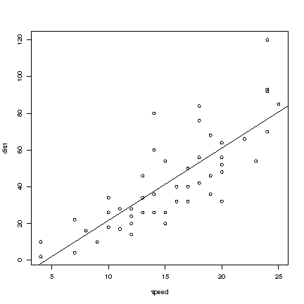

# Vectors and Matrix Operations

## Numbers, vectors, matrices

> Recall that the set of real numbers is  $\mathbb{R}$
>  and that a vector ,
>  $v \in \mathbb{R}^n$
> , is just an  $n$
> -tuple of numbers.\
> Similarly, an  $n \times m$
>  matrix is just a table of numbers, with  $n$
> 
> rows and  $m$
>  columns and we can write
> 
> $$A_{mn} \in \mathbb{R}^{mn}$$
> 
> Note that a vector is normally considered equivalent to a  $n\times 1$
> 
> matrix i.e. we view these as column vectors.

### Examples

> **Example**:  
> 
> In R, a vector can be generated with:
> 
>     X<- 3:6
>     X
>     [1] 3 4 5 6
> 
> A matrix can be generated in R as follows,
> 
>     matrix(X)
>        [,1]
>     [1,]    3
>     [2,]    4
>     [3,]    5
>     [4,]    6
> 
> > **Note**:  
> > 
> > *Note 26*. We note that R distinguishes between vectors and matrices.

## Elementary Operations

> We can define multiplication of a real number  $k$
>  and a vector
>  $v=(v_1,\ldots,v_n)$
>  by  $k\cdot v=(kv_1,\ldots,kv_n)$
> . The sum of two
> vectors in  $\mathbb{R}^n$
> ,  $v=(v_1,\ldots,v_n)$
>  and  $u=(u_1,\ldots,u_n)$
> 
> is defined as the vector  $v+u=(v_1+u_1,\ldots,v_n+u_n)$
> . We can define
> multiplication of a number and a matrix and the sum of two matrices (of
> the same sizes) similarly.

### Examples

> **Example**:  
> 
>     A <- matrix(c(1,2,3,4), nr=2, nc=2)
>     A
>          [,1] [,2]
>     [1,]    1    3
>     [2,]    2    4
> 
>     B <- matrix(c(1,0,2,1), nr=2, nc=2)
>     B
>          [,1] [,2]
>     [1,]    1    2
>     [2,]    0    1
> 
>     A+B
>       [,1] [,2]
>     [1,]    2    5
>     [2,]    2    5

## The tranpose of a matrix

> In R, matrices may be constructed using the  $\verb|matrix|$
>  function and
> the transpose of  $A$
> ,  $A^\prime$
> , may be obtained in R by using the `t`
> function:
> 
> `A<-matrix(1:6, nrow=3)`
> 
>  $\texttt{t(A)}$
> 

### Details

If  $A$
 is an  $n \times m$
 matrix with element  $a_{ij}$
 in row  $i$
 and
column  $j$
, then  $A^\prime$
 or  $A^T$
 is the  $m\times n$
 matrix with
element  $a_{ij}$
 in row  $j$
 and column  $i$
.

### Examples

> **Example**:  
> 
> Consider a vector in R
> 
>     x<-1:4
>     x
>     [1] 1 2 3 4
>     t(x)
>          [,1] [,2] [,3] [,4]
>     [1,]    1    2    3    4
>     matrix(x)
>          [,1]
>     [1,]    1
>     [2,]    2
>     [3,]    3
>     [4,]    4
>     t(matrix(x))
>          [,1] [,2] [,3] [,4]
>     [1,]    1    2    3    4
>      
> 
> > **Note**:  
> > 
> > *Note 27*. Note that the first solution gives a  $1 \times n$
> >  matrix and
> > the second solution gives a  $n \times 1$
> >  matrix.

## Matrix multiplication

> Matrices  $A$
>  and  $B$
>  can be multiplied together if  $A$
>  is an
>  $n \times p$
>  matrix and  $B$
>  is an  $p\times m$
>  matrix. The general
> element  $c_{ij}$
>  of  $n\times m$
> ;  $C=AB$
>  is found by pairing the  $i^{th}$
> 
> row of  $C$
>  with the  $j^{th}$
>  column of  $B$
> , and computing the sum of
> products of the paired terms.
> 
> 

### Details

Matrices  $A$
 and  $B$
 can be multiplied together if  $A$
 is a  $n\times p$

matrix and  $B$
 is a  $p\times m$
 matrix. Given the general element
 $c_{ij}$
 of  $n \times m$
 matrix,  $C=AB$
 is found by pairing the  $i^{th}$

row of  $C$
 with the  $j^{th}$
 column of  $B$
, and computing the sum of
products of the paired terms.

### Examples

> **Example**:  
> 
> Matrices in R
> 
>     A<-matrix(c(1,3,5,2,4,6),3,2)
>     A
>          [,1] [,2]
>     [1,]    1    2
>     [2,]    3    4
>     [3,]    5    6
>     B<-matrix(1,1,2,3)2,2)
> 
>     B<-matrix(c(1,1,2,3),2,2)
>      B
>          [,1] [,2]
>     [1,]    1    2
>     [2,]    1    3
>     A%*%B
>          [,1] [,2]
>     [1,]    3    8
>     [2,]    7   18
>     [3,]   11   28

## More on matrix multiplication

> Let  $A$
> ,  $B$
> , and  $C$
>  be  $m\times n$
> ,  $n\times l$
> , and  $l\times p$
> 
> matrices, respectively. Then we have 
> 
> $$(AB)C=A(BC).$$
> 
>  In general, matrix
> multiplication is not commutative, that is  $AB\neq BA$
> .\
> We also have 
> 
> $$(AB)'=B'A'.$$
> 
>  In particular,  $(Av)'(Av)=v'A'Av$
> , when  $v$
> 
> is a  $n\times1$
>  column vector.\
> \
> More obvious are the rules
> 
> 1.   $A+(B+C)=(A+B)+C$
> 
> 
> 2.   $k(A+B)=kA+kB$
> 
> 
> 3.   $A(B+C)=AB+AC$
> ,
> 
> where  $k\in\mathbb{R}$
>  and when the dimensions of the matrices fit.

## Linear equations

### Details

**Detail:**\
General linear equations can be written in the form  $Ax=b$
.

### Examples

> **Example**:  
> 
> The set of equations\
> \
>  $2x+3y=4$
> \
>  $3x+y=2$
> \
> can be written in matrix formulation as
> 
> $$\begin{bmatrix}
> 2 & 3  \\
> 3 & 1 
> \end{bmatrix}
> \begin{bmatrix}
> x \\
> y
> \end{bmatrix} =
> \begin{bmatrix}
> 4 \\
> 2
> \end{bmatrix}$$
> 
> i.e.  $A\underline{x} = \underline{b}$
>  for an appropriate choice of of
>  $A, \underline{x}$
>  and  $\underline{b}$
> 

## The unit matrix

> The  $n\times n$
>  matrix
> 
> $$I=
> \left[
> \begin{array}{cccc}
>   1 & 0 & \ldots & 0 \\
>   0 & 1 & 0  & \vdots \\
>   \vdots & 0  & \dots & 0 \\
>   0 & \ldots & 0 & 1
> \end{array} \right]$$
> 
> is the identity matrix. This is because if a matrix  $A$
>  is  $n\times n$
> 
> then  $A I = A$
>  and  $I A  = A$
> 

## The inverse of a matrix

> If  $A$
>  is an  $n \times n$
>  matrix and  $B$
>  is a matrix such that
> 
> $$BA = AB = I$$
> 
> then  $B$
>  is said to be the inverse of  $A$
> , written
> 
> $$B = A ^{-1}.$$
> 
> Note that if  $A$
>  is an  $n \times n$
>  matrix for which an inverse exists,
> then the equation  $Ax = b$
>  can be solved and the solution is
>  $x = A^{-1} b$
> .

### Examples

> **Example**:  
> 
> If matrix  $A$
>  is:
> 
> $$\begin{bmatrix}
> 2 & 3  \\
> 3 & 1 
> \end{bmatrix}$$
> 
> then  $A ^{-1}$
>  is:
> 
> $$\begin{bmatrix}
> \frac{-1}{7} & \frac{3}{7} \\
> \frac{3}{7} & \frac{-2}{7}
> \end{bmatrix}$$
> 

**Copyright** 2021, Gunnar Stefansson (editor) with contributions from
very many students

This work is licensed under the Creative Commons Attribution-ShareAlike
License. To view a copy of this license, visit
http://creativecommons.org/licenses/by-sa/1.0/ or send a letter to
Creative Commons, 559 Nathan Abbott Way, Stanford, California 94305,
USA.

# Some notes on matrices and linear operators

## The matrix as a linear operator

> Let  $A$
>  be an  $m\times  n$
>  matrix. The function
> 
> $$T_A:\mathbb{R}^n\to\mathbb{R}^m, T_A(\underline{x}) = A\underline{x},$$
> 
> is linear, that is
> 
> $$T_A (a\underline{x} + b\underline{y}) = aT_A(\underline{x}) + bT_A(\underline{y})$$
> 
> if  $\underline{x}, \underline{y} \in \mathbb{R}^n$
>  and
>  $a, b \in \mathbb{R}$
> .

### Examples

> **Example**:  
> 
> If 
> 
> $$A=\begin{bmatrix}
> 1 & 2 
> \end{bmatrix}$$
> 
>  then  $T_A(\underline{x}) = x + 2y$
>  where
>  $\underline{x} = {x \choose y}\in \mathbb{R}^2$
> 

> **Example**:  
> 
> If 
> 
> $$A=\begin{bmatrix}
> 0 & 1  \\
> 1 & 0
> \end{bmatrix}$$
> 
>  then 
> 
> $$T_A{x \choose y} = \begin{bmatrix}
> y  \\
> x
> \end{bmatrix}.$$
> 

> **Example**:  
> 
> If 
> 
> $$A= \begin{bmatrix}
> 0 & 2 & 3\\
> 1 & 0 & 1
> \end{bmatrix}$$
> 
>  then 
> 
> $$T_A\left(
> \begin{array}{ccc}
>   x \\
>   y\\
>   z
>  \end{array} \right) = 
> \begin{bmatrix}
> 2y + 3z\\
> x + z
> \end{bmatrix}.$$
> 

> **Example**:  
> 
> If 
> 
> $$T{x \choose y } = \left(
>  \begin{array}{cc}
>    x+y  \\
>   2x-3y
>  \end{array} \right)$$
> 
>  then  $T (\underline{x}) = A \underline{x}$
>  if we
> set 
> 
> $$A = \begin{bmatrix}
> 1 & 1 \\
> 2 & -3
> \end{bmatrix}.$$
> 

## Inner products and norms

> Assuming  $x$
>  and  $y$
>  are vectors, then we define their inner product by
> 
> $$x \cdot y = x_1y_1 + x_2y_2 + \cdots + x_ny_n$$
> 
> where 
> 
> $$x =\begin{pmatrix}
> x_1\\
> \vdots\\
> x_n
> \end{pmatrix}$$
> 
>  and 
> 
> $$y= \begin{pmatrix}
> y_1\\
> \vdots\\
> y_n
> \end{pmatrix}.$$
> 

### Details

If  $x$
,  $y$
 $\in \mathbb{R}^n$ are arbitrary (column) vectors, then we
define their inner product by

$$x \cdot y = x_1y_1 + x_2y_2 + \cdots + x_ny_n$$

where 

$$x= \begin{pmatrix}
x_1\\
\vdots\\
x_n
\end{pmatrix}$$

 and 

$$y =\begin{pmatrix}
y_1\\
\vdots\\
y_n
\end{pmatrix}.$$

> **Note**:  
> 
> *Note 28*. Note that we can also view  $x$
>  and  $y$
>  as  $n \times 1$
> 
> matrices and we see that  $x \cdot y = x^\prime y$
> .

> **Definition**:  
> 
> The normal length of a vector is defined by
>  $\left \| x \right \|^2 = x \cdot x$
> . It may also be expressed as
>  $\left \| x \right \| = \sqrt{x_1^2 + x_2^2 + \cdots + x_n^2}$
> .

It is easy to see that for vectors  $a, b$
 and  $c$
 we have
 $(a+b)\cdot c=a\cdot c+ b\cdot c$
 and  $a\cdot b=b\cdot a$
.

### Examples

Two vectors  $x$
 and  $y$
 are said to be orthogonal if  $x \cdot y = 0$


> **Example**:  
> 
> If 
> 
> $$x= \begin{pmatrix}
> 3\\
> 4
> \end{pmatrix}$$
> 
>  and 
> 
> $$y= \begin{pmatrix}
> 2\\
> 1
> \end{pmatrix},$$
> 
>  then
> 
> $$x \cdot y = 3 \cdot 2 + 4 \cdot 1 = 10,$$
> 
> and
> 
> $$\left \| x \right \|^2 = 3^2 + 4^2 = 25,$$
> 
> so
> 
> $$\left\| x \right \| = 5$$
> 

## Orthogonal vectors

> Two vectors  $x$
>  and  $y$
>  are said to be orthogonal if  $x\cdot y=0$
> 
> denoted  $x \perp y$
> 

### Details

> **Definition**:  
> 
> Two vectors  $x$
>  and  $y$
>  are said to be **orthogonal** if  $x\cdot y=0$
> 
> denoted  $x \perp y$
> 

If  $a,b \in \mathbb{R}^n$
 then

$$\left\|a+b\right\|^2=a\cdot a+2a\cdot b+b\cdot b$$

 so

$$\left\|a+b\right\|^2=\left\|a\right\|^2+\left\|b\right\|^2 + 2\underline{a}\underline{b}.$$

> **Note**:  
> 
> *Note 29*. Note that if  $a \perp b$
>  then
>  $\left\|a+b\right\|^2=\left\|a\right\|^2+ \left\|b\right\|^2$
> , which is
> Pythagoras' theorem in  $n$
>  dimensions.

## Linear combinations of i.i.d. random variables

> Suppose  $X_1,\dots ,X_n$
>  are i.i.d. random variables and have mean
>  $\mu_1, \dots , \mu_n$
>  and variance  $\sigma^2$
>  then the expected value
> of  $Y$
>  of the linear combination is 
> 
> $$Y=\sum a_i X_i$$
> 
>  and if
>  $a_1,\dots ,a_n$
>  are real constants then the mean is:
> 
> $$\mu_Y = \sum a_i \mu_i$$
> 
> and the variance is:
> 
> $$\sigma^2 = \sum a^2_i \sigma^2_i$$
> 

### Examples

> **Example**:  
> 
> Consider two i.i.d. random variables,  $Y_1,Y_2$
>  such that
>  $E[Y_1]=E[Y_2]=2$
>  and  $Var[Y_1]=Var[Y_2]=4$
> , and a specific linear
> combination of the two,  $W=Y_1+3Y_2$
> .\
> We first obtain 
> 
> $$E[W]=E[Y_1+3Y_2]=E[Y_1]+3E[Y_2]=2+3\cdot 2=2+6=8.$$
> 
> Similarly, we can first use independence to obtain
> 
> $$Var[W]=Var[Y_1+3Y_2]=Var[Y_1]+Var[3Y_2]$$
> 
> and then (recall that  $Var[aY]=a^2Var[Y]$
> )
> 
> $$Var[Y_1]+Var[3Y_2]=Var[Y_1]+3^2Var[Y_2]=1^2 \cdot 4+3^2\cdot 4= 1 \cdot 4 + 9 \cdot 4= 40$$
> 
> Normally, we just write this up in a simple sequence
> 
> $$Var[W]=Var[Y_1+3Y_2]=Var[Y_1]+3^2Var[Y_2]=1^2 \cdot 4+3^2\cdot 4 = 1 \cdot 4 + 9 \cdot 4= 40$$
> 

## Covariance between linear combinations of i.i.d random variables

> Suppose  $Y_1,\ldots,Y_n$
>  are i.i.d., each with mean  $\mu$
>  and variance
>  $\sigma^2$
>  and  $a,b\in \mathbb{R}^n$
> . Writing 
> 
> $$Y= \left(
>  \begin{array}{ccc}
>    Y_1  \\
>    \vdots\\
>    Y_n 
>  \end{array} \right),$$
> 
>  consider the linear combination  $a'Y$
>  and  $b'Y$
> .

### Details

The covarience between random variables  $U$
 and  $W$
 is defined by

$$Cov(U,W)= E[(U-\mu_u)(W-\mu_w)]$$

 where  $\mu_u=E[U]$
 and  $\mu_w=E[W]$
.
Now, let  $U=a'Y=\sum Y_ia_i$
 and  $W=b'Y=\sum Y_ib_i$
, where
 $Y_1,\ldots,Y_n$
 are i.i.d. with mean  $\mu$
 and variance  $\sigma^2$
,
then we get

$$Cov(U,W)= E[(a'Y-\Sigma a_\mu)(b'Y-\Sigma b\mu)]$$


$$= E[(\Sigma a_iY_i -\Sigma a_i\mu)(\Sigma b_jY_j -\Sigma b_j\mu )]$$

and after some tedious (but basic) calculations we obtain

$$Cov(U,W)=\sigma^2a\cdot b$$

### Examples

> **Example**:  
> 
> If  $Y_1$
>  and  $Y_2$
>  are i.i.d., then
> 
> $$Cov(Y_1+Y_2, Y_1-Y_2)=Cov\left( (1,1)
> \begin{pmatrix}Y_1\\
> Y_2
> \end{pmatrix}
> ,  (1,-1) 
> \begin{pmatrix}
> Y_1\\
> Y_2
> \end{pmatrix}
> \right)$$
> 
> 
> 
> $$=(1,1)
> \begin{pmatrix}
> 1\\
> -1
> \end{pmatrix}\sigma^2$$
> 
> 
> 
> $$=0.$$
> 
> and in general,
>  $Cov(\underline{a}'\underline{Y}, \underline{b}'\underline{Y})=0$
>  if
>  $\underline{a}\bot \underline{b}$
>  and  $Y_1,\ldots,Y_n$
>  are independent.

## Random vectors

>  $Y= (Y_1, \ldots , Y_n)$
>  is a random vector if  $Y_1, \ldots , Y_n$
>  are
> random variables.

### Details

> **Definition**:  
> 
> If  $E[Y_i] = \mu_i$
>  then we typically write
> 
> $$E[Y]=\left(
> \begin{array}{ccc}
>   \mu_1 \\
>   \vdots \\
>   \mu_n
> \end{array} \right)=\mu.$$
> 
> If  $Cov(Y_i, Y_j) = \sigma_{ij}$
>  and
>  $Var[Y_i]=\sigma_{ii} = \sigma_i^2$
> , then we define the matrix
> 
> $$\boldsymbol{\Sigma} = (\sigma_{ij})$$
> 
>  containing the variances and
> covariances. We call this matrix the **covariance matrix** of  $Y$
> ,
> typically denoted  $Var[Y] = \boldsymbol{\Sigma}$
>  or
>  $CoVar[Y] = \boldsymbol{\Sigma}$
> .

### Examples

> **Example**:  
> 
> If  $Y_i, \ldots , Y_n$
>  are i.i.d.,  $EY_i = \mu$
> ,  $VY_i = \sigma^2$
> ,
>  $a,b\in\mathbb{R}^n$
>  and  $U=a'Y$
> ,  $W=b'Y$
> , and 
> 
> $$T=\begin{bmatrix}
> U \\
> W
> \end{bmatrix}$$
> 
> then
> 
> $$ET=
> \begin{bmatrix}
> \Sigma a_i  \mu \\
> \Sigma b_i  \mu
> \end{bmatrix}$$
> 
> 
> 
> $$VT=
> \boldsymbol{\Sigma}
> = \sigma^2
> \begin{bmatrix}
> \Sigma a_i^2 & \Sigma a_i b_i \\
> \Sigma a_ib_i & \Sigma b_i^2
> \end{bmatrix}$$
> 

> **Example**:  
> 
> If  $\underline{Y}$
>  is a random vector with mean  $\boldsymbol{\mu}$
>  and
> variance-covariance matrix  $\boldsymbol{\Sigma}$
> , then
> 
> $$E[a'Y] = a'\mu$$
> 
> and
> 
> $$Var[a'Y] = a' \boldsymbol{\Sigma} a.$$
> 

## Transforming random vectors

> Suppose
> 
> $$\mathbf{Y}=
> \left(
> \begin{array}{c}
> Y_1\\
> \vdots \\
> Y_n
> \end{array} \right)$$
> 
> is a random vector with  $E[\mathbf{Y}] = \mu$
>  and
>  $Var[\mathbf{Y}] = \boldsymbol{\Sigma}$
>  where the variance-covariance
> matrix 
> 
> $$\boldsymbol{\Sigma} = \sigma^2 I$$
> 

### Details

Note that if  $Y_1, \ldots, Y_n$
 are independent with common variance
 $\sigma^2$
 then

$$\boldsymbol{\Sigma}=
\left[
\begin{array}{ccccc}
\sigma_{1}^{2} & \sigma_{12} & \sigma_{13} & \ldots & \sigma_{1n} \\
\sigma_{21} & \sigma_2^{2} & \sigma_{23} & \ldots & \sigma_{2n} \\
\sigma_{31} &\sigma_{32}  &\sigma_3^{2}  & \ldots & \sigma_{3n}\\
\vdots & \vdots & \vdots & \ddots & \vdots \\
\sigma_{n1} & \sigma_{n2} & \sigma_{n3} & \ldots & \sigma_n^{2}\\ 
\end{array} \right]$$


$$=
\left[
\begin{array}{ccccc}
\sigma_{1}^{2} & 0 & \ldots & \ldots & 0 \\
 0 & \sigma_2^{2} & \ddots & 0  & \vdots \\
 \vdots & \ddots  &\sigma_3^{2}  & \ddots & \vdots \\
\vdots & 0 & \ddots & \ddots & 0 \\
0 & \ldots & \ldots & 0 & \sigma_n^{2}\\ 
\end{array} \right]$$


$$= 
\sigma^2
\left[
\begin{array}{ccccc}
1 & 0 & \ldots & \ldots & 0 \\
 0 & 1 & \ddots & 0  & \vdots \\
 \vdots & \ddots  & 1  & \ddots & \vdots \\
\vdots & 0 & \ddots & \ddots & 0 \\
0 & \ldots & \ldots & 0 & 1 \\ 
\end{array} \right]
= \sigma^2 I.$$

If  $A$
 is an  $m \times n$
 matrix, then

$$E[A\mathbf{Y}] = A \mathbf{\mu}$$

and 

$$Var[A\mathbf{Y}] = A \boldsymbol{\Sigma} A'.$$

**Copyright** 2021, Gunnar Stefansson (editor) with contributions from
very many students

This work is licensed under the Creative Commons Attribution-ShareAlike
License. To view a copy of this license, visit
http://creativecommons.org/licenses/by-sa/1.0/ or send a letter to
Creative Commons, 559 Nathan Abbott Way, Stanford, California 94305,
USA.

# Ranks and determinants

## The rank of a matrix

> The rank of an  $n \times p$
>  matrix  $A$
> , denoted by  $\text{rank}(A)$
> , is
> the largest number of columns of  $A$
> , which are not linearly dependent
> (i.e. the number of linearly independent columns).

### Details

Vectors  $a_1, a_2, \ldots, a_n$
 are said to be linearly dependent if
there exist constants  $k_1 , \ldots, k_n$
 that are not all zero, such
that 

$$k_1 a_1 + k_2 a_2 + \ldots + k_n a_n = 0.$$

Note that if such constants exist, then we can write one of the  $a$
's as
a linear combination of the rest, e.g. if  $k_1 \neq 0$
 then

$$a_1=\mathbf{c_1} =  -\frac{k_2}{k_1} a_2 - \ldots - \frac{k_2}{k_1} a_n$$

It can be shown that the rank of  $A$
, is the same as the rank of  $A'$

i.e. the maximum number of linearly independent rows of  $A$
.

> **Note**:  
> 
> *Note 30*. Note that if  $\text{rank}(A) = p$
> , then the columns are
> linearly independent.

### Examples

> **Example**:  
> 
> If 
> 
> $$A= 
>   \left[ 
>    \begin{array}{cc}
>      1 & 0 \\
>      0 & 1 \\
>    \end{array}
>   \right]$$
> 
> then  $\text{rank}(A)$
>  = 2, since
> 
> $$k_1
>   \left(
>    \begin{array}{cc}
>      1 \\
>      0 \\
>    \end{array}
>   \right) +  k_2
>   \left(
>    \begin{array}{cc}
>      0 \\
>      1 \\
>    \end{array}
>   \right) =  \left(
>     \begin{array}{cc}
>       0 \\
>       0 \\
>     \end{array}
>    \right)$$
> 
> if and only if
> 
> $$\left( 
>   \begin{array}{cc}
>      k_1 \\
>      k_2 \\
>    \end{array}
>   \right) =   \left(
>     \begin{array}{cc}
>       0 \\
>       0 \\
>     \end{array}
>    \right)$$
> 
> so the columns are linearly independent.

> **Example**:  
> 
> If 
> 
> $$A = 
>   \left[ 
>    \begin{array}{ccc}
>      1 & 0 & 1 \\
>      0 & 1 & 1\\
>      0 & 0 & 0 \\
>    \end{array}
>   \right]$$
> 
> then  $\text{rank}(A)$
>  = 2.

> **Example**:  
> 
> If 
> 
> $$A = 
>   \left[ 
>    \begin{array}{ccc}
>      1 & 1 & 1 \\
>      0 & 1 & 0 \\
>      0 & 1 & 0 \\
>    \end{array}
>   \right]$$
> 
> then  $\text{rank}(A)$
>  = 2. since 
> 
> $$1
>   \left(
>    \begin{array}{ccc}
>      1 \\
>      0 \\
>      0 \\
>    \end{array}
>   \right) +  0
>   \left(
>    \begin{array}{ccc}
>      0 \\
>      1 \\
>      1 \\
>    \end{array}
>   \right) + (-1)
>   \left(
>     \begin{array}{ccc}
>       1 \\
>       0 \\
>       0 \\
>     \end{array}
>    \right) = 0$$
> 
>  (and hence the rank cannot be more than 2) but 
> 
> $$k_1
>   \left(
>    \begin{array}{ccc}
>      1 \\
>      0 \\
>      0 \\
>    \end{array}
>   \right) +  k_2
>   \left(
>    \begin{array}{ccc}
>      0 \\
>      1 \\
>      1 \\
>    \end{array}
>   \right)$$
> 
> \
> if and only if  $k_1=k_2=0$
>  (and hence the rank must be at least 2).

## The determinant

> Recall that for a  $2 \times 2$
>  matrix,
> 
> $$A=
> \begin{bmatrix}
> a & b  \\
> c & d 
> \end{bmatrix}$$
> 
> the inverse of  $A$
>  is
> 
> $$A^{-1}=
> \frac{1}{ad-bc}
> \begin{bmatrix}
> 2 & 3  \\
> 3 & 1 
> \end{bmatrix}$$
> 

### Details

> **Definition**:  
> 
> The number  $ad-bc$
>  is called the **determinant** of the  $2 \times 2$
> 
> matrix  $A$
> .

> **Definition**:  
> 
> Now suppose  $A$
>  is an  $n \times n$
>  matrix. An **elementary product**
> from the matrix is a product of  $n$
>  terms based on taking exactly one
> term from each column of row  $x$
> . Each such term can be written in the
> form
>  $a_{1j_1} \cdot a_{2j_2} \cdot a_{3j_3} \cdot \ldots \cdot a_{nj_n}$
> 
> where  $j_1, \ldots , j_n$
>  is a permutation of the integers
>  $1,2, \ldots , n$
> . Each permutation  $\sigma$
>  of the integers
>  $1,2,\ldots,n$
>  can be performed by repeatedly interchanging two numbers.

> **Definition**:  
> 
> A **signed elementary product** is an elementary product with a positive
> sign if the number of interchanges in the permutation is even but
> negative otherwise.

The determinant of  $A$
,  $\det(A)$
 or  $\vert A \vert$
, is the sum of all
signed elementary products.

### Examples

> **Example**:  
> 
> 
> $$A=
> \begin{bmatrix}
> a_{11} & a_{12}  \\
> a_{21} & a_{22} 
> \end{bmatrix}$$
> 
> then
> 
>  $\vert A \vert = a_{1\underline{1}} a_{2\underline{2}} - a_{1\underline{2}}a_{2\underline{1}}$
> .

> **Example**:  
> 
> If 
> 
> $$A=
> \begin{bmatrix}
> a_{11} & a_{12} & a_{13}  \\
> a_{21} & a_{22} & a_{23} \\
> a_{31} & a_{32} & a_{33}
> \end{bmatrix},$$
> 
> Then
> 
>  $\vert A \vert$
> 
> 
> =  $a_{11} a_{22} a_{33}$
>  This is the identity permutation and has
> positive sign
> 
>  $-a_{11} a_{23} a_{32}$
>  This is the permutation that only interchanges
>  $2$
>  and  $3$
> 
> 
>  $-a_{12} a_{21} a_{33}$
>  Only one interchange
> 
>  $+a_{12} a_{23} a_{31}$
>  Two interchanges
> 
>  $+a_{13} a_{21} a_{32}$
>  Two interchanges
> 
>  $-a_{13} a_{22} a_{31}$
>  Three interchanges

> **Example**:  
> 
> 
> $$A=
> \begin{bmatrix}
> 1 & 1  \\
> 1 & 0 
> \end{bmatrix}$$
> 
>  $\vert A \vert = -1$
> 

> **Example**:  
> 
> 
> $$A=
> \begin{bmatrix}
> 1 & 0 & 0  \\
> 0 & 2 & 0  \\
> 0 & 0 & 3 
> \end{bmatrix}$$
> 
>  $\vert A \vert = 1 \cdot 2 \cdot 3 = 6$
> 

> **Example**:  
> 
> 
> $$A=
> \begin{bmatrix}
> 1 & 0 & 0  \\
> 0 & 2 & 0  \\
> 0 & 3 & 0 
> \end{bmatrix}$$
> 
>  $\vert A \vert = 0$
> 

> **Example**:  
> 
> 
> $$A=
> \begin{bmatrix}
> 1 & 0 & 0  \\
> 0 & 0 & 2  \\
> 0 & 3 & 0 
> \end{bmatrix}$$
> 
>  $\vert A \vert = -6$
> 

> **Example**:  
> 
> 
> $$A=
> \begin{bmatrix}
> 2 & 1  \\
> 2 & 1 
> \end{bmatrix}$$
> 
>  $\vert A \vert = 0$
> 

> **Example**:  
> 
> 
> $$A=
> \begin{bmatrix}
> 1 & 0 & 1  \\
> 0 & 1 & 1  \\
> 1 & 1 & 2 
> \end{bmatrix}$$
> 
>  $\vert A \vert = 0$
> 

## Ranks, inverses and determinants

> The following statements are true for an  $n\times n$
>  matrix  $A$
> :
> 
> -    $\text{rank} (A)= n$
> 
> 
> -    $\det(A)\neq 0$
> 
> 
> -    $A$
>  has an inverse

### Details

Suppose  $A$
 is an  $n\times n$
 matrix. Then the following are truths:

-    $\text{rank} (A)= n$


-    $\det(A)\neq 0$


-    $A$
 has an inverse

**Copyright** 2021, Gunnar Stefansson (editor) with contributions from
very many students

This work is licensed under the Creative Commons Attribution-ShareAlike
License. To view a copy of this license, visit
http://creativecommons.org/licenses/by-sa/1.0/ or send a letter to
Creative Commons, 559 Nathan Abbott Way, Stanford, California 94305,
USA.

# Multivariate calculus

## Vector functions of several variables

> A vector-valued function of several variables is a function
> 
> $$f: \mathbb{R}^{m} \rightarrow \mathbb{R}^{n}$$
> 
>  i.e. a function of  $m$
> 
> dimensional vectors, which returns  $n$
>  dimensional vectors.

### Examples

> **Example**:  
> 
> A real valued function of many variables:
>  $f: \mathbb{R}^3\to\mathbb{R}$
> ,  $f(x_1,x_2,x_3)=2x_1+3x_2+4x_3$
> .
> 
> > **Note**:  
> > 
> > *Note 31*. Note that  $f$
> >  is linear and  $f(x)=Ax$
> >  where
> > 
> > $$x=\begin{pmatrix} x_1\\
> > x_2\\
> > x_3\end{pmatrix}$$
> > 
> >  and 
> > 
> > $$A=\begin{bmatrix}2&3&4\end{bmatrix}.$$
> > 

> **Example**:  
> 
> Let 
> 
> $$f: \mathbb{R}^{2} \rightarrow \mathbb{R}^{2}$$
> 
>  where:
> 
> $$f(x_1,x_2) = \left(
> \begin{array}{c}
> x_1+x_2 \\
> x_1-x_2
> \end{array} \right)$$
> 
> > **Note**:  
> > 
> > *Note 32*. Note that  $f(x)=Ax$
> > , where 
> > 
> > $$A=\begin{bmatrix}
> > 1&1\\
> > 1&-1
> > \end{bmatrix}.$$
> > 

> **Example**:  
> 
> Let 
> 
> $$f: \mathbb{R}^{3} \rightarrow \mathbb{R}^{4}$$
> 
>  be defined by
> 
> $$f(x)
> = \left(
> \begin{array}{c}
> x_1+x_2 \\
> x_1-x_3 \\
> y-z \\
> x_1+x_2+x_3
> \end{array} \right)$$
> 
> > **Note**:  
> > 
> > *Note 33*. Note that: 
> > 
> > $$f(x) = Ax$$
> > 
> >  where 
> > 
> > $$A =
> > \begin{bmatrix}
> > 1 & 1 & 0\\
> > 1 & 0 & -1\\
> > 0 & 1 & -1\\
> > 1 & 1 & 1
> > \end{bmatrix}$$
> > 

> **Example**:  
> 
> These multi-dimensional functions do not have to be linear, for example
> the function  $f:\mathbb{R}^2\to\mathbb{R}^2$
>  
> 
> $$f(x) = \left(
> \begin{array}{c}
> x_1x_2 \\
> x_1^{2}+x_2^{2}
> \end{array} \right),$$
> 
>  is obviously not linear.

## The gradient

> Suppose the real valued function  $f:\mathbb{R}^m \rightarrow \mathbb{R}$
> 
> is differentiable in each coordinate. Then the gradient of  $f$
> , denoted
>  $\nabla f$
>  is given by
> 
> $$\nabla f(x)=\begin{pmatrix}\frac{\partial f}{\partial x_1},&\dots &,\frac{\partial f}{\partial x_1}\end{pmatrix}.$$
> 

### Details

> **Definition**:  
> 
> Suppose the real valued function  $f:\mathbb{R}^m \rightarrow \mathbb{R}$
> 
> is differentiable in each coordinate. Then the **gradient** of  $f$
> ,
> denoted  $\nabla f$
>  is given by
> 
> $$\nabla f(x)=
> \begin{pmatrix} \frac{\partial f}{\partial x_1},&\dots &,\frac{\partial f}{\partial x_1}\end{pmatrix},$$
> 
> where each partial derivative  $\frac{\partial f}{\partial x_i}$
>  is
> computed by differentiating  $f$
>  with respect to that variable, regarding
> the others as fixed.

### Examples

> **Example**:  
> 
> Let
> 
> $$f(\underline{x})= x^2+y^2+2xy.$$
> 
> Then the partial derivatives of  $f$
>  are
> 
> $$\frac{\partial f}{\partial x}=2x+2y$$
> 
> and
> 
> $$\frac{\partial f}{\partial y}=2y+2x$$
> 
> and the gradient of  $f$
>  is therefore
> 
> $$\nabla f =\begin{pmatrix}2x+2y, & 2y+2x\end{pmatrix}$$
> 

> **Example**:  
> 
> Let
> 
> $$f(\underline{x})=x_1-x_2$$
> 
> The gradient of  $f$
>  is
> 
> $$\nabla f= \begin{pmatrix}1, & -1\end{pmatrix}$$
> 

## The Jacobian

> Now consider a function  $f:\mathbb{R}^m\to\mathbb{R}^n$
> . Write  $f_i$
>  for
> the  $i^{th}$
>  coordinate of  $f$
> , so we can write
>  $f(x)=(f_1(x),f_2(x),\ldots,f_n(x))$
> , where  $x\in\mathbb{R}^m$
> . If each
> coordinate function  $f_i$
>  is differentiable in each variable we can form
> the *Jacobian matrix* of  $f$
> : 
> 
> $$\begin{pmatrix}\nabla f_1\\ 
>   \vdots\\ 
>   \nabla f_n
> \end{pmatrix}.$$
> 

### Details

Now consider a function  $f:\mathbb{R}^m\to\mathbb{R}^n$
. Write  $f_i$
 for
the  $i^{th}$
 coordinate of  $f$
, so we can write
 $f(x)=(f_1(x),f_2(x),\ldots,f_n(x))$
, where  $x\in\mathbb{R}^m$
. If each
coordinate function  $f_i$
 is differentiable in each variable we can form
the *Jacobian matrix* of  $f$
: 

$$\begin{pmatrix}\nabla f_1\\ 
  \vdots\\ 
  \nabla f_n
\end{pmatrix}.$$

In this matrix, the element in the  $i^{th}$
 row and  $j^{th}$
 column is
 $\frac{\partial f_i}{\partial x_j}$
.

### Examples

> **Example**:  
> 
> For the function
> 
> $$f(x,y)=\begin{pmatrix}
>   x^2 +y \\
>   x y  \\
>   x 
> \end{pmatrix}=
> \begin{pmatrix}
>   f_1(x,y) \\
>   f_2(x,y) \\
>   f_3(x,y) 
> \end{pmatrix},$$
> 
> the Jacobian matrix of  $f$
>  is the matrix
> 
> $$J= \begin{bmatrix}
>       \nabla f_1 \\
>       \nabla f_2 \\
>       \nabla f_3 
>       \end{bmatrix}=
> \begin{bmatrix}
>       2x & 2y \\
>       y & x \\
>       1 & 0 
>       \end{bmatrix}.$$
> 

## Univariate integration by substitution

> If  $f$
>  is a continuous function and  $g$
>  is strictly increasing and
> differentiable then,
> 
> $$\int_{g(a)}^{g(b)} f(x)dx =  \int_a^b f(g(t))g^\prime (t)dt.$$
> 

### Details

If  $f$
 is a continuous function and  $g$
 is strictly increasing and
differentiable then,

$$\int_{g(a)}^{g(b)} f(x)dx =  \int_a^b f(g(t))g^\prime (t)dt.$$

It follows that if  $X$
 is a continuous random variable with density  $f$

and  $Y = h(X)$
 is a function of  $X$
 that has the inverse  $g=h^{-1}$
, so
 $X = g(Y)$
 , then the density of  $Y$
 is given by,

$$f_Y(y)   = f (g(y)) g^\prime (y)$$

This is a consequence of

$$P [Y \leq b] = P [g(Y) \leq g(b)] = P [X \leq g(b)] = \int_{- \infty} ^{g(b)}f(x)dx = \int_{- \infty} ^b f (g(y))g^\prime (y)dy.$$

## Multivariate integration by substitution

> Suppose  $f$
>  is a continuous function
>  $f: \mathbb{R}^n \rightarrow \mathbb{R}$
>  and
>  $g: \mathbb{R}^n \rightarrow \mathbb{R}^n$
>  is a one-to-one function with
> continuous partial derivatives. Then if  $U \subseteq \mathbb{R}^n$
>  is a
> subset,
> 
> $$\int_{g(U)} f(\mathbf {x})d\mathbf {x}  = \int_{U}({g}(\mathbf {y}))|J|d\mathbf {y}$$
> 
> where  $J$
>  is the Jacobian matrix and  $|J|$
>  is the absolute value of it's
> determinant.
> 
> $$J=
> \left|\begin{bmatrix}
> \frac{\partial g_1}{\partial y_1} & \frac{\partial g_1}{\partial y_2} & \cdots &\frac{\partial g_1}{\partial y_n} \\
> \vdots & \vdots & \cdots & \vdots \\
> \frac{\partial g_n}{\partial y_1} & \frac{\partial g_n}{\partial y_2} & \cdots & \frac{\partial g_n}{\partial y_n} 
> \end{bmatrix}\right| = 
> \left|\begin{bmatrix}
> \nabla g_1 \\
>  \vdots \\
> \nabla g_n 
> \end{bmatrix}\right|$$
> 

### Details

Suppose  $f$
 is a continuous function
 $f: \mathbb{R}^n \rightarrow \mathbb{R}$
 and
 $g: \mathbb{R}^n \rightarrow \mathbb{R}^n$
 is a one-to-one function with
continuous partial derivatives. Then if  $U \subseteq \mathbb{R}^n$
 is a
subset,

$$\int_{g(U)} f(\mathbf {x})d\mathbf {x}  = \int_{U}({g}(\mathbf {y}))|J|d\mathbf {y}$$

where  $J$
 is the Jacobian determinant and \|J\| is its absolute value.

$$J= 
\left|\begin{bmatrix}
\frac{\partial g_1}{\partial y_1} & \frac{\partial g_1}{\partial y_2} & \cdots &\frac{\partial g_1}{\partial y_n} \\
\vdots & \vdots & \cdots & \vdots \\
\frac{\partial g_n}{\partial y_1} & \frac{\partial g_n}{\partial y_2} & \cdots & \frac{\partial g_n}{\partial y_n} 
\end{bmatrix}\right| = 
\left|\begin{bmatrix}
\nabla g_1 \\
 \vdots \\
\nabla g_n 
\end{bmatrix}\right|$$

Similar calculations as in 28.4 give us that if  $X$
 is a continuous
multivariate random variable,  $X = (X_1, \ldots, X_n)^\prime$
 with
density  $f$
 and  $\mathbf{Y}  = \mathbf{h} (\mathbf{X})$
, where
 $\mathbf{h}$
 is one-to-one with inverse  $\mathbf g= \mathbf{h}^{-1}$
.
So,  $\mathbf{X} = g(\mathbf{Y})$
, then the density of  $\mathbf{Y}$
 is
given by;

$$f_Y(\mathbf y)   = f (g(\mathbf y)) |J|$$

### Examples

> **Example**:  
> 
> If  $\mathbf{Y} = A \mathbf X$
>  where  $A$
>  is an  $n \times n$
>  matrix with
>  $\det(A)\neq0$
>  and  $X = (X_1, \ldots, X_n)^\prime$
>  are i.i.d. random
> variables, then we have the following results:\
> \
> The joint density of  $X_1 \cdots X_n$
>  is the product of the individual
> (marginal) densities,
> 
> $$f_X(\mathbf x)= f(x_1) f(x_2) \cdots f(x_n).$$
> 
> The matrix of partial derivatives corresponds to
>  $\frac{\partial g}{\partial y}$
>  where
>  $\mathbf X = \mathbf g(\mathbf{Y})$
> , i.e. these are the derivatives of
> the transformation:  $\mathbf X = g (\mathbf{Y}) = A^{-1}\mathbf{Y}$
> , or
>  $\mathbf X = B \mathbf{Y}$
>  where  $B = A^{-1}$
> .\
> But if  $\mathbf X = B \mathbf{Y}$
> , then
> 
> $$X_i = b_{i1}y_1 + b_{i2}y_2 + \cdots b_{ij}y_j\cdots b_{in}y_n$$
> 
> So,  $\frac{\partial x_i}{\partial y_j} = b_{ij}$
>  and thus,
> 
> $$J =\left|\frac{\partial d\mathbf x}{\partial d\mathbf y}\right| = |B| = |A^{-1}| = \frac {1}{|A|}$$
> 
> The density of  $\mathbf{Y}$
>  is therefore;
> 
> $$f_Y(\mathbf{y})   =  f_X(g(\mathbf{y})) |J| = f_X(A^{-1}\mathbf{y}) |A^{-1}|$$
> 

**Copyright** 2021, Gunnar Stefansson (editor) with contributions from
very many students

This work is licensed under the Creative Commons Attribution-ShareAlike
License. To view a copy of this license, visit
http://creativecommons.org/licenses/by-sa/1.0/ or send a letter to
Creative Commons, 559 Nathan Abbott Way, Stanford, California 94305,
USA.

# The multivariate normal distribution and related topics

## Transformations of random variables

> Recall that if  $X$
>  is a vector of continuous random variables with a
> joint probability density function and if  $Y=h(X)$
>  such that  $h$
>  is a
> one-to-one function and continuously differentiable with inverse  $g$
>  so
>  $X= g(Y)$
> , then the density of  $Y$
>  is given by 
> 
> $$f_Y(y)=f(g(y))|J|$$
> 

### Details

 $J$
 is the Jacobian determinant of  $g$
. In particular if  $Y=AX$
 then

$$f_Y(y)=f(A^{-1}y)|det(A^{-1})|$$

if  $A$
 has an inverse.

## The multivariate normal distribution

### Details

Consider i.i.d. random variables,  $Z_1, \ldots ,Z_n \sim N(0,1)$
,

$$\underline{Z}=
\left( \begin{array}{ccc}
 Z_1 \\
 \vdots\\
 Z_n
\end{array} \right)$$

 and let
 $\underline{Y}=A \underline{Z} + \underline{\mu}$
 where  $A$
 is an
invertible  $n \times n$
 matrix and  $\underline{\mu} \in \mathbb{R}^n$
 is
a vector, so  $Z= A^{-1}(Y-\underline{\mu})$
.

Then the p.d.f. of  $Y$
 is given by

$$f_{\underline{Y}}(\underline{y})= f_{\underline{Z}}(A^{-1}(\underline{y}- \underline{\mu})) \vert \det(A^{-1}) \vert$$

But the joint p.d.f. of  $\underline{Z}$
 is the product of the p.d.f.'s
of  $Z_1, \ldots , Z_n$
, so
 $f_{\underline{Z}}(\underline{z})= f(z_1) \cdot f(z_2) \cdot \ldots \cdot f(z_n)$

where

$$f(z_i) = \frac{1}{\sqrt{2 \pi}} e^{-\frac{z^2}{2}}$$

and hence

$$f_{\underline{Z}}(\underline{z}) = \prod_{i=1}^n \frac{1}{\sqrt{2 \pi}} e^{\frac{-z^2}{2}}$$


$$= \left(\frac{1}{\sqrt{2 \pi}}\right)^n e^{-\frac{1}{2} \Sigma_{i=1}^n z_i^2}$$


$$=\frac{1}{(2 \pi)^\frac{n}{2}} e^{-\frac{1}{2} \underline{z}'\underline{z}}$$

since

$$\sum_{i=1}^n z_i^2 = \Vert \underline{z} \Vert ^2 = \underline{z} \cdot \underline{z} = \underline{z}'  \underline{z}.$$

The joint p.d.f. of  $\underline{Y}$
 is therefore

$$f_{\underline{Y}}(\underline{y}) = f_{\underline{Z}}(A^{-1}(\underline{y} - \underline{\mu})) \vert \det(A^{-1}) \vert.$$


$$=\frac{1}{(2 \pi)^{\frac{n}{2}}} e^{-\frac{1}{2}(A^{-1}(\underline{y}-\underline{\mu}))'(A^{-1}(\underline{y}-\underline{\mu}))}\frac{1}{\vert \det(A)\vert}$$

We can write  $\det(AA')=det(A)^2$
 so
 $\vert \det(A)\vert = \sqrt{det(AA')}$
 and if we write  $\Sigma=AA'$
,
then

$$\vert \det(A) \vert = \vert \boldsymbol{\Sigma} \vert ^\frac{1}{2}$$

Also, note that

$$(A^{-1}(\underline{y}-\underline{\mu}))'(A^{-1}(\underline{y}-\underline{\mu})) = (\underline{y} - \underline{\mu})'(A^{-1})' A^{-1}(\underline{y} - \underline{\mu}) = (\underline{y} - \underline{\mu})' \boldsymbol{\Sigma}^{-1}(\underline{y}-\underline{\mu})$$

We can now write

$$f_{\underline{Y}}(\underline{y}) = \frac{1}{(2 \pi)^\frac{n}{2} \vert \boldsymbol{\Sigma} \vert ^{\frac{1}{2}}} e^{-\frac{1}{2} (\underline{y}-\underline{\mu}) \boldsymbol{\Sigma}^{-1} (\underline{y}-\underline{\mu})}.$$

This is the density of the multivariate normal distribution.

Note that 

$$E[\underline{Y}] = \mu$$


$$Var[\underline{Y}] = Var[A\underline{Z}] = AVar[\underline{Z}]A' = AIA' = \boldsymbol{\Sigma}.$$

Notation:  $\underline{Y}\sim N(\underline{\mu}, \boldsymbol{\Sigma})$


## Univariate normal transforms

> The general univariate normal distribution with density
> 
> $$f_Y(y) = \frac{1}{\sqrt{2\pi}\sigma}e^{-\frac{(y-\mu)^2}{2\sigma^2}}$$
> 
> is a special case of the multivariate version.

### Details

Further, if  $Z\sim N(0,1)$
, then clearly  $X=aZ+\mu \sim N(\mu,\sigma^2)$

where  $\sigma^2=a^2$
.

## Transforms to lower dimensions

> If  $Y\sim N \left ( \boldsymbol{\mu},\boldsymbol{\Sigma} \right )$
>  is a
> random vector of length  $n$
>  and  $A$
>  is an  $m\times n$
>  matrix of rank
>  $m\leq n$
> , then  $AY \sim N(A\mu,A\Sigma A')$
> .

### Details

If  $Y\sim N \left ( \boldsymbol{\mu},\boldsymbol{\Sigma} \right )$
 is a
random vector of length  $n$
 and  $A$
 is an  $m\times n$
 matrix of rank
 $m\leq n$
, then  $AY \sim N(A\mu,A\Sigma A')$
.\
To prove this, set up an  $(n-m)\times n$
 matrix,  $B$
, so that the
 $n\times n$
 matrix,  $C$
, formed from combining the rows of  $A$
 and  $B$

is of full rank  $n$
. Then it is easy to derive the density of  $CY$
 which
also factors nicely into a product, only one of which contains  $AY$
,
which gives the density for  $AY$
.

## The OLS estimator

> Suppose  $Y \sim N(X \beta,\sigma^2 I)$
> . The ordinary least squares
> estimator, when the  $n \times p$
>  matrix is of full rank,  $p$
> , where
>  $p\leq n$
> , is: 
> 
> $$\hat{\beta} = (X'X)^{-1}X'Y$$
> 
>  The random variable which
> describes the process giving the data and estimate is:
> 
> $$b = (X'X)^{-1}X'Y$$
> 
> It follows that 
> 
> $$\hat{\beta} \sim N(\beta,\sigma^{2}(X'X)^{-1}).$$
> 

### Details

Suppose  $Y \sim N(X \beta,\sigma^2I)$
. The ordinary least squares
estimator, when the  $n \times p$
 matrix is of full rank,  $p$
, is:

$$\hat{\beta} = (X'X)^{-1}X'Y.$$

 The equation below is the random
variable which describes the process giving the data and estimate:

$$b = (X'X)^{-1}X'Y$$

 If  $B = (X'X)^{-1}X'$
, then we know that

$$BY \sim N(B X \beta, B(\sigma^{2}I)B')$$

 Note that

$$BX\beta = (X'X)^{-1}X'X\beta=\beta$$

 and

$$\begin{aligned}
  B(\sigma^{2}I)B' &= \sigma^{}(X'X)^{-1}X'[(X'X)^{-1}X']'\\
  &= \sigma^{2}(X'X)^{-1}X'X(X'X)^{-1}\\
  &=  \sigma^{2}(X'X)^{-1}.\end{aligned}$$

It follows that 

$$\hat{\beta} \sim N(\beta,\sigma^{2}(X'X)^{-1})$$

> **Note**:  
> 
> *Note 34*. The earlier results regarding the multivariate Gaussian
> distribution also show that the vector of parameter estimates will be
> Gaussian even if the original  $Y$
> -variables are not independent.

**Copyright** 2021, Gunnar Stefansson (editor) with contributions from
very many students

This work is licensed under the Creative Commons Attribution-ShareAlike
License. To view a copy of this license, visit
http://creativecommons.org/licenses/by-sa/1.0/ or send a letter to
Creative Commons, 559 Nathan Abbott Way, Stanford, California 94305,
USA.

# Independence, expectations and the moment generating function

## Independent random variables

> Recall that two events,  $A$
>  and  $B$
> , are independent if,
> 
> $$P [A \cap B] = P[A] P[B].$$
> 
> Since the conditional probability of  $A$
>  given  $B$
>  is defined by:
> 
> $$P [A|B] = \frac {P [A \cap B]} {P[B]}.$$
> 
> We see that  $A$
>  and  $B$
>  are independent if and only if
> 
> $$P[A|B] = P[A] \quad (\text{when }  P [B] > 0 ).$$
> 
> Two continuous random variables,  $X$
>  and  $Y$
> , are similarly independent
> if,
> 
> $$P [X \in A, Y \in B] = P [X \in A] P[Y \in B].$$
> 

### Details

Two continuous random variables,  $X$
 and  $Y$
, are similarly independent
if,

$$P [X \in A, Y \in B] = P [X \in A] P[Y \in B]$$

Now suppose  $X$
 has p.d.f.  $f_X$
 and  $Y$
 has p.d.f.  $f_Y$
. Then,

$$P [X \in A] = \int_{A} f_X (x) dx,$$


$$P [Y \in B] = \int_{B} f_Y (y) dy.$$

So  $X$
 and  $Y$
 are independent if:

$$P [X \in , Y \in B] = \int_{A} f_X (x) dx \int_{B} f_Y (y) dy$$


$$= \int_{A}f_X (x) (\int_{B} f_Y (y) dy) dx.$$


$$= \int_{A}\int_{B} f_X (x)f_Y (y) dydx.$$

But, if  $f$
 is the joint density of  $X$
 and  $Y$
 then we know that

$$P [X \in A, Y \in B]$$


$$\int_{A}\int_{B} f (x,y) dydx.$$

Hence  $X$
 and  $Y$
 are independent if and only if we can write the joint
density in the form of,

$$f(x ,y) = f_X (x)f_Y (y).$$

## Independence and expected values

> If  $X$
>  and  $Y$
>  are independent random variables then  $E[XY]=E[X]E[Y]$
> .\
> Further, if  $X$
>  and  $Y$
>  are independent random variables then
>  $E[g(X)h(Y)]=E[g(X)]E[h(Y)]$
>  is true if  $g$
>  and  $h$
>  are functions in
> which expectations exist.

### Details

If  $X$
 and  $Y$
 are random variables with a joint distribution function
 $f(x,y)$
, then it is true that for  $h:\mathbb{R}^2\to\mathbb{R}$
 we have

$$E[h(X,Y)]=\int\int h(x,y)f(x,y)dxdy$$

for those  $h$
 such that the integral on the right exists.\
Suppose  $X$
 and  $Y$
 are independent continuous r.v., then

$$f(x,y) = f_X (x) f_Y (y)$$

Thus, 

$$E[XY] = \int\int xy f (x,y) dxdy$$


$$= \int\int xy f_X (x) f_Y (y) dxdy$$


$$= \int xf_X (x) dx \int yf_Y (y) dy$$


$$= E [X] E [Y].$$

> **Note**:  
> 
> *Note 35*. Note that if  $X$
>  and  $Y$
>  are independent then
>  $E[h(X) g(Y)] = E [h(X)] E[g(Y)]$
>  is true whenever the functions  $h$
>  and
>  $g$
>  have expected values.

### Examples

> **Example**:  
> 
> Suppose  $X,Y \in U (0,2)$
>  are i.i.d then,
> 
> $$f_X (x) = 
> \begin{cases}
>   \frac{1}{2} & \text{if } 0 \leq x \leq 2 \\
>   0 & \text{otherwise}
> \end{cases}.$$
> 
> and similarly for  $f_Y$
> .
> 
> Next, note that, 
> 
> $$f(x,y) =  f_X (x) f_Y (y) = 
> \begin{cases}
>   \frac{1}{4} &\text{if } 0 \leq x,y \leq 2\\
>   0 & \text{otherwise}
> \end{cases}.$$
> 
> Also note that  $f(x,y) \geq 0$
>  for all  $(x,y) \in \mathbb{R}^2$
>  and
> 
> $$\int\int  f(x,y)dxdy = \int_{0}^{2}\int_{0}^{2} \frac {1}{4} dxdy =  \frac {1}{4}.4 = 1$$
> 
> It follows that
> 
> > E \[X Y\] &= \_-\^\_-\^ f(x,y) xy dxdy\
> > &= \_y=0\^2\_x=0\^2 xy dxdy\
> > &= \_y=0\^2 y (\_x=0\^2 x dx) dy\
> > &= \_y=0\^2 y \_x=0\^2 dy\
> > &= \_y=0\^2 y ( \^2 - \^2 ) dy\
> > &= \_0\^2 y dy\
> > &= \_0\^2 y dy\
> > &= y\^2 \| \_0\^2\
> > &= \^2\
> > &= 1,
> 
> but
> 
> $$E [X] = E[Y] = \int_{y=0}^{2} x \frac {1}{2} dx = 1,$$
> 
> so
> 
> $$E[XY] = E [X] E[Y].$$
> 

## Independence and the covariance

> If  $X$
>  and  $Y$
>  are independent then  $Cov(X,Y)=0$
> .\
> In fact, if  $X$
>  and  $Y$
>  are independent then  $Cov(h(X),g(Y))=0$
>  for any
> functions  $g$
>  and  $h$
>  in which expected values exist.

## The moment generating function

> If  $X$
>  is a random variable we define the moment generating function
> when  $t$
>  exists as:  $M(t):=E[e^{tX}]$
> .

### Examples

> **Example**:  
> 
> If  $X\sim Bin(n,p)$
>  then
>  $M(t)=\displaystyle\sum_{x=0}^{n} e^{tx}p(x) = \displaystyle\sum_{x=0}^{n} e^{tx} \binom{n}{x}p\cdot (1-p)^{n-x}$
> 

## Moments and the moment generating function

> If  $M_{X}(t)$
>  is the moment generating function (mgf) of  $X$
> , then
>  $M_{X}^{(n)}(0)=E[X^n]$
> .

### Details

Observe that
 $M(t)=E[e^{tX}]=E[1+X+\frac{(tX)^2}{2!}+\frac{(tX)^3}{3!}+\dots]$
 since
 $e^a=1+a+\frac{a^2}{2!}+\frac{a^3}{3!}+\dots$
. If the random variable
 $e^{|tX|}$
 has a finite expected value then we can switch the sum and
the expected valued to obtain:

$$M(t)=E\left[\sum_{n=0}^{\infty}\frac{(tX)^n}{n!}\right]=\sum_{n=0}^{\infty}\frac{E[(tX)^n]}{n!}=\sum_{n=0}^{\infty}t^n\frac{E[X^n]}{n!}$$

This implies that the  $n^{th}$
 derivative of  $M(t)$
 evaluated at  $t=0$

is exactly  $E[X^n]$


## The moment generating function of a sum of random variables

>  $M_{X+Y}(t)=M_{X}(t)\cdot M_{Y}(t)$
>  if  $X$
>  and  $Y$
>  are independent.

### Details

Let  $X$
 and  $Y$
 be independent random vaiables, then

$$M_{X+Y}(t)=E[e^{Xt+Yt}]=E[e^{Xt}e^{Xt}]=E[e^{Xt}]E[e^{Xt}]=M_{X}(t)M_{Y}(t)$$

## Uniqueness of the moment generating function

> Moment generating functions (m.g.f.) uniquely determine the probability
> distribution function for random variables. Thus, if two random
> variables have the same m.g.f, then they must also have the same
> distribution.

**Copyright** 2021, Gunnar Stefansson (editor) with contributions from
very many students

This work is licensed under the Creative Commons Attribution-ShareAlike
License. To view a copy of this license, visit
http://creativecommons.org/licenses/by-sa/1.0/ or send a letter to
Creative Commons, 559 Nathan Abbott Way, Stanford, California 94305,
USA.

# The gamma distribution

## The gamma distribution

> If a random variable  $X$
>  has the density
> 
> $$f(x) = \frac{x^{\alpha-1} e^{\frac{-x} {\beta}}} {\Gamma(\alpha) \beta^{\alpha}}$$
> 
> where  $x>0$
>  for some constants  $\alpha$
> ,  $\beta>0$
> , then  $X$
>  is said to
> have a gamma distribution.

### Details

The function  $\Gamma$
 is basically chosen so that  $f$
 integrates to one,
i.e.

$$\Gamma(\alpha) = \int_0^\infty t^{\alpha-1} e^{-t}dt$$

It is not too hard to see that  $\Gamma(n)=(n-1)!$
 if  $n \in \mathbb{N}$
.
Also,  $\Gamma(\alpha + 1) = \alpha \Gamma(\alpha)$
 for all  $\alpha >0$
.

## The mean, variance and mgf of the gamma distribution

> Suppose  $X \sim G (\alpha, \beta)$
>  i.e.  $X$
>  has density
> 
> $$f(x) = \frac{x^{\alpha -1} e^{-x/\beta}} {\Gamma (\alpha) \beta^{\alpha}} , x > 0$$
> 
> Then, 
> 
> $$E[X] = \alpha\beta$$
> 
> 
> 
> $$M(t) = (1-\beta t)^{-\alpha}$$
> 
>  
> 
> $$Var[X] = \alpha \beta^2$$
> 

### Details

The expected value of  $X$
 can be computed as follows:

$$\begin{aligned}
E[X] & = & \int_{-\infty}^{\infty} xf(x)dx \\
 & = & \int_{0}^{\infty} x \frac{x^{\alpha -1} e^{-x/\beta}} {\Gamma (\alpha) \beta^{\alpha}} dx \\
 & = & \frac{\Gamma(\alpha+1)\beta^{\alpha+1}}{\Gamma(\alpha)\beta^{\alpha}} \int_{0}^{\infty}  \frac{x^{(\alpha+1) -1} e^{-x/\beta}} {\Gamma (\alpha+1) \beta^{\alpha+1}} dx\\
 & = & \frac{\alpha\Gamma(\alpha)\beta^{\alpha+1}}{\Gamma(\alpha)\beta^{\alpha}} \end{aligned}$$

so  $E[X] = \alpha\beta$
.\
Next, the m.g.f. is given by

$$\begin{aligned}
E[e^{tX}] & = & \int_{0}^{\infty} e^{tx}  
                \frac{x^{\alpha-1}e^{-x/\beta}}
                     {\Gamma(\alpha)\beta^{\alpha}} 
                dx \\
& = & \frac{1}{\Gamma(\alpha)\beta^{\alpha}} 
\int_{0}^{\infty} x^{\alpha-1} e^{tx - x/\beta} dx \\
& = &  \frac{\Gamma(\alpha) \phi^{\alpha} }
            {\Gamma(\alpha) \beta^{\alpha}} 
\int_{0}^{\infty} \frac{x^{(\alpha-1)} e^{-x/\phi}} {\Gamma (\alpha) \phi^{\alpha}}dx \end{aligned}$$

if we choose  $\phi$
 so that  $\frac{-x}{\phi} = tx - x/\beta$
 i.e.
 $\frac{-1}{\phi} = t - \frac{1}{\beta}$
 i.e.
 $\phi = - \frac{1}{t-1/\beta} = \frac{\beta}{1 - \beta t}$
 then we have

$$\begin{aligned}
M(t) & = & \left(\frac{\phi}{\beta}\right)^{\alpha} \\
& = & \left(\frac{\beta / (1-\beta t)}{\beta}\right)^{\alpha} \\
& = & \frac{1}{(1-\beta t)^{\alpha} }\end{aligned}$$

or  $M(t) = (1-\beta t)^{-\alpha}$
. It follows that

$$M'(t) = (-\alpha) (1-\beta t)^{-\alpha-1} (-\beta) = \alpha\beta(1-\beta t)^{-\alpha-1}$$

so  $M'(0) = \alpha\beta$
. Further,

$$\begin{aligned}
M''(t) & = & \alpha\beta (-\alpha-1)(1-\beta t)^{-\alpha-2} (-\beta) \\
& = & \alpha\beta^2 (\alpha+1)(1-\beta t)^{-\alpha-2} \end{aligned}$$


$$\begin{aligned}
E[X^2] & = & M''(0) \\
& = & \alpha\beta^2 (\alpha+1) \\
& = & \alpha^2 \beta^2 + \alpha \beta^2\end{aligned}$$

Hence,

$$\begin{aligned}
Var[X] & = & E[X]^2 - E[X]^2\\
& = & \alpha^2 \beta^2 + \alpha \beta^2 - (\alpha\beta)^2 \\
& = & \alpha \beta^2\end{aligned}$$

## Special cases of the gamma distribution: The exponential and chi-squared distributions

> Consider the gamma density,
> 
> $$f(x) = \frac {x^{\alpha - 1} e^\frac{-x}{\beta}} {\Gamma(\alpha) \beta^{\alpha}} , x > 0$$
> 
> For parameters  $\alpha, \beta > 0$
> .\
> If  $\alpha = 1$
>  then
> 
> $$f(x) = \frac {1} {\beta} e^\frac{-x}{\beta}, x > 0$$
> 
> and this is the density of exponential distribution.\
> Consider next the case  $\alpha = \frac{v}{2}$
>  and  $\beta = 2$
>  where  $v$
> 
> is an integer, so the density becomes,
> 
> $$f(x) = \frac {x^ {\frac{v}{2}- 1} e^\frac{-x}{2}} {\Gamma (\frac{v}{2}) Z^ \frac{v}{2}},  x > 0$$
> 
> This is the density of a chi-squared random variable with  $v$
>  degrees of
> freedom.

### Details

Consider,  $\alpha = \frac{v}{2}$
 and  $\beta = 2$
 where  $v$
 is an
integer, so the density becomes,

$$f(x) = \frac {x^ {\frac{v}{2}- 1} e^\frac{-x}{2}} {\Gamma (\frac{v}{2}) Z^ \frac{v}{2}},  x > 0$$

This is the density of a chi-squared random variable with  $v$
 degrees of
freedom.\
This is easy to see by starting with  $Z \sim N(0,1)$
 and defining
 $W = Z^2$
 so that the c.d.f. is:

$$H _{(w)} = P [W \leq w] = P [ Z^2 \leq w]$$


$$= P [ - \sqrt{w}\leq Z \leq \sqrt{w}]$$


$$= 1 - P [|Z| > \sqrt{w}]$$


$$= 1-2p [Z< - \sqrt{w}]$$


$$= 1 - 2  \int_{-\alpha}^{\sqrt{w}} \frac{e \frac{-t^2}{2}} {\sqrt{2w}} dt = 1 - 2\phi (\sqrt{w})$$

The p.d.f. of  $w$
 is therefore,

$$h(w) = H ^\prime(w)$$


$$= 0 - 2\phi ^\prime (\sqrt{w}) \frac{1} {2} w ^ {\frac{1} {2} -1}$$

but

$$\phi (x) = \int_{-\alpha}^{x} \frac{e \frac{-t^2}{2}} {2\Pi} dt  \phi ^\prime (x) = \frac {d}{dx}\int_{\alpha}^{x}\frac{e \frac{-t^2}{2}} {2\Pi} dt = \frac{e \frac{-x^2}{2}} {2\Pi}$$

So

$$h[w] =  -2 \frac{e \frac{-w}{2}} {2\Pi}. \frac {1} {2} . w^{\frac {1}{2} -1}$$


$$h[w] = \frac{w^ {\frac{-1}{2}-1} e \frac{-w}{2}} {2\Pi}, w > 0$$

We see that we must have  $h=f$
 with  $v = 1$
. We have also shown
 $\Gamma (\frac {1}{2}) 2 ^\frac {1}{2} = \sqrt{2\pi}$
, i.e
 $\Gamma (\frac {1}{2}) = \sqrt{\pi}$
. Hence we have shown the  $\chi^2$

distribution on 1 df to be  $G (\alpha = \frac {v}{2}, \beta = 2)$
 when
 $v = 1$
.

## The sum of gamma variables

> In the general case if  $X_1 \ldots X_n \sim G (\alpha, \beta)$
>  are
> i.i.d. then  $X_1 + X_2 + \ldots X_n \sim G (n\alpha, \beta)$
> .\
> In particular, if  $X_1, X_2 , \ldots, X_v \sim \chi^2$
>  i.i.d. then
>  $\Sigma_{i=1}^v X_i \sim \chi^2_{v}$
> .

### Details

If  $X$
 and  $Y$
 are i.i.d.  $G (\alpha, \beta)$
, then

$$M_X (t) = M_Y (t) = \frac {1} {(1- \beta t)^\alpha}$$

and

$$M_{X+Y} (t) = M_X (t) M_Y (t) = \frac {1} {(1- \beta t)^{2 \alpha}}$$

So 

$$X + Y \sim G (2\alpha, \beta)$$

In the general case if  $X_1 \ldots X_n \sim G (\alpha, \beta)$
 are
i.i.d. then  $X_1 + X_2 + \ldots X_n \sim G (n\alpha, \beta)$
. In
particular, if  $X_1, X_2 , \ldots, X_v \sim \chi^2$
 i.i.d., then
 $\sum_{i=1}^v X_i \sim \chi^2_{v}$


**Copyright** 2021, Gunnar Stefansson (editor) with contributions from
very many students

This work is licensed under the Creative Commons Attribution-ShareAlike
License. To view a copy of this license, visit
http://creativecommons.org/licenses/by-sa/1.0/ or send a letter to
Creative Commons, 559 Nathan Abbott Way, Stanford, California 94305,
USA.

# Notes and examples: The linear model

## Simple linear regression in R

> To test the effect of one variable on another, simple linear regression
> may be applied. The fitted model may be expressed as
>  $y=\alpha + \hat{\beta} x,$
>  where  $\alpha$
>  is a constant,  $\hat{\beta}$
> 
> is the estimated coefficient, and  $x$
>  is the explanatory variable.
> 
> 
> 
> Figure: Example taken from R of a fitted model using linear regression.

### Details

Below is the linear regression output using the R's data set \"car\".
Notice that the output from the model may be divided into two main
categories:

1.  output that assesses the model as a whole, and

2.  output that relates to the estimated coefficients for the model

```{=html}
<!-- -->
```
    Call:
    lm(formula = dist ~ speed, data = cars)

    Residuals:
        Min      1Q  Median      3Q     Max 
    -29.069  -9.525  -2.272   9.215  43.201 

    Coefficients:
                Estimate Std. Error t value Pr(>|t|)    
    (Intercept) -17.5791     6.7584  -2.601   0.0123 *  
    speed         3.9324     0.4155   9.464 1.49e-12 ***
    ---

    Residual standard error: 15.38 on 48 degrees of freedom
    Multiple R-squared: 0.6511,     Adjusted R-squared: 0.6438 
    F-statistic: 89.57 on 1 and 48 DF,  p-value: 1.490e-12 

Notice that there are four different sets of output
(`Call, Residuals, Coefficients`, and `Results`) for both the constant
 $\alpha$
 and the estimated coefficient  $\hat{\beta}$
 speed variable.\
The estimated coefficients describe the change in the dependent variable
when there is a single unit increase in the explanatory variable given
that everything else is held constant.\
The standard error is a measure of accuracy and is used to construct the
confidence interval. Confidence intervals provide a range of values for
which there is a set level of confidence that the true population mean
will be within the given range. For example, if the CI is set at 95%
percent then the probability of observing a value outside the given CI
range is less than 0.05.\
The  $p$
-value is represented as a percentage. Specifically, the
 $p$
-value indicates the percentage of time, given that your null
hypothesis is true, that you would find an outcome at least as extreme
as the observed value. If your calculated  $p$
-value is  $0.02$
 then 2% of
the time you'd observe a mean at least as large as your observed.\
In the overall model assessment the R-squared is the explained variance
over the total variance. Generally, a higher  $R^2$
 is better but data
with very little variance makes it easy to achieve a higher  $R^2$
, which
is why the adjusted  $R^2$
 is presented.\
Lastly, the  $F$
-statistic is given. Since the  $t$
-Statistic is not
appropriate to compare two or more coefficients, the  $F$
-statistic must
be applied. The basic methodology is that it compares a restricted model
where the coefficients have been set to a certain fixed level to a model
which is unrestricted. The most common is the sum of squared residuals
 $F$
-test.

## Multiple linear regression

## The one-way model

> The one-way ANOVA model is of the form: 
> 
> $$Y_{ij}=\mu_i+\epsilon_{ij}$$
> 
> or 
> 
> $$Y_{ij}=\mu+\alpha_i+\epsilon_{ij}$$
> 

### Details

The one-way ANOVA model is of the form: 

$$Y_{ij}=\mu_i+\epsilon_{ij}$$

where  $Y_{ij}$
 is observation  $j$
 in treatment group  $i$
 and  $\mu_i$
 are
the parameters of the model and are means of treatment group  $i$
. The
 $\epsilon_{ij}$
 are independent and follow a normal distribution with
mean zero and constant variance  $\sigma^2$
 often written as
 $\epsilon\sim N(0,\sigma^2)$
.\
The ANOVA model can also be written in the form:

$$Y_{ij}=\mu+\alpha_i+\epsilon_{ij}$$

 where  $\mu$
 is the overall mean of
all treatment groups and  $\alpha_i$
 is the deviation of mean of
treatment group  $i$
 from the overall mean. The  $\epsilon_{ij}$
 follow a
normal distribution as before.\
The expected value of  $Y_{ij}$
 is  $\mu_i$
 as the expected value of the
errors is zero, often written as  $E[Y_{ij}]=\mu_i$
.

### Examples

> **Example**:  
> 
> In the rat diet experiment the model would be of the form:
> 
> $$y_{ij}=\mu_i+\epsilon_{ij}$$
> 
>  where  $y_{ij}$
>  is the weight gain for rat
>  $j$
>  in diet group  $i$
> ,  $\mu_i$
>  would be the mean weight gain in diet
> group  $i$
>  and  $\epsilon_{ij}$
>  would be the deviation of rat  $j$
>  from the
> mean of its diet group.

## Random effects in the one-way layout

> The simplest random effects model is the one-way layout, commonly
> written in the form 
> 
> $$y_{ij}=\mu + \alpha_i + \epsilon_{ij},$$
> 
>  where
>  $j =1,\ldots,J$
>  and  $i =1,\ldots,I$
> .
> 
> Normally one also assumes  $\epsilon_{ij}\sim N(0,\sigma_A^2)$
> ,
>  $\alpha_i \sim N (0,\sigma_A^2)$
> , and that all these random variables
> are independent.
> 
> Note that we have stopped making a distinction in notation between
> random variables and measurements (the  $y$
> -values are just random
> variables when distributions occur).

### Details

Note that this is considerably different from the fixed effect model.

Since the factor has changed to a random variable with an expected value
of zero, the expected value of all the  $y$
 is the same:

$$Ey_{ij}=\mu .$$

The variance of  $y$
 now has two components:

$$Vy_{ij}=\sigma^2_A + \sigma^2.$$

In addition we have a covariance structure between the measurements and
this needs to be looked at in some detail. First, the general case of a
covariance between two general  $y_{ij}$
 and  $y_{i'j'}$
, where the
indices may or may not be the same:

$$\begin{aligned}
Cov(y_{ij},y_{i'j'}) &=Cov(\alpha_i+\epsilon_{ij}, \alpha_{i'}+ \epsilon_{i'j'})\\
                     &=E[(\alpha_i+\epsilon_{ij})(\alpha_{i'}+\epsilon_{i'j'})]\\
                     &=E[\alpha_i\alpha_{i'}] + E[\epsilon{ij}\alpha_{i'}]+ E[\alpha_i\epsilon_{i'j'}] + E[\epsilon_{ij}\epsilon_{i'j'}]\end{aligned}$$

> **Note**:  
> 
> *Note 36*. Recall that  $E[UW]=E[U]E[W]$
>  if  $U,W$
>  are independent

So,

$$E[\epsilon_{ij}\alpha_{i'}]=E[\alpha_i\epsilon_{i'j'}] = E\alpha_iE\epsilon_{i'j'}=0 .$$

Further, 

$$E[\epsilon_{ij}\epsilon{i'j'}] =
  \begin{cases}
  \sigma^2 & \text{if } i=i', j=j'\\
  0 & \text{otherwise} 
\end{cases}$$

and

$$E[\alpha_{i}\alpha{i'}] =
\begin{cases}
\sigma^2_A &\text{if } i=i'\\
0 &\text{if }i \neq i' 
\end{cases}$$

so

$$Cov(y_{ij},y_{i'j'}) = 
\begin{cases}
  \sigma_A^2+\sigma^2 & \text{if } i=i', j=j'\\
  \sigma'_A & \text{if } i=i', j \neq j'\\
  0 & \text{otherwise}
\end{cases}.$$

It follows that the correlation between measurements  $y_{ij}$
 and
 $y_{ij'}$
 (within the same group) are

$$\begin{aligned}
Cor(y_{ij},y_{ij'}) &= \frac{Cov(y_{ij},y_{ij'})}{\sqrt{Var[y_{ij}]Var[y_{ij'}]}}\\
                   &= \frac{\sigma_A^2}{\sqrt{(\sigma_A^2 + \sigma^2)^2}}\\
                   &= \Rightarrow Cor(y_{ij}, y_{ij'}) = \frac{\sigma_A^2}{\sigma_A^2 + \sigma^2}\end{aligned}$$

.

This is the intra-class correlation.

## Linear mixed effects models (lmm)

> The simplest mixed effects model is
> 
> $$y_{ij} = \mu + \alpha_i + \beta_j + \epsilon_{ij}$$
> 
> where  $\mu, \alpha_1, \alpha_2, \ldots, \alpha_i$
>  are unknown constants,
> 
>  $\beta_j \sim N(0,\sigma^2_\beta)$
> 
> 
>  $\epsilon_{ij} \sim N(0,\sigma^2)$
> 
> 
> ( $\beta_j$
>  and  $\epsilon_{ij}$
>  independent).

### Details

The  $\mu$
 and  $\alpha_i$
 are the fixed effects and  $\beta_j$
 is the
random effects.\
Recall that in the simple one-way layout with
 $y_{ij} = \mu + \alpha_i + \epsilon_{ij}$
, we can write the model in
matrix form  $\underline{y} = X \underline{\beta} + \underline{\epsilon}$

where  $\underline{\beta} = (\mu, \alpha_1, \ldots, \alpha_I)'$
 and  $X$

is appropriately chosen.

The same applies to the simplest random effects model
 $y_{ij}= \mu + \beta_j+ \epsilon_{ij}$
 where we can write
 $\underline{y} = \mu \cdot \underline{1}+ Z \underline{U} + \underline{\epsilon}$

where  $\underline{1}=(1,1, \ldots , 1)'$
,
 $\underline{U} = ( \beta_1 , \ldots , \beta_J )'$
.

In general, we write the mixed effects models in matrix form with
 $\underline{y} = X \underline{\beta} + Z \underline{U} + \underline {\epsilon}$
,
where  $\underline{\beta}$
 contains the fixed effects and  $\underline{U}$

contains the random effects.

### Examples

> **Example**:  
> 
> 1.   $y_i = \beta_1 + \beta_2 x_i + \epsilon_i$
>  (SLR)
> 
> 2.   $y_{ij} = \mu + \alpha_i + \beta_i x_{ij} + \epsilon_{ij}$
>  only
>     fixed effects (ANCOVA)
> 
> 3.   $y_{ijk} = \mu + \alpha_i + b_j + \epsilon_{ijk}$
>  where $\alpha_i$ are
>     fixed but $b_j$ are random.
> 
> 4.   $y_{ijk} = \mu  + \alpha_i + b_j x_{ij} + \epsilon_{ijk}$
>  where $\alpha_i$
>     are fixed but $b_j$ are random slopes.

## Maximum likelihood estimation in lmm

> The likelihood function for the unknown parameters
>  $L(\boldsymbol{\beta},\sigma^2_A, \sigma^2)$
>  is
> 
> $$\frac{1}{(2\pi)^{n/2} \left| \boldsymbol{\Sigma}_y \right| ^{n/2}} 
> e^{-1/2 (\mathbf{y}-X\boldsymbol{\beta})' \boldsymbol{\Sigma}^{-1}_y (\mathbf{y}-X\boldsymbol{\beta})}$$
> 
> where  $\boldsymbol{\Sigma}_y =  \sigma^2_A Z Z' + \sigma^2 I$
> .\
> Maximising  $L$
>  over  $\boldsymbol{\beta},\sigma^2_A, \sigma^2$
>  gives the
> variance components and the fixed effects. May also need
>  $\mathbf{\hat{u}}$
> , this is normally done using BLUP.

### Details

Recall that if  $W$
 is a random variable vector with  $EW = \mu$
 and
 $VW= \boldsymbol{\Sigma}$
 then 

$$E[AW] = A\mathbf{\mu}$$


$$Var[AW]= A \boldsymbol{\Sigma} A'$$

In particular, if  $W \sim N(\mu, \boldsymbol{\Sigma})$
 then
 $AW \sim N(A\mu, A \boldsymbol{\Sigma} A')$
.\
Now consider the lmm with

$$y = X \boldsymbol{\beta} + Zu + \boldsymbol{\epsilon}$$

 where

$$u = (u_1 , \ldots , u_m)'$$


$$\boldsymbol{\epsilon} = (\epsilon_1 , \ldots , \epsilon_m)'$$

 and the
random variables  $U_i \sim N(0, \sigma^2_A)$
,
 $\epsilon_i \sim N(0, \sigma^2)$
 are all independent so that
 $u \sim N(0, \sigma^2_A I)$
 and
 $\boldsymbol{\epsilon} \sim N(\mathbf{0}, \sigma^2 I)$
.

Then  $Ey = X\boldsymbol{\beta}$
 and 

$$\begin{aligned}
Vy& = & \boldsymbol{\Sigma}_y \\
& = & Var[Zu+Var[\boldsymbol{\epsilon}]] \\
& = & Z(\sigma^2_A I) Z' + \sigma^2 I\\
& = & \sigma^2_A Z Z' + \sigma^2 I\end{aligned}$$

 and hence
 $y \sim N(X\boldsymbol{\beta},\sigma^2_A Z Z' + \sigma^2 I )$
.\
Therefore the likelihood function for the unknown parameters
 $L(\boldsymbol{\beta},\sigma^2_A, \sigma^2)$
 is

$$= \frac{1}{(2\pi)^{n/2} \left| \boldsymbol{\Sigma}_y \right| ^{n/2}} e^{-1/2 (\mathbf{y}-X\boldsymbol{\beta})' \boldsymbol{\Sigma}^{-1}_y (y-X\boldsymbol{\beta})}$$

where  $\boldsymbol{\Sigma}_y =  \sigma^2_A Z Z' + \sigma^2 I$
.
Maximizing  $L$
 over  $\boldsymbol{\beta},\sigma^2_A, \sigma^2$
 gives the
variance components and the fixed effects. May also need  $\hat{u}$
,
which is normally done using BLUP.

**Copyright** 2022, Gunnar Stefansson (editor) with contributions from
very many students

This work is licensed under the Creative Commons Attribution-ShareAlike
License. To view a copy of this license, visit
http://creativecommons.org/licenses/by-sa/1.0/ or send a letter to
Creative Commons, 559 Nathan Abbott Way, Stanford, California 94305,
USA.

# Some regression topics

## Poisson regression

> Data  $y_i$
>  are from a Poisson distribution with mean  $\mu_i$
>  and
>  $\ln{\mu_i}=\beta_1+\beta_2 x_i$
> . A likelihood function can be written
> and the parameters can be estimated using maximum likelihood.

## The generalized linear model (GLM)

> Data  $y_i$
>  are from a distribution within the exponential family, with
> mean  $\mu_i$
>  and  $g(\mu_i)=\textbf{x}'_i\boldsymbol{\beta}$
>  for some
> link function,  $g$
> . A likelihood function can now be written and the
> parameters can be estimated using maximum likelihood.

### Details

Data  $y_i$
 are from a distribution within the exponential family, with
mean  $\mu_i$
 and  $g(\mu_i)=\textbf{x}'_i\boldsymbol{\beta}$
 for some
link function,  $g$
.\
The exponential family includes distributions such as the Gaussian,
binomial, Poisson, and gamma (and thus exponential and chi-squared).\
The link functions are typically

-   identity (with the Gaussian)

-   log (with the Poisson and the gamma)

-   logistic (with the binomial)

A likelihood function can be set up for each of these models and the
parameters can be estimated using maximum likelihood.

The glm package in R has options to estimate parameters in these models.

**Copyright** 2022, Gunnar Stefansson (editor) with contributions from
very many students

This work is licensed under the Creative Commons Attribution-ShareAlike
License. To view a copy of this license, visit
http://creativecommons.org/licenses/by-sa/1.0/ or send a letter to
Creative Commons, 559 Nathan Abbott Way, Stanford, California 94305,
USA.

# Overview drills

**Copyright** 2021, Gunnar Stefansson (editor) with contributions from
very many students

This work is licensed under the Creative Commons Attribution-ShareAlike
License. To view a copy of this license, visit
http://creativecommons.org/licenses/by-sa/1.0/ or send a letter to
Creative Commons, 559 Nathan Abbott Way, Stanford, California 94305,
USA.