.35in .35in

**Copyright** This work is licensed under the Creative Commons
Attribution-ShareAlike License. To view a copy of this license, visit
http://creativecommons.org/licenses/by-sa/1.0/ or send a letter to
Creative Commons, 559 Nathan Abbott Way, Stanford, California 94305,
USA.

**Acknowledgements**

This project has received direct funding from the EU H2020 project
Minouw, to provide technical support for students who take tutorials on
the EAFM in general and discard models in particular.

Most of the content has been developed as a part of giving courses at
the University of Iceland and at GRÓ-FTP, with additions and
developments in 2019-2021 funded in part by FarFish.

MareFrame is a EC-funded RTD project which seeks to remove the barriers
preventing more widespread use of the ecosystem-based approach to
fisheries management.\
`http://mareframe-fp7.org`

This project has received funding from the European Union's Seventh
Framework Programme for research, technological development and
demonstration under grant agreement no.613571.\
`http://mareframe-fp7.org`

The University of Iceland uses the tutor-web in many courses and funds
content-development as a part of this use.

The University of Iceland Research Fund has funded many of the studies
developing algorithms uses in tutor-web.\
`http://www.hi.is/`

This project has received funding from the European Commission's Horizon
2020 Research and Innovation Programme under Grant Agreement No. 634495
for the project Science, Technology, and Society Initiative to minimize
Unwanted Catches in European Fisheries (MINOUW).\
`http://minouw-project.eu/`

This project has received funding from the European Union's Horizon 2020
research and innovation programme under grant agreement no. 727891.\
`www.farfish.eu`

# Numbers, arithmetic and basic algebra

## Natural Numbers

> The positive integers are called natural numbers.\
> These numbers can be added, multiplied together and so forth.\
> Notation: $\mathbb{N}=\{1,2,3,4,....\}$\
> Subtraction and division are not defined on these numbers.\
> An arbitrary element of $\mathbb{N}$ is most commonly denoted by
> $i,\ j,\ n$, or $m$, but any symbol can be used.

### Details

> **Definition**:  
> 
> The set of positive integers is usually denoted by $\mathbb{N}$, i.e.
> $\mathbb{N}=\{1,2,3,4,....\}$ and is called the set of **natural
> numbers**. In some cases the number zero is included as a natural
> number, but here we will use the symbol $\mathbb{N}_0$ to denote the
> integers 0, 1, 2 and up.

Within this set of numbers it is possible to add and multiply numbers
together. Arithmetic operations are denoted by $+$ for addition and
$\cdot$ (or $\times$) for multiplication. A natural number can also be
raised to the power of a natural number, e.g.
$3^5=3\cdot 3\cdot 3\cdot 3\cdot 3$ or in general
$m^n=m\cdot m \cdot \ldots \cdot m$ ($n$ times).\
When stating general properties of the natural numbers one needs to use
symbols to indicate that the property holds for an arbitrary number. It
is not enough to just write the property for a few numbers. For example,
to declare that one can interchange numbers in a sum, it is not enough
to say $4+3=3+4$ but one must explicitly state \"the addition operator
has the property that any two natural numbers, $n,\ m\in \mathbb{N}$
satisfy $n+m=m+n$\".\
An arbitrary element of $\mathbb{N}$ is most commonly denoted by
$i,\ j,\ n$,or $m$, but any symbol, $a,\ b,\ c, \ldots$, can be used.\
Several rules of arithmetic apply (some by definition, others can be
derived) such as


$$\begin{aligned}
ab&=&ba\\
a+b&=&b+a\\
a+bc&=&a+(bc)\\
a(b+c)&=&ab+ac\\
(a+b)+c&=&a+(b+c)\\
(ab)c&=&a(bc)\end{aligned}$$


Subtraction and division are not generally defined. In addition, we
define one integer, $n$, to the power of another, $m$, to mean $n$
multiplied by itself $m$ times:
$n^m=\underbrace{n\cdot n \cdot \ldots \cdot n}{m}$.

> **Definition**:  
> 
> The power is an **operator** just like addition and multiplication, and
> is defined to have higher priority than the other two.

### Examples

> **Example**:  
> 
> If we have $x=4$ and $y= 2$ and want to evaluate 
> 
> $$x^y+y^x$$
> 
>  then we
> replace the values of x and y in the expression, and evaluate it, taking
> care to observe the correct order of operations: 
> 
> $$4^2+2^4=16+16=32.$$
> 
> 

## Starting with R

> Download R from the R website: <http://www.r-project.org/>
> 
> Look at on-line information on R, and take the tutor-web R tutorial:
> <http://tutor-web.net/stats/stats240.1>
> 
> Simple R commands:
> 
> -   Assignment: $\texttt{x<-2}$
> 
> -   Arithmetic: $\texttt{2*5+4}$

### Details

To assign values to a variable in R one can use \"$\texttt{<-}$\"or
\"$\texttt{=}$\"; however, these are **NOT** equivalent. Using the
equals sign is confusing and therefore not recommended.

### Examples

> **Example**:  
> 
> Assigning values to a variable:
> 
>     x<-2
>     y<-3
>     z<-x+y 

> **Example**:  
> 
> Viewing assigned values:\
> Type the name,i.e. \"z\", to view the assigned value.
> 
>     z
>     [1] 5

## The Integers

> The set of positive and negative integers:
> 
> $\mathbb{Z} = \{.., .., -2, -1, 0, 1, 2, ......\}$

### Details

> **Definition**:  
> 
> The set of all integers is denoted by $\mathbb{Z}$, i.e.
> 
> 
> $$\mathbb{Z} = \{.., .., -2, -1, 0, 1, 2, ......\} .$$
> 
> 

> **Note**:  
> 
> *Note 1*. Note that within this set it is possible to subtract as well
> as add and multiply. Within this set we cannot, however, in general,
> perform division.

When preforming multiple mathematical operations within the same
equation, i.e. $79 - 8\cdot 3$, there is a conventional order for which
the operations must be performed.

> **Definition**:  
> 
> The conventional order of operations for equations with multiple
> mathematical operations is referred to as an **operator precedence**.

### Examples

> **Example**:  
> 
> To compute $79 - 8\cdot 3$ start by multiplying and then subtracting:\
> $79 - 8\cdot 3 = 79-24 = 55$

> **Example**:  
> 
> To compute $15 - (24 + 36)$ we first note that the parentheses
> (brackets) imply a precedence; anything inside brackets should be
> evaluated first.
> 
> Thus, we first add 36 to 24 and then we subtract that from 15.\
> 15 - (24+36) = 15 - 60 = - 45\
>  
> 
> Note that the answer is a negative number.

> **Example**:  
> 
> Simple arithmetic in R is easily done at the command prompt.
> 
>     79-8*3
>     [1] 55
>     15-(24+36)
>     [1] -45

## Rational numbers

> **Rational numbers** are fractions denoted p/q, where p and q are
> integers. We can simplify fractions if the numerator and denominator
> contain common terms.

### Details

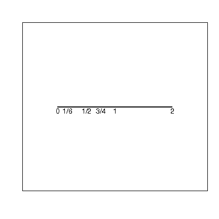

> **Definition**:  
> 
> **Rational numbers** are fractions denoted $p/q$, where $p$ and $q$ are
> integers. The set of all rational numbers is usually denoted
> $\mathbb{Q}$.

> **Note**:  
> 
> *Note 2*. Note that every integer is a rational number (obtained by
> taking $q=1$).

We can simplify fractions if the numerator and denominator contain
common terms.\
When the rationals are ordered on to a line there are points missing,
i.e. there are \"gaps\", for example there is no rational number $p/q$
such that $(p/q)^2=2$.

### Examples

> **Example**:  
> 
> $\frac{2}{6}$=$\frac{2}{2 \cdot 3}$=$\frac{1}{3}$

The rational numbers can be put in order along a line as in the figure.

> **Example**:  
> 
> As an elaborate example of a fraction, consider the evaluation of the
> quantity 
> 
> $$\frac{\frac{2}{3}+\frac{2}{5}}{\frac{1}{3}+\frac{1}{2}}$$
> 
> 

> **Example**:  
> 
> Evaluate 
> 
> $$\frac{\frac{2}{3}+\frac{2}{5}}{\frac{1}{3}+\frac{1}{2}}$$
> 
> 
> 
> Solution: We can either start by calculating the numerator
> 
> 
> 
> $$\frac{2}{3}+\frac{2}{5}$$
> 
> 
> 
> or the denominator
> 
> 
> 
> $$\frac{1}{3}+\frac{1}{2}.$$
> 
> 
> 
> Here we choose to start with the numerator. The first step is to make
> the two fractions in the numerator have a common denominator.
> 
> We can either find the least common denominator or use the product of
> the two denominators. Here they are the same number, 15.
> 
> So the first step is:
> 
> 
> 
> $$\frac{2}{3}\cdot \frac{5}{5}+\frac{2}{5}\cdot \frac{3}{3} = \frac{2\cdot 5}{3\cdot 5}+\frac{2\cdot 3}{5\cdot 3} = \frac{10}{15}+\frac{6}{15}.$$
> 
> 
> 
> Now it is possible to add the two fractions, which is the second step:
> 
> 
> 
> $$\frac{10+6}{15} = \frac{16}{15}$$
> 
> 
> 
> Next, the same process has to be performed for the original denominator.
> 
> With the same method (LCM - least common multiple) we get:
> 
> 
> 
> $$\frac{1\cdot 2}{3\cdot 2}+\frac{1\cdot 3}{2\cdot 3} = \frac{2}{6}+\frac{3}{6} =\frac{5}{6}$$
> 
> 
> 
> Then the total answer is:
> 
> 
> 
> $$\frac{\frac{16}{15}}{\frac{5}{6}} {=} \frac{16}{15} \cdot \frac{6}{5} = \frac{96}{75}= \frac{96/3}{75/3}=\frac{32}{25}$$
> 
> 
> 
> We can see that in the last step of the equation, the factor has been
> simplified. To do this we use factoring. Here we obtain:
> 
> 
> 
> $$\frac{96}{75}$$
> 
> 
> 
> = 
> 
> $$\frac{3\cdot 32}{3\cdot 25}$$
> 
> 
> 
> We can now remove \"3\", or the multiplier, as it is on both sides of
> the fraction. So we have:
> 
> 
> 
> $$\frac{32}{25}$$
> 
> 
> 
> = 
> 
> $$\frac{25}{25}+\frac{7}{25} 
> =1\frac{7}{25}$$
> 
> 
> 
> In step 1 above we used Cross-Multiplication.
> 
> > **Definition**:  
> > 
> > **Cross-Multiplication** is when we multiple the numerator by the
> > reciprocal of the denominator.
> 
> So in this case we rewrite 
> 
> $$\frac{\frac{16}{15}}{\frac{5}{6}}$$
> 
> 
> 
> or 
> 
> $$\frac{16}{15} \div \frac{5}{6}$$
> 
> 
> 
> as 
> 
> $$\frac{16}{15} \cdot \frac{6}{5}$$
> 
> 
> 
> As you can see all we are doing is turning 
> 
> $$\frac{5}{6}$$
> 
> 
> 
> upside down: and multiplying it with 
> 
> $$\frac{16}{15}$$
> 
> 
> 
> This gives:
> 
> 
> 
> $$\frac{96}{75}$$
> 
> 

In some cases it is possible to draw a **square root** of a fraction
$s=\frac{p}{q}$, i.e. find a number $r\in \mathbb{Q}$ such that $r^2=s$.
The square root is denoted $\sqrt{r}$.

> **Example**:  
> 
> Consider the expression
> 
> 
> $$(\sqrt{\frac{1}{9}} \times 2^4) + (\frac{1}{5} \times \sqrt{25}).$$
> 
> 
> 
> To evaluate this expression, first consider separately the two parts on
> each side of the plus symbol.
> 
> The first part is 
> 
> $$(\sqrt{\frac{1}{9}} \times 2^4)$$
> 
> 
> 
> and the second part is 
> 
> $$(\frac{1}{5} \times \sqrt{25}).$$
> 
> 
> 
> In addition, by definition of root,
> 
> 
> $$\sqrt{\frac{1}{9}} = \frac{1}{3}.$$
> 
> 
> 
> First part:
> 
> 
> $$(\sqrt{\frac{1}{9}} \times 2^4) = \frac{1}{3} \times 16 = \frac{16}{3}$$
> 
> 
> 
> Second part:
> 
> 
> $$(\frac{1}{5} \times \sqrt{25}) = \frac{1}{5} \times 5 = 1$$
> 
> 
> 
> Finally, add the first part and the second part:
> 
> 
> $$\frac{16}{3} + 1 = \frac{19}{3}$$
> 
> 

> **Example**:  
> 
> Consider the following fraction example, to be solved step by step:
> 
> 
> 
> $$\frac{\frac{4}{2}+(\frac{1}{4}\cdot\frac{5}{3})}{\frac{2}{6}\div\frac{1}{5}}$$
> 
> 
> 
> First we need to be aware of operator precedence, sometimes called
> BODMAS (brackets, multiplication/division, then addition/subtraction).
> 
> 
> 
> $$(\frac{1}{4}\cdot\frac{5}{3}) = \frac{5}{12}$$
> 
> 
> 
> After solving the bracket we can proceed with adding 
> 
> $$\frac{4}{2}$$
> 
> 
> 
> to 
> 
> $$\frac{5}{12}$$
> 
> 
> 
> as there is no other action left for the nominator of the main fraction.
> So:
> 
> 
> 
> $$\frac{4}{2}+\frac{5}{12}$$
> 
> 
> 
> When adding fractions together we first have to find a common
> denominator, in this case 12 would work as 
> 
> $$2\cdot6=12$$
> 
> 
> 
> So we multiply both the numerator and the denominator of that fraction
> by 6 and then add the two numerators of the fractions together, keeping
> the same denominator.
> 
> 
> 
> $$\frac{4}{2}+\frac{5}{12}=\frac{4\cdot6}{2\cdot6}+\frac{5}{12}=\frac{24}{12}+\frac{5}{12}=\frac{29}{12}$$
> 
> 
> 
> Now we have the top half of the fraction solved. We then proceed with
> dividing the two fractions of the bottom half. When dividing fractions
> we use the so called cross multiplication technique. This arithmetic
> trick is derived from the fact that if you divide a fraction by its
> duplicate you get 1. If you multiple a fraction by its reciprocal (it's
> reverse) you also get 1. Like so:
> 
> 
> 
> $$\frac{1}{2}\div\frac{1}{2}=1$$
> 
> 
> 
> and 
> 
> $$\frac{1}{2}\cdot\frac{2}{1}=1$$
> 
> 
> 
> These functions always provide the same result and therefore we can turn
> the fraction we are dividing by upside down and multiply it to the other
> fraction as that is usually much easier.\
> We can therefore rewrite 
> 
> $$\frac{2}{6}\div\frac{1}{5}$$
> 
> 
> 
> as 
> 
> $$\frac{2}{6}\cdot\frac{5}{1}=\frac{10}{6}$$
> 
> 
> 
> We've now solved both halves of the original fraction and can therefore
> proceed to solve it, again with the cross multiplication technique as
> fractions are after all just divisions:
> 
> 
> 
> $$\frac{29}{12}\div\frac{10}{6}=\frac{29}{12}\cdot\frac{6}{10}=\frac{174}{120}$$
> 
> 
> 
> Now 
> 
> $$\frac{174}{120}$$
> 
> 
> 
> is a pretty bad looking fraction and we'd preferably like to simplify
> it.\
> To do this we use factoring.
> 
> > **Definition**:  
> > 
> > **Factoring** essentially means to break a number done into it's
> > smallest factors or multipliable prime numbers.
> 
> In this case we get 
> 
> $$\frac{2\cdot3\cdot29}{2\cdot3\cdot20}$$
> 
> 
> 
> These are the smallest prime numbers that can multiply together into 174
> and 120 respectively.\
> A way of doing this in your head is by first dividing both numbers
> (174,120) by two. Which gives us:
> 
> 
> 
> $$\frac{2\cdot87}{2\cdot60}$$
> 
> 
> 
> and then dividing those numbers (87,60) by 3, since they can't be
> divided by 2. Dividing by 3 gives you
> 
> 
> $$\frac{3\cdot29}{3\cdot20}=\frac{29}{20}$$
> 
> 
> 
> which is a lot nicer than 
> 
> $$\frac{174}{120}$$
> 
> 
> 
> The reasoning behind this factoring simplification is that we can remove
> multipliers if they are on both sides of a fraction. This is because the
> result of a fraction where the numerator and the denominator are the
> same is always 1. Like so:
> 
> 
> 
> $$\frac{1}{1}=1$$
> 
> 
> 
> or 
> 
> $$\frac{2}{2}=1$$
> 
> 
> 
> or 
> 
> $$\frac{3}{3}=1$$
> 
> 
> 
> The final answer therefore is
> 
> 
> 
> $$\frac{\frac{4}{2}+(\frac{1}{4}\cdot\frac{5}{3})}{\frac{2}{6}\div\frac{1}{5}}=\frac{29}{20}$$
> 
> 

## The real line

> Some obvious numbers are not fractions.
> 
> The set of numbers making up the real line is denoted by the symbol
> $\mathbb{R}$.
> 
> 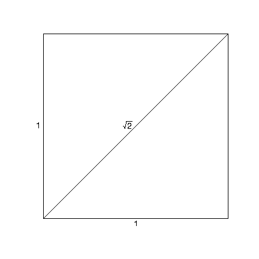
> 
> Figure: The diagonal of a rectangle with unit side lengths of
> $\sqrt{2}$, Note that $\sqrt{2}$ is not a fraction.

### Details

Some obvious numbers, which commonly occur, are not fractions. These are
in between the rational numbers (fractions). Filling in the missing
points to obtain a continuum results in the set of \"real numbers\".\
Denoted by $\mathbb{R}$ the entire set of \"real numbers\" which
corresponds to \"filling in\" the \"missing pieces\" of the line.

### Examples

> **Example**:  
> 
> If $C$ is the circumference of a circle and $D$ is the diameter and we
> define $\pi=\frac{C}{D}$ then $\pi$ is not a fraction.

> **Example**:  
> 
> One example of a non fraction is the number e (Euler's number) which can
> be defined by
> 
> 
> 
> $$e = \sum_{n=0}^{\infty }\frac{1}{n!}$$
> 
> 

> **Example**:  
> 
> If you have a right triangle with unit side length, what is the length
> of its hypotenuse and what class of numbers does it belong to?
> 
> An isosceles triangle is defined as having adjacent and opposite sides
> of same length, connected by a $90^{\circ}$ angle. Unit side length of
> these, refers to a side length of 
> 
> $$1.$$
> 
> 
> 
> As we have a $90^{\circ}$ angle, we can use Pythagoras' theorem:
> 
> 
> 
> $$a^2+b^2=c^2$$
> 
> 
> 
> With 
> 
> $$a=adjacent$$
> 
> 
> 
> 
> 
> $$b=opposite$$
> 
> 
> 
> 
> 
> $$c=hypotenuse$$
> 
> 
> 
> So with 
> 
> $$a,b=1:$$
> 
> 
> 
> 
> 
> $$c^2=1^2+1^2$$
> 
> 
> 
> 
> 
> $$c^2=1+1$$
> 
> 
> 
> 
> 
> $$c^2=2$$
> 
> 
> 
> We take the square root to get 
> 
> $$c$$
> 
> 
> 
> 
> 
> $$c=\sqrt{2}$$
> 
> 
> 
> Now that we answered the first part of the question, it needs to be
> defined, which class of number 
> 
> $$\sqrt{2}$$
> 
> 
> 
> belongs to. 
> 
> $$\sqrt{2}$$
> 
> 
> 
> is an irrational number, and belongs thereby to the set of real numbers
> 
> 
> $$\mathbb{R}$$
> 
> 
> 
> Real numbers can be imagined as points on an infinitely long line, which
> is also called the real line.

**Copyright** 2021, Gunnar Stefansson (editor) with contributions from
very many students

This work is licensed under the Creative Commons Attribution-ShareAlike
License. To view a copy of this license, visit
http://creativecommons.org/licenses/by-sa/1.0/ or send a letter to
Creative Commons, 559 Nathan Abbott Way, Stanford, California 94305,
USA.

# Data vectors

## The plane

> Pairs of numbers can be depicted as points on a plane.
> 
> The plane is normally denoted by $\mathbb{R}^2$.

### Details

Pairs of numbers can be depicted as points on a plane.\

> **Definition**:  
> 
> A **plane** is a perfectly flat surface with no thickness and no end, it
> can extend forever in all directions. It has two-dimensions, length and
> width. We need two values to find a point on the plane.

Normally we talk about \"the plane\" as the collection of all pairs of
numbers and denoted it by


$$\mathbb{R}^2 = \{ (x,y) : x,y \in \mathbb{R} \},$$

 giving coordinates
to each point.

### Examples

> **Example**:  
> 
> Plotting the point (2,4) in the x-y plane using R.
> 
>     plot(2,4,xlim=c(0,6),ylim=c(0,6),xlab="x",ylab="y",cex=2)
>     text(2,4,"(2,4)",pos=4,cex=2)
> 
> Additional points can be added using the $\texttt points$ function:
> 
>     points(3,5, cex = 0.5)      ## a point at (3,5)

If you have 2 sets of coordinates on a plane you can calculate the
distance between the 2 points and graph the line connecting the points

> **Example**:  
> 
> What is the distance between the 2 points (3,9) and (5,1)?
> 
> We will use the Pythagorean theorem:
> 
> 
> 
> $$d = \sqrt{(x_{2}-x_{1})^{2}+(y_{2}-y_{1})^{2}}$$
> 
> 
> 
> We insert our values into the formula: 
> 
> $$d=\sqrt{(5-3)^{2}+(1-9)^{2}}$$
> 
> 
> 
> When we combine inside the parenthesis we get:
> 
> 
> $$d=\sqrt{(2)^{2}+(-8)^{2}}$$
> 
> 
> 
> Squaring both terms: 
> 
> $$d=\sqrt{4+64}$$
> 
> 
> 
> Then we take the square root: 
> 
> $$d=\sqrt{68}$$
> 
> 
> 
> The result: 
> 
> $$d=8.2462$$
> 
> 

## Simple plots in R

> Graphing functions in R
> 
> -   plot - plots a scatter plot (as a line plot)
> 
> -   points - adds points to a plot
> 
> -   text - adds text to a plot
> 
> -   lines - adds lines to a plot
> 
> 
> 
> Figure: Points on a plane, drawn with R.

### Examples

> **Example**:  
> 
>     plot(2,3)
> 
> gives a single plot and
> 
>     plot(2,3, xlim=c(0,5), ylim=c(0,5))
> 
> gives a single plot but forces both axes to range from 0 to 5.

> **Example**:  
> 
> The following R commands can be used to generate a plot with two points:
> 
>     plot(1,2,xlim=c(0,5),ylim=c(0,5),xlab="x",ylab="y")
>     points(3,1)
>     text(1,2,"(1,2)",pos=4, cex=2)
>     text(3,1,"(3,1)",pos=4, cex=2)

> **Example**:  
> 
> In this example, we plot 3 points. The first two points are by including
> vectors with a length of 2 as the x and y arguments of the plot
> function. The third plot was added with the points function. The second
> and third points were labeled using the text function and a line was
> drawn between them using the lines function.
> 
> > **Note**:  
> > 
> > *Note 3*. Note that if you are unsure of what format the arguments of an
> > R function needs to be, you can call a help file by typing \"?\" before
> > the function name (e.g. \"?lines\")
> 
>     plot(c(2,3),c(3,4),xlim=c(2,6),ylim=c(1,5),xlab="x",ylab="y")
>     points(4,2)
>     text(3,4,"(3,4)",pos=4, cex=2)
>     text(4,2,"(4,2)",pos=4, cex=2)
>     lines(c(3,4), c(4,2))

## Data

> Data are usually a sequence of numbers, typically called a vector.

### Details

When we collect data these are one or more sequences of numbers,
collected into data vectors. We commonly think of these data vectors as
columns in a table.

### Examples

> **Example**:  
> 
> In R, if the command
> 
>     x <- c(4,5,3,7)
> 
> is given, then $\verb1x1$ contains a vector of numbers.

> **Example**:  
> 
> Create a function in R, give it a name \"Myfunction\" which takes the
> sum of x,y.
> 
>     Myfunction<- function(x,y) {
>      sum(x,y)
>     }
> 
> If you input the vectors 1:3 and 4:7 into the function it will calculate
> the sum of $\verb|x<-(1+2+3)|$ and $\verb|y<-(4+5+6+7)|$ as follows
> 
>     > Myfunction(1:3,4:7)
>     28

## Indices for a data vector

> If data are in a vector $x$, then we use [indices]{.underline} to refer
> to individual elements.

### Details

If $i$ is an integer then $x_i$ denotes the $i$'th element of $x$.\
Note that although we do not distinguish (much) between row- and column
vectors, usually a vector is thought of as a column. If we need to
specify the type of vector, row or column, then for vector $x$, the
column vector would be referred to as $x'$ and the row vector as $x^T$
(the **transpose** of the original).

### Examples

> **Example**:  
> 
> If $x=(4,5,3,7)$ then $x_1=4$ and $x_4=7$

> **Example**:  
> 
> How to remove all indices below a certain value in R
> 
>     x <- c(1,5,8,9,4,16,12,7,11)
>     x
>     [1]  1  5  8  9  4 16 12  7 11
>     y <- x[x>10]
>     y
>     [1] 16 12 11

> **Example**:  
> 
> Consider a function that takes to vectors
> 
> 
> $$a \in \mathbb{R}^n, b \in \mathbb{N}^m$$
> 
> 
> 
> as arguments with 
> 
> $$n \ge m$$
> 
> 
> 
> and 
> 
> $$1 \le b_1,...,b_m \le n.$$
> 
> 
> 
> The function returns the sum 
> 
> $$\sum_{i = 1}^m {a_b}_i$$
> 
> 
> 
> Long version:\
> `f`N \<- function(a,b) \
> result \<- sum(a\[b\])\
> return(result)\
> 
> Short version:\
> `|`fN \<- function(a,b) sum(a\[b\])\|

## Summation

> We use the symbol $\Sigma$ to denote sums.
> 
> In R, the sum function adds numbers.

### Examples

> **Example**:  
> 
> If $x=(4,5,3,7)$
> 
> then
> 
> 
> 
> $$\sum_{i=1}^{4} x_i = x_1+x_2+x_3+x_4 = 4+5+3+7 = 19$$
> 
> 
> 
> and
> 
> 
> 
> $$\sum_{i=2}^{4} x_i = x_2+x_3+x_4 = 5+3+7 = 15 .$$
> 
> 
> 
> Within R one can give the corresponding commands:
> 
>      x<-c(4,5,3,7)
>      x
>     [1] 4 5 3 7
>      sum(x)
>     [1] 19
>     sum(x[2:4])
>     [1] 15

**Copyright** 2021, Gunnar Stefansson (editor) with contributions from
very many students

This work is licensed under the Creative Commons Attribution-ShareAlike
License. To view a copy of this license, visit
http://creativecommons.org/licenses/by-sa/1.0/ or send a letter to
Creative Commons, 559 Nathan Abbott Way, Stanford, California 94305,
USA.

# More on algebra

## Some Squares

> If a and b are real numbers, then
> 
> 
> 
> $$(a+b)^2=a^2+2ab+b^2$$
> 
> 

### Details

If a, b are real numbers, then:

$(a+b)^2=a^2+2ab+b^2$

This can be proven formally with the following argument:


$$\begin{aligned}
(a+b)^2 &=& (a+b)(a+b)\\
       &=&( a+b)a+(a+b)b\\
       &=& a^2+ba+ba+b^2\\
       &=& a^2+2ab+b^2\end{aligned}$$


## Pascal's Triangle

> Pascal's triangle is a geometric arrangement of the binomial
> coefficients in a triangle
> 
> 
> 
> $$\begin{array}{ccccc}
>   & & 1 & &\\
>   & 1 & & 1&\\
>   1 & & 2 & & 1\\
>   \vdots \quad \vdots && \vdots && \vdots \quad \vdots
> \end{array}$$
> 
> 

### Details


$$\begin{array}{ccccccccc}
  n=0: & & & & &1& & & \\
  n=1: & & & &1& &1& & \\
  n=2: & & &1& &2& &1& \\
  n=3: & &1& &3& &3& &1
\end{array}$$


To build Pascal's triangle, start with \"1\" at the top, and then
continue placing numbers below it in a triangular pattern. Each number
is just the two numbers above it added together (except for the edges,
which are all \"1\").

### Examples

> **Example**:  
> 
> The following function in R gives you the Pascal's triangle for $n= 0$
> to $n=10$.
> 
>     fN <- function(n) formatC(n, width=2)
>     for (n in 0:10) {
>         cat(fN(n),":", fN(choose(n, k = -2:max(3, n+2))))
>         cat("\n")
>     }
> 
>      0 :  0  0  1  0  0  0
>      1 :  0  0  1  1  0  0
>      2 :  0  0  1  2  1  0  0
>      3 :  0  0  1  3  3  1  0  0
>      4 :  0  0  1  4  6  4  1  0  0
>      5 :  0  0  1  5 10 10  5  1  0  0
>      6 :  0  0  1  6 15 20 15  6  1  0  0
>      7 :  0  0  1  7 21 35 35 21  7  1  0  0
>      8 :  0  0  1  8 28 56 70 56 28  8  1  0  0
>      9 :  0  0  1  9 36 84 126 126 84 36  9  1  0  0
>     10 :  0  0  1 10 45 120 210 252 210 120 45 10  1  0  0
> 
> Changing the numbers in the line $\verb|for(n in 0:10)|$ will give
> different portions of the triangle.

## Factorials

> We define the factorial of an integer n as\
> $n!= n\cdot(n-1) \cdot(n-2)\cdot \ldots \cdot 3 \cdot 2 \cdot 1$

### Details

> **Definition**:  
> 
> We define the factorial of an integer n as
> 
> 
> $$n!= n\cdot(n-1) \cdot(n-2)\cdots \ldots \cdot 3 \cdot 2 \cdot 1 .$$
> 
> 

### Examples

> **Example**:  
> 
> Suppose you have 6 apples, $\{a, b, c, d, e, f\}$ and you want to put
> each one into a different apple basket, $\{1,2,3,4,5,6\}$.\
> For the first basket you can choose from 6 apples $\{a, b, c, d, e,
> f\}$, and for the second basket you have then 5 apples to choose from
> and so it goes for the rest of the baskets, so for the last one you only
> have 1 apple to choose from.\
> The end result would then be:
> $6! = 6 \cdot 5 \cdot 4 \cdot 3 \cdot 2 \cdot 1 = 720$ possible
> allocations.\
> This could also be calculated in R with the factorial function:
> 
>     factorial(6)
>     [1] 720

## Combinations

> The number of different ways one can choose a subset of size $x$ from a
> set of $n$ elements is determined using the following calculation:
> 
> 
> $${n \choose x}= \frac{{n!}}{{x!\left( {n - x} \right)!}}$$
> 
> 

### Details

> **Definition**:  
> 
> A **combination** is an un-ordered collection of distinct elements

Suppose we want to toss a coin $n$ times. In each toss we obtain head
(H) or tail (T) resulting in a sequence of H,T,T,H, \... T.\
How many of these possible sequences contain exactly $x$ tails? There
are $n$ positions in the sequence, we can choose $x$ of these in
$\binom{n}{x}$ ways and put our \"Ts\" in those positions. If the
probability of landing tails is $p$ then each one of these sequences
with exactly $x$ tails has probability $p^x(1-p)^{n-x}$ so the total
probability of landing exactly $x$ tails in $n$ independent tosses is


$${n \choose x}= \frac{{n!}}{{x!\left( {n - x} \right)!}} .$$


For convenience we define $0!$ to be 1.

### Examples

> **Example**:  
> 
> Consider tossing a coin four times.\
> (a) How many times will this experiment result in exactly two tails?\
> There are a total of 16 possible sequences of heads and tails from four
> tosses. These can simply all be written down to answer a question like
> this.\
> We get two tails in 6 of these tosses. We can explicitly write the
> corresponding combinations of two tails as follows
> 
>     HHTT
>     HTHT
>     HTTH
>     THTH
>     TTHH
>     THHT
> 
> \(b\) How many times you will end up with 1 tail? The answer is 4 times
> and the output can be written as;
> 
>     HHHT
>     HTHH
>     THHH
>     HHTH 
> 
> The case of a single tail is easy: The single tail can come up in any
> one of four positions.

## The binomial theorem

> 
> 
> $$(a+b)^n  = \sum_{x=0}^n {n \choose x} a^xb^{n-x}$$
> 
> 

### Details

If a and b are real numbers and n is an integer then the expression
$(a+b)^n$ can be expanded as:

$(a+b)^n = a^n+ {n \choose 1}a^{n-1}b +  {n \choose 2}a^{n-2}b^ + \ldots +{n \choose n-1}ab^{n-1}+b^n$

$(a+b)^n  = \sum_{i=1}^n  {n \choose x}a^xb^{n-x}$

This can be seen by looking at $(a+b)^ n$ as a product of n parentheses
and multiply these by picking one item (a or b) from each. If we picked
$a$ from x parentheses and $b$ from $(n-x)$, then the product is
$a^x b^{n-x}$. We can choose the $x$ $a$'s in a total of $\binom{n}{x}$
ways so the coefficient of $a^xb^{n-x}$ is $\binom{n}{x}$.

### Examples

> **Example**:  
> 
> Since 
> 
> $$(a+b)^n  = \sum_{x=0}^n {n \choose x} a^xb^{n-x},$$
> 
>  it follows
> that 
> 
> $$2^n = (1+1)^n  = \sum_{x=0}^n {n \choose x}$$
> 
>  i.e.
> 
> 
> $$2^n = {n \choose 0} + {n \choose 1} + {n \choose 2}\ldots+ {n \choose n}$$
> 
> 

**Copyright** 2021, Gunnar Stefansson (editor) with contributions from
very many students

This work is licensed under the Creative Commons Attribution-ShareAlike
License. To view a copy of this license, visit
http://creativecommons.org/licenses/by-sa/1.0/ or send a letter to
Creative Commons, 559 Nathan Abbott Way, Stanford, California 94305,
USA.

# Discrete random variables and the binomial distribution

## Simple probabilities

### Details

Of all the possible 3-digit strings, $\binom{3}{x}$ of them have $x$
heads. So the probability of landing $x$ heads is
$\binom{3}{x}p^x(1-p)^{3-x}$.

### Examples

> **Example**:  
> 
> Consider a biased coin which has probability $p$ of landing heads up. If
> we toss this coin 3 independent times the possible outcomes are:
> 
> 
> 
> $$\begin{array}{c c c}
>   \hline
>   \text{sequence} & \text{probability}  & \text{Number of heads}\\
>   \hline                
>   \text{HHH} & p \cdot p \cdot p=p^3 & 3\\
>   \text{HHT} & p^2(1-p) & 2\\
>   \text{HTH} & p^2(1-p) & 2 \\
>   \text{HTT} & p(1-p)^2 & 1\\
>   \text{THH} & p^2(1-p) & 2\\
>   \text{THT} & p(1-p)^2 & 1\\   
>   \text{TTH} & p(1-p)^2 & 1\\
>   \text{TTT} & (1-p)^3 & 0\\
>   \hline
> \end{array}$$
> 
> 

> **Example**:  
> 
> It is also possible to aggregate these values into a table and describe
> only the number of heads obtained: 
> 
> $$\begin{array}{c c}
>   \hline
>   \text{Heads} & \text{Probability}\ p(x)\\
>   \hline                
>   0 & (1-p)^3\\
>   1 & 3p(1-p)^2\\
>   2 & 3p^2(1-p)\\
>   3 & p^3 \\
>   \hline
> \end{array}.$$
> 
>  If we are only interested in the number of heads, then
> this table describes a **probability mass function** $p$, namely the
> probability $p(x)$ of every possible outcome $x$ of the experiment.

> **Example**:  
> 
> Given that a year is 365 days and each day has the same probability of
> being someone's birthday. What's the probability of at least 2 people
> sharing a birthday in a group of 25 people?\
> Now, calculating each of the possible outcomes could become very
> tedious. That is calculating the odds that 2 people share a birthday, 3
> people, 4 people, etc. So instead we try to find out the odds that no
> one in the group shares a birthday and subtract those odds from 1
> (100%).\
> First, let's look at the odds of only two people having distinct
> birthdays.
> 
> 
> 
> $$\frac{365}{365}\cdot\frac{364}{365} = 0.9973$$
> 
> 
> 
> Person one can be born on any day and the odds of having a distinct
> birthday are therefore 1. The next person can be born on everyday but
> the 1 the other person was born on, so 364 days.\
> Now let's say we add the 3rd person and calculate his/her odds of having
> a distinct birthday.
> 
> 
> 
> $$\frac{365}{365}\cdot\frac{364}{365}\cdot\frac{363}{365} = 0.9918$$
> 
> 
> 
> This can also be rewritten as
> 
> 
> 
> $$\frac{365\cdot364\cdot363}{365^3}$$
> 
> 
> 
> And we can do this on and on for all the 25 people we are interested in.
> But that may also become a bit tedious. So we use factorials instead. So
> instead of doing
> 
> 
> 
> $$\frac{365\cdot364\cdot363...\cdot341}{365^{25}}$$
> 
> 
> 
> we do
> 
> 
> 
> $$\frac{\frac{365!}{340!}}{365^{25}}=0.4313$$
> 
> 
> 
> Essentially the division of factorials here removes all the values \<
> 341, leaving 340, 339, 338 \... 1
> 
> Now remember this is the probability that no one shares a birthday. So
> when we subtract this from 1 we get
> 
> 
> 
> $$1-0.4313=0.5687$$
> 
> 
> 
> or roughly 57% odds of at least 2 people in a group of 25 sharing the
> same birthday.

## Random variables

> A random variable is a concept used to denote the outcome of an
> experiment before it is conducted.

### Examples

> **Example**:  
> 
> Let $X$ denote the number of heads in a coin tossing experiment. We can
> then talk about the probabilities of certain events such as obtaining
> two heads, i.e. $X=2$. We write this as
> 
> 
> 
> $$P[X=2]={n \choose 2}p^2(1-p)^{n-2}$$
> 
> 
> 
> In general: 
> 
> $$P[X=x] = {n \choose x}p^x (1-p)^{n-x}$$
> 
>  where
> $x = 0,1,.....,n$

### Handout

> **Definition**:  
> 
> A **random variable**, $X$, is a function defined on a sample space,
> with outcomes in the set of real numbers.

It is simpler to think of a random variable as a symbol used to denote
the outcome of an experiment before it is conducted.

> **Note**:  
> 
> *Note 4*. Note that it is **essential** to distinguish between upper
> case and lower case letters when writing these probabilities - it makes
> no sense to write $P[x=x]$.

> **Note**:  
> 
> *Note 5*. Random variables are generally denoted by upper case letters
> such as $X$, $Y$ and so on.

> **Note**:  
> 
> *Note 6*. To see how a random variable is a function, it is useful to
> consider the actual outcomes of two coin tosses. These outcomes can be
> denoted $\{HH, HT, TH, TT\}$. Now consider a random variable $X$ which
> describes the number of heads obtained. This random variable attributed
> 2 to the outcome $HH$ and 0 to $TT$, i.e. $X$ is a function with
> $X(HH)=2$, $X(HT)=X(TH)=1$ and $X(TT)=0$.

## Simple surveys with replacement

> If we randomly draw individuals (with replacement) and ask a question
> with two possible answers (positive or negative), then the number of
> positive answers will come from a binomial distribution.

### Examples

> **Example**:  
> 
> Suppose we are participating in a lottery. We pick a number from a
> lottery bowl (a simple random sample). We can put the number aside, or
> we can put it back into the bowl. If we put the number back in the bowl,
> it may be selected more than once; if we put it aside, it can be
> selected only one time.
> 
> > **Definition**:  
> > 
> > When an element can be selected more than one time, we are sampling
> > **with replacement**.
> 
> > **Definition**:  
> > 
> > When an element can be selected only one time, we are sampling **without
> > replacement**.

## The binomial distribution

> If we toss a biased coin $n$ independent times, each with probability
> $p$ of landing heads up, then the probability of obtaining $x$ heads is
> 
> 
> 
> $${n \choose x}p^x (1-p)^{n-x}$$
> 
> 

### Examples

> **Example**:  
> 
> Suppose we toss a coin, with probability $p$ of landing on heads $n$
> times obtaining a sequence of Hs (when it lands heads) and Ts (when it
> lands tails). Any sequence, 
> 
> $$HTH...HTHHH$$
> 
>  which has $x$ heads ($H$)
> and $n-x$ tails ($T$), has the probability $p^x(1-p)^{n-x}$. There are
> exactly $\binom{n}{x}$ such sequences, so the total probability of
> landing $x$ heads in $n$ tosses is 
> 
> $$\binom{n}{x}p^x(1-p)^{n-x}.$$
> 
> 

> **Example**:  
> 
> Let the probability that a certain football club wins a match be equal
> to 0.4.If the total number of matches played in the season is 30, what
> is the probability that the football club wins the match 10% of the
> time?\
> We first calculate the number of times a match was played and won by
> multiplying the percentage of wins by the number of matches played.\
> 10% of 30 times = 3 times\
> We can now proceed to calculate the probability that they will win the
> match given that their probability of a winning is 0.4 if they play 3
> times in a season. This can be computed as follows:
> 
> 
> $$\binom{30}{3} \times (0.4)^3 \times (1-0.4)^{30-3}$$
> 
> 
> 
> 
> 
> $$=0.000265$$
> 
> 
> 
> \
> This can be calculated in R using the code below:
> 
>     dbinom(3,30,0.4)
> 
>     [1] 0.0002659437
> 
> This is equal to the manual calculation using the binomial theorem.

> **Example**:  
> 
> Suppose a youngster puts his shirt on by himself every day for five
> days. The probability that he puts it on the right way each time is
> $p=0.2$. We let $X$ be a random variable that describes the number of
> times the youngster puts his shirt on the right way. The youngster can
> either put the shirt on the wrong or the right way so $X$ follows the
> binomial distribution with the parameters $p=0.2$ (the probability of a
> successful trial) and $n=5$ (number of trials). We can now calculate for
> example the probability that the youngster will put it on the right way
> for at least 4 days.\
> Putting the shirt on the right way for at least 4 days means that the
> youngster will either put it on the right way for either four or five
> days (at least four or more days of five days total). We thus have to
> calculate the probability that the youngster will put his shirt on the
> right way for 4 and 5 days separately and then we add it together. We
> can write this process as follows:
> 
> 
> 
> $$P(X\geq4) = P(X=4) + P(X=5)$$
> 
> 
> 
> 
> 
> $$= \binom{5}{4}\times0.2^4\times(1-0.2)^{5-4} + \binom{5}{5}\times0.2^5\times(1-0.2)^{5-5}$$
> 
> 
> 
> 
> 
> $$= 5\times0.2^4\times0.8^1 + 1\times0.2^5\times0.8^0$$
> 
> 
> 
> 
> 
> $$= 5\times0.2^4\times0.8 + 0.2^5\times1$$
> 
> 
> 
> 
> 
> $$= 5\times0.8 \times0.2^4 + 0.2^5$$
> 
> 
> 
> 
> 
> $$= 4\times0.2^4 + 0.2^5$$
> 
> 
> 
> 
> 
> $$= 4\times0.0016 + 0.00032$$
> 
> 
> 
> 
> 
> $$= 0.00672$$
> 
> 
> 
> The probability that the youngster will put his shirt on the right way
> for at least four out of five is thus 0,7%.\
> This is possible to calculate in R in a several ways, either using the
> command dbinom or pbinom. The command dbinom calculates 
> 
> $$P(X = k)$$
> 
> 
> 
> and the command pbinom calculates 
> 
> $$P(X \leq k)$$
> 
> 
> 
> where $k$ is the number of successful trials. If $n$ is the number of
> trials and $p$ is the probability of a successful trials then the
> commands are used by writing: $dbinom$($k$,$n$,$p$) and
> pbinom($k$,$n$,$p$).\
> To calculate the probability that the youngster will put his shirt on
> the right way for at least four days of five we thus write the command:
> 
>     dbinom(4,5,0.2) + dbinom(5,5,0.2)
> 
> which gives 0.00672.\
> This is the same as writing:
> 
>     dbinom(c(4,5),5,0.2)
> 
> or
> 
>     dbinom(4:5,5,0.2)
> 
> which give two separate numbers: 0.00640 and 0.00032 which can be added
> together to get 0.00672.\
> There is also a command to add them together for us:
> 
>     sum(dbinom(c(4,5),5,0.2))
> 
> or
> 
>     sum(dbinom(4:5,5,0.2))
> 
> They give the answer 0.00672.\
> The fourth way of calculating this in R is to use pbinom. As said before
> pbinom calculates 
> 
> $$P(X \leq k)$$
> 
> 
> 
> where $k$ is the number of successful trials. Here we want to calculate
> the probability that the youngster will put his shirt on the right way
> in 4 or 5 times (of 5 total) so the number of successful trials is 4 or
> greater. That means we want to calculate 
> 
> $$P(X \geq 4)$$
> 
> 
> 
> which equals 
> 
> $$1 - P(X \leq 3).$$
> 
> 
> 
> We thus put $k$ as 3 and the R command will be:
> 
>     1 - pbinom(3,5,0.2)
> 
> which also gives 0.00672.

> **Example**:  
> 
> In a certain degree program, the chance of passing an examination is
> 20%. What is the chance of passing at most 2 exams if the student takes
> five exams?\
> Solution:\
> In this problem, we compute the chance of a student passing, 0, 1 or 2
> exams. This is given by,
> 
> 
> $$p(X=0 \text{ or }1 \text{ or }2)={5\choose 0}0.2^0 0.8^5 +{5\choose 1}0.2^1 0.8^4 +{5\choose 2}0.2^2 0.8^3$$
> 
> 
> 
> 
> 
> $$=1\times0.2^0 0.8^5 +5\times 0.2^1 0.8^4 +10\times0.2^2 0.8^3$$
> 
> 
> 
> 
> 
> $$=0.32768+0.4096+0.2048$$
> 
> 
> 
> 
> 
> $$=0.94208$$
> 
> 
> 
> In the R console, we can use the command,
> $\verb|sum(dbinom(c(0:2),5,0.2))|$, which also gives 
> 
> $$0.94208.$$
> 
> 
> 
> The same answer is obtained with
> 
>     dbinom(0,5,0.2)+dbinorm(1,5,0.2)+dbinom(2,5,0.2)
> 
> and with
> 
>     pbinom(2,5,0.2)

> **Example**:  
> 
> Consider the probability of someone jumping off a cliff is 0.35. Suppose
> we randomly selected four individuals to participate in the cliff
> jumping activity. What is the chance that exactly one of them will jump
> off the cliff?\
> Consider a scenario where one person jumps:\
> P (A =jump , B = refuse, C = refuse, D = refuse)
> 
> = P (A =jump) P (B = refuse) P (C = refuse) P (D = refuse)
> 
> $= (0.35)(0.65)(0.65)(0.65) = (0.35)^1 (0.65)^3 = 0.096$\
> But there are three other scenarios( B, C, or D) in which one only
> person decides to jump. In each of these cases, the probability is again
> 0.096. These four scenarios exhaust all the possible ways that exactly
> one of the four people jumps:
> 
> $4 \cdot (0.35)^1 (0.65)^3 = 0.38.$\
> In the R console we can use the command: $\verb|dbinom(1,4,0.35)|$ which
> gives the answer as 0.384475.

## General discrete probability distributions

> A general discrete probability distribution can be described by a list
> of all possible outcomes and associated probabilities.

### Details

A general discrete probability distribution is described by the possible
outcomes 

$$x_1, x_2, \ldots$$

 and associated probabilities, denoted by
$p_1, p_2, \ldots$ or $p(x_1), p(x_2),\ldots$\
If a random variable $X$ has this distribution, then we can write


$$P[X=x_i] = p(x_i)= p_i$$


or in general


$$P[X=x] = p(x)$$


where it is understood that $p(x) = 0$ if $x$ is not one of these $x_i$.

### Examples

> **Example**:  
> 
> If $X$ is the number of heads ($H$) before obtaining the first tail
> ($T$) when tossing an unbiased coin 4 independent times, then the
> possible basic outcomes are:
> 
> 
> 
> $$\begin{array}{c c c}
> \hline
>          & \text{Toss}    &   \\
> \text{In binary} & 1\ 2\ 3\ 4 & \#\text{H before T}\\
> \hline              
>   0000 & \text{H H H T} & 3\\
>   0010 & \text{H H T H} & 2\\
>   0011 & \text{H H T T} & 2\\
>   0100 & \text{H T H H} & 1\\
>   0101 & \text{H T H T} & 1\\
>   0110 & \text{H T T H} & 1\\
>   0111 & \text{H T T T} & 1\\
>   1000 & \text{T H H H} & 0\\
>   1001 & \text{T H H T} & 0\\
>   1010 & \text{T H T H} & 0\\
>   1011 & \text{T H T T} & 0\\
>   1100 & \text{T T H H} & 0\\
>   1101 & \text{T T H T} & 0\\
>   1110 & \text{T T T H} & 0\\
>   1111 & \text{T T T T} & 0\\
> \hline
> \end{array}$$
> 
> 
> 
> Since the coin is unbiased, each of these has the same probability of
> occurring. We can now count sequences to find the number of
> possibilities of a particular number of heads, $H$, before a tail in 4
> coin tosses and thus obtain the corresponding probabilities as:
> 
> 
> $$\begin{array}{c r}
> \hline
> \text{Number of tosses before a heads} & \text{Probability}\\
>  & p(x)\\
> \hline
> 0 & \frac{8}{16}=\frac{1}{2}\\
> 1 & \frac{4}{16}=\frac{1}{4}\\
> 2 & \frac{2}{16}=\frac{1}{8}\\
> 3 & \frac{1}{16}\\
> 4 & \frac{1}{16}\\
> \hline
> \end{array}$$
> 
> 

## The expected value or population mean

> The expected value is the sum of the possible outcomes, weighted with
> the respective probabilities (discrete variable). Think of this in terms
> of an urn full of marbles, each labelled with number.

### Details

If the possible outcomes are $x_1, x_2...$ with probabilities
$p_1, p_2...$ then the expected value is


$$\mu=x_1 \cdot p_1+x_2 \cdot p_2 + \ldots .$$


The fact that this is the only sensible definition of an expected value
follows from considering random draws from a finite population where
there are $n_i$ possibilities of obtaining the value $x_i$. If we set
$n=\sum x_i$ and $p_i=n_i/n$ then the expected value above is the simple
average of all the numbers in the original population.\
In the case of the **binomial distribution** with $n$ trials and success
probability $p$ it turns out that


$$\mu=n \cdot p$$


If $X$ is the corresponding random variable, we denote this quantity by
$E[X]$.

### Examples

> **Example**:  
> 
> If we toss a fair coin 10 independent times, we expect on average
> $np=10\cdot\frac{1}{2}= 5$ heads.

> **Example**:  
> 
> Toss a fair die and pay \$60 if a six comes up and nothing otherwise.
> The expected outcome is
> 
> 
> $$\frac{5}{6}\cdot\$0+\frac{1}{6}\cdot\$60= \$10.$$
> 
> 

> **Example**:  
> 
> In Las Vegas, a particular sports bet has about a 30% chance of winning.
> If the bet wins, the bettor will win 15 dollars. If the bet loses, the
> bettor will lose 10 dollars. The expected return of placing one of these
> bets is -2.50 dollars.
> 
> Detailed calculation:
> 
> 
> 
> $$\$15\cdot 0.3 - \$10\cdot 0.7 = -\$2.5$$
> 
> 

> **Example**:  
> 
> Class starts at 8:00 and the last bus that will get you to class on time
> leaves at 7:30. The teacher has a policy that if you are late to class 6
> of the 30 classes, then she drops your final grade by 1/10 points. You
> know that if you set your alarm for 7:15, you miss the 7:30 bus
> approximately every fourth time, but if you set it for 7:10, you'll only
> miss the bus approximately every eighth time. If you set it for 7:00,
> you'll only miss the bus every one hundredth time.\
> Part A: Assuming you try to go to class every time, can you expect to
> have your grade dropped in the following scenarios?
> 
> 1 - You set your alarm for 7:15 throughout the duration of the class.
> 
> 2 - You set your alarm for 7:15 until you reach 5 missed classes, then
> switch to 7:10.
> 
> 3 - You set your alarm for 7:15 until you reach 5 missed classes, then
> switch to 7:00.\
> Part B: What is your expected grade in the course, assuming you would
> have had a 7/10 without the late penalty, and:
> 
> 1 - You would never choose the first alarm-clock strategy and you would
> most likely choose scenario 2 (let's say 9/10 times), but there's a
> small chance you might choose the 3rd strategy (let's say 1/10 times).
> 
> 2 - You would never choose the first alarm-clock strategy and you would
> most likely choose scenario 3 (let's say 9/10 times), but there's a
> small chance you might choose the 2nd strategy (let's say 1/10 times).\
> Answers:
> 
> A1 - Let's call X our random variable, which we want to be the number of
> times we make it to class on-time. With the alarm set to 7:15 we expect
> to make it to class on-time:
> 
> 
> $$E[X]=30\times(1-\frac{1}{4})=22\frac{1}{2}$$
> 
> 
> 
> You're grade would most likely be dropped.\
> A2 - First we need to see how many classes we go to before we reach the
> 5-late-classes threshhold: 
> 
> $$E[X] = n \times (1 - \frac{1}{4}) = n - 5$$
> 
> 
> 
> 
> 
> $$E[X] = n ((1 - \frac{1}{4}) - 1) = - 5$$
> 
> 
> 
> 
> 
> $$E[X] = n = \frac{- 5}{- \frac{1}{4}}$$
> 
> 
> 
> 
> 
> $$E[X] = n = \frac{20}{1} = 20$$
> 
> 
> 
> So, the night before our 21st class, you get worried and change
> alarm-clock strategies. If you set it at 7:15 for the rest of the course
> (10 classes), you will be on time:
> 
> 
> $$E[X] = 15 + 10 \times (1 - \frac{1}{8}) = 23 \frac {3}{4}$$
> 
> 
> 
> You're grade would most likely be dropped.\
> A3: If you instead start setting the alarm clock for 7:00 for the rest
> of the course, you will be on time:
> 
> 
> $$E[X] = 15 + 10 \times (1 - \frac{1}{100}) = 24 \frac{1}{9}$$
> 
> 
> 
> You're grade would most likely NOT be dropped.\
> Part B: **This seems to contain errors** In Part A, we calculated the
> mean of several binomial distributions that described the expected
> number of days that you will arrive on-time to class. Each distribution
> corresponded to a different alarm-setting scenario. In this part, we are
> describing a different binomial distribution. It describes your expected
> grade. Therefore, the grade is the outcome n, weighted by the
> probability of you choosing the particular alarm-clock setting
> procedure:
> 
> 
> 
> $$1 - E[X] = 0 \times 6 + 0.9 \times 6 + 0.1 \times 7 = 6.1$$
> 
> 
> 
> 
> 
> $$1 - E[X] = 0 \times 6 + 0.1 \times 6 + 0.9 \times 7 = 6.9$$
> 
> 
> 
> Note that the probabilities of these three choices (0 + 0.9 + 0.1) must
> equal 1, since these are the only three choices defined.

## The population variance

> The (population) variance, for a discrete distribution, is
> 
> 
> 
> $$\sigma^2 = E\left[ \left ( X-\mu \right ) ^2 \right ] = (x_1 - \mu)^2 p_1 + (x_2 - \mu)^2 p_2 + ...$$
> 
> 
> 
> where it is understood that the random variable $X$ has this
> distribution and $\mu$ is the expected value.\
> In the case of the binomial distribution, it turns out that:
> 
> $\sigma^2 = np(1 - p)$

### Details

> **Definition**:  
> 
> If $\mu$ is the expected value, then the **variance of a discrete
> distribution** is defined as
> 
> 
> $$\sigma ^2=(x_1 - \mu)^2 p_1 + (x_2 - \mu)^2 p_2 + \ldots .$$
> 
> 

If a random variable $X$ has associated probabilities, $p_i=P[X=x_i]$,
then one can equivalently write


$$\sigma^2 = V[X]=E\left [ \left ( X - \mu \right ) ^ 2\right ] .$$


### Examples

> **Example**:  
> 
> In the case of the binomial distribution, it turns out that:
> 
> 
> 
> $$\sigma^2 = np(1 - p) .$$
> 
> 

**Copyright** 2021, Gunnar Stefansson (editor) with contributions from
very many students

This work is licensed under the Creative Commons Attribution-ShareAlike
License. To view a copy of this license, visit
http://creativecommons.org/licenses/by-sa/1.0/ or send a letter to
Creative Commons, 559 Nathan Abbott Way, Stanford, California 94305,
USA.

# Functions

## Functions of a single variable

> A function describes the relationship between variables.
> 
> Examples:\
> $f(x) = x^2$
> 
> $y = 2+3\cdot x^4$
> 
> 

### Details

Functions are commonly used in statistical applications, to describe
relationships.

> **Definition**:  
> 
> A **function** describes the relationship between variables. A variable
> $y$ is described as a function of a variable $x$ by completely
> specifying how $y$ can be computed for any given value of $x$.

An example could be the relationship between a dose level and the
response to the dose.\
The relationship is commonly expressed by writing either $f(x) = x^{2}$
or $y = x^2$.\
Usually names are given to functions, i.e. to the relationship itself.
For example, $f$ might be the function and $f(x)$ could be its value for
a given number $x$. Typically $f(x)$ is a number but $f$ is the
function, but the sloppy phrase \"the function $f(x)=2x+4$\" is also
common.

### Examples

> **Example**:  
> 
> $f(x) = x^2$ or $y = x^2$ specifies that the computed value of $y$
> should always be $x^2$, for any given value of $x$.

## Functions in R

> A function can be defined in R using the \"function\" command
> 
> 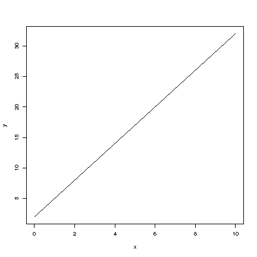

## Ranges and plots in R

> Functions in R can commonly accept a range of values and will return a
> corresponding vector with the outcome.

### Examples

> **Example**:  
> 
>     f <- function(x) {return(x*12)}
>     x <- seq (-5,5,0,1)
>     y <- f(x)
>     plot {(x,y) type= 'l'} 

## Plotting functions

> In statistics, the function of interest is commonly called the response
> function. If we write Y=f(x), the outcome Y is usually called the
> response variable and x is the explanatory variable. Function values are
> plotted on vertical axis while x values are plotted on horizontal axis.
> This plots Y against x.

### Examples

> **Example**:  
> 
> The following R commands can be used to generate a plot for function; Y=
> 2+3x
> 
>     x<- seq(0:10)
>     g <- function(x){
>     + yhat <- 2+3*x
>     + return(yhat)
>     + }
>      
>     x<-seq(0,10,0.1)
>     y<- g(x)
>     plot(x,y,type="l", xlab="x",ylab="y")

## Functions of several variables

### Examples

> **Example**:  
> 
> 
> 
> $$\begin{aligned}
> z &= 2x+3y+4\\
> v &= t^2+3x\\
> w &= t^2+3b*x\end{aligned}$$
> 
> 

**Copyright** 2021, Gunnar Stefansson (editor) with contributions from
very many students

This work is licensed under the Creative Commons Attribution-ShareAlike
License. To view a copy of this license, visit
http://creativecommons.org/licenses/by-sa/1.0/ or send a letter to
Creative Commons, 559 Nathan Abbott Way, Stanford, California 94305,
USA.

# Polynomials

## The general polynomial

> The general polynomial:
> 
> $p(x)=a_{0}+a_{1}x+a_{2}x^{2}+...+a_{n}x^{n}$
> 
> The simplest: $p(x)=a$

### Details

> **Definition**:  
> 
> A **polynomial** describes a specific function consisting of linear
> combinations of positive integer powers of the explanatory variable.

The general form of a polynomial is:

$p(x)=a_{0}+a_{1}x+a_{2}x^{2}+...+a_{n}x^{n}$

The simplest of these is the constant polynomial $p(x)=a$.

## The quadratic

> The general form of the quadratic (parabola) is $p(x) = ax^2 + bx + c$.
> 
> The simplest quadratic is $p(x) = x^2$
> 
> 
> 
> Figure: Parabolas: Quadratic functions.

### Details

The quadratic polynomial of the form $p(x) = ax^2 + bx + c$ describes a
parabola when points $(x,y)$ with $y = p(x)$ are plotted.\
The simplest parabola is $p(x) = x^2$ (Fig. a) which is always
non-negative $p(x)\geq 0$ and $p(x)=0$ only when $x=0$.

> **Note**:  
> 
> *Note 7*. Note that $p(-x) = p(x)$ since $(-x)^2= x^2$.

If the coefficient at the highest power is negative, then the parabola
is \"upside down\"(Fig. b).\
This is sometimes used to describe a response function.

## The cubic

> The general form of a cubic polynomial is:
> 
> $p(x)=ax^3 + bx^2 + cx + d$
> 
> 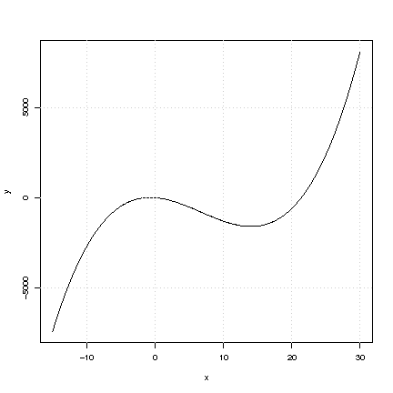
> 
> Figure: $y=x^3-20x^2-30x-4$

## The Quartic

> The general form of the quartic polynomial is
> $p(x) = ax^4 + bx^3 + cx^2 + dx + e$
> 
> 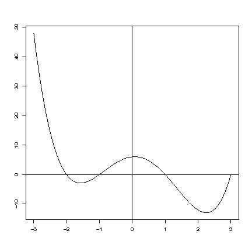
> 
> Figure: The general shape. Here we used the following equation
> $y=x^4-x^3-7x^2+x+6$

## Solving the linear equation

> If the value of $y$ is given and we know that $x$ and $y$ are on a
> specific line so that $y = a + bx$, then we can find the value of $x$

### Details

If a value of $y$ is given and we know that $x$ and $y$ lie on a
specific straight line so that $y = a + bx$, then we can find the value
of $x$ by considering $y = a+bx$ as an equation to be solved for $x$,
since $y$, $a$ and $b$ are all known.\
The general solution is found through the following steps:

-   Equation: $y = a + bx$

-   Subtract $a$ from both sides

    -   $y-a = bx$

    -   $bx=y-a$

-   Divide by $b$ on both sides if $b$ is not equal to 0.

    -   $x=\frac{1}{b}(y-a).$

## Roots of the quadratic equation

> The general solution of $ax^2 + bx + c = 0$ is given by
> $x = \frac{-b \pm \sqrt{b^2 - 4ac}}{2a}$.

### Details

Suppose we want to solve $ax^2 + bx + c = 0$, where $a \neq 0$.

The general solution is given by the formula


$$x = \frac{-b \pm \sqrt{b^2 - 4ac}}{2a},$$


if $b^2 - 4ac \geq 0$. On the other hand, if $b^2-4ac<0$, the quadratic
equation has no real solution.

### Examples

> **Example**:  
> 
> Solve $x^2 - 3x + 2 = 0$
> 
> Putting this into the context of the formulation $ax^2+bx+c=0$, the
> constants are;
> 
> $a = 1, b = -3 , c = 2$
> 
> Inserting this into the formula for the roots gives:
> 
> 
> 
> $$\begin{aligned}
> x &=& \frac{-(-3) \pm \sqrt{(-3)^2 - 4(1)(2)}}{2(1)}\\
> x &=& \frac{3 \pm \sqrt{9 - 8}}{2}\\
> x &=& \frac{3 \pm \sqrt{1}}{2}\\
> x &=& \frac{3 + 1}{2} , \frac{3 - 1}{2}\\
> x &=& \frac{4}{2} , \frac{2}{2}\\
> x &=& 2 , 1 \end{aligned}$$
> 
> 

> **Example**:  
> 
> Find the roots of the following polynomial
> 
> 
> 
> $$3x^{4} + 14x^{2} + 15$$
> 
> 
> 
> We can use the quadratic equation to solve for the roots of this
> polynomial if we substitute a variable for 
> 
> $$x^{2}$$
> 
> 
> 
> Let's use the letter 
> 
> $$a$$
> 
> 
> 
> 
> 
> $$3a^{2} + 14a + 15$$
> 
> 
> 
> We then plug the constants in to the quadratic equation.
> 
> 
> 
> $$x = \frac{-(14) \pm \sqrt{14^{2} - (4)(3)(15)}}{(2)(3)}$$
> 
> 
> 
> which simplifies to
> 
> 
> 
> $$\frac{-(14) \pm \sqrt{196 - 180}}{6}$$
> 
> 
> 
> which equals 
> 
> $$-1\frac{2}{3}$$
> 
> 
> 
> and 
> 
> $$-3.$$
> 
> 
> 
> Then, since we substituted a for 
> 
> $$x^2$$
> 
> 
> 
> we need to take the square root of these values to get the roots of the
> polynomial.
> 
> So, 
> 
> $$x_{1,2} = \pm \sqrt{-1\frac{2}{3}}$$
> 
> 
> 
> and 
> 
> $$x_{3,4} = \pm \sqrt{3}$$
> 
> 

**Copyright** 2021, Gunnar Stefansson (editor) with contributions from
very many students

This work is licensed under the Creative Commons Attribution-ShareAlike
License. To view a copy of this license, visit
http://creativecommons.org/licenses/by-sa/1.0/ or send a letter to
Creative Commons, 559 Nathan Abbott Way, Stanford, California 94305,
USA.

# Simple data analysis in R

## Entering data; dataframes

> Several methods exist to enter data into R:
> 
> 1.  Enter directly: x\<-c(4,3,6,7,8)
> 
> 2.  Read in a single vector: x\<-scan(\"filename\")
> 
> 3.  Use: x\<-read.table(\"file address\")

### Details

The most direct method will not work if there are a lot numbers;
therefore, the second method is to read in a single vector by
x\<-scan(\"filename\"), \"filename\" = text string, either a full path
name or refers to a file in the working directory.\
The scan() command returns a vector, but the read.table() command
returns a dataframe, which is a rectangular table of data whose columns
have names. A column can be extracted from a data frame, e.g., with x\<-
dat\$a where\"dat\" is the name of the data frame and \"a\" is the name
of a column.

> **Note**:  
> 
> *Note 8*. Note that for read.table(\"file address\"), \"file address\"
> refers to the location of the file. Thus, it can be the URL or the
> complete file directory depending on where the table is stored.

### Examples

> **Example**:  
> 
> Below are three examples using R code to enter data
> 
> 1.  x\<-c(4,3,6,7,8)
> 
> 2.  x\<-scan(\"lecture 70.txt\")
> 
> 3.  x\<-read.table(\"http://notendur.hi.is/ gunnar/kennsla/alsm/data/set115.dat\",
>     header=T)

## Histograms

> A histogram is a graphical display of tabulated frequencies, shown as
> bars.
> 
> In R use the command: hist()
> 
> 

### Examples

A histogram is a graphical display of tabulated frequencies, shown as
bars.

> **Example**:  
> 
> If we toss a fair die 100 times and record the number of sixes, then we
> can view that as the outcome of a random variable $X$, which is binomial
> with $n=100$ and $p=\frac{1}{6}$, i.e $X \sim b(n=100,p=\frac{1}{6})$\
> Now this can be done e.g. 1000 times to obtain numbers,
> $x_1,...,x_{1000}$. Within R this can be simulated using
> 
>     x <- rbinom(1000,100,1/6)
> 
> We would typically plot these using a histogram, e.g.\
> hist(x)\
> or\
> hist(x,nclass=50);l

## Bar Charts

> The bars in a bar chart usually correspond to frequencies in categories
> and are therefore kept apart.
> 
> 

### Details

A bar chart is similar to the histogram but is used for categorical
data.

## Mean, standard error, standard deviations

### Details

The most familiar measure of central tendency is the arithmetic mean.

> **Definition**:  
> 
> An **arithmetic mean** is the sum of the values divided by the number
> values, typically expressed as:
> 
> 
> 
> $$\bar{y} = \frac{\sum_{i=1}^{n} y_i}{n}$$
> 
> 

> **Definition**:  
> 
> The **sample variance** is a measure of the spread of a set of values
> from the mean value:
> 
> 
> 
> $$s^2 = \frac{1}{n-1}\displaystyle\sum_{i=1}^{n}(x_i - \bar{x} )^2$$
> 
> 

The sample standard deviation is more commonly used as a measure of the
spread of a set of values from the mean value.

> **Definition**:  
> 
> The **standard deviation** is the square root of the variance and may be
> expressed as:
> 
> 
> 
> $$s = \sqrt{\frac{1}{n-1}\displaystyle\sum_{i=1}^{n}(x_i - \bar{x} )^2}$$
> 
> 

> **Definition**:  
> 
> The **standard error** is a method used to indicate the reliability of
> the sample mean:
> 
> 
> 
> $$SE_{\bar{y}} = \sqrt{\frac{s^2}{n}}$$
> 
> 

If a vector x in R contains an array of numbers then:\
$\verb;mean(x);$ returns the average, $\bar{x}$\
$\verb;sd(x);$ returns the standard deviation,$s$\
$\verb;var(x);$ returns the variance, $s^2$\
\
We may also want to use several other related operations in R: 

$\verb;median(x);$, the median value in vector x\
$\verb;range(x);$, which list the range: $\verb;max(x)-\verb;min(x);$\
If the variable $\verb;x;$ contains discrete categories,
$\verb;table(x);$ returns counts of the frequency in each category.

## Scatter plots and correlations

> If we have paired explanatory and response data we are often interested
> in seeing if a relationship exists between them. To do this, we first
> plot the data in a scatter plot.
> 
> 
> 
> Figure: Scatter plot showing the length-weight relationship of fish
> species \"X\". Data source : Marine Resource Institution - Iceland.

### Details

A first step in analyzing data is to prepare different plots. The type
of variable will determine the type of plot. For example, when using a
scatter plot both the explanatory and response data should be continuous
variables.\
The equation for the Pearson correlation coefficient is:


$$r_{x,y} = \frac{\sum_{i=1}^{n}(x_i - \bar{x})(y_i - \bar{y})}{\sum_{i=1}^{n}(x_i - \bar{x})^2\sum_{i=1}^{n}(y_i - \bar{y})^2},$$


where $\bar{x}$ and $\bar{y}$ are the sample means of the x- and
y-values.

The correlation is always between -1 and 1.

### Examples

The following R commands can be used to generate a scatter plot for
vectors x and y

> **Example**:  
> 
>     plot(x,y) 

**Copyright** 2021, Gunnar Stefansson (editor) with contributions from
very many students

This work is licensed under the Creative Commons Attribution-ShareAlike
License. To view a copy of this license, visit
http://creativecommons.org/licenses/by-sa/1.0/ or send a letter to
Creative Commons, 559 Nathan Abbott Way, Stanford, California 94305,
USA.

# Indices and the apply commands in R

## Giving names to elements

> We can name elements of vectors and data frames in R using the \"names\"
> command.

### Examples

> **Example**:  
> 
>     X<-c(41, 3, 73)
>     names(X)<-c("One", "Two", "Three")
> 
> View the results by simply typing \"X\" and the output of \"X\" is given
> as follows:
> 
>     X
>     One   Two Three 
>     41     3    73
> 
> With this we can refer to the elements by name as well as locations
> using\...
> 
>     X[1] 
>     One  
> 
>     X["Three"] 
>     Three  
>     73 

## Regular matrix indices and naming

> A matrix is a table of numbers. Typical matrix indexing: mat\[i,j\],
> mat\[1:2,\] etc\
> A matrix can have row and column names Indexing with row and column
> names: mat\[\"a\",\"B\"\]

### Details

> **Definition**:  
> 
> A **matrix** is a (two-dimensional) table of numbers, indexed by row and
> column numbers.

> **Note**:  
> 
> *Note 9*. Note that a matrix can also have row and column names so that
> the matrix can be indexed by its names rather than numbers.

### Examples

> **Example**:  
> 
> Consider a matrix with 2 rows and 3 columns. Consider extracting first
> element (1,2), then all of line 2 and then columns 2-3 in an R session:
> 
>     mat<-matrix(1:6,ncol=3)
>     mat
>          [,1] [,2] [,3]
>     [1,]    1    3    5
>     [2,]    2    4    6
> 
>     mat[1,2]
>     [1] 3
> 
>     mat[2,]
>     [1] 2 4 6
> 
>     mat[,2:3]
>          [,1] [,2]
>     [1,]    3    5
>     [2,]    4    6
> 
> Next, consider the same matrix, but give names to the rows and columns.
> The rows will get the names \"a\" and \"b\" and the columns will be
> named \"A\", \"B\" and \"C\".
> 
> The entire R session could look like this:
> 
>     mat<-matrix(1:6,ncol=3)
>     dimnames(mat)<-list(c("a","b"),c("A","B","C"))
>     mat
>       A B C
>     a 1 3 5
>     b 2 4 6
> 
>     mat["b",c("B","C")]
>     B C 
>     4 6 

## The apply command

> The apply command\...
> 
> apply(mat,2,sum) -- applies the sum function within each column
> 
> apply(mat,1,mean) -- computes the mean within each row

## The tapply command

> Commonly one has a data vector and another vector of the same length
> giving categories for the measurements. In this case one often wants to
> compute the mean or variance (or median etc) within each category. To do
> this we use the tapply command in R.

### Examples

> **Example**:  
> 
>     z<-c(5,7,2,9,3,4,8)
>     i<-c("m","f","m","m","f","m","f")
> 
> A. Find the sum within each group
> 
>     tapply(z,i,sum)
>      f  m 
>     18 20 
> 
> B.Find the sample sizes
> 
>     tapply(z,i,length) 
>     f m 
>     3 4 
> 
> C.Store outputs and use names
> 
>     n<-tapply(z,i,length) 
>     n
>     f m 
>     3 4 
>     n["m"]
>     m 
>     4 

## Logical indexing

> A logical vector consists of $TRUE$ (1) or $FALSE$ (0) values. These can
> be used to index vectors or matrices.

### Examples

> **Example**:  
> 
>     i<-c("m","f","m","m","f","m","f")
>     z<-c(5,7,2,9,3,4,8)
> 
>     i=="m"
>     [1]  TRUE FALSE  TRUE  TRUE FALSE  TRUE FALSE
> 
>     z[i=="m"]
>     [1] 5 2 9 4
> 
>     z[c(T,F,T,T,F,T,F)]
>     [1] 5 2 9 4

## Lists, indexing lists

> A list is a collection of objects. Thus, data frames are lists.

### Examples

> **Example**:  
> 
>     x<-list(y=2,z=c(2,3),w=c("a","b","c"))
>     x[["z"]]
>     [1] 2 3
>     names(x)
>     [1] "y" "z" "w"
>     x["w"]
>     [1] "a" "b" "c"
>     x$w
>     [1] "a" "b" "c"

**Copyright** 2021, Gunnar Stefansson (editor) with contributions from
very many students

This work is licensed under the Creative Commons Attribution-ShareAlike
License. To view a copy of this license, visit
http://creativecommons.org/licenses/by-sa/1.0/ or send a letter to
Creative Commons, 559 Nathan Abbott Way, Stanford, California 94305,
USA.

# Functions of functions and the exponential function

## Exponential growth and decline

> Exponential growth is typically expressed as:
> 
> $y(t)=Ae^{kt}$
> 
> 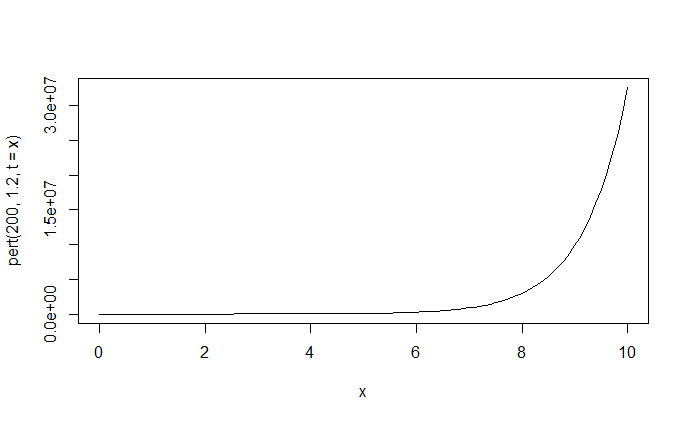
> 
> Figure: Exponential growth curve

### Details

> **Definition**:  
> 
> **Exponential growth** is the rate of population increase across time
> when a population is devoid of limiting factors (i.e. competition,
> resources, etc.) and experiences a constant growth rate.

Exponential growth is typically expressed as:

$y(t)=Ae^{kt}$

where\
$A$ (sometimes denoted $P$)=initial population size\
$k$= growth rate\
$t$ =number of time intervals\

> **Note**:  
> 
> *Note 10*. Note that exponential growth occurs when $k>0$ and
> exponential decline occurs when $k<0$.

## The exponential function

> An exponential function is a function with the form: $f(x)=b^x$

### Details

For the exponential function $f(x)=b^x$, $x$ is a positive integer and
$b$ is a fixed positive real number. The equation can be rewritten as:


$$f(x)=b^x=b\cdot b \cdot b...b.$$


When the exponential function is written as $f(x)=e^x$ then, it has a
growth rate at time $x$ equivalent to the value of $e^x$ for the
function at $x$.

## Properties of the exponential function

> Recall that the methods of the basic arithmetic implies that:
> 
> 
> $$e^{a+b} = e^a e^b$$
> 
>  for any real numbers $a$ and $b$.

## Functions of functions

### Details

Consider two functions, $f$ and $g$, each defined for some set of real
numbers. Where $x$ can be solved in function $f$ using $Y = f(x)$ when
$g(Y)$ exists for all such resulting $Y$. If $Y = f(x)$ and $g(Y)$ exist
then we can compute $g(f(x))$ for any $x$.\
If\
$f(x) = {x}^2$ and\
$g(y)= {e}^y$ then\
$g(f(x))= {e}^{f(x)} = {e}^{x^2}$\
If we call the resulting function ${h}$;\
$h(x) = g(f(x))$\
Then ${h}$ is commonly written as\
${h} = {g}\circ{f}$\
\

### Examples

> **Example**:  
> 
> If\
> $g(x)= {3}+ {2}x$ and\
> $f(x) = {5}{x}^2$\
> Then\
> $g(f(x)) = {3} +{2} f(x)$\
> $g(f(x)) = {3} +{10x}^2$\
> $f(g(x)) = {5}{(g(x))}^2$\
> $f(g(x)) = {5}{({3}+{2x})}^2$\
> $f(g(x)) = {45}+{60x}+{20x}^2$

## Storing and using R code

> As R code gets more complex (more lines) it is usually stored in files.
> Functions are typically stored in separate files.

### Examples

> **Example**:  
> 
> Save the following file (test.r):
> 
>     x=4
>     y=8
>     cat("x+y is", x+y, "\n")
> 
> To read the file use:
> 
>     source("test.r")
> 
> and the outcome of the equation is displayed in R

## Storing and calling functions in R

> To save a function in a separate file use a command of the form
> \"function.r\".

### Examples

> **Example**:  
> 
>     f<-function(x) {
>         return (exp(sum(x)))
>         }
> 
> can be stored in a file function.r and subsequently read using the
> source command.

**Copyright** 2021, Gunnar Stefansson (editor) with contributions from
very many students

This work is licensed under the Creative Commons Attribution-ShareAlike
License. To view a copy of this license, visit
http://creativecommons.org/licenses/by-sa/1.0/ or send a letter to
Creative Commons, 559 Nathan Abbott Way, Stanford, California 94305,
USA.

# Inverse functions and the logarithm

## Inverse Function

> If $f$ is a function, then the function $g$ is the inverse function of
> $f$ if 
> 
> $$g(f(x))=x$$
> 
> 
> 
> for all $x$ in which $f(x)$ can be calculated

### Details

The inverse of a function $f$ is denoted by $f^{-1}$, i.e.


$$f^{-1}(f(x))=x$$


### Examples

> **Example**:  
> 
> If $f(x) = x^2$ for $x<0$ then the function $g$, defined as
> $g(y)=\sqrt{y}$ for $y>0$, is not the inverse of $f$ since
> $g(f(x))=\sqrt{x^2}= |x|= -x$ for $x<0$.

## When the inverse exists: The domain question

> Inverses do not always exist. For an inverse of $f$ to exist, $f$ must
> be one-to-one, i.e. for each $x$, $f(x)$ must be unique.
> 
> 
> 
> Figure: The function $f(x)=x^2$ does not have an inverse since f(x)=1
> has two possible solutions -1 and 1.

### Examples

> **Example**:  
> 
> $f(x)=x^2$ does not have an inverse since $f(x)=1$ has two possible
> solutions -1 and 1.

> **Note**:  
> 
> *Note 11*. Note that iff $f$ is a function, then the function $g$ is the
> inverse function of $f$, if $g(f(x)) = x$ for all calculated values of
> $x$ in $f(x)$.\
> The inverse function of $f$ is denoted by $f^{-1}$, i.e.
> $f^{-1}(f(x)) = x$.

> **Example**:  
> 
> What is the inverse function, $f^{-1}$, of $f$ if $f(x) = 5 + 4x$.\
> The simplest approach is to write $y=f(x)$ and solve for $x$:
> 
> With 
> 
> $$f(x) = 5 + 4x$$
> 
> 
> 
> we write 
> 
> $$y = 5 + 4x$$
> 
> 
> 
> which we can now rewrite as 
> 
> $$y - 5 = 4x$$
> 
> 
> 
> and this implies 
> 
> $$\frac{y-5}{4} = x$$
> 
> 
> 
> And there we have it, very simple:
> 
> 
> 
> $$f^{-1}(f(x)) = \frac{y - 5}{4}$$
> 
> 

## The base 10 logarithm

> When $x$ is a positive real number in $x=10^y$, $y$ is referred to as
> the base 10 logarithm of x and is written as: 
> 
> $$y=\log_{10}(x)$$
> 
> 
> 
> or 
> 
> $$y=\log(x)$$
> 
> 

### Details

If $\log (x) = a$ and $\log (y)=b$, then $x = 10^a$ and $y = 10^b$, and


$$x \cdot y = 10^a \cdot 10^b = 10^{a+b}$$

 so that 

$$\log(xy) = a+b$$


### Examples

> **Example**:  
> 
> 
> 
> $$\begin{aligned}
> log(100)&=& 2 \\
> log(1000)&=& 3\end{aligned}$$
> 
> 

> **Example**:  
> 
> If 
> 
> $$\log(2) \approx 0.3$$
> 
> 
> 
> then 
> 
> $$10^y=2$$
> 
> 
> 
> > **Note**:  
> > 
> > *Note 12*. Note that 
> > 
> > $$2^{10}=1024 \approx 1000 = 10^3$$
> > 
> > 
> > 
> > therefore 
> > 
> > $$2 \approx 10^{3/10}$$
> > 
> > 
> > 
> > so 
> > 
> > $$\log (2) \approx 0.3$$
> > 
> > 

## The natural logarithm

> A logarithm with $e$ as a base is referred to as the natural logarithm
> and is denoted as $ln$ : 
> 
> $$y=ln(x)$$
> 
> 
> 
> if 
> 
> $$x=e^y=exp(y)$$
> 
> 
> 
> Note that $ln$ is the inverse of $exp$.
> 
> 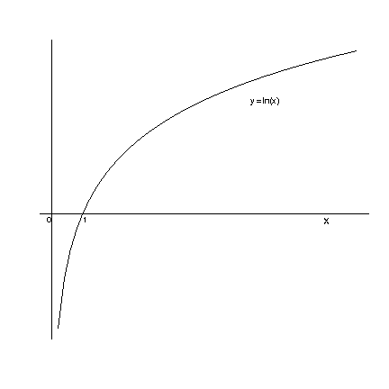
> 
> Figure: The curve depicts the fuction $y=\ln(x)$ and shows that $ln$ is
> the inverse of $exp$. Note that $\ln(1)=0$ and when $y=0$ then $e^0=1$.

## Properties of logarithm(s)

> Logarithms transform multiplicative models into additive models, i.e.
> 
> 
> $$\ln(a\cdot b) = \ln a + \ln b$$
> 
> 

### Details

This implies that any statistical model, which is multiplicative becomes
additive on a log scale, e.g.


$$y = a \cdot w^b \cdot x^c$$


$$\ln y = (\ln a) + \ln (w^b) + \ln (x^c)$$


Next, note that


$$\begin{aligned}
\ln (x^2)&=& \ln (x \cdot x)\\
&=& \ln x + \ln x\\
&=& 2 \cdot ln x\end{aligned}$$


and similarly $\ln (x^n) = n \cdot \ln x$ for any integer n.

In general $\ln (x^c) = c \cdot \ln x$ for any real number c (for x\>0).

Thus the multiplicative model (from above)


$$y=a \cdot w^b \cdot x^c$$


becomes 

$$y= (\ln a) + b \cdot \ln w + c \cdot \ln x$$

 which is a linear
model with parameters $(\ln a)$, $b$ and $c$.

In addition, the log-transform is often variance-stabilizing.

## The exponential function and the logarithm

> The exponential function and the logarithms are inverses of each other
> 
> 
> $$x = e^y \Leftrightarrow y = \ln{x}$$
> 
> 

### Details

> **Note**:  
> 
> *Note 13*. Note the properties:
> 
> 
> 
> $$\ln (x \cdot y) = \ln (x) + \ln (y)$$
> 
> 
> 
> and 
> 
> $$e^a \cdot e^b = e^{a+b}$$
> 
> 

### Examples

> **Example**:  
> 
> Solve the equation 
> 
> $$10e^{1/3x} + 3 = 24$$
> 
> 
> 
> for $x$.
> 
> First, get the 3 out of the way.
> 
> 
> 
> $$10e^{1/3x} = 21$$
> 
> 
> 
> Then the 10.
> 
> 
> 
> $$e^{1/3x} = 2.1$$
> 
> 
> 
> Next, we can take the natural log of 2.1. Since $ln$ is an inverse
> function of $e$ this would result in
> 
> 
> 
> $$\frac{1}{3}x = \ln(2.1)$$
> 
> 
> 
> This yields 
> 
> $$x = \ln(2.1) \cdot 3$$
> 
> 
> 
> which is 
> 
> $$\approx 2.23$$
> 
> 

**Copyright** 2021, Gunnar Stefansson (editor) with contributions from
very many students

This work is licensed under the Creative Commons Attribution-ShareAlike
License. To view a copy of this license, visit
http://creativecommons.org/licenses/by-sa/1.0/ or send a letter to
Creative Commons, 559 Nathan Abbott Way, Stanford, California 94305,
USA.

# Continuity and limits

## The concept of continuity

> A function is continuous if it has no jumps. Thus, small changes in each
> $x_0$, the input, correspond to small changes in the output, $f(x_0)$.
> 
> 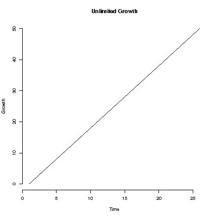
> 
> Figure: The above figure is an example of linear growth. Thomas Robert
> Malthus (1766-1834) warned about the dangers of uninhibited population
> growth.

### Details

A function is said to be discontinuous if it has jumps. The function is
continuous if it has no jumps. Thus, for a continuous function, small
changes in each $x_0$, the input, correspond to small changes in the
output, $f(x_0)$.

> **Note**:  
> 
> *Note 14*. Note that polynomials are continuous as are logarithms (for
> positive numbers).

## Discrete probabilities and cumulative distribution functions

> The cumulative distribution function for a discrete random variable is
> discontinuous.
> 
> 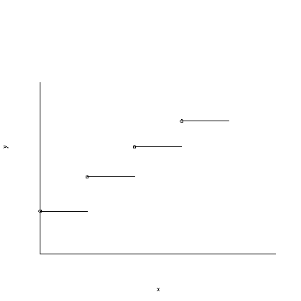

### Details

> **Definition**:  
> 
> If $X$ is a random variable with a discrete probability distribution and
> the probability mass function of 
> 
> $$p(x)=P[X=x]$$
> 
>  then the **cumulative
> distribution function**, defined by 
> 
> $$F(X)=P[X\leq x]$$
> 
>  is
> discontinuous, i.e. it jumps at points in which a positive probability
> occurs.

> **Note**:  
> 
> *Note 15*. When drawing discontinuous functions it is common practice to
> use a filled circle at $(x,f(x))$ to clarify what the function value is
> at a point $x$ of discontinuity.

### Examples

> **Example**:  
> 
> If a coin is tossed 3 independent times and $X$ denotes the number of
> heads, then $X$ can only take on the values 0, 1, 2 and 3. The
> probability of landing exactly $x$ heads, $P(X=x)$, is
> $p(x) = \binom{n}{x} p^n (1-p)^{n-x}$. The probabilities are
> 
>     x  | p(x) | F(x)
>     ----------------
>     0  | 1/8  | 1/8
>     1  | 3/8  | 4/8
>     2  | 3/8  | 7/8
>     3  | 1/8  | 1
> 
> The cumulative distribution function,
> $F(x)=P[X \leq x] = \sum_{t\leq x} p(t)$ has jumps and is therefore
> discontinuous.
> 
> > **Note**:  
> > 
> > *Note 16*. Notice on the above figure how the circles are filled in, the
> > solid circles indicate where the function value is.

## Notes on discontinuous function

> A function is discontinuous for values or ranges of the variable that do
> not vary continuously as the variable increases. In other words, breaks
> or jumps.
> 
> 
> 
> Figure: $f(x) = \frac{1}{x}$, where $x\neq 0$

### Details

A function can be discontinuous in a number of different ways. Most
commonly, it may jump at certain points or increase without bound in
certain places.\
Consider the function $f$, defined by $f(x)= 1/x$ when $x\neq 0$.
Naturally, $1/x$ is not defined for $x=0$. This function increases
towards $+\infty$ as $x$ goes to zero from the right but decreases to
$-\infty$ as $x$ goes to zero from the left. Since the function does not
have the same limit from the right and the left, it can not be made
continuous at $x=0$ even if one tries to define $f(0)$ as some number.

## Continuity of polynomials

> All polynomials, $p(x)=a_0+a_1x+a_2x^2+\ldots +a_n x^n ,$ are
> continuous.
> 
> 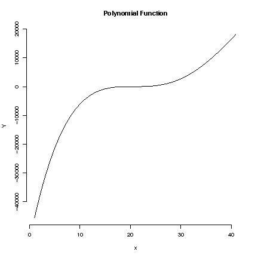

### Details

It is easy to show that simple polynomials such as $p(x)=x$,
$p(x)=a+bx$, $p(x)=ax^2+bx+c$ are continuous functions.\
It is generally true that a polynomial of the form


$$p(x)=a_0+a_1x+a_2x^2+\ldots +a_n x^n$$

 is a continuous function.

## Simple Limits

> A \"limit\" is used to describe the value that a function or sequence
> \"approaches\" as the input or index approaches some value. Limits are
> used to define continuity, derivatives and integrals.
> 
> 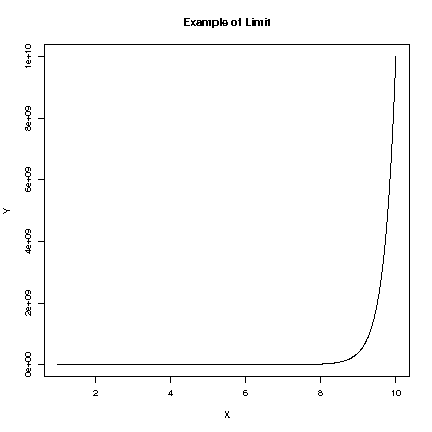
> 
> Figure: $f(x) = x^x$, for $x>0$

### Details

> **Definition**:  
> 
> A **limit** describes the value that a function or sequence approaches
> as the input or index approaches some value.

Limits are essential to calculus (and mathematical analysis in general)
and are used to define continuity, derivatives and integrals.\
Consider a function and a point ${x}_0$. If $f(x)$ gets steadily closer
to some number $c$ as $x$ gets closer to a number $x_0$, then $c$ is
called the limit of $f(x)$ as $x$ goes to $x_0$ and is written as:


$$c= \lim_{x\to x_0}f(x)$$


If $c = f(x_0)$ then $f$ is **continuous** at $x_0$.

### Examples

> **Example**:  
> 
> A simple example of limits:
> 
> Evaluate the limit of $f(x) = \frac{x^{2}-16}{x-4}$ when
> $x\rightarrow 4$, or
> 
> 
> 
> $$\lim_{x\rightarrow 4} \frac{x^{2}-16}{x-4}.$$
> 
> 
> 
> Notice that in principle we can not simply stick in the value $x=4$
> since we would then get $0/0$ which is not defined. However we can look
> at the numerator and try to factor it.
> 
> This gives us:
> 
> 
> 
> $$\frac{x^{2}-16}{x-4} = \frac{(x-4)(x+4)}{x-4} = x +4$$
> 
> 
> 
> and the result has the obvious limit of $4+4=8$ as $x\to 4$.

> **Example**:  
> 
> Consider the function
> 
> 
> 
> $$g (x ) =  \frac{1}{x}$$
> 
> 
> 
> where $x$ is a positive real number. As $x$ increases, $g(x)$ decreases,
> approaching 0 but never getting there since $\frac{1}{x}=0$ has no
> solution. One can therefore say, "The limit of $g(x)$, as $x$ approaches
> infinity, is 0," and write 
> 
> $$\lim_{x\to\infty} g(x)=0.$$
> 
> 

## More on limits

> Limits impose a certain range of values that may be applied to the
> function.
> 
> 
> 
> Figure: The function $f(x)= \frac{1}{1+e^{-x}}$.

### Examples

> **Example**:  
> 
> The Beverton-Holt stock recruitment curve is given by:
> 
> 
> $$R=\frac{\alpha S}{1+\frac{S}{K}}$$
> 
> 
> 
> where $\alpha, K >0$ are constants and S = biomass and R= recruitment.\
> The behavior of this curve as S increases $S\rightarrow\infty$ is
> 
> 
> $$\lim_{S\to\infty}\frac{\alpha S}{1+\frac{S}{K}} =\alpha K .$$
> 
>  This is
> seen by rewriting the formula as follows:
> 
> 
> $$\lim_{S\to\infty}\frac{\alpha S}{1+\frac{S}{K}} =
> \lim_{S\to\infty}\frac{\alpha }{\frac{1}{S}+\frac{1}{K}} =\alpha K .$$
> 
> 

> **Example**:  
> 
> A popular model for proportions is: 
> 
> $$f(x) = \frac{1}{1+e^{-x}}$$
> 
> 
> 
> As x increases, $e^{-x}$ decreases which implies that the term
> $1+e^{-x}$ decreases and hence $\frac{1}{1+e^{-x}}$ increases, from
> which it follows that $f$ is an increasing function.
> 
> Notice that $f(0)=\frac{1}{2}$ and further,
> 
> 
> $$\lim_{x\to\infty} f(x) = 1.$$
> 
>  This is seen from considering the
> components:\
> Since $e^{-x} = \frac{1}{e^{x}}$ and the exponential function goes to
> infinity as $x\to\infty$, $e^{-x}$ goes to $0$ and hence $f(x)$ goes to
> 1.\
> Through a similar analysis one finds that
> 
> 
> $$\lim_{x\to-\infty} f(x)=0 ,$$
> 
> 
> 
> since, as $x\rightarrow \infty$, first $-x\rightarrow \infty$ and second
> $e^{-x} \rightarrow \infty$.

> **Example**:  
> 
> Evaluate the limit of 
> 
> $$f(x) = \frac{\sqrt{x + 4} - 2}{x}$$
> 
> 
> 
> as 
> 
> $$x \to 0$$
> 
> 
> 
> 
> 
> $$\lim_{x \to 0} \frac{\sqrt{x + 4} - 2}{x}$$
> 
> 
> 
> Since the square root is present we cannot just direct substitute the 0
> as $x$. This will give us $\frac{0}{0}$, which is an indeterminate form.
> We must perform some algebra first. The way to get rid of the radical is
> to multiply the numerator by the conjugate.
> 
> 
> 
> $$\frac{\sqrt{x + 4} - 2}{x} \cdot \frac{\sqrt{x + 4} + 2}{\sqrt{x + 4} + 2}$$
> 
> 
> 
> This gives us
> 
> 
> $$\frac{(\sqrt{x + 4})^2 + 2(\sqrt{x+4}) - 2(\sqrt{x+4}) -4}{x(\sqrt{x + 4} + 2)}$$
> 
> 
> 
> The numerator reduces to $x$, and the $x$'s will cancel out leaving us
> with 
> 
> $$\frac{1}{\sqrt{x + 4} + 2}$$
> 
> 
> 
> At this point we can direct substitute 0 for $x$, which will give us
> 
> 
> $$\frac{1}{\sqrt{0 + 4} + 2}$$
> 
> 
> 
> Therefore, 
> 
> $$\lim_{x \to 0} \frac{\sqrt{x + 4} - 2}{x} = \frac{1}{4}$$
> 
> 

## One-sided limits

> $f(x)$ may tend towards different numbers depending on whether
> $x \rightarrow x_{0}$:
> 
> from the right ($x \rightarrow x_{0+}$)
> 
> or from the left ($x \rightarrow x_{0-}$).
> 
> 

### Details

Sometimes a function is such that $f(x)$ tends to different numbers
depending on whether $x \rightarrow x_0$ from the right
($x \rightarrow x_{0+}$) or from the left ($x \rightarrow x_{0-}$).\
If 

$$\lim_{x \to x_{0+}} f(x)=f(x_0)$$

 then we say that $f$ is
continuous from the right at $x_0$.

**Copyright** 2021, Gunnar Stefansson (editor) with contributions from
very many students

This work is licensed under the Creative Commons Attribution-ShareAlike
License. To view a copy of this license, visit
http://creativecommons.org/licenses/by-sa/1.0/ or send a letter to
Creative Commons, 559 Nathan Abbott Way, Stanford, California 94305,
USA.

# Sequences and series

## Sequences

> A **sequence** is a string of indexed numbers $a_1, a_2, a_3, \ldots$.
> We denote this sequence with $(a_n)_{n\geq1}$.

### Details

In a sequence the same number can appear several times in different
places.

### Examples

> **Example**:  
> 
> $(\frac{1}{n})_{n\geq1}$ is the sequence
> $1,\frac{1}{2}, \frac{1}{3}, \frac{1}{4}, \ldots$.

> **Example**:  
> 
> $(n)_{n\geq1}$ is the sequence $1,2,3,4,5,\ldots$.

> **Example**:  
> 
> $(2^nn)_{n\geq1}$ is the sequence $2,8, 24, 64,\ldots$.

## Convergent sequences

> A sequence $a_n$ is said to **converge** to the number b if for every
> $\varepsilon >0$ we can find an $N\in \mathbb{N}$ such that
> $|a_n-b| < \varepsilon$ for all $n \geq N$. We denote this with
> $\lim_{n\to\infty}a_n=b$ or $a_n\to b$, as $n\to\infty$.

### Details

A sequence $a_n$ is said to **converge** to the number b if for every
$\varepsilon >0$ we can find an $N\in \mathbb{N}$ such that
$|a_n-b| < \varepsilon$ for all $n \geq N$. We denote this with
$\lim_{n\to\infty}a_n=b$ or $a_n\to b$, as $n\to\infty$.

If x is a number then,

$(1 + \frac{x}{n})^n \rightarrow e^x$ as $n\rightarrow\infty$

### Examples

> **Example**:  
> 
> The sequence $(\frac{1}{n})_{n\geq\infty}$ converges to $0$ as
> $n\to\infty$

> **Example**:  
> 
> If x is a number then,
> 
> $(1 + \frac{x}{n})^n \rightarrow e^x$ as $n\rightarrow\infty$

## Infinite sums (series)

> We are interested in, whether infinite sums of sequences can be
> defined.\

### Details

Consider a sequence of numbers, $(a_n)_{n\to\infty}$.

Now define another sequence $(s_n)_{n\to\infty},$ where


$$s_n=\sum_{k=1}^na_k.$$


If $(s_n)_{n\to\infty}$ is convergent to $S=\lim_{n\to\infty}s_n,$ then
we write 

$$S=\sum_{n=1}^{\infty}a_n.$$


### Examples

> **Example**:  
> 
> If 
> 
> $$a_k = x^k, k=0,1,.....$$
> 
> 
> 
> \
> then 
> 
> $$s_n=\sum_{k=0}^{n}x^k=x^0+x^1+......+x^n$$
> 
>  Note also that
> 
> 
> $$xs_n=x(x^0+x^1+......+x^n)= x + x^2 + ..... + x^{n+1}$$
> 
>  We have
> 
> 
> $$s_n = 1 + x + x^2 + .... + x^n$$
> 
> 
> 
> 
> 
> $$xs_n = x + x^2 + ..... +x^n + x^{n+1}$$
> 
> 
> 
> 
> 
> $$s_n – xs_n = 1 - x^{n+1}$$
> 
>  i.e. 
> 
> $$s_n(1-x) = 1-x^{n+1}$$
> 
>  and we have
> 
> 
> $$s_n =\frac{1-x^{n+1}}{1-x}$$
> 
>  if $x\neq1$. If $0<x<1$ then
> $x^{n+1}\to 0$ as $n\to\infty$ and we obtain $s_n\to\frac{1}{1-x}$ so
> $\sum_{n=0}^{\infty}x^n=\frac{1}{1-x}$.

## The exponential function and the Poisson distribution

> The exponential function can be written as a series (infinite sum):
> 
> 
> $$e^x=\sum_{n=0}^{\infty}\frac{x^n}{n!}.$$
> 
> 
> 
> The Poisson distribution is defined by the probabilities
> 
> 
> $$p(x)=e^{-\lambda}\frac{\lambda^x}{x!}\textrm{ for } x=0,\ 1,\ 2,\ \ldots$$
> 
> 

### Details

The exponential function can be written as a series (infinite sum):


$$e^x=\sum_{n=0}^{\infty}\frac{x^n}{n!}.$$


Knowing this we can see why the Poisson probabilities


$$p(x)=e^{-\lambda}\frac{\lambda^x}{x!}$$


add to one:


$$\sum_{x=0}^{\infty}p(x)=\sum_{x=0}^{\infty}e^{-\lambda}\frac{\lambda^x}{x!}=e^{-\lambda}\sum_{x=0}^{\infty}\frac{\lambda^x}{x!}=e^{-\lambda}e^{\lambda}=1.$$


## Relation to expected values

> The expected value for the Poisson is given by
> 
> 
> 
> $$\begin{aligned}
> \sum_{x=0}^\infty x p(x) &=& \sum_{x=0}^\infty x e^{-\lambda} \frac{\lambda^x}{x!} \\
>                          &=& \lambda\end{aligned}$$
> 
> 

### Details

The expected value for the Poisson is given by


$$\begin{aligned}
\sum_{x=0}^\infty x p(x) &=& \sum_{x=0}^\infty x e^{-\lambda} \frac{\lambda^x}{x!} \\
                         &=& e^{-\lambda} \sum_{x=1}^\infty   \frac{x\lambda^x}{x!} \\
                         &=& e^{-\lambda} \sum_{x=1}^\infty   \frac{\lambda^x}{(x-1)!} \\
                         &=& e^{-\lambda} \lambda \sum_{x=1}^\infty   \frac{\lambda^{(x-1)}}{(x-1)!} \\
                         &=& e^{-\lambda} \lambda \sum_{x=0}^\infty   \frac{\lambda^{x}}{x!} \\
                         &=& e^{-\lambda} \lambda  e^{\lambda}\\
                         &=& \lambda\end{aligned}$$


**Copyright** 2021, Gunnar Stefansson (editor) with contributions from
very many students

This work is licensed under the Creative Commons Attribution-ShareAlike
License. To view a copy of this license, visit
http://creativecommons.org/licenses/by-sa/1.0/ or send a letter to
Creative Commons, 559 Nathan Abbott Way, Stanford, California 94305,
USA.

# Slopes of lines and curves

## The slope of a line

> Linear functions produce straight-line graphs. In general, a straight
> line follows the following equation: 
> 
> $$y = a + bx ,$$
> 
>  where $a$ and $b$
> are fixed numbers.\
> The line on the graph is the set of points:
> 
> 
> $$\left \{ (x,y):   x,y \in \mathbb{R}, y = a+bx\right \} .$$
> 
> 
> 
> 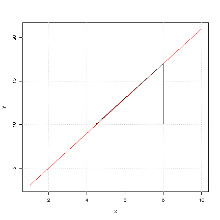

### Details

The slope of a straight line represents the change in the $y$ coordinate
corresponding to a unit change in the $x$ coordinate.

## Segment slopes

> Let's assume we have a more general function
> 
> $y = f(x)$.\
> To find the slope of a line segment, consider 2 $x$-coordinates, $x_0$
> and $x_1$, and look at the slope between $(x_0, f(x_0))$ and
> $(x_1, f(x_1))$.
> 
> 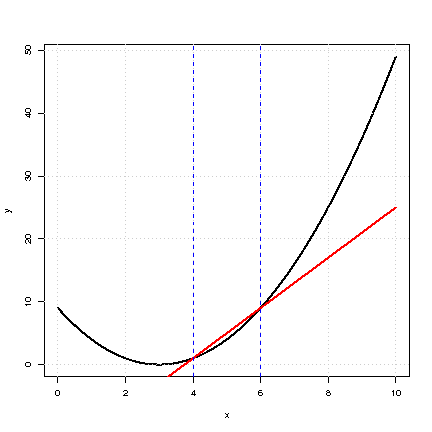

### Details

Consider two points, $(x_0,y_0)$ and $(x_1,y_1)$. The slope of the
straight line that goes through these points is


$$\frac {y_1 - y_0} {x_1 - x_0} .$$


Thus, the slope of a line segment passing throught the points
$(x_0,f(x_0))$ and $(x_1,f(x_1))$, for some function, $f$, is


$$\frac {f(x_1) - f(x_0)} {x_1 - x_0}$$


If we let $x_1 = x_0 + h$ then the slope of the segment is


$$\frac {f(x_0+h) - f(x_0)} {h} .$$


## The slope of $y=x^2$

> Consider the task of computing the slope of the function $y=x^2$ at a
> given point.
> 
> 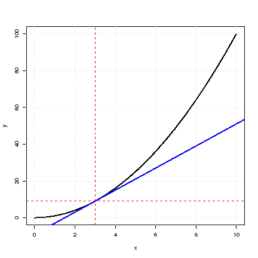

### Examples

Consider the function $y = f(x) = x^2$.\
In order to find the slope at a given point $(x_0 )$, we look at


$$y = \frac{f (x_0 +h) - f(x_0)} {h}$$


for small values of $h$.\
For this particular function, $f (x) = x^2$, and hence


$$f (x_0 +h) = (x_0 +h) ^2  = x^2 + 2hx_0 + h^2 .$$


The slope of a line segment is therefore given by


$$\frac{f (x_0 +h) - f(x_0)} {h}= \frac{2hx_0 + h^2} {h} = 2x_0 + h .$$


As we make $h$ steadily smaller, the segment slope, $2x_0 + h$, tends
towards $2x_0$. It follows that the slope, $y'$, of the curve *at a
general point* $x$ is given by $y' = 2x$.

## The tangent to a curve

> A **tangent** to a curve is a line that intersects the curve at exactly
> one point. The slope of a tangent for the function $y=f(x)$ at the point
> $(x_0,f(x_0))$ is 
> 
> $$\lim_{h\to0}\frac{f(x_0+h)-f(x_0)}{h}.$$
> 
> 
> 
> 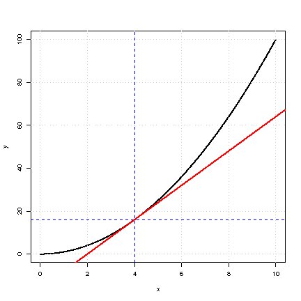

### Details

To find the slope of the tangent to a curve at a point, we look at the
slope of a line segment between the points $(x_0,f(x_0))$ and
$(x_0+h,f(x_0+h))$, which is 

$$\frac{f(x_0+h)-f(x_0)}{h}$$


and then we take $h$ to be closer and closer to $0$. Thus the slope is


$$\lim_{h\to0}\frac{f(x_0+h)-f(x_0)}{h}$$


when this limit exists.

### Examples

> **Example**:  
> 
> We wish to find tangent line for the function $f(x)=x^2$ at the point
> $(1,1)$. First we need to find the slope of this tangent, it is given as
> 
> 
> $$\lim_{h\to0}\frac{(1+h)^2-1^2}{h}=\lim_{h\to0}\frac{2h+h^2}{h}=\lim_{h\to0}(2+h)=2.$$
> 
> 
> 
> Then, since we know the tangent goes through the point $(1,1)$ the line
> is $y=2x-1$.

## The slope of a general curve

> 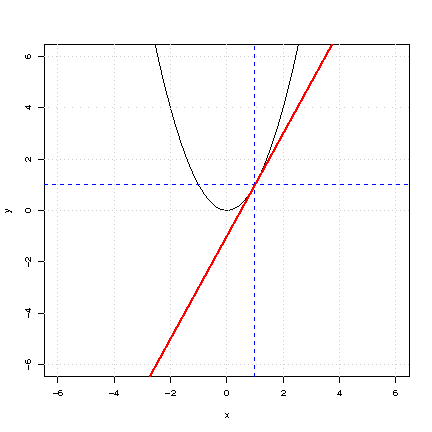

### Details

Imagine a nonlinear function whose graph is a curve described by the
equation,

$y = f(x)$.\
Here we want to find the slope of a line tangent to the curve at a
specific point $(x_0)$.

The slope of the line segment is given by the equation
$\frac{f (x_0 +h) - f(x_0)} {h}$.\
Reducing $h$ towards zero, gives the slope of this curve if it exists.

**Copyright** 2021, Gunnar Stefansson (editor) with contributions from
very many students

This work is licensed under the Creative Commons Attribution-ShareAlike
License. To view a copy of this license, visit
http://creativecommons.org/licenses/by-sa/1.0/ or send a letter to
Creative Commons, 559 Nathan Abbott Way, Stanford, California 94305,
USA.

# Derivatives

## The derivative as a limit

> The derivative of the function $f$ at the point $x$ is defined as
> 
> 
> $$\lim_{h \to 0} \frac{f(x+h) - f(x)}{h}$$
> 
> 
> 
> if this limit exists.

### Details

> **Definition**:  
> 
> The derivative of the function f at the point x is defined as
> 
> 
> $$\lim_{h \to 0} \frac{f(x+h) -f(x)}{h}$$
> 
> 
> 
> if this limit exists.

When we write $y = f(x)$, we commonly use the notation $\frac{dy}{dx}$
or $f'(x)$ for this limit.

## The derivative of $f(x)=a+bx$

> If $f(x) = a + bx$ then $f(x + h) = a+ b(x + h) = a + bx + bh$ and thus
> 
> 
> $$\lim_{h \to 0} \frac{f(x+h)-f(x)}{h} = \lim_{h \to 0} \frac{bh}{h}=b$$
> 
> 
> 
> 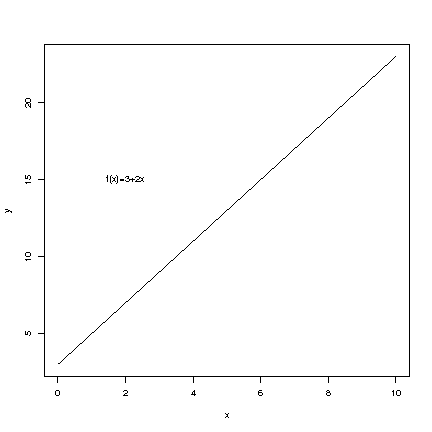

### Details

If $f(x) = a + bx$ then $f(x + h) = a+ b(x + h) = a + bx + bh$ and thus


$$\lim_{h \to 0} \frac{f(x+h)-f(x)}{h} = \lim_{h \to 0} \frac{bh}{h}=b.$$


Thus $f'(x)=b$.

## The derivative of $f(x)=x^n$

> If $f(x)=x^n$, then $f'(x)=nx^{n-1}$.

### Details

Let $f(x)=x^n$, where $n$ is a positive integer. To calculate $f'$ we
use the binomial theorem in the third step:


$$\begin{aligned}
\frac{f(x+h)-f(x)}{h}&=\frac{(x+h)^n-x^n}{h}\\
&=\frac{\sum_{q=0}^{n-1}\binom{n}{q}x^qh^{n-q}}{h}\\
&=\sum_{q=0}^{n-1}\binom{n}{q}x^qh^{n-q-1}\to\binom{n}{n-1}x^{n-1}=nx^{n-1}\end{aligned}$$


Thus, we obtain $f'(x)=nx^{n-1}$.

## The derivative of ln and exp

> If 
> 
> $$f(x)  = e^x$$
> 
>  then 
> 
> $$f'(x) = e^x$$
> 
> 
> 
> If 
> 
> $$g(x) = \ln(x)$$
> 
>  then 
> 
> $$g'(x) = \frac{1}{x}$$
> 
> 

### Details

The derivatives of the exponential function is the exponential function
itself i.e.\
if 

$$f(x)  = e^x$$

 then 

$$f'(x) = e^x$$


The derivatives of the natural logarithm, $\ln(x)$, is $\frac{1}{x}$,
i.e. if 

$$g(x) = \ln(x)$$

 then 

$$g'(x) = \frac{1}{x}$$


## The derivative of a sum and linear combination

> If $f$ and $g$ are functions then the derivative of $f+g$ is given by
> $f' + g'$.

### Details

Similarly, the derivative of a linear combination is the linear
combination of the derivatives.

If $f$ and $g$ are functions and $k(x)=af(x) + bg(x)$ then
$k'(x)=af'(x)+ bg'(x)$.

### Examples

> **Example**:  
> 
> If $f(x) = 2+3x$ and $g(x)+x^3$\
> then we know that\
> $f'(x)=3$, $g(x)=3x^2$ and if we write 
> 
> $$h(x)=f(x)+g(x)=2+3x+x^3$$
> 
>  then
> 
> 
> $$h'(x)=3+3x^2$$
> 
> 

## The derivative of a polynomial

> The derivative of a polynomial is the sum of the derivatives of the
> terms of the polynomial.

### Details

If

$p(x)=a_0+a_1x+...+a_n x^n$

then

$p'(x)=a_1+2a_2x+3a_3x^2+4a_4x^3+...+na_n x^{(n-1)}$

### Examples

> **Example**:  
> 
> If
> 
> $p(x)=2x^4+x^3$
> 
> then
> 
> $p'(x)=2\frac{dx^4}{dx}+\frac{dx^3}{dx}=2 \cdot 4x^3 +3x^2 = 8x^3 +3x^2$

## The derivative of a product

> If 
> 
> $$h(x)=f(x)\cdot g(x)$$
> 
>  then
> 
> 
> $$h'(x)=f'(x)\cdot g(x)+f(x)\cdot g'(x)$$
> 
> 

### Details

Consider two functions, $f$ and $g$ and their product, $h$:


$$h(x)=f(x)\cdot g(x).$$

 The derivative of the product is given by


$$h'(x)=f'(x)\cdot g(x)+f(x)\cdot g'(x).$$


### Examples

> **Example**:  
> 
> Suppose the function $f$ is given by 
> 
> $$f(x)=xe^x+x^2\ln x .$$
> 
>  Then the
> derivative can be computed step by step as 
> 
> $$\begin{aligned}
> f(x)&=&\frac{dx}{dx}e^x+x\frac{de^x}{dx}+\frac{dx^2}{dx}\ln x +x^2\frac{d \ln x}{dx}\\
>     &=&1\cdot e^x +     x \cdot e^x     + 2x \cdot \ln x     + x^2 \cdot \frac{1}{x}\\
>     &=&e^x \left ( 1+x \right ) + 2x \ln  x +x\end{aligned}$$
> 
> 

## Derivatives of composite functions

> If $f$ and $g$ are functions and $h=f  \circ g$ so that\
> $h(x) = f(g(x))$ then\
> $h'(x) = \frac{dh(x)}{dx} = f'(g(x)) g'(x)$

### Examples

> **Example**:  
> 
> For fixed $x$ consider:
> 
> 
> 
> $$\begin{aligned}
>     f(p) &=& \ln(p^{x} (1-p)^{n-x})\\
>          &=& \ln p^{x} + \ln(1-p)^{n-x}\\%ln of a product is the sum of ln
>          &=& x \ln p + (n-x) \ln (1-p)\\
>     \end{aligned}$$
> 
> 
> 
> 
> 
> $$\begin{aligned}
>   f'(p)&=& x \frac{1}{p} + \frac{n-x}{1-p}(-1)\\
>          &=& \frac{x}{p} - \frac{n-x}{1-p}\\
>     \end{aligned}$$
> 
> 

> **Example**:  
> 
> $f(b) = (y-bx)^2$ ($y,x$ fixed)
> 
> 
> $$\begin{aligned}
>     f'(b)&=& 2 (y-bx) (-x)\\
>          &=& -2x (y-bx)\\
>          &=&(-2xy) + (2x^2)b   
>     \end{aligned}$$
> 
> 

**Copyright** 2021, Gunnar Stefansson (editor) with contributions from
very many students

This work is licensed under the Creative Commons Attribution-ShareAlike
License. To view a copy of this license, visit
http://creativecommons.org/licenses/by-sa/1.0/ or send a letter to
Creative Commons, 559 Nathan Abbott Way, Stanford, California 94305,
USA.

# Applications of differentiation

## Tracking the sign of the derivative

> If $f$ is a function, then the sign of its derivative, $f'$, indicates
> whether $f$ is increasing ($f'>0$), decreasing ($f'<0$), or zero. $f'$
> can be zero at points where $f$ has a maximum, minimum, or a saddle
> point.

### Details

If $f$ is a function, then the sign of its derivative, $f'$, indicates
whether $f$ is increasing ($f'>0$), decreasing ($f'<0$), or zero. $f'$
can be zero at points where $f$ has a maximum, minimum, or a saddle
point.\
If $f'(x)>0$ for $x<x_0$, $f'(x_0)=0$ and $f'(x)<0$ for $x>x_0$ then $f$
has a maximum at $x_0$

If $f'(x)<0$ for $x<x_0$, $f'(x_0)=0$ and $f'(x)>0$ for $x>x_0$ then $f$
has a minimum at $x_0$

If $f'(x)>0$ for $x<x_0$, $f'(x_0)=0$ and $f'(x)>0$ for $x<x_0$ then $f$
has a saddle point at $x_0$

If $f'(x)<0$ for $x<x_0$, $f'(x_0)=0$ and $f'(x)<0$ for $x<x_0$ then $f$
has a saddle point at $x_0$

### Examples

> **Example**:  
> 
> If $f$ is a function such that its derivative is given by
> 
> 
> $$f'(x) = (x-1)(x-2)(x-3)(x-4),$$
> 
>  then applying the above criteria for
> maxima and minima, we see that $f$ has maxima at $1$ and $3$ and $f$ has
> minima at $2$ and $4$.

## Describing extrema using $f''$

> $x_0$ with $f'(x_0)=0$ corresponds to a maximum if $f''(x_0)<0$
> 
> $x_0$ with $f'(x_0)=0$ corresponds to a minimum if $f''(x_0)>0$

### Details

If $f'(x_0)=0$ corresponds to a maximum, then the derivative is
decreasing and the second derivative can not be positive, (i.e.
$f''(x_0)\leq 0$). In particular, if the second derivative is strictly
negative, ($f''(x_0) <0$), then we are assured that the point is indeed
a maximum, and not a saddle point.\
If $f'(x_0)=0$ corresponds to a minimum, then the derivative is
increasing and the second derivative can not be negative, (i.e.
$f''(x_0) \geq 0$).\
If the second derivative is zero, then the point may be a saddle point,
as happens with $f(x)=x^3$ at $x=0$.

## The likelihood function

> If $p$ is the probability mass function (p.m.f.): 
> 
> $$p(x) = P [X = x]$$
> 
> 
> 
> then the joint probability of obtaining a sequence of outcomes from
> independent sampling is
> 
> 
> 
> $$p(x_1) \cdot p(x_2) \cdot p(x_3) \ldots p(x_n)$$
> 
> 
> 
> Suppose each probability includes some parameter $\theta$, this is
> written,
> 
> 
> 
> $${p_{\theta}}(x_1),  \ldots {p_{\theta}}(x_n)$$
> 
> 
> 
> If the experiment gives $x_1, x_2 \ldots, x_n$ we can write the
> probability as a function of the parameters:
> 
> 
> 
> $$L_{\mathbf{x}}(\theta) = p_{\theta}(x_1),  \ldots p_{\theta}(x_n).$$
> 
> 
> 
> This is the *l*ikelihood function.

### Details

> **Definition**:  
> 
> Recall that the **probability mass function (p.m.f)** is a function
> giving the probability of outcomes of an experiment.

We typically denote the p.m.f. by $p$ so $p(x)$ gives the probability of
a given outcome, $x$, of an experiment. The p.m.f. commonly depends on
some parameter. We often write,


$$p(x) = P [X = x].$$


If we take a sample of independent measurements, from $p$, then the
joint probability of a given set of numbers is,


$$p(x_1) \cdot p(x_2) \cdot p(x_3) \ldots p(x_n)$$


Suppose each probability includes the same parameter $\theta$, then this
is typically written,


$${p_{\theta}}(x_1),  \ldots {p_{\theta}}(x_n)$$


Now consider the set of outcomes $x_1, x_2 \ldots, x_n$ from the
experiment. We can now take the probability of this outcome as a
function of the parameters.

> **Definition**:  
> 
> $L_{\mathbf{x}}(\theta) = p_{\theta}(x_1),  \ldots p_{\theta}(x_n)$
> 
> This is the **likelihood function** and we often seek to maximize it to
> estimate the unknown parameters.

### Examples

> **Example**:  
> 
> Suppose we toss a biased coin $n$ independent times and obtain x heads,
> we know the probability of obtaining x heads is,
> 
> 
> 
> $$\binom{n}{x}p^x (1-p)^{n-x}$$
> 
> 
> 
> The parameter of interest is $p$ and the likelihood function is,
> 
> 
> 
> $$L(p) = \binom{n}{x}p^x (1-p)^{n-x}$$
> 
> 
> 
> If $p$ is unknown we sometimes wish to maximize this function with
> respect to $p$ in order to estimate the *true* probability $p$.

## Plotting the likelihood

> missing slide -- want to give a numeric example and plot $L$

### Examples

missing example -- want to give a numeric example and plot $L$

## Maximum likelihood estimation

> If L is a likelihood function for a p.m.f. $p_{\theta}$, then the value
> $\hat{\theta}$ which gives the maximum of L:
> 
> 
> $$L (\hat{\theta}) = \max_\theta ({L}_\theta)$$
> 
>  is the maximum
> likelihood estimator (MLE) of $\theta$

### Details

> **Definition**:  
> 
> If L is a likelihood function for a p.m.f. $p_{\theta}$, then the value
> $\hat{\theta}$ which gives the maximum of L:
> 
> 
> $$L (\hat{\theta}) = \max_\theta ({L}_\theta)$$
> 
>  is the **maximum
> likelihood estimator** of $\theta$

### Examples

> **Example**:  
> 
> If $x$ is the number of heads from $n$ independent tosses of a coin, the
> likelihood function is:
> 
> 
> 
> $$L_x(p) = {n \choose x} p^x (1-p)^{n-x}$$
> 
> 
> 
> Maximizing this is equivalent to maximizing the logarithm of the
> likelihood, since logarithmic functions are increasing. The
> log-likelihood can be written as:
> 
> 
> 
> $$\ln (L(p))= \ln \binom{n}{x} + x \ln (p) + (n-x) \ln (1-p).$$
> 
> 
> 
> To find possible maxima , we need to differentiate this formula and set
> the derivative to zero
> 
> 
> 
> $$0 = \frac{dl (p)}{dp} = 0 + \frac{x}{p}+\frac{n-x}{1-p}(-1)$$
> 
> 
> 
> 
> 
> $$0 = p(1-p) \frac{(x)}{p} - p(1-p)  \frac{n-x}{1-p}$$
> 
> 
> 
> 
> 
> $$0 = (1-p)x  - p(n-x)$$
> 
> 
> 
> 
> 
> $$0 = x  - px -pn + px = x-pn$$
> 
> 
> 
> So,
> 
> 
> 
> $$0 =  x-pn$$
> 
> 
> 
> 
> 
> $$p = \frac{x}{n}$$
> 
> 
> 
> is the extreme and so we can write
> 
> 
> 
> $$\hat{p} = \frac{x}{n}$$
> 
> 
> 
> for the MLE

## Least squares estimation

> Least squares: Estimate the parameters $\theta$ by minimizing
> 
> 
> $$\sum_{i=1}^{n}{(y_i - g_i (\theta))^2}$$
> 
> 

### Details

Suppose we have a model linking data to parameters. In general we are
predicting $y_i$ as $g_i$ ($\theta$).

In this case it makes sense to estimate parameters $\theta$ by
minimizing 

$$\sum_{i=1}^{n}{(y_i - g_i (\theta))^2} .$$


### Examples

> **Example**:  
> 
> One may predict numbers, $x_i$, as a mean, $\mu$, plus error. Consider
> the simple model $x_i = \mu + \epsilon_i$, where $\mu$ is an unknown
> parameter (constant) and $\epsilon_i$ is the error in measurement when
> obtaining the $i$'th observations, $x_i$, $i=1,\ldots , n$.\
> A natural method to estimate the parameter is to minimize the squared
> deviations 
> 
> $$\min_{\mu} \sum_{i=1}^n \left (x - \mu \right )^2  .$$
> 
> 
> 
> It is not hard to see that the $\hat{\mu}$ that minimizes this is the
> mean: 
> 
> $$\hat{ \mu} = \bar{x} .$$
> 
> 

> **Example**:  
> 
> One also commonly predicts data $y_1 , \cdots ,y_n$ with values on a
> straight line, i.e. with $\alpha + \beta x_i$, where $x_1, \ldots , x_n$
> are fixed numbers.\
> This leads to the *r*egression problem of finding parameter values for
> $\hat{\alpha}$ and $\hat{\beta}$ which gives the best fitting straight
> line in relation to least squares:
> 
> 
> 
> $$\min_{\alpha,\beta} \sum \left ( y_i - ( \alpha + \beta x_i) \right ) ^2$$
> 
> 

> **Example**:  
> 
> As a general exercise in finding the extreme of a function, let's look
> at the function $f(\theta)=\sum_{i=1}^n(x_i\theta -3)^2$ where $x_i$ are
> some constants. We wish to find the $\theta$ that minimizes this sum. We
> simply differentiate $\theta$ to obtain
> $f'(\theta)=\sum_{i=1}^n2(x_i\theta -3)x_1=2\sum_{i=1}^n x^2_i\theta -2\sum_{i=1}^n3x_i$.
> Thus, 
> 
> $$\begin{aligned}
> f'(\theta)&=2\theta \sum_{i=1}^n x^2_i-2\sum_{i=1}^n3x_i=0\\
> &\Leftrightarrow \theta=\frac{\sum_{i=1}^n3x_i}{\sum_{i=1}^n x^2_i}.\end{aligned}$$
> 
> 

**Copyright** 2021, Gunnar Stefansson (editor) with contributions from
very many students

This work is licensed under the Creative Commons Attribution-ShareAlike
License. To view a copy of this license, visit
http://creativecommons.org/licenses/by-sa/1.0/ or send a letter to
Creative Commons, 559 Nathan Abbott Way, Stanford, California 94305,
USA.

# Integrals and probability density functions

## Area under a curve

> The area under a curve between x=a and x=b (for a positive function) is
> called the integral of the function.
> 
> 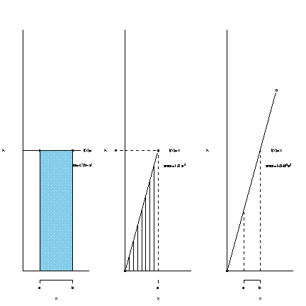
> 
> Figure: Example 1, 2 and 3

### Details

> **Definition**:  
> 
> The area under a curve between x=a and x=b (for a positive function) is
> called the **integral of the function** and is denoted:
> $\int_{a}^{b} f(x)dx$ when it exists.

## The antiderivative

> Given a function $f$, if there is another function $F$ such that $F'=f$,
> we say that $F$ is the *antiderivative* of $f$. For a function $f$ the
> antiderivative is denoted by $\int f dx$.
> 
> Note that if $F$ is one antiderivative of $f$ and $C$ is a constant,
> then $G=F+C$ is also an antiderivative. It is therefore customary to
> always include the constant, e.g. $\int x dx=\frac{1}{2}x^2+C$.

### Examples

> **Example**:  
> 
> The antiderivative of $x$ to a power raises the power.
> $\int x^n dx=\frac{1}{n+1}x^{n+1} +C$.

> **Example**:  
> 
> $\int e^x dx=e^x+C$.

> **Example**:  
> 
> $\int \frac{1}{x} dx=\ln(x)+C$.

> **Example**:  
> 
> $\int 2xe^{x^2} dx=e^{x^2}+C$.

## The fundamental theorem of calculus

> If $f$ is a continuous function, and $F'(x)=f(x)$ for $x\in[a,b]$, then
> $\int_a^b f(x)dx=F(b)-F(a)$

### Detail

It is not too hard to see that the area under the graph of a positive
function $f$ on the interval $[a,b]$ must be equal to the difference of
the values of its antiderivative at $a$ and $b$. This also holds for
functions which take on negative values and is formally stated below.

> **Definition**:  
> 
> **Fundamental theorem of calculus:** If $F$ is the antiderivative of the
> continuous function $f$, i.e. $F'=f$ for $x\in[a,b]$, then
> $\int_a^b f(x)dx=F(b)-F(a)$.
> 
> This difference is often written as $\int_a^b f dx$ or $[F(x)]_a ^b$.

### Examples

> **Example**:  
> 
> The area under the graph of $x^n$ between $0$ and $3$ is
> $\int_0^3 x^n dx = [\frac{1}{n+1}x^{n+1}]_0 ^3=\frac{1}{n+1}3^{n+1}-\frac{1}{n+1}0^{n+1}=\frac{3^{n+1}}{n+1}$

> **Example**:  
> 
> The area under the graph of $e^x$ between $3$ and $4$ is
> $\int_3^4 e^x dx =[e^x]_3 ^4= e^4-e^3$

> **Example**:  
> 
> The area under the graph of $\frac{1}{x}$ between $1$ and $a$ is
> $\int_1^a \frac{1}{x} dx =[\ln(x)]_1 ^a= \ln(a)-\ln(1)=\ln(a).$

## Density functions

> The probability density function (p.d.f.) and the cumulative
> distribution function (c.d.f.).
> 
> 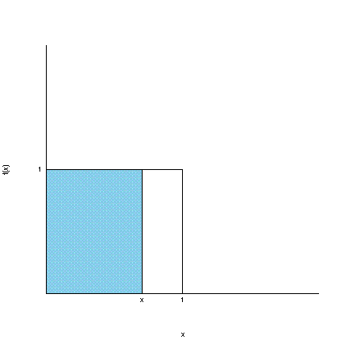

### Details

> **Definition**:  
> 
> If $X$ is a random variable such that
> 
> 
> $$P(a\leq X\leq b)=\int\limits^{b}_{a}f(x)dx,$$
> 
> 
> 
> \
> for some function $f$ which satisfies $f(x)\geq0$ for all $x$ and
> 
> 
> $$\int\limits^\infty_{-\infty} f(x)dx = 1$$
> 
> 
> 
> \
> then $f$ is said to be a **probability density function (p.d.f.)** for
> $X$.

> **Definition**:  
> 
> The function 
> 
> $$F(x)= \int\limits^{x}_{-\infty} f(t)dt$$
> 
> 
> 
> is the **cumulative distribution function (c.d.f.)**.

### Examples

> **Example**:  
> 
> Consider a random variable $X$ from the uniform distribution, denoted by
> $X\sim U(0,1)$. This distribution has density
> 
> 
> 
> $$f(x) = 
> \begin{cases}
>   1 &\text{if } 0 \leq x \leq 1\\
>   0 &\text{e.w.}
> \end{cases}.$$
> 
> 
> 
> The cumulative distribution function is given by
> 
> 
> 
> $$P[X\leq x] = \int\limits^{x}_{-\infty} f(t)dt = 
> \begin{cases}
>   0 & \text{if } x<0\\
>   x & \text{if } 0 \leq x \leq 1\\
>   1 & \text{else}
> \end{cases}.$$
> 
> 

> **Example**:  
> 
> Suppose $X \sim P(\lambda)$, where X may denote the number of events per
> unit time. The p.m.f. of X is described by
> $p(x)=P[X=x]=e^{-\lambda}\frac{\lambda^x}{x!}$ for $x=0,1,2,...$.
> Consider now the waiting time, T, between events, or simply until the
> first event. Consider the event $T>t$ for some number t\>0. If
> $X\sim p(\lambda)$ denotes the number of events per unit time, then let
> $X_t$ denote the number of events during the time period for 0 through
> t. Then it is natural to assume
> 
> $X_t \sim P(\lambda t)$ and it follows that $T>t$ if and only if $X_t=0$
> and we obtain $P[T>t]=P[X_t=0]=e^{-\lambda t}$. It follows that the
> c.d.f. of T is $F_T(t)=P[T\leq t]=1-P[T>t]=1-e^{-\lambda t}$ for $t>0$.\
> The p.d.f. of T is therefore
> $f_T(t)=F_T'(t)=\frac{d}{dt}F_T(t)=\frac{d}{dt}(1-e^{-\lambda t}=0-e^{- \lambda t}*(-\lambda)=\lambda e^{-\lambda t}$
> for $t \geq 0$ and $f_T(t)=0$ for $t=0$.\
> The resulting density
> 
> 
> 
> $$f(t) =
> \begin{cases}
>   \lambda e^{-\lambda t} & \text{for}& t \geq0\\
>   0 & \text{for} & t<0
> \end{cases}.$$
> 
> 
> 
> describes the exponential distribution.
> 
> This distribution has the expected value
> 
> 
> $$E[T]=\int\limits^{\infty}_{-\infty} tf(t)dt=\int\limits^{\infty}_{0} t \lambda e^{-\lambda t}dt.$$
> 
> 
> 
> **the stuff below is all messed up\...**
> 
> We set $u=\lambda t$ and $du=\lambda dt$ to obtain
> 
> 
> $$\int ue^{-u}du= \frac{1}{\lambda}\int\limits^{\infty}_{0} ue^{-u}du=\frac{1}{\lambda}=
> \int\limits^{\infty}_{0} 1 \cdot e^{-u}du$$
> 
> 
> 
> 
> 
> $$=\left [ -ue^{-u}\right ] _0^{\infty}$$
> 
> 
> 
> 
> 
> $$=\left[\frac{1}{\lambda}(-e^{-u})\right]_{0}^{\infty} -0=\frac{1}{\lambda} .$$
> 
> 

## Probabilities in R: The normal distribution

> R has functions to compute values of probability density functions
> (p.d.f.) and cumulative distribution functions (c.m.d.) for most common
> distributions.

### Details

The p.d.f. for the normal distribution is


$$p(t)=\frac{1}{\sqrt{2\pi}}e^{-\frac{t^2}{2}}$$


The c.d.f. for the normal distribution is


$$\Phi(x)=\int\limits_{-\infty}^x\frac{1}{\sqrt{2\pi}}e^{-\frac{t^2}{2}}dt$$


### Examples

> **Example**:  
> 
> dnorm() gives the value of the normal p.d.f.

> **Example**:  
> 
> pnorm() gives the value of the normal c.d.f.

## Some rules of integration

### Examples

> **Example**:  
> 
> Using integration by parts we obtain
> 
> 
> $$\int \ln(x)x dx= \frac{1}{2}x^2\ln(x)-\int \frac{1}{2}x^2\cdot \frac{1}{x} dx = \frac{1}{2}x^2\ln(x)-\int \frac{1}{2}x dx=\frac{1}{2}x^2\ln(x)-\frac{1}{4}x^2.$$
> 
> 

> **Example**:  
> 
> Consider $\int_1^2 2xe^{x^2} dx$. By setting $x=g(t)=\sqrt{t}$ we obtain
> 
> 
> $$\int_1^2 2xe^{x^2} dx = \int_1^4 2\sqrt{t}e^{t}\frac{1}{2\sqrt{t}}dt=\int_1^4 e^t dt=e^4-e.$$
> 
> 

### Handout

The two most common \"tricks\" applied in integration are a) integration
by parts and b) integration by substitution.\
a) **Integration by parts**


$$(fg)'=f'g+fg'$$

 by integrating both sides of the equation we obtain:


$$fg=\int f'g dx + \int fg' dx \Leftrightarrow \int fg' dx=fg-\int f'g dx$$


\
b) **Integration by substitution**\
Consider the definite integral $\int_a^b f(x) dx$ and let $g$ be a
one-to-one differential function for the interval $(c,d)$ to $(a,b)$.
Then 

$$\int_a^b f(x) dx=\int_c^d f(g(y))g'(y) dy$$


**Copyright** 2021, Gunnar Stefansson (editor) with contributions from
very many students

This work is licensed under the Creative Commons Attribution-ShareAlike
License. To view a copy of this license, visit
http://creativecommons.org/licenses/by-sa/1.0/ or send a letter to
Creative Commons, 559 Nathan Abbott Way, Stanford, California 94305,
USA.

# Principles of programming

## Modularity

> Modularity involves designing a system that is divided into a set of
> functional units (named modules) that can be composed into a larger
> application.\
> Any programming project should be split into logical module pieces of
> code which are combined into a complete program.

### Details

Typically input, initialization, analysis, and output commands are
grouped into separate parts.

### Examples

> **Example**:  
> 
> Input
> 
>     dat<-read.table("http://notendur.hi.is/~gunnar/kennsla/alsm/data/set115.dat", header=T)
>     cols<- c("le", "osl")
> 
> Analysis
> 
>     Mn<-mean(dat[, cols[1]])
> 
> Output
> 
>     print (Mn)

## Modularity and functions

> In many cases groups of commands can be collected together into a
> function.

### Details

Typically a project has several such functions.

### Examples

> **Example**:  
> 
> Suppose you want to plot the weight vs. length for several datasets in
> 
> 
> 
> $$\verb|http://hi.is/~gunnar/kennsla/alsm/data|$$
> 
> 
> 
> A function can then be set up with the file number as an argument:
> 
>      plotwtle<-function (fnum){
>      fname<-paste(
>      "http://hi.is/~gunnar/kennsla/alsm/data/set",fnum,".dat",sep="")
>       cat("The URL B", fname,"\n")
>       dat<-read.table(fname,header=T)
>       ttl<-paste("Data from file number", fnum)
>       plot(dat$le,dat$osl,main=ttl)
>       }
> 
> Now call this with
> 
>     plotwtle(105)

## Modularity and files

> It is advisable to split larger projects into several manageable files.

### Details

Once a project reaches more than five lines of code, it should be stored
in one or more separate files. In order to combine these files a single
"source" command file can be created.\
Typically function definitions are stored in separate files, so one may
have several separate files like:\
\"input.r\"\
\"function.r\"\
\"analysis.r\"\
\"output.r\"\
While developing the analysis, the data would only be read once with\
source("input.r")\
The goal of this practice is to end up with a set of files which are
completely self-contained, so one can start with an empty R session and
give only the commands like:\
source ("input.r")\
source ("functions.r")\
source ("analysis.r")\
Furthermore, this ensures repeatability.

### Examples

> **Example**:  
> 
> For a given project "input", "functions" "analysis" and "output" files
> can be created as below.
> 
> [input.r]{.underline}
> 
>     dat<-read.table("http://notendur.hi.is/~gunnar/kennsla/alsm/data/set115.dat", header=T)
> 
> [functions.r]{.underline}
> 
>     plotwtle<-function(fnum){
>      fname<-paste("http://notendur.hi.is/~gunnar/kennsla/alsm/data/set",fnum,".dat",sep="")
>       cat("The URL is",fname,"\n")
>       dat<-read.table(fname,header=T)
>       ttl<-paste("My data set was",fnum)
>       plot(dat$le,dat$osl,main=ttl,xlab="Length(cm)",ylab="Live weight (g)")
>     }
> 
> [output.r]{.underline}
> 
>     source("functions.r")
>     for(i in 101:150){
>       fnam<-paste("plot",i,".pdf",sep="")
>       pdf(fnam)
>       plotwtle(i)
>       dev.off()
>     }
> 
> These files can be executed with source commands as below:
> 
> > source ("input.r")
> > 
> > source ("functions.r")
> > 
> > source ("output.r")

## Structuring an R project

### Details

We already covered how to split code into different functions and
linking them together with the help of one executable file that is
\"sourcing\" the others. However, when you undertake a larger project,
there will be a lot of different data and files and it is very advisable
to have a consistent structure throughout the project.\
A common project layout is to allocate all project files into a folder,
something along the lines of:

    /project
        /data
        /src
        /doc
        /figs (or /out)

Such a structure is quite normal in programming languages such as C,
Matlab, and R.\
Purpose of the different folders:\
/data: Contains all important data to the project, which you will use.
This folder should be read-only! No function is allowed to write
anything into this folder.\
\
/src: (abbreviation for \"source(-code)\") Here you will store all the
functions that you programmed. You can decide to store the executable
function here as well or, alternatively, have that one in the root
project folder.\
\
/doc: Contains further documentation material about your project. This
could be, for example, readme files for other people who use your
functions, or the paper you wrote about the project, or the latex files
while you're writing.\
\
/figs or /out: Here your functions are allowed to write and can produce
the different results, like graphs, figures or anything else.\
Finally, a large programming project should at some stage be split into
packages and stored on dedicated servers such as github or CRAN.

### Examples

> **Example**:  
> 
> Consider first the issue of maintaining the code itself. It is common
> for R beginners to only work interactively within the command-line
> interface. However, it is essential that the code be kept in one or more
> files.\
> For large projects these will be several different files, each with its
> own purpose. To run a complete analysis one would typically set up one
> file to run all the tasks by reading in data through analyses to
> outputs.\
> For example, a file named \"run.r\" could contain the sequence of
> commands:
> 
> > source(\"setup.r\")
> > 
> > source(\"analysis.r\")
> > 
> > source(\"plot.r\")

## Loops, for

> If a piece of code is to be run repeatedly, the for-loop is normally
> used.

### Details

If a piece of code is to be run repeatedly, the for-loop is normally
used. The R code form is:

        for(index in sequence){
        commands
        }

### Examples

> **Example**:  
> 
> To add numbers we can use
> 
>     tot <- 100
>     for(i in 1:100){
>       tot <- tot + i
>     }
>     cat ("the sum is ", tot, "\n")

> **Example**:  
> 
> Define the plot function
> 
> 
>     plotwtle <- AS BEFORE
> 
> To plot several of these we can use a sequence:
> 
>     plotwtle(101)
>     plotwtle(102)
>     .
>     .
>     .
> 
> or a loop
> 
>     for (i in 101:150){
>       fname<- paste("plot", i, ".pdf", sep="")
>       pdf(fname)
>       plotwtle(i)
>       dev.off()
>     }

## The if and ifelse commands

> The \"if\" statement is used to conditionally execute statements.\
> The \"ifelse\" statement conditionally replaces elements of a structure.

### Examples

> **Example**:  
> 
> If we want to compute $x^x$ for $x$-values in the range 0 through 5, we
> can use
> 
>     xlist<-seq(0,5,0.01)
>     y<-NULL
>     for(x in xlist){
>       if(x==0){
>         y<-c(y,1)
>       }else{
>         y<-c(y,x**x)
>       }
>     }

> **Example**:  
> 
>     x<-seq(0,5,0.01)
>     y<-ifelse(x==0,1,x^x)

> **Example**:  
> 
>     dat<-read.table ("file")
>     dat<-ifelse (dat==0,0.01,dat)

> **Example**:  
> 
>     x<-ifelse (is.na(x),0,x)

## Indenting

> Code should be properly indented!\

### Details

fFunctions, for-loops, and if-statements should always be indented.

## Comments

> All code should contain informative comments. Comments are separated out
> from code using the pound symbol (#).

### Examples

> **Example**:  
> 
> ####################
> 
> ####SETUP DATA####
> 
> ####################
> 
> dat\<-read.table(filename)
> 
> x\<-log(dat\$le) #log-transformation of length
> 
> y\<-log(dat\$wt) #log-transformation of weight
> 
> ######################
> 
> ####THE ANALYSIS####
> 
> ######################

**Copyright** 2021, Gunnar Stefansson (editor) with contributions from
very many students

This work is licensed under the Creative Commons Attribution-ShareAlike
License. To view a copy of this license, visit
http://creativecommons.org/licenses/by-sa/1.0/ or send a letter to
Creative Commons, 559 Nathan Abbott Way, Stanford, California 94305,
USA.

# The Central Limit Theorem and related topics

## The Central Limit Theorem

> If measurements are obtained independently and come from a process with
> finite variance, then the distribution of their mean tends towards a
> Gaussian (normal) distribution as the sample size increases.
> 
> 
> 
> Figure: The standard normal density

### Details

> The **Central Limit Theorem** states that if $X_1, X_2, \ldots$ are
> independent and identically distributed random variables with mean $\mu$
> and (finite) variance $\sigma^2$, then the distribution of
> $\bar{X}_n:= \frac{X_1+\dots+X_n}{n}$ tends towards a normal
> distribution.

It follows that for a large enough sample size $n$, the distribution
random variable $\bar{X}_n$ can be approximated by $n(\mu,\sigma^2/n)$.

The standard normal distribution is given by the p.d.f.


$$\varphi(z) = \frac{1}{\sqrt{2\pi}} e^{\frac{-z^2}{2}}$$

 for
$z\in \mathbb{R}$.\
The standard normal distribution has an expected value of zero,


$$\mu = \int z\varphi (z)dz =0$$

 and a variance of


$$\sigma^2 = \int ({z-\mu})^2 \varphi(z)dz=1$$


If a random variable $Z$ has the standard normal (or Gaussian)
distribution, we write $Z\sim n(0,1)$.

If we define a new random variable, $Y$, by writing $Y=\sigma Z + \mu$,
then $Y$ has an expected value of $\mu$, a variance of $\sigma^2$ and a
density (p.d.f.) given by the formula:


$$f(y) = \frac{1}{\sqrt{2\pi}\sigma}   \ e^{\frac{-(y-\mu)^2}{2\sigma^2}}.$$


This is general normal (or Gaussian) density, with mean $\mu$ and
variance $\sigma^2$.

The Central Limit Theorem states that if you take the mean of several
independent random variables, the distribution of that mean will look
more and more like a Gaussian distribution (if the variance of the
original random variables is finite).

More precisely, the cumulative distribution function of


$$\frac{\bar{X}_n - \mu}{\sigma/\sqrt{n}}$$

 converges to $\Phi$, the
$n(0,1)$ cumulative distribution function.

### Examples

> **Example**:  
> 
> If we collect measurements on waiting times, these are typically assumed
> to come from an exponential distribution with density
> 
> 
> 
> $$f(t)=\lambda e^{-\lambda t},\textrm{ for } t>0$$
> 
> 
> 
> The Central Limit Theorem states that the mean of several such waiting
> times will tend to have a normal distribution.

> **Example**:  
> 
> We are often interested in computing
> 
> 
> $$w=\frac{\bar{x}-\mu_0}{\frac{s}{\sqrt{n}}}$$
> 
>  which comes from a
> t-distribution (see below), if the $x_i$ are independent outcomes from a
> normal distribution.
> 
> However, if $n$ is large and $\sigma^2$ is finite then $w$ values will
> look as though they came from a normal distribution. This is in part a
> consequence of the Central Limit Theorem, but also of the fact that $s$
> will become close to $\sigma$ as $n$ increases.

## Properties of the binomial and Poisson distributions

> The binomial distribution is really a sum of 0 and 1 values (counts of
> failures = 0 and successes =1). So, a simple, single binomial outcome
> will correspond to coming from a normal distribution if the count is
> large enough.

### Details

Consider the binomial probabilities:


$$p(x)=\binom{n}{x}p^x(1-p)^{n-x}$$


for $x=0,1,2,3, \cdots,n$ where $n$ is a non-negative integer. Suppose
$p$ is a small positive number, specifically consider a sequence of
decreasing $p$-values, specified with $p_n= \frac{\lambda}{n}$ and
consider the behavior of the probability as $n \rightarrow \infty$. We
obtain:


$$\begin{aligned}
\binom{n}{x}p_n^x(1-p_n)^{n-x}& = &\frac{n!}{x!(n-x!)} \left ( \frac{\lambda}{n} \right )^x \left ( 1-\frac{\lambda}{n} \right )^{n-x}\\
& = &\frac{n(n-1)(n-2)\cdots (n-x+1)}{x!} \frac{\frac{\lambda}{n}^x}{\left ( 1-\frac{\lambda}{n} \right ) ^x} \left ( 1-\frac{\lambda}{n} \right )^n\\
& = &\frac{n(n-1)(n-2)\cdots (n-x+1)}{x!n^x} \frac{\lambda^x}{\left ( 1-\frac{\lambda}{n} \right ) ^x} \left ( 1-\frac{\lambda}{n} \right )^n\end{aligned}$$


> **Note**:  
> 
> *Note 17*. Notice that $\frac{n(n-1)(n-2)\cdots (n-x+1)}{n^x}\to 1$ as
> $n\to\infty$. Also notice that $(1-\frac{\lambda}{n})^x\to 1$ as
> $n\to\infty$. Also
> 
> 
> 
> $$\lim_{n \to \infty} \bigg( 1-\frac{\lambda}{n} \bigg) = e^{- \lambda}$$
> 
> 
> 
> and it follows that
> 
> 
> 
> $$\lim_{n \to \infty} \binom{n}{x}p_n^x(1-p_n)^{n-x} = \frac{e^{- \lambda} \lambda^x}{x!}, x= 0,1,2, \cdots , n$$
> 
> 
> 
> and hence the binomial probabilities may be approximated with the
> corresponding Poisson.

### Examples

> **Example**:  
> 
> The mean of a binomial (n,p) variable is $\mu=n\cdot p$ and the variance
> is $\sigma^2=np(1-p)$.\
> The R command $dbinom(q,n,p)$ calculates the probability of $q$
> successes in $n$ trials assuming that the probability of a success is
> $p$ in each trial (binomial distribution), and the R command
> $pbinom(q,n,p)$ calculates the probability of obtaining $q$ or fewer
> successes in $n$ trials.
> 
> The normal approximation of this distribution can be calculated with
> $pnorm(q,mu,sigma)$ which becomes $pnorm(q,n*p,sqrt(n*p(1-p))$. Three
> numerical examples (note that pbinom and pnorm give similar values for
> large n):
> 
>     pbinom(3,10,0.2)
>     [1] 0.8791261
>     pnorm(3,10*0.2,sqrt(10*0.2*(1-0.2)))
>     [1] 0.7854023
> 
>     pbinom(3,20,0.2)
>     [1] 0.4114489
>     pnorm(3,20*0.2,sqrt(20*0.2*(1-0.2)))
>     [1] 0.2880751
> 
>     pbinom(30,200,0.2)
>     [1] 0.04302156
>     pnorm(30,200*0.2,sqrt(200*0.2*(1-0.2)))
>     [1] 0.03854994

> **Example**:  
> 
> We are often interested in computing $w=\frac{\bar{x}-\mu}{s/\sqrt{n}}$
> which has a t-distribution if the $x_i$ are independent outcomes from a
> normal distribution. If $n$ is large and $\sigma^2$ is finite, this will
> look as if it comes from a normal distribution.\
> The numerical examples below demonstrate how the t-distribution
> approaches the normal distribution.
> 
>     qnorm(0.7)
>     [1] 0.5244005 
>     #This is the value which gives the cumulative probability of p=0.7 for a n~(0,1)
>     qt(0.7,2)
>     [1] 0.6172134
>     #The value, which gives the cumulative probability of p=0.7 with n=2 for the t-distribution.
>     qt(0.7,5)
>     [1] 0.5594296
>     qt(0.7,10)
>     [1] 0.541528
>     qt(0.7,20)
>     [1] 0.5328628
> 
> 
>     qt(0.7,100)
>     [1] 0.5260763

## Monte Carlo simulation

> If we know an underlying process we can simulate data from the process
> and evaluate the distribution of any quantity based on such data.
> 
> 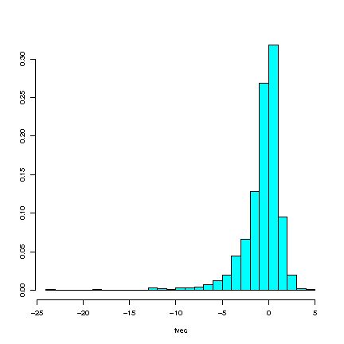
> 
> Figure: A simulated set of $t$-values based on data from an exponential
> distribution.

### Examples

> **Example**:  
> 
> Suppose our measurements come from an exponential distribution and we
> want to compute
> 
> 
> 
> $$t = \frac{\overline x - \mu}{s / \sqrt{n}}$$
> 
> 
> 
> but we want to know the distribution of those when $\mu$ is the true
> mean.\
> For instance, $n=5$ and $\mu = 1$, we can simulate (repeatedly)
> $x_1, \ldots , x_5$ and compute a t-value for each. The following R
> commands can be used for this:
> 
>     library(MASS)
>     n<-5          
>     mu<-1         
>     lambda<-1     
>     tvec<-NULL    
>     for(sim in 1:10000){ 
>        x<-rexp(n,lambda)  
>        xbar<-mean(x)      
>        s<-sd(x)           
>        t<-(xbar-mu)/(s/sqrt(n)) 
>        tvec<-c(tvec,t)          
>     }                       
> 
>     #then do...                
> 
>      truehist(tvec)     #truehist gives a better histogram 
>      sort(tvec)[9750]     
>      sort(tvec)[250]      

**Copyright** 2021, Gunnar Stefansson (editor) with contributions from
very many students

This work is licensed under the Creative Commons Attribution-ShareAlike
License. To view a copy of this license, visit
http://creativecommons.org/licenses/by-sa/1.0/ or send a letter to
Creative Commons, 559 Nathan Abbott Way, Stanford, California 94305,
USA.

# Miscellanea

## Simple probabilities in R

> R has functions to compute probabilities based on most common
> distributions.\
> \
> If $X$ is a random variable with a known distribution, then R can
> typically compute values of the cumulative distribution function or:
> 
> 
> $$F(x)=P[X \leq x]$$
> 
> 

### Examples

> **Example**:  
> 
> If $X \sim b(n,p)$ has binomial distribution, i.e.
> 
> 
> $$P(X = x) = {n \choose x}p^x(1-p)^{n-x},$$
> 
>  then cumulative
> probabilities can be computed with $pbinom$, e.g.
> 
>     pbinom(5,10,0.5) 
> 
> gives 
> 
> $$P[X \leq 5] = 0.623$$
> 
>  where 
> 
> $$X \sim b(n=10,p= \frac{1}{2}).$$
> 
> 
> 
> This can also be computed by hand. Here we have $n=10$, $p=1/2$ and the
> probability $P[X \leq 5]$ is obtained by adding up the individual
> probabilities, $P[X =0]+P[X =1]+P[X =2]+P[X =3]+P[X =4]+P[X =5]$
> 
> 
> 
> $$P[X \leq 5]  = \sum_{x=0}^5 {10\choose x} \frac{1}{2}^x\frac{1}{2}^{10-x}.$$
> 
> 
> This becomes
> 
> 
> $$P[X \leq 5]  = {10\choose 0} \frac{1}{2}^0\frac{1}{2}^{10-0} +{10\choose 1} \frac{1}{2}^1\frac{1}{2}^{10-1}+{10\choose 1} \frac{1}{2}^2\frac{1}{2}^{10-2}+{10\choose 3} \frac{1}{2}^3\frac{1}{2}^{10-3}+{10\choose 4} \frac{1}{2}^4\frac{1}{2}^{10-4}+{10\choose 5} \frac{1}{2}^5\frac{1}{2}^{10-5}$$
> 
> 
> or
> 
> 
> $$P[X \leq 5]  = {10\choose 0} \frac{1}{2}^{10} +{10\choose 1} \frac{1}{2}^{10}+{10\choose 1} \frac{1}{2}^{10}+{10\choose 3} \frac{1}{2}^{10}+{10\choose 4} \frac{1}{2}^{10}+{10\choose 5} \frac{1}{2}^{10}=\frac{1}{2}^{10}\left[1+10+45+...\right ].$$
> 
> 
> 
> Furthermore,
> 
>     pbinom(10,10,0.5)
>     [1] 1
> 
> and
> 
>     pbinom(0,10,0.5) 
>     [1] 0.0009765625
> 
> It is sometimes of interest to compute $P[X=x]$ in this case, and this
> is given by the $dbinom$ function, e.g.
> 
>     dbinom(1,10,0.5)
>     [1] 0.009765625
> 
> or $\frac{10}{1024}$

> **Example**:  
> 
> Suppose $X$ has a uniform distribution between $0$ and $1$, i.e.
> $X \sim U(0,1)$. Then the $punif$ function will return probabilities of
> the form 
> 
> $$P[X \leq x]= \int_{-\infty}^{x} f(t)dt= \int_{0}^{x} f(t)dt$$
> 
> 
> 
> where $f(t)=1$ if $0 \leq t \leq 1$ and $f(t)=0$. For example:
> 
>     punif(0.75)
>     [1]  0.75
> 
> To obtain $P[a \leq X \leq b],$ we use $punif$ twice, e.g.
> 
>     punif(0.75)-punif(0.25)
>     [1]  0.5

## Computing normal probabilities in R

> To compute probabilities $X\sim n(\mu,\sigma^2)$ is usually transformed,
> since we know that 
> 
> $$Z:=\frac{X-\mu}{\sigma} \sim(0,1)$$
> 
>  The
> probabilities can then be computed for either $X$ or $Z$ with the
> $pnorm$ function in R.

### Details

Suppose $X$ has a normal distribution with mean $\mu$ and variance


$$X\sim n(\mu,\sigma^2)$$

 then to compute probabilities, $X$ is usually
transformed, since we know that 

$$Z=\frac{X-\mu}{\sigma} \sim(0,1)$$

 and
the probabilities can be computed for either $X$ or $Z$ with the $pnorm$
function.

### Examples

> **Example**:  
> 
> If $Z \sim n(0,1)$ then we can e.g. obtain $P[Z\leq1.96]$ with
> 
>     pnorm(1.96)
>     [1] 0.9750021
> 
>     pnorm(0)
>     [1] 0.5
> 
>     pnorm(1.96)-pnorm(1.96)
>     [1] 0
> 
>     pnorm(1.96)-pnorm(-1.96)
>     [1] 0.9500042
> 
> The last one gives the area between -1.96 and 1.96.

> **Example**:  
> 
> If $X \sim n(42,3^2)$ then we can compute probabilites either by
> transforming 
> 
> $$\begin{aligned}
> P[X\leq x] &= P[\frac{X-\mu}{\sigma} \leq \frac{x-\mu}{\sigma}]\\
>            &= P[Z \leq \frac{x-\mu}{\sigma}]\end{aligned}$$
> 
>  and calling
> $pnorm$ with the computed value $z=\frac{x-\mu}{\sigma}$, or call
> $pnorm$ with $x$ and specify $\mu$ and $\sigma$.\
> \
> To compute $P[X\leq 48]$, either set $z=(48-42)/3=2$ and obtain
> 
>     pnorm(2)
>     [1] 0.9772499
> 
> or specify $\mu$ and $\sigma$
> 
>     pnorm(42,42,3)
>     [1] 0.5

## Introduction to hypothesis testing

### Details

If we have a random sample $x_1, \ldots , x_n$ from a normal
distribution, then we consider them to be outcomes of independent random
variables $X_1, \ldots , X_n$ where $X_i \sim n(\mu, \sigma^2)$.
Typically, $\mu$ and $\sigma^2$ are unknown but assume for now that
$\sigma^2$ is known.\
Consider the hypothesis:\
$H_0: \mu = \mu_0$ vs. $H_1: \mu > \mu_0$\
where $\mu_0$ is a specified number.\
Under the assumption of independence, the sample mean


$$\overline{x} = \frac{1}{n} \sum^n_{i=1}x_i$$


is also an observation from a normal distribution, with mean $\mu$ but a
smaller variance.Specifically, $\overline{x}$ is the outcome of


$$\overline{X} = \frac{1}{n} \sum^n_{i=1}X_i$$


and


$$X \sim n(\mu, \frac{ \sigma^2}{n})$$


so the standard deviation of X is $\frac{\sigma}{\sqrt{n}}$, so the
appropriate error measure for $\overline{x}$ is
$frac{\sigma}{\sqrt{n}}$, when $\sigma$ is unknown.\
If $H_0$ is true, then


$$z:= \frac{\overline{x}-\mu_0}{\sigma / \sqrt{n}}$$


is an observation from an $n \sim n (0,1)$ distribution, i.e. an outcome
of


$$Z= \frac{\overline{X}-\mu_0}{\sigma / \sqrt{n}}$$


where $Z \sim n(0,1)$ when $H_0$ is correct. It follows that e.g.
$P[\vert Z \vert > 1.96] = 0.05$ and if we observe
$\vert Z \vert > 1.96$ then we reject the null hypothesis.\
Note that the value z\* = 1.96 is a quantile of the normal distribution
and we can obtain other quantiles with the $pnorm$ function, e.g.
$pnorm(0.975)$ gives 1.96.

**Copyright** 2021, Gunnar Stefansson (editor) with contributions from
very many students

This work is licensed under the Creative Commons Attribution-ShareAlike
License. To view a copy of this license, visit
http://creativecommons.org/licenses/by-sa/1.0/ or send a letter to
Creative Commons, 559 Nathan Abbott Way, Stanford, California 94305,
USA.

# Multivariate probability distributions

## Joint probability distribution

> If
> 
> $X_1,\ldots, X_n$ are discrete random variables with
> 
> $P[X_1 = x_1, X_2 = x_2,\ldots, X_n = x_n] = p(x_1,\ldots, x_n)$, where
> $x_1, \ldots, x_n$ are numbers, then the function $p$ is the joint
> probability mass function (p.m.f.) for the random variables
> $X_1, \ldots, X_n$.\
> For continuous random variables $Y_1, \ldots, Y_n$, a function $f$ is
> called the joint probability density function if,
> 
> $P [Y\in {A}] = \int\int\ldots\int f(y_1,\ldots y_n)dy_1dy_2 \cdots dy_n$.

### Details

> **Definition**:  
> 
> If $X_1, \ldots, X_n$ are discrete random variables with
> $P[X_1 = x_1, X_2 = x_2,\ldots, X_n = x_n] = p(x_1,\ldots, x_n)$ where
> $x_1 \ldots x_n$ are numbers, then the function $p$ is the joint
> **probability mass function (p.m.f.)** for the random variables
> $X_1, \ldots, X_n$.

> **Definition**:  
> 
> For continuous random variables $Y_1, \ldots, Y_n$, a function $f$ is
> called the joint probability density function if,
> 
> $P [Y\in {A}] = \underbrace{\int\int\ldots\int}_{A} f(y_1,\ldots y_n)dy_1dy_2 \cdots dy_n$.

> **Note**:  
> 
> *Note 18*. Note that if $X_1, \ldots, X_n$ are independent and
> identically distributed, each with p.m.f. $p$, then
> $p(x_1, x_2, \ldots, x_n) = q(x_1)q(x_2)\ldots q(x_n)$, i.e,
> $P [X_1 = x_1,  X_2 = x_2,\ldots, X_n= x_n] = P [X_1 = x_1] P[X_2 = x_2]\ldots P[X_n= x_n]$.

> **Note**:  
> 
> *Note 19*. Note also that if $A$ is a set of possible outcomes
> $(A  \subseteq \mathbb{R}^n)$, then we have
> 
> 
> $$P[X \in {A}] = \sum_{(x_1,\ldots,x_n)\in A} p(x_1,\ldots, x_n).$$
> 
> 

### Examples

## The random sample

> A set of random variables $X_1, \ldots, X_n$ is a random sample if they
> are independent and identically distributed (i.i.d.).\
> A set of numbers $x_1, \ldots, x_n$ are called a random sample if they
> can be viewed as an outcome of such random variables.
> 
> 

### Details

Samples from populations can be obtained in a number of ways. However,
to draw valid conclusions about populations, the samples need to
obtained randomly.

> **Definition**:  
> 
> In **random sampling**, each item or element of the population has an
> equal and independent chance of being selected.

A set of random variables; $X_1 \ldots X_n$ is a random sample if they
are independent and identically distributed (i.i.d.).

> **Definition**:  
> 
> If a set of numbers $x_1 \ldots x_n$ can be viewed as an outcome of
> random variables, these are called a **random sample**.

### Examples

> **Example**:  
> 
> If $X_1, \ldots, X_n  \sim U(0,1)$, i.i.d., i.e. $X_1$ and $X_n$ are
> independent and each have a uniform distribution between 0 and 1. Then
> they have a joint density which is the product of the densities of $X_1$
> and $X_n$.\
> Given the data in the above figure and if $x_1 , x_2 \in \mathbb{R}$
> 
> 
> 
> $$f(x_1, x_2) = f_1(x_1) f_2(x_2) =
> \begin{cases}
>   1 & \text{if } 0 \leq x_1, x_2 \leq 1 \\
>   0 & \text{elsewhere}
> \end{cases}.$$
> 
> 

> **Example**:  
> 
> Toss two dice independently, and let $X_1, X_2$ denote the two (future)
> outcomes.\
> Then
> 
> 
> 
> $$P[X_1 = x_1, X_2 =  x_2]=
>  \begin{cases}
>   \frac{1}{36} & \text{if } 1 \leq x_1, x_2 \leq 6 \\
>   0 & \text{elsewhere}
> \end{cases}.$$
> 
> 
> 
> is the joint p.m.f.

## The sum of discrete random variables

### Details

Suppose $X$ and $Y$ are discrete random values with a probability mass
function $p$. Let $Z=X+Y$. Then


$$\begin{aligned}
P(Z=z) & = &\sum_{\{ (x,y): x+y=z\}} p(x,y)\end{aligned}$$


### Examples

> **Example**:  
> 
> $(X,Y) = \text{outcomes}$,
> 
>         [,1] [,2] [,3] [,4] [,5] [,6]
>     [1,]    2    3    4    5    6    7
>     [2,]    3    4    5    6    7    8
>     [3,]    4    5    6    7    8    9
>     [4,]    5    6    7    8    9   10
>     [5,]    6    7    8    9   10   11
>     [6,]    7    8    9   10   11   12
> 
> 
> 
> $$P[X+Y =7] =\frac{6}{36}=\frac{1}{6}$$
> 
> 
> 
> Because there are a total of 36 equally likely outcomes and 7 occurs six
> times this means that $P[X + Y = 7] =\frac{1}{6}$.
> 
> Also 
> 
> $$P[X+Y = 4] = \frac{3}{36} = \frac{1}{12}$$
> 
> 

## The sum of two continuous random variables

> If X and Y are continuous random variables with joint p.d.f. $f$ and
> $Z=X+Y$, then we can find the density of $Z$ by calculating the
> cumulative distribution function.
> 
> 

### Details

If X and Y are c.r.v. with joint p.d.f. $f$ and $Z=X+Y$, then we can
find the density of $Z$ by first finding the cumulative distribution
function


$$P[Z \leq z]=P[X+Y \leq z]=\int\int_{\{(x,y):x+y \leq z\}} f(x,y)dxdy.$$


### Examples

> **Example**:  
> 
> If X and Y $\sim$ U(0,1), independent and $Z=X+Y$ then
> 
> 
> 
> $$P[Z \leq z]= 
> \begin{cases}
>   0 & \text{for} & z \leq 0\\
>   \frac{z^2}{2} & \text{for} & 0<z<1\\
>   1 & \text{for}& z>2\\
>   1-\frac{(2-z)^2}{2} & \text{for} & 1<z<2
> \end{cases}$$
> 
> 
> 
> the density of $z$ becomes
> 
> 
> 
> $$g(z)= 
> \begin{cases}
>   z & \text{for} & 0 <z \leq 1\\
>   2-z & \text{for} & 1< z \leq 2\\
>   0 & \text{for} & \text{elsewhere}
> \end{cases}.$$
> 
> 

> **Example**:  
> 
> To approximate the distribution of $Z=X+Y$ where $X,Y \sim U(0,1)$
> i.i.d., we can use Monte Carlo simulation. So, generate 10.000 pairs,
> set them up in a matrix and compute the sum.

## Means and variances of linear combinations of independent random variables

> If $X$ and $Y$ are random variables and $a,b\in\mathbb{R}$, then
> 
> 
> 
> $$E[aX+bY] = aE[X]+bE[Y].$$
> 
> 

### Details

If $X$ and $Y$ are random variables, then


$$E[X+Y] = E[X]+E[Y]$$


i.e. the expected value of the sum is just the sum of the expected
values. The same applies to a finite sum, and more generally


$$E[\sum_{i=1}^{n} a_i X_i] = \sum_{i=1}^{n} a_i E[X_i]$$

 when
$X_i,...,X_n$ are random variables and $a_1,...,a_n$ are numbers (if the
expectations exist).

If the random variables are independent, then the variance also add


$$V[X+Y] = V[X] + V[Y]$$

 and


$$V[\sum_{i=1}^{n} a_i X_i] = \sum_{i=1}^{n} a_i^2 V[X_i]$$


### Examples

> **Example**:  
> 
> $X,Y \sim U(0,1)$, i.i.d. then
> 
> 
> 
> $$E[X+Y]=E[X] + E[Y] = \int_0^1 x\cdot 1dx+\int_0^1 x\cdot 1dx = [\frac{1}{2}x^2]_0^1+[\frac{1}{2}x^2]_0^1=1.$$
> 
> 

> **Example**:  
> 
> Let $X,Y\sim N(0,1)$. Then $E[X^2+Y^2] = 1+1=2$.

## Means and variances of linear combinations of measurements

> If $x_1,....,x_n$ and $y_1,....,y_n$ are numbers, and we set
> 
> 
> $$z_i=x_i + y_i$$
> 
> 
> 
> 
> 
> $$w_i=ax_i$$
> 
>  where a\>0, then
> 
> 
> $$\overline{z} = \frac{1}{n} \sum_{i=1}^{n} z_i= \overline{x} + \overline{y}$$
> 
> 
> 
> 
> 
> $$\overline{w}= a\overline{x}$$
> 
> 
> 
> 
> 
> $$s_w^2=\frac{1}{n-1}\sum_{i=1}^{n}(w_i-\overline{w})^2$$
> 
> 
> 
> 
> 
> $$= \frac{1}{n-1}\sum_{i=1}^{n}(ax_i-a\overline{x})^2$$
> 
> 
> 
> 
> 
> $$= a^2s_x^2$$
> 
> 
> 
> and 
> 
> $$s_w=as_x$$
> 
> 

### Examples

> **Example**:  
> 
> We set:
> 
>     a<-3
>     x<-c(1:5)
>     y<-c(6:10)
> 
> Then:
> 
>     z<-x+y
>     w<-a*x
>     n<-length(x)
> 
> Then $\overline{z}$ is:
> 
>     (sum(x)+sum(y))/n 
>     [1] 11
>     mean(z) 
>     [1] 11
> 
> and $\overline{w}$ becomes:
> 
>     a*mean(x)
>     [1] 9
>     mean(w)
>     [1] 9
> 
> and $s_w^2$ equals:
> 
>     sum((w-mean(w))^2))/(n-1)
>     [1] 22.5
>     sum((a*x - a*mean(x))^2)/(n-1)
>     [1] 22.5
>     a^2*var(x)
>     [1] 22.5
> 
> and $s_w$ equals:
> 
>     a*sd(x)
>     [1] 4.743416
>     sd(w)
>     [1] 4.743416

## The joint density of independent normal random variables

> If $Z_1, Z_2 \sim n(0,1)$ are independent then they each have density
> 
> 
> $$\phi(x)=\frac{1}{\sqrt{2\pi}}e^{-\frac{x^2}{2}},x\in\mathbb{R}$$
> 
>  and
> the joint density is the product $f(z_1,z_2)=\phi(z_1)\phi(z_2)$ or
> 
> 
> $$f(z_1,z_2)=\frac{1}{(\sqrt{2\pi})^2} e^{\frac{-z_1^2}{2}-\frac{z_2^2}{2}} .$$
> 
> 

### Details

If $X\sim n (\mu_1,\sigma_1^2)$ and $Y\sim n(\mu_2, \sigma_2^2)$ are
independent, then their densities are


$$f_X (x)= \frac{1}{\sqrt{2\pi}\sigma_1} \; e^\frac{-(x-\mu_1)^2}{2\sigma_1^2}$$


and


$$f_Y(y) = \frac{1}{\sqrt{2\pi}\sigma_2} \; e^\frac{-(y-\mu_2)^2}{2\sigma_2^2}$$


and the joint density becomes


$$\frac{1}{2\pi\sigma_1\sigma_2} \: e^{-\frac{(x-\mu_1)^2}{2\sigma_1^2}-\frac{(y-\mu_2)^2}{2\sigma_2^2}}$$


Now, suppose $X_1,\ldots,X_n\sim n(\mu,\sigma^2)$ are i.i.d., then


$$f(\underline{x})=\frac{1}{(2\pi)^\frac{n}{2}\sigma^n}\; e^{-\displaystyle\sum^{n}_{i=1} \frac{(x_i-\mu)^2}{a\sigma^2}}$$


\
is the multivariate normal density in the case of i.i.d. variables.

## More general multivariate probability density functions

### Examples

> **Example**:  
> 
> Suppose X and Y have the joint density
> 
> $f(x,y) =
> \begin{cases}
> 2 & \text{   } 0\leq y \leq x \leq 1\\
> 0 & \text{   otherwise}
> \end{cases}$
> 
> First notice that
> $\int_{\mathbb{R}}\int_{\mathbb{R}}f(x,y)dxdy=\int_{x=0}^1\int_{y=0}^x2dydx=\int_0^12xdx=1$,
> so $f$ is indeed a density function.
> 
> Now, to find the density of $X$ we first find the c.d.f. of $X$, first
> note that for $a<0$ we have $P[X\leq a]=0$ but if $a\geq 0$, we obtain
> 
> 
> $$F_X(a)=P[X\leq a]=\int_{x_0}^a\int_{y=0}^x2dydx=[x^2]_0^a=a^2.$$
> 
>  The
> density of $X$ is therefore
> 
> $f_X(x) = \frac{dF(x)}{dx}
> \begin{cases}
> 2x & \text{   } 0\leq x \leq 1\\
> 0 & \text{   otherwise}
> \end{cases}.$

### Handout

If

$f: \mathbb{R}^n\rightarrow\mathbb{R}$

is such that

$P[X \in A] = \int_A\ldots\int f(x_1,\ldots, x_n)dx_1\cdots dx_n$

and $f(x)\geq 0$ for all $\underline{x}\in \mathbb{R}^n$

then $f$ is the *joint density* of

$\mathbf{X}= \left( \begin{array}{ccc}
  X_1 \\ 
  \vdots \\
  X_n
  \end{array}\right).$

If we have the joint density of some multidimensional random variable
$X=(X_1,\ldots,X_n)$ given in this manner, then we can find the
individual density functions of the $X_i$'s by integrating the other
variables.

**Copyright** 2021, Gunnar Stefansson (editor) with contributions from
very many students

This work is licensed under the Creative Commons Attribution-ShareAlike
License. To view a copy of this license, visit
http://creativecommons.org/licenses/by-sa/1.0/ or send a letter to
Creative Commons, 559 Nathan Abbott Way, Stanford, California 94305,
USA.

# Some distributions related to the normal

## The normal and sums of normals

> The sum of independent normally distributed random variables is also
> normally distributed.

### Details

The sum of independent normally distributed random variables is also
normally distributed. More specifically, if
$X_1 \sim n(\mu_1, \sigma_{1}^2)$ and $X_2 \sim n(\mu_2, \sigma_{2}^2)$
are independent then $X_1 + X_2 \sim n(\mu, \sigma^2)$ since
$\mu = E \left[ X_1 + X_2 \right] = \mu_1 + \mu_2$ and\
$\sigma^2 = V \left[ X_1 + X_2 \right]$ with
$\sigma^2 = \sigma_{1}^2 + \sigma_{2}^2$\
if $X_1$ and $X_2$ are independent.\
Similarly 

$$\sum_{i=1}^{n} X_i$$


is normal if $X_1 , \ldots , X_n$ are normal and independent.

### Examples

> **Example**:  
> 
> Simulating and plotting a single normal distribution. $Y \sim n(0,1)$
> 
> 
>     library(MASS)           # for truehist
>     par(mfcol=c(2,2))       
>     y<-rnorm(1000)          # generating 1000 n(0,1)
>     mn<-mean(y)
>     vr<-var(y)
>     truehist(y,ymax=0.5)    # plot the histogram
>     xvec<-seq(-4,4,0.01)    # generate the x-axis
>     yvec<-dnorm(xvec)       # theoretical n(0,1) density
>     lines(xvec,yvec,lwd=2,col="red")
>     ttl<-paste("Simulation and theory n(0,1)\n",
>                "mean=",round(mn,2),
>                "and variance=",round(vr,2))
>     title(ttl)

> **Example**:  
> 
> Sum of two normal distributions.
> 
> 
> 
> $$Y_1 \sim n(2, 2^2)$$
> 
> 
> 
> and 
> 
> $$Y_2 \sim n(3, 3^2)$$
> 
> 
> 
>     y1<-rnorm(10000,2,2)    # n(2,2^2)
>     y2<-rnorm(10000,3,3)    # n(3, 3^2)
>     y<-y1+y2
>     truehist(y)
>     xvec<-seq(-10,20,0.01)
>     # check
>     mn<-mean(y)
>     vr<-var(y)
>     cat("The mean is",mn,"\n")
>     cat("The variance is ",vr,"\n")
>     cat("The standard deviation is",sd(y),"\n")
>     yvec<-dnorm(xvec,mean=5,sd=sqrt(13)) # n() density
>     lines(xvec,yvec,lwd=2,col="red")
>     ttl<-paste("The sum of n(2,2^2) and n(3,3^2)\n",
>                "mean=",round(mn,2),
>                "and variance=",round(vr,2))
>     title(ttl)

> **Example**:  
> 
> Sum of nine normal distributions, all with $\mu = 42$ and $\sigma^2=2^2$
> 
>     ymat<-matrix(rnorm(10000*9,42,2),ncol=9)
>     y<-apply(ymat,1,mean)
>     truehist(y)
>     # check
>     mn<-mean(y)
>     vr<-var(y)
>     cat("The mean is",mn,"\n")
>     cat("The variance is ",vr,"\n")
>     cat("The standard deviation is",sd(y),"\n")
>     # plot the theoretical curve
>     xvec<-seq(39,45,0.01)
>     yvec<-dnorm(xvec,mean=5,sd=sqrt(13)) # n() density
>     lines(xvec,yvec,lwd=2,col="red")
>     ttl<-paste("The sum of nine n(42^2) \n",
>                "mean=",round(mn,2),
>                "and variance=",round(vr,2))
>     title(ttl)

## The Chi-square distribution

> If $X \sim n$ (0,1),then $Y = X^2$ has a distribution which is called
> the Chi - square distribution ($\chi^2$) on one degree of freedom. This
> can be written as:
> 
> 
> 
> $$Y \sim \chi^2$$
> 
> 
> 
> 

### Details

> **Definition**:  
> 
> If $X_1, X_2, \ldots, X_n$ are i.i.d. $N(0,1)$ then the distribution of
> 
> $Y = X_1^2 + X_1^2 + \ldots + X_n^2$ has a **Chi square
> ($\chi^2$)distribution**.

## Sum of Chi square Distributions

> Let $Y_1$ and $Y_2$ be independent variables. If $Y_1 = \chi^2_{\nu_1}$
> and $Y_2 = \chi^2_{\nu_2}$,
> 
> then the sum of these two variables also follows a chi-squared
> ($\chi^2$)distribution
> 
> 
> 
> $$Y_1 + Y_2 = \chi^2_{\nu_1+ \nu_2}$$
> 
> 
> 
> 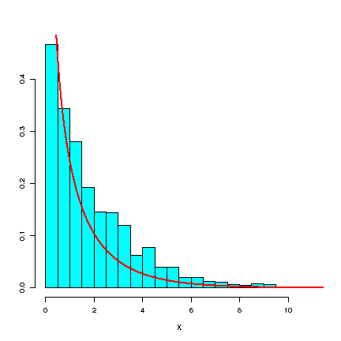

### Details

> **Note**:  
> 
> *Note 20*. Recall that if 
> 
> $$X_1, \ldots, X_n \sim n (\mu, \sigma^2)$$
> 
> 
> 
> are i.i.d., then
> 
> 
> 
> $$\sum_{i=1}^n \left ( \frac {\bar{X} - \mu} {\sigma}\right ) ^2= \sum_{i=1}^n \frac {\left ( \bar{X} - \mu\right ) ^2} {\sigma}\sim \chi^2$$
> 
> 

## Sum of squared deviation

> If $X_1,\cdots,X_n \sim n(\mu,\sigma^2)$ i.i.d, then
> 
> 
> 
> $$\sum_{i=1}^n \left ( \frac{X_i-\mu}{\sigma} \right )^2 \sim \chi_{n}^2,$$
> 
> 
> 
> but we are often interested in
> 
> 
> 
> $$\frac{1}{n-1}\sum_{i=1}^n (X_i-\bar{X})^2\sim \chi_{n-1}^2.$$
> 
> 

### Details

Consider a random sample of Gaussian random variables, i.e.
$X_1,\cdots,X_n \sim n(\mu,\sigma^2)$ i.i.d. Such a collection of random
variables have properties which can be used in a number of ways.


$$\sum_{i=1}^n \left ( \frac{X_i-\mu}{\sigma} \right )^2 \sim \chi_{n}^2,$$


but we are often interested in


$$\frac{1}{n-1}\sum_{i=1}^n (X_i-\bar{X})^2\sim \chi_{n-1}^2.$$


> **Note**:  
> 
> *Note 21*. A degree of freedom is lost because of subtracting the
> estimator of the mean as opposed to the true mean.

The correct notation is:

$\mu$ = population mean

$\bar{X}$ = sample mean (a random variable)

$\bar{x}$ = sample mean (a number)

## The t-distribution

> If $U\sim n(0,1)$ and $W\sim\chi^{2}_{\nu}$ are independent, then the
> random variable 
> 
> $$T=\frac{U}{\sqrt{\frac{w}{\nu}}}$$
> 
> 
> 
> has a distribution which we call the t-distribution on $\nu$ degrees of
> freedom denoted $T \sim t_{\nu}$.

### Details

> **Definition**:  
> 
> If $U\sim n(0,1)$ and $W\sim\chi^{2}_{\nu}$ are independent, then the
> random variable 
> 
> $$T:=\frac{U}{\sqrt{\frac{w}{\nu}}}$$
> 
>  has a distribution
> which we call the **$t$-distribution** on $\nu$ degrees of freedom,
> denoted $T \sim t_\nu$.

It turns out that if $X_1, \ldots ,X_n \sim n(\mu,\sigma ^2)$ and we set


$$\bar{X}=\frac{1}{n}\sum_{i=1}^n X_i$$

 and 

$$S=
\sqrt{\frac{1}{1-n}\sum_{i=1}^n (X_i-X)^2}$$

 then


$$\frac{\bar{X}-\mu}{S/\sqrt{n}} \sim t_{n-1}.$$


This follows from $\bar{X}$ and $\sum_{i=1}^n(X_i-\bar{X})^2$ being
independent and $\frac{\bar{X}-\mu}{\sigma/\sqrt{n}}\sim n(0,1)$, $\sum
\frac{(X_i-\bar{X})^2}{\sigma^2}\sim \chi_{n-1}^2$.

**Copyright** 2021, Gunnar Stefansson (editor) with contributions from
very many students

This work is licensed under the Creative Commons Attribution-ShareAlike
License. To view a copy of this license, visit
http://creativecommons.org/licenses/by-sa/1.0/ or send a letter to
Creative Commons, 559 Nathan Abbott Way, Stanford, California 94305,
USA.

# Estimation, estimates and estimators

## Ordinary least squares for a single mean

> If $\mu$ is unknown and $x_i,\ldots,x_n$ are data, we can estimate $\mu$
> by finding 
> 
> $$\min_{\mu} \sum_{i=1}^{n}(x_i-\mu)^2$$
> 
> 
> 
> In this case the resulting estimate is simply
> 
> 
> 
> $$\mu = \overline{x}$$
> 
>  and can easily be derived by setting the
> derivative to zero.

### Examples

> **Example**:  
> 
> Consider the numbers $x_1, \ldots, x_5$ to be
> 
> 
> $$13,7,4,16 \textrm{ and } 9$$
> 
> 
> 
> We can plot $\sum(x_i-\mu)^2$ vs. $\mu$ and find the minimum.

## Maximum likelihood estimation

> If $\left (Y_1, \ldots , Y_n\right )'$ is a random vector from a density
> $f_{\theta}$ where $\theta$ is an unknown parameter, and $\mathbf{y}$ is
> a vector of observations then we define the **likelihood function** to
> be 
> 
> $$L_{\mathbf{y}}(\theta)=f_{\theta}(y).$$
> 
> 

### Examples

> **Example**:  
> 
> If, $x_1,\ldots,x_n$ are assumed to be observations of independent
> random variables with a normal distributions and mean of $\mu$ and
> variance of $\sigma^2$, then the joint density is
> 
> 
> $$f(x_1)\cdot f(x_2)\cdot\ldots\cdot f(x_n)$$
> 
> 
> 
> 
> 
> $$= \frac{1}{\sqrt{2\pi}\sigma}e^{-\frac{(x_1-\mu)^2}{2\sigma^2}} \cdot \ldots\cdot \frac{1}{\sqrt{2\pi}\sigma}e^{-\frac{(x_n-\mu)^2}{2\sigma^2}}$$
> 
> 
> 
> 
> 
> $$=\Pi_{i=1}^n \frac{1}{\sqrt{2\pi}\sigma}e^{-\frac{(x_i-\mu)^2}{2\sigma^2}}$$
> 
> 
> 
> 
> 
> $$=\frac{1}{(2\pi)^{n/2}\sigma^n}e^{-\frac{1}{2\sigma^2}\sum_{i=1}^n(x_i-\mu)^2}$$
> 
> 
> 
> and if we assume $\sigma^2$ is known then the likelihood function is
> 
> 
> $$L(\mu)=\frac{1}{(2\pi)^{n/2}\sigma^n}e^{-\frac{1}{2\sigma^2}\sum_{i=1}^n(x_i-\mu)^2}$$
> 
> 
> 
> Maximizing this is done by maximizing the log, i.e. finding the $\mu$
> for which: 
> 
> $$\frac{d}{d\mu}\ln L(\mu)=0,$$
> 
>  which again results in the
> estimate 
> 
> $$\hat{\mu}=\overline{x}$$
> 
> 

### Detail

> **Definition**:  
> 
> If $\left (Y_1, \ldots , Y_n\right )'$ is a random vector from a density
> $f_{\theta}$ where $\theta$ is an unknown parameter, and $\mathbf{y}$ is
> a vector of observations then we define the **likelihood function** to
> be 
> 
> $$L_{\mathbf{y}}(\theta)=f_{\theta}(y).$$
> 
> 

## Ordinary least squares

> Consider the regression problem where we fit a line through $(x_i,y_i)$
> pairs with $x_1, \ldots, x_n$ fixed numbers but where $y_i$ is measured
> with error.
> 
> 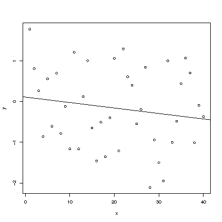
> 
> Figure: Regression line through data pairs.

### Details

The ordinary least squares (OLS) estimates of the parameters $\alpha$
and $\beta$ in the model $y_i=\alpha + \beta x_i + \epsilon_i$ are
obtained by minimizing the sum of squares


$$\sum_i \left ( y_i -(\alpha +\beta x_i)  \right )^2$$


$$\begin{aligned}
a&=\overline{y} - b\overline{x} \\
\\
b&= \frac{\displaystyle\sum^n_{i=1} (x_i-\overline{x})(y_i-\overline{y})}{\displaystyle\sum^n_{i=1} (x_i-\overline{x})^2}\end{aligned}$$


## Random variables and outcomes

### Details

Recall that $X_1, \ldots, X_n$ are random varibles (reflecting the
population distribution) and $x_1, \ldots, x_n$ are numerical outcomes
of these distributions. We use upper case letters to denote random
variables and lower case letters to denote outcome or data.

### Examples

> **Example**:  
> 
> Let the mean of a population be zero and the $\sigma=4$. Then draw three
> samples from this population with size, n, either 4, 16 or 64. The
> sample mean $\bar{X}$ will have a distribution with mean zero and
> standard deviation of $\frac{\sigma}{\sqrt{n}}$ where n= 4, 16 or 64.

## Estimators and estimates

> In OLS regression, note that the values of $a$ and $b$
> 
> 
> 
> $$a = \overline{y} - b \overline{x}$$
> 
> 
> 
> 
> 
> $$b = \frac{\sum_{i=1}^{n} (x_i - \overline{x}) (y_i - \overline{y})}{\sum_{i=1}^{n} (x_i - \overline{x})^2}$$
> 
> 
> 
> are outcomes of random variables e.g. $b$ is the outcome of
> 
> 
> 
> $$\hat{\beta} = \frac{\sum_{i=1}^{n} (x_i - \overline{x}) (Y_i - \overline{Y})}{\sum_{i=1}^{n} (x_i - \overline{x})^2}$$
> 
> 
> 
> the estimator which has some distribution.
> 
> 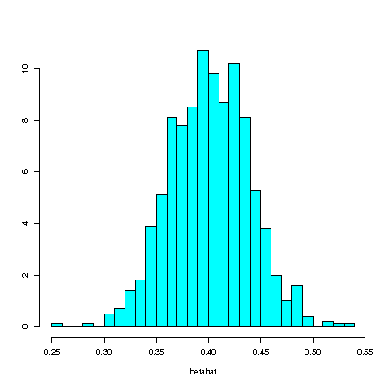
> 
> Figure: Shows an example of the distribution of the estimator
> $\hat{\beta}$

### Details

The following R commands can be used to generate a distribution for the
estimator $\hat{\beta}$

    library(MASS)
    nsim <- 1000 #  replicates
    betahat <- NULL
    for (i in 1:nsim){
      n <- 20
      x <- seq(1:n)  # Fixed x vector
      y <- 2 + 0.4*x + rnorm(n, 0, 1)
      xbar <- mean(x)
      ybar <- mean(y)
      b <- sum((x-xbar)*(y-ybar))/sum((x-xbar)^2)
      a <- ybar - b* xbar
     betahat <- c(betahat, b)
    }
    truehist(betahat)

**Copyright** 2021, Gunnar Stefansson (editor) with contributions from
very many students

This work is licensed under the Creative Commons Attribution-ShareAlike
License. To view a copy of this license, visit
http://creativecommons.org/licenses/by-sa/1.0/ or send a letter to
Creative Commons, 559 Nathan Abbott Way, Stanford, California 94305,
USA.

# Test of hypothesis, P values and related concepts

## The principle of the hypothesis test

> The principle is to formulate a hypothesis and an alternative
> hypothesis, $H_0$ and $H_a$ respectively, and then select a statistic
> with a given distribution when $H_0$ is true and select a rejection
> region which has a specified probability $(\alpha)$ when $H_0$ is true.
> 
> The rejection region is chosen to reflect $H_a$, i.e to ensure a high
> probability of rejection when $H_a$ is true.

### Examples

> **Example**:  
> 
> Suppose we want to evaluate whether a coin is biased. We can plan an
> experiment for this. Suppose we toss the coin 5 times and count the
> number of heads. We can test the following hypothesis simply.\
> $H_0: p = \frac {1} {2}$ where $H_0$ is the null hypothesis
> 
> $H_a ; p > \frac {1} {2}$ where $H_a$ is an alternative hypothesis
> 
> and $p$ is probability of having a head.\
> We reject $H_0$ if we get all heads. (Assuming the only interest is in a
> tendency towards larger probabilities). So the probability of rejecting
> the null hypothesis $H_0$ is:
> 
> P\[reject $H_0$\]= P \[ all heads in 5 trials\] $\equiv p^5$
> 
> If $H_0$ is true, then P \[reject $H_0$\] = $\frac {1} {2}$\
> Need to choose 5 trials to ensure
> $\frac {1} {2^5} = \frac {1} {32} < \frac {1} {32} < 0.05$\
> i.e. The probability of incorrectly rejecting $H_0$ is less than
> $\alpha = 0.05$

> **Example**:  
> 
> Flip a coin to test
> 
> $H_0: P = \frac {1} {2}$ vs $H_a: P \neq \frac {1} {2}$\
> Reject, if no heads or all heads are obtained in 6 trials, where the
> error rate is
> 
> P \[reject $H_0$ when true\] = P \[all heads or all tails\]
> 
> = P\[all heads\] + P \[all tails\]
> 
> =
> $\frac {1} {2^6} + \frac {1} {2^6} = 2 \frac {1} {64} = \frac {1} {32} < 0.05$\
> \
> A variation of this test is called the sign test, which is used to test
> hypothesis of the form,
> 
> $H_0$: true median = 0 using a count of the number of positive values.

## The one sided z test for normal mean

> Consider testing
> 
> 
> 
> $$H_0: \mu = \mu_0$$
> 
> 
> 
> vs
> 
> 
> 
> $$H_a: \mu > \mu_0$$
> 
> 
> 
> Where data $x_1 \ldots x_n$ are collected as independent observations of
> $X_1 \ldots X_n \sim n(\mu, \sigma^2)$ and $\sigma^2$ is known. If $H_0$
> is true, then
> 
> 
> 
> $$\bar {x} \sim n (\mu_0, \frac{\sigma^2}{n})$$
> 
>  So,
> 
> 
> 
> $$Z = \frac{\bar {x} - \mu_0}{\frac{\sigma} {\sqrt{n}}} \sim n (0,1)$$
> 
> 
> 
> It follows that,
> 
> 
> 
> $$P[Z>z*] = \alpha$$
> 
> 
> 
> Where
> 
> 
> 
> $$z* = z_{1-\alpha}$$
> 
> 
> 
> So if the data $x_1 \ldots x_n$ are such that,
> 
> 
> 
> $$z = \frac{\bar {x} - \mu_0}{\frac{\sigma} {\sqrt{n}}}  > z*$$
> 
> 
> 
> Then $H_0$ is rejected.

### Examples

> **Example**:  
> 
> Consider the following data set:47, 42, 41, 45, 46.
> 
> Suppose we want to test the following hypothesis
> 
> 
> 
> $$H_0 : \mu = 42$$
> 
> 
> 
> vs
> 
> 
> 
> $$H_a : \mu > 42$$
> 
> 
> 
> $\sigma = 2$ is given
> 
> The mean of the given data set can be calculated as
> 
> 
> 
> $$\bar {x} = 44.2$$
> 
> 
> 
> we can calculate $z$ by using following equation
> 
> 
> 
> $$z = \frac{\bar {x} - \mu}{\frac{\sigma} {\sqrt{n}}} = \frac{44.2 - 42}{\frac{2} {\sqrt{5}}}$$
> 
> 
> 
> 
> 
> $$z = \frac{2.2}{0.8944} = 2.459$$
> 
> 
> 
> 
> 
> $$z* = 1.645$$
> 
> 
> 
> Here
> 
> $z> z*$
> 
> So $H_0$ is rejected with $\alpha = 0.05$

## The two-sided z test for a normal mean

> 
> 
> $$z: =\frac{\overline{x}-\mu_0}{s\sqrt{n}} \sim n(0,1)$$
> 
> 

### Details

Consider testing $H_0: \mu=\mu_0$ versus $H_a: \mu \ne \mu_0$ based on
observation from
$\overline{X_1},..., \overline{X} \sim n(\mu, \sigma^2)$ i.i.d. where
$\sigma^2$ is known. If $H_0$ is true, then


$$Z: = \frac{\overline{x}-\mu_0}{\sigma \sqrt{n}} \sim n(0,1)$$


and 

$$P[|z| > z^\star] = \alpha$$


with 

$$z^\star = z_{1}$$


We reject $H_0$ if $|z| > z^\star$. If $|z| > z^\star$ is not true, then
we \"Cannot reject the $H_0$\".

### Examples

> **Example**:  
> 
> In R, you may generate values to calculate the $z$ value. The command
> that is generally used is: `quantile`
> 
> To illustrate:
> 
>     z<-rnorm(1000,0,1)
>     quantile(z,c(0.025,0.975))
>          2.5%     97.5% 
>     -1.995806  2.009849 
> 
> So, the $z$ value for a two-sided normal mean is
> $\left |-1.99 \right |$.

## The one-sided t-test for a single normal mean

> Recall that if $X_1,...,X_n \sim N(\mu,\sigma^2)$ i.i.d. then
> 
> 
> $$\frac{\overline{X}-\mu}{S/\sqrt{n}}\sim t_{n-1}$$
> 
> 

### Details

Recall that if $X_1,\ldots,X_n \sim N(\mu,\sigma^2)$ i.i.d. then


$$\frac{\overline{X}-\mu}{S/\sqrt{n}}\sim t_{n-1}$$


To test the hypothesis $H_0:\mu=\mu_{0}$ vs $H_1:\mu > \mu_{0}$ first
note that if $H_0$ is true, then


$$T= \frac{\overline{X}-\mu_{0}}{S/\sqrt{n}} \sim t_{n-1}$$


so 

$$P[T>t*]=\alpha$$


if 

$$t*=t_{n-1,1-\alpha}$$


Hence, we reject $H_0$ if the data $x_1,...,x_n$ results in a a value of
$t:=\frac{\overline{x}-\mu_0}{S/\sqrt{n}}$ such that t\>t\*, otherwise
$H_0$ can not be rejected.

### Examples

> **Example**:  
> 
> Suppose the following data set (12,19,17,23,15,27) comes independently
> from a normal distribution and we need to test $H_0:\mu=\mu_0$ vs
> $H_a:\mu>\mu_0$. Here we have $n=6,\overline{x}=18.83, s=5.46, \mu_0=18$
> so we obtain 
> 
> $$t=\frac{\overline{x}-\mu_0}{s/\sqrt{n}}= 0.37$$
> 
> 
> 
> so $H_0$ cannot be rejected.\
> In R, t\* is found using qt(n-1,0.95) but the entire hypothesis can be
> tested using
> 
>     t.test(x,alternative="greater",mu=<$\mu_0$>)

## Comparing means from normal populations

> Suppose data are gathered independently from two normal populations
> resulting in\
> $x_1,....,x_n$ and $y_1,...y_m$

### Details

We know that if


$$X_1, ...., X_n \sim n(\mu_1,\sigma)$$


$$Y_1, ...., Y_m \sim n(\mu_2,\sigma)$$


are all independent then


$$\bar{X}-\bar{Y} \sim n(\mu_1-\mu_2,\frac{\sigma^2}{n}+\frac{\sigma^2}{m})$$


Further,


$$\sum_{i=1}^{n} \frac{(X_i-\bar{X})^2}{\sigma^2} \sim X_{n-1}^{2}$$

 and


$$\sum_{j=1}^{m} \frac{(Y_j-\bar{Y})^2}{\sigma^2} \sim X_{m-1}^{2}$$

 so


$$\frac {\sum_{i=1}^{n}(X_i-\bar{X})^2 + \sum_{j=1}^{m}(Y_j-\bar{Y})^2}{\sigma^2} \sim X_{n+m-2}^2$$


and it follows that


$$\frac {\bar{X}-\bar{Y}-(\mu_1-\mu_2)}{S\sqrt{(\frac{1}{n}+\frac{1}{m})}} \sim t_{n+m-2}$$


where


$$S=\sqrt{\frac{\sum_{i=1}^{n}(X_1-\bar{X})^2+\sum_{j=1}^{m}(Y_j-\bar{Y})^2}{n+m-2}}$$


consider testing $H_0:\mu_1=\mu_2$ vs $H_1=mu_1>\mu_2$. Hence, if $H_0$
is true then the observed value


$$t=\frac{\bar{x}-\bar{y}}{S\sqrt{\frac{1}{n}+\frac{1}{m}}}$$

 comes from
a t-test with $n+m-2$ df and we reject $H_0$ if $\left|t\right|>t^*$.
Here,


$$S=\sqrt{\frac{\sum_{i}(x_i-\bar{x})^2+\sum_{j}(y_j-\bar{y})^2}{n+m-2}}$$


and $t^*=t_{n+m-2,1-\alpha}$

## Comparing means from large samples \<Ól.B.M.\>

> If $X_1,....X_n$ and $Y_1,.....Y_m$, are all independent (with finite
> variance) with expected values of $\mu_1$ and $\mu_2$ respectively, and
> variances of $\sigma_1^2$,and $\sigma_2^2$ respectively, then
> 
> 
> $$\frac{\overline{X}-\overline{Y}-(\mu_1-\mu_2)}{\sqrt{\frac{\sigma_1^2}{n}+\frac{\sigma_2^2}{m}}} \dot{\sim}n(0,1)$$
> 
> 
> if the sample sizes are large enough.\
> This is the central limit theorem.

### Details

Another theorem (Slutzky) stakes that replacing $\sigma_1^2$ and
$\sigma_2^2$ with $S_1^2$ and $S_2^2$ will result in the same (limiting)
distribution.\
It follows that for large samples we can test


$$H_0: \mu_1=\mu_2 \qquad vs. \qquad H_a:\mu_1 > \mu_2$$

 by computing


$$z=\frac{\overline{x}-\overline{y}}{\sqrt{\frac{s_1^2}{n}+\frac{s_2^2}{m}}}$$


and reject $H_0$ if $z>z_{1-\alpha}$.

## The P-value

> The p-value of a test is an evaluation of the probability of obtaining
> results which are as extreme as those observed in the context of the
> hypothesis.

### Examples

> **Example**:  
> 
> Consider a dataset and the following hypotheses
> 
> 
> $$H_0:\mu=42$$
> 
> 
> 
> vs. 
> 
> $$H_a:\mu>42$$
> 
>  and suppose we obtain
> 
> 
> $$z=2.3$$
> 
>  We reject $H_0$ since 
> 
> $$2.3>1.645+z_{0.95}$$
> 
>  The p-value is
> 
> 
> $$P[Z>2.3]= 1-\Phi(2.3)$$
> 
>  obtained in R using
> 
>     1-pnorm(2.3)
>     [1] 0.01072411
> 
> If this had been a two tailed test, then 
> 
> $$\begin{aligned}
> P &= P[|Z|>2.3]\\
> \quad &=P[Z<-2.3]+P[Z>2.3]\\
> \quad &=2\cdot P[Z>2.3]\end{aligned}$$
> 
> 

## The concept of significance

### Details

Two sample means are statistically $\underline{significantly}$
$\underline{different}$ if their null hypothesis ($\mu_1 = \mu_2$)can be
$\underline{rejected}$. In this case, one can make the following
statements:

-   The population means are different.

-   The sample means are significantly different.

-   $\mu_1 \ne \mu_2$

-   $\bar{x}$ is significantly different from $\bar{y}$.

But one does not say:

-   The sample means are different.

-   The population means are different with probability 0.95.

Similarly, if the hypothesis $H_0: \mu_1 = \mu_2$ can not be rejected,
we can say:

-   There is no significant difference between the sample means.

-   We can not reject the equality of population means.

-   We can not rule out\...

But we can not say:

-   The sample means are equal.

-   The population means are equal.

-   The population means are equal with probability 0.95.

**Copyright** 2021, Gunnar Stefansson (editor) with contributions from
very many students

This work is licensed under the Creative Commons Attribution-ShareAlike
License. To view a copy of this license, visit
http://creativecommons.org/licenses/by-sa/1.0/ or send a letter to
Creative Commons, 559 Nathan Abbott Way, Stanford, California 94305,
USA.

# Power and sample sizes

## The power of a test

> Suppose we have a method to test a null hypothesis against an
> alternative hypothesis. The test would be \"controlled\" at some level
> $\alpha$, i.e. $P[reject~H_0] \leq \alpha$ whenever $H_0$ is true.\
> On the other hand, when $H_0$ is false one wants $P[reject ~ H_0]$ to be
> as high as possible.\
> If the parameter to be tested is $\theta$ and $\theta_0$ is a value
> within $H_0$ and $\theta_a$ is in $H_a$ then we want
> $P_{\theta_0}[reject~H_0] \leq \alpha$ and $P_{\theta_a}[reject~H_0]$ as
> large as possible.\
> For a general $\theta$ we write
> 
> 
> $$\beta(\theta) = P_{\theta} [reject~H_0]$$
> 
>  for the power of the test

### Details

Do not use the phrase \"accept\".

## The power of tests for proportions

> 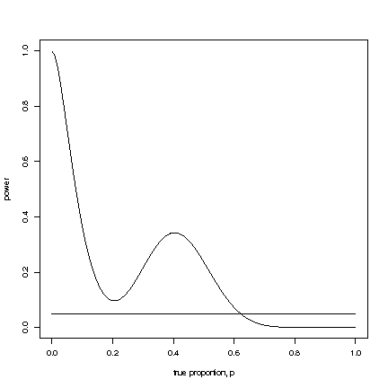

### Examples

> **Example**:  
> 
> Suppose 7 students are involved in an experiment which is comprised of 7
> trails and each trial consists of rolling a dice 9 times.\
> \
> Experiment 1: A student records a 0 if they toss an even number (2,4,6),
> and records a 1 if they toss an odd number (1,3,5). After tossing the
> dice 9 times and recording a 0 or 1 the student tabulates the number of
> 1s. This process is repeated 6 more times.\
> \
> Data and outcomes: x = number of successes in n trials =$\sum_{i=1}^n$.
> Thus, x = number of odd numbers\
> \
> Question:Test whether $p=P[odd number]=\frac{1}{2}$ that is
> 
> $H_0: p=\frac{1}{2}$ vs. $H_a: p\neq \frac{1}{2}$\
> \
> Solution: Now, x is an outcome of $X \sim Bin(n,p)$. We know from the
> CLT that 
> 
> $$\frac{X-np}{\sqrt{np(1-p)}} \sim\dot N(0,1)$$
> 
> 
> 
> write $p_0=\frac{1}{2}$ so if $H_0:p=p_0$ is true then
> 
> 
> $$Z:=\frac{X-np_0}{\sqrt{np_0(1-p_0)}}\sim\dot N(0,1)$$
> 
>  so we reject
> $H_0$ if the observed value 
> 
> $$z=\frac{x-np_0}{\sqrt{np_0(1-p_0)}}$$
> 
>  is
> such that $\left | z\right | >z_{1-\frac{\alpha}{2}}$
> 
> Outcomes from 21 trials
> 
> $\begin{matrix}
> 7   & 4 & 4\\
> 3 & 4 & 6\\
> 5 & 3 & 4\\
> 5 & 5 & 3\\
> 6 & 4 & 5\\
> 4 & 3 & 5\\
> 3 & 6 & 7
> \end{matrix}$
> 
> 
> 
> $$z=\frac{7-9\cdot \frac{1}{2}}{\sqrt{9\cdot\frac{1}{2}\cdot \frac{1}{2}}}=\frac{7-4.5}{3\cdot\frac{1}{2}}=\frac{14-9}{3}=\frac{5}{3} < 1.96$$
> 
> 
> So we do not reject the null hypothesis!\
> 
> > **Note**:  
> > 
> > *Note 22*. Note that we can rewrite the test statistics slightly
> > 
> > 
> > 
> > $$z=\frac{x-\frac{n}{2}}{\sqrt{n\cdot\frac{1}{2}\cdot\frac{1}{2}}}=\frac{x-\frac{9}{2}}{3\cdot\frac{1}{2}}=\frac{2x-9}{3}$$
> > 
> > 
> 
> > **Note**:  
> > 
> > *Note 23*. Note that we reject if $\frac{2x-9}{3}>1.96$ i.e. if
> > $2x>9+3\cdot1.96 \approx 9+6=15$\
> > $x>7.5$ \[for x=8 or 9\] or $2x<9-3\cdot1.96, x<1.5$ \[for x=0 or 1\].

> **Example**:  
> 
> Suppose 7 students are involved in an experiment which is comprised of 7
> trails and each trial consists of rolling a dice 9 times.\
> \
> Experiment 2: The procedure is the same as in experiment 1, but now the
> student records 0 for a 1 or 2 and a 1 for a 3,4,5,or 6.\
> \
> Data and outcomes:
> 
> x = number of successes in n trials =$\sum_{i=1}^n$ Thus, x = number of
> 'b's\
> \
> Solution: Outcomes from 21 experiments
> 
> $\begin{matrix}
> 5 & 4 & 3\\
> 8 & 5 & 7\\
> 5 & 7 & 3\\ 
> 7 & 6 & 5\\ 
> 7 & 8 & 8\\ 
> 5 & 6 & 4\\ 
> 2 & 5 & 7
> \end{matrix}$
> 
> This time our test is $H_0:p=\frac{2}{3}$ vs $H_a:p=\frac{2}{3}$. Note
> that we reject $H_0$ if $\frac{6x-4n}{9}>1,96$ \[for x=9\] or if
> $\frac{6x-4n}{9}<-1,96$ \[for x=0,1,2,3\].\
> We reject $H_0$ in 3 out of 21 trials.

> **Example**:  
> 
> Suppose 7 students are involved in an experiment which is comprised of 7
> trails and each trial consists of rolling a dice 9 times.\
> \
> Experiment 3: Same as experiment 1 except 0 is recorded for 1,2,3,4,5
> and a 1 is recorded for 6.\
> \
> Data and outcomes:
> 
> x = number of successes in n trials =$\sum_{i=1}^n$ Thus, x = number of
> '1's\
> \
> Solution: Outcomes from 21 experiments
> 
> $\begin{matrix}
> 0 & 1 & 2\\
> 1 & 2 & 1\\
> 1 & 4 & 2\\ 
> 1 & 1 & 1\\
> 1 & 3 & 1\\ 
> 1 & 1 & 2\\ 
> 0 & 2 & 0
> \end{matrix}$
> 
> With the same kind of calculations as above, we find that we reject the
> null hypothesis $H_0:p=\frac{1}{6}$ in 14 out of 21 trials.

## The Power of the one sided z test for the mean

> The one sided z-test for the mean $(\mu)$ is based on a random sample
> where $X_1 \ldots X_n \sim n(\mu, \sigma^2)$ are independent and
> $\sigma^2$ is known.\
> The power of the test for an arbitrary $\mu$ can be computed as:
> 
> 
> 
> $$\beta(\mu) = 1 - \Phi \left ( \frac{\mu_0 - \mu }{\frac{\sigma} {\sqrt{n}}} + z_{1- \alpha} \right )$$
> 
> 

### Details

The one sided z-test for the mean $(\mu)$ is based on a random sample
where $X_1 \ldots X_n \sim n(\mu, \sigma^2)$ are independent and
$\sigma^2$ is known.\
If the hypotheses are:

$H_0 : \mu = \mu_0$ vs

$H_a : \mu > \mu_0$\
Then we know that, if $H_0$ is true


$$Z = \frac{\bar {X} - \mu_0}{\frac{\sigma} {\sqrt{n}}} \sim n (0,1)$$


Given data $x_1, \ldots x_n$, the z-value is


$$z = \frac{\bar {x} - \mu_0}{\frac{\sigma} {\sqrt{n}}}$$


We reject $H_0$ if $z > z_{1-\alpha}$

The level of this test is


$$P_{\mu_0} [Reject H_0]= P_{\mu_0}[\frac{\bar {X} - \mu_0}{\frac{\sigma} {\sqrt{n}}} > z_{1- \alpha}]$$


$$= P[z > z_{1- \alpha}] = {\alpha}$$


since $Z \sim n (0,1)$ when $\mu_0$ is the true value.\
\
The power of the test for an arbitrary $\mu$ can be computed as follows.


$$\beta(\mu) = P_{\mu} [reject H_0]$$


$$= P_{\mu}[\frac{\bar {X} - \mu_0}{\frac{\sigma} {\sqrt{n}}} > z_{1- \alpha}]$$


$$= P_{\mu} [\bar {X}> \mu_0 + z_{1- \alpha}{\frac{\sigma} {\sqrt{n}}}]$$


$$= P_{\mu} [\frac{\bar {X} - \mu}{\frac{\sigma} {\sqrt{n}}}> \frac{\mu_0 - \mu }{\frac{\sigma} {\sqrt{n}}}+ z_{1- \alpha}]$$


$$= P[Z > \frac{\mu_0 - \mu}{\frac{\sigma} {\sqrt{n}}} + z_{1- \alpha}]$$


We obtain


$$\beta(\mu) = 1 - \Phi \left ( \frac{\mu_0 - \mu }{\frac{\sigma} {\sqrt{n}}} + z_{1- \alpha} \right )$$


### Examples

> **Example**:  
> 
> Suppose we know $\sigma=2$ and we will take a sample from
> $n\left ( \mu, \sigma^2\right)$ intending to test the hypothesis $\mu=3$
> at level $\alpha=0.05$. We want to know the power against a one-tailed
> alternative when the true mean is actually $\mu=4$ when the sample size
> is $n=25$.\
> \
> We can set this up in R with:
> 
>     alpha<-0.05
>     n<-25
>     sigma<-2
>     mu0<-3
>     mu<-4
>     zcrit<-qnorm(1-alpha)
> 
> Sticking the formula into R gives
> 
>     1-pnorm((mu0-mu)/(sigma/sqrt(n))+zcrit)
>     [1] 0.803765
> 
> On the other hand, one can also use a simple simulation approach. First,
> decide how many samples are to be simulated (Nsim). Then, generate all
> of these samples, arrange them in a matrix and compute the mean of each
> sample. The z-value of each of these Nsim tests are then computed and a
> check is made whether it exceeds the critical point (1) or not (0).
> 
>     Nsim<-10000
>     m<-matrix(rnorm(Nsim*n,mu,sigma),ncol=n)
>     mn<-apply(m,1,mean)
>     z<-(mn-mu0)/(sigma/sqrt(n))
>     i<-ifelse(z>zcrit,1,0)
>     sum(i/Nsim)
>     [1] 0.8081

## Power and sample size for the one-sided z-test for a single normal mean

> Suppose we want to test $H_0:\mu=\mu_0$ vs $H_a:\mu>\mu_0$. We will
> reject $H_0$ if the observed value
> 
> 
> $$z=\frac{\overline{x}-\mu_0}{\sigma/\sqrt{n}}$$
> 
> 
> 
> is such that $z>z_{1-\alpha}$.

### Details

Suppose we want to test $H_0:\mu=\mu_0$ vs $H_a:\mu>\mu_0$. So based on
$X_1,...,X_n\sim n(\mu,\sigma ^2)$ i.i.d. with $\sigma^2$ known we will
reject $H_0$ if the observed value


$$z=\frac{\overline{x}-\mu_0}{\sigma/\sqrt{n}}$$


is such that $z>z_{1-\alpha}$. The power is given by:


$$\beta(\mu)=1-\Phi(\frac{\mu-\mu_0}{\sigma/\sqrt{n}}+z_{1-\alpha})$$


and describes the probability of rejecting $H_0$ when $\mu$ is the
correct value of the parameter. Suppose we want to reject $H_0$ with a
prespecified probability $\beta_1$, when $\mu_1$ is the true value of
$\mu$. For this, we need to select the sample size so that


$$\beta(\mu_1) \geq \beta_1$$


i.e. find n which satisfies


$$1-\Phi(\frac{\mu_1-\mu_0}{\sigma/\sqrt{n}}+z_{1-\alpha})\geq \beta_1$$


### Examples

> **Example**:  
> 
>     mu0<-10
>     sigma<-2
>     mu1<-11
>     n<-50
>     d<-(mu1-mu0)
> 
>     power.t.test(n=n,delta=d,sd=sigma,sig.level=0.05,type="one.sample",alternative="one.sided",strict
>     + = TRUE)
> 
>          One-sample t test power calculation 
> 
>                   n = 50
>               delta = 1
>                  sd = 2
>           sig.level = 0.05
>               power = 0.9672067
>         alternative = one.sided

## The non central t - distribution

> Recall that if $Z \sim n(0, 1)$ and $U \sim {\chi^2}_v$ are independent
> then
> 
> 
> 
> $$\frac{Z}{\sqrt{\frac{U}{v}}}\sim t_v$$
> 
> 
> 
> and it follows for a random sample
> $X_1 \ldots X_n \sim n(\mu, \sigma^2)$ independent; that
> 
> 
> 
> $$\frac{\bar {X} - \mu}{\frac{s} {\sqrt{n}}} = \frac{\frac{\bar {X} - \mu}{\frac{\sigma} {\sqrt{n}}}}{\sqrt{\frac{\sum ({X_i} -\bar {X})^2} { \frac {{\sigma}^2} {n-1}}}} \sim t_{n-1}$$
> 
> 

### Details

On the other hand, if $W \sim n (\Delta,1)$ and $U \sim {\chi}^2_v$ are
independent, then $\frac{W}{\sqrt{\frac{U}{v}}}$ has a non central
t-distribution with $v$ degrees of freedom and non centrality parameter
$\Delta$. This distribution arises, if
$X_1 \ldots X_n \sim n(\mu, \sigma^2)$ independent and we want to
consider the distribution of:


$$\frac{\bar {X} - \mu}{\frac{S} {\sqrt{n}}} = \frac{\frac{\bar {X} - \mu}{\frac{\sigma} {\sqrt{n}}} + \frac{\mu - \mu_0 }{\frac{\sigma} {\sqrt{n}}}} {\frac{S}{\sqrt{n}}} = \frac {Z + \frac{\mu - \mu_0 }{\frac{\sigma} {\sqrt{n}}}}{\sqrt{\frac{U}{v}}}$$


Where $\mu \neq \mu_0$ which is a non central t with non centrality
parameters


$$\Delta = \frac{\mu - \mu_0 }{\frac{\sigma} {\sqrt{n}}}$$


with $n-1$ df. Here $v = n-1 df$ since $Z \sim n (0,1)$ and
$U \sim {\chi}^2_{n-1}$ in this equation

## The power of t-test for a normal mean (warning: errors)

### Details

**WARNING: This is all wrong and needs to be rewritten**

Consider $X_1,\ldots,X_n \sim n (\mu, \sigma^2)$ i.i.d. where $\sigma^2$
is unknown and we want to test $H_0:\mu = \mu_0$ vs. $H_a: \mu > \mu_0$.
We know that


$$T:= \frac{\overline{X} - \mu}{s/\sqrt{n}} \sim_{t_n-1}$$


and we will reject $H_0$ if the computed value


$$t:= \frac{\overline{x} - \mu_0}{s/\sqrt{n}}$$


is such that 

$$t>t^{\star}=t_{n-1, 1-\alpha}.$$


The power of this test is:


$$\begin{aligned}
B(\mu) = P_{\mu}[reject\ H_0] &= P_{\mu} \lbrack \frac{\overline{x} - \mu_0}{s/\sqrt{n}} > t^\star \rbrack\\
&=P_{\mu} \lbrack \overline{x} - \mu_0 > t^\star\cdot s/\sqrt{n} \rbrack\\
&=P_{\mu} \lbrack \frac{\overline{x} - \mu}{s/\sqrt{n}} > t^\star+\frac{\mu_0-\mu}{s/\sqrt{n}} \rbrack.\end{aligned}$$


Which is the probability that a $t_{n-1,1-\alpha}$-variable exceed
$t^{\star}+\frac{\mu_0-\mu}{s/\sqrt{n}}$.

**WARNING: This is all wrong and needs to be rewritten (the s in the
above line is a random variable so this make no sense at all)**

## Power and sample size for the one sided t-test for a mean

> Suppose we want to calculate the power of a one sided t-test for a
> single mean (one sample), this can easily be done in R with the
> `power.t.test` command.

### Details

$\triangle = \mu_1-\mu_2$\
$\delta = \frac{\mu_1-\mu_2}{\sigma/\sqrt{n}}$

### Examples

> **Example**:  
> 
> For a one sided power analysis we wish to test the following
> hypotheses:\
> For a one sample test:\
> $H_0: \mu = \mu_0$ vs. $H_a: \mu > \mu_0$\
> For a two sample test:\
> $H_0: \mu_1 = \mu_2$ vs. $H_a: \mu_1 > \mu_2$\
> In R, the `power.t.test` command is useful to calculate how many samples
> one needs to obtain a certain power of a test, but also to calculate the
> power when we have a given number of samples.

> **Example**:  
> 
> How many samples do I need to get a power of .9?
> 
>     power.t.test(power = .95, delta=1.5,sd=2, type="one.sample", alternative = "one.sided")
> 
>      One-sample t test power calculation 
> 
>                   n = 20.67702
>               delta = 1.5
>                  sd = 2
>           sig.level = 0.05
>               power = 0.95
>         alternative = one.sided
>         
> 
> We would thus need a sample size of n = 31.15 or $\approx 32$ samples to
> obtain a power of 0.9 for our analysis.\
>  

> **Example**:  
> 
> With a sample size of n = 45, what will the power of my test be?\
> 
>     power.t.test(n=45,delta=1.5,sd=2,sig.level=0.05,type="one.sample",alternative="one.sided")
> 
>           One-sample t test power calculation 
>          
>                        n = 45
>                    delta = 1.5
>                       sd = 2
>                sig.level = 0.05
>                    power = 0.9995287
>              alternative = one.sided
> 
> This is done the same way for two samples only by changing the
> alternative to \"two.sample\". For two sided power analysis, one only
> needs to change the alternative to \"two.sided\".\
>  

> **Example**:  
> 
> If one is interested in doing a power analysis for an ANOVA test, this
> is done in a fairly similar way.\
>  \
> With a given sample size of n=20:
> 
>     power.anova.test(groups=4, n=20, between.var=1, within.var=3)
> 
> Balanced one-way analysis of variance power calculation
> 
>              groups = 4
>                   n = 20
>         between.var = 1
>          within.var = 3
>           sig.level = 0.05
>               power = 0.9679022
> 
> To calculate the sample size needed to obtain a power of 0.90 for a
> test:
> 
>     power.anova.test(groups=4, between.var=1, within.var=3, power=.9) 
> 
> Balanced one-way analysis of variance power calculation
> 
>              groups = 4
>                   n = 15.18834
>         between.var = 1
>          within.var = 3
>           sig.level = 0.05
>               power = 0.9

## The power of the 2-sided t-test

> A power analysis on a two-sided t-test can be done in R using the
> $power.t.test$ command.

### Details

For a one sample test:\
$H_0: \mu=\mu_0$ vs. $H_a:\mu\neq\mu_0$\
\
The $power.t.test$ command is useful to provide information for
determining the minimum sample size one needs to obtain a certain power
of a test:

     power.t.test(n= ,delta= ,sd= ,sig.level= ,power= ,type=c("two.sample","one.sample","paired"),alternative=c("two.sided"))

where:\
n=sample size\
d=effect size\
sd=standard deviation\
sig.level=significance level\
power= normally 0.8, 0.9 or 0.95\
type= two sample, one sample or paired (the type selected depends on the
research)\
alternative= either one sided or two sided\

### Examples

> **Example**:  
> 
> How many samples do I need in my research to obtain a power of 0.8?
> 
>     power.t.test(delta=1.5,sd=2,sig.level=0.05,power=0.8,type=c("two.sample"),alternative=c("two.sided"))
> 
>          Two-sample t test power calculation 
> 
>                   n = 28.89962
>               delta = 1.5
>                  sd = 2
>           sig.level = 0.05
>               power = 0.8
>         alternative = two.sided
> 
> So, one needs 29 samples (n=29) to obtain a power level of 0.8 for this
> analysis.

## The power of the 2-sample one and two-sided t-tests

> The power of a two sample, one-sided t-test can be computed as follows:
> 
> 
> 
> $$\beta_{(\mu_1\mu_2)} = P_{\mu_1\mu_2}\left[ \frac{Z + \Delta}{\sqrt{U/(n+m-2)}} > t^*_{1-\alpha,n+m-2} \right]$$
> 
> 
> 
> and the power of a two sample, two-sided t-test is give by:
> 
> 
> 
> $$\beta_{(\mu_1\mu_2)} = P_{\mu_1\mu_2}\left[ \frac{Z + \Delta}{\sqrt{U/(n+m-2)}} > t^*_{1-\alpha,n+m-2} \right]\\ 
> +P_{\mu_1\mu_2}\left[ \frac{Z + \Delta}{\sqrt{U/(n+m-2)}} < -t^*_{1-\alpha,n+m-2} \right]$$
> 
> 
> 
> where
> $\Delta = \frac{(\mu_1-\mu_2)}{\sigma\sqrt{\frac{1}{n}+\frac{1}{m}}}$
> and $U$ is the SSE.\

### Details

*T*wo Sample, One-sided t-Test:

Suppose data are gathered independently from two normal populations
resulting in 

$$X_1, \ldots, X_n \sim n(\mu_1, \sigma^2)$$


$$Y_1, \ldots, Y_m \sim n(\mu_2, \sigma^2)$$

 where all data are
independent then


$$\overline{X}-\overline{Y} \sim n(\mu_1 - \mu_2, \frac{\sigma^2}{n}\ + \frac{\sigma^2}{m})$$


The null hypothesis in question is $H_o: \mu_1 = \mu_2$ versus
alternative $H_a: \mu_1 > \mu_2$. If $H_o$ is true then the observed
value


$$t = \frac{\overline{x}-\overline{y}}{s\sqrt{\frac{1}{n}+\frac{1}{m}}}$$


comes from a t-distribution with $n+m-2$ degrees of freedom and we
reject $H_o$ if $\left|t \right|> t^*_{1-\alpha,n+m-2}$\
The power of the test can be computed as follows:


$$\begin{aligned}
\beta_{(\mu_1\mu_2)}& = & P_{\mu_1\mu_2}\left[reject~H_o \right]\\
& = & P_{\mu_1\mu_2}\left[\frac{\overline{X}-\overline{Y}}{S\sqrt{\frac{1}{n}+\frac{1}{m}}} > t^*_{1-\alpha,n+m-2} \right]\\
& = &  P_{\mu_1\mu_2}\left[\frac{\frac{\overline{X}-\overline{Y}-(\mu_1-\mu_2)}{\sigma\sqrt{\frac{1}{n}+\frac{1}{m}}}+ \frac{(\mu_1-\mu_2)}{\sigma\sqrt{\frac{1}{n}+\frac{1}{m}}}}{S/\sigma} > t^*_{1-\alpha,n+m-2}\right]\\
& = &  P_{\mu_1\mu_2}\left[\frac{Z +\frac{(\mu_1-\mu_2)}{\sigma\sqrt{\frac{1}{n}+\frac{1}{m}}}}
{S/\sqrt{(n+m-2)}} > t^*_{1-\alpha,n+m-2} \right]\\
& = &  P_{\mu_1\mu_2}\left[ \frac{Z + \Delta}{\sqrt{U/(n+m-2)}} > t^*_{1-\alpha,n+m-2} \right]\end{aligned}$$


where
$\Delta = \frac{(\mu_1-\mu_2)}{\sigma\sqrt{\frac{1}{n}+\frac{1}{m}}}$
and $U$ is the SSE of the samples which is divided by the appropriate
degrees of freedom to give a $\chi^2$ distribution.\
This is the probability that a non-central $t$-variable exceeds $t^*$.\
\
*T*wo Sample, Two-sided t-Test:

In this case the null hypothesis is defined as $H_o: \mu_1 = \mu_2$
versus alternative $H_a: \mu_1 \neq \mu_2$.\
The power of the test can be computed as follows:


$$\begin{aligned}
\beta_{(\mu_1\mu_2)}& = & P_{\mu_1\mu_2}\left[reject~H_o \right]\\
& = & P_{\mu_1\mu_2}\left[\left|\frac{\overline{X}-\overline{Y}}{S\sqrt{\frac{1}{n}+\frac{1}{m}}}\right| > t^*_{1-\alpha,n+m-2} \right]\\
& = & P_{\mu_1\mu_2}\left[\frac{\overline{X}-\overline{Y}}{S\sqrt{\frac{1}{n}+\frac{1}{m}}} > t^*_{1-\alpha,n+m-2} \right] \\
&& +\: P_{\mu_1\mu_2} \left[\frac{\overline{X}-\overline{Y}}{S\sqrt{\frac{1}{n}+\frac{1}{m}}} <-t^*_{1-\alpha,n+m-2} \right] \\
& = &  P_{\mu_1\mu_2}\left[\frac{\frac{\overline{X}-\overline{Y}-(\mu_1-\mu_2)}{\sigma\sqrt{\frac{1}{n}+\frac{1}{m}}}+\frac{(\mu_1-\mu_2)}{\sigma\sqrt{\frac{1}{n}+\frac{1}{m}}}}{S/\sqrt{(n+m-2)}} > t^*_{1-\alpha,n+m-2}\right] \\
&& +\:   P_{\mu_1\mu_2}\left[\frac{\frac{\overline{X}-\overline{Y}-(\mu_1-\mu_2)}{\sigma\sqrt{\frac{1}{n}+\frac{1}{m}}}+\frac{(\mu_1-\mu_2)}{\sigma\sqrt{\frac{1}{n}+\frac{1}{m}}}}{S/\sqrt{(n+m-2)}} < -t^*_{1-\alpha,n+m-2}\right]
\\
& = &  P_{\mu_1\mu_2}\left[ \frac{Z + \Delta}{\sqrt{U/(n+m-2)}} > t^*_{1-\alpha,n+m-2} \right]\\
&& +\: P_{\mu_1\mu_2}\left[ \frac{Z + \Delta}{\sqrt{U/(n+m-2)}} < -t^*_{1-\alpha,n+m-2} \right]\end{aligned}$$


where
$\Delta = \frac{(\mu_1-\mu_2)}{\sigma\sqrt{\frac{1}{n}+\frac{1}{m}}}$
and $U$ is the SSE of the samples which is divided by the appropriate
degrees of freedom to give a $\chi^2$ distribution.\

> **Note**:  
> 
> *Note 24*. Note that the power of a test can be obtained using the
> $power.t.test$ function in R.

## Sample sizes for two-sample one and two-sided t-tests

> The sample size should always satisfy the desired power.

### Details

Suppose we want to reject the $H_o$ with a pre-specified probability
$\beta_1$ when $\mu_1$ and $\mu_2$ are true values of $\mu$. For this,
we need to select the sample size $n$ and $m$ so that
$\beta_(\mu_1\mu_2) \geq \beta_1$ i.e. find $n$ and $m$ which satisfies


$$P_{\mu_1\mu_2} \left[ \frac{Z + \Delta}{\sqrt{U/(n+m-2)}} > t^*_{1-\alpha,n+m-2} \right]$$


for a two sample, one-sided t-test.\
Similarly for a two sample, two-sided t-test we need to find $n$ and $m$
that satisfies

$P_{\mu_1\mu_2}\left[ \frac{Z + \Delta}{\sqrt{U/(n+m-2)}} > t^*_{1-\alpha,n+m-2} \right]$ +
$P_{\mu_1\mu_2} \left[\frac{Z + \Delta}{\sqrt{U/(n+m-2)}} < -t^*_{1-\alpha,n+m-2} \right]$

## A case study in power

> Want to compute power in analysis of covariance:
> 
> 
> $$y_{ij}=\mu_i+\beta x_{ij}+\epsilon_{ij} , \ i=1, 2,\ j=1,\ldots J,$$
> 
> 
> where $\epsilon_{ij}\sim n(0,\sigma^ 2)$ are i.i.d.?\
> This can be done by simulation and can easily be expanded to other
> cases.

### Handout

> **Example**:  
> 
> If you want to compute a power analysis in analysis of covariance:
> 
> 
> $$y_{ij}=\mu_i+\beta x_{ij}+\epsilon_{ij} , \ i=1, 2,\ j=1,\ldots J,$$
> 
> 
> where $\epsilon_{ij}\sim n(0,\sigma^ 2)$ are i.i.d. then use
> simulation.\
> To do this one needs to first define the task in more detail, along with
> what exactly is known and what the assumptions are.
> 
> > **Note**:  
> > 
> > *Note 25*. Note that there are only two groups, with intercepts $\mu_1$
> > and $\mu_2$. The \"power\" will refer to the power of a test for
> > $\mu_1=\mu_2$, i.e. we want to test whether the group means are equal,
> > correcting for the effect of the continuous variable $x$.
> 
> In principle, the $x$-values will be either fixed a priori or they may
> be a random part of the experiment. Here we will assume that the
> $x$-values are randomly selected in the range 20-30 (could e.g. be the
> ages of patients).\
> Since this is in the planning stage of the experiment, we also have a
> choice of the sample size within each group. For convenience, the sample
> sizes are taken to be the same in each group, $J$ so the total number of
> measurements will be $n=2J$. We also need to decide at which levels of
> $\mu_1$ and $\mu_2$ the power is to be computed (but it is really only a
> function of the difference, $\mu_1-\mu_2$).\
> The following pieces of R code can be saved into a file, \"ancovapow.r\"
> and then command
> 
>     source("ancovapow.r")
> 
> can be used to run the whole thing.\
> The beginning of the command sequence merely consists of comments and
> definitions of parameter values. These need to be changed for each case
> separately.
> 
>     #
>     # ancovapow.r - power computations for analysis of covarariance
>     #             - one factor, two levels mu0, mu1
>     #             - one covariate x, x0 stores possible values from which a random set is chosen
>     #
>     # first set values of parameters
>     #
>     alpha<-0.05
>     sigma<-7.5        # the common standard deviation
>     x0<-20:30         # the set of x values
>     delta<-10         # the difference in the means
>     mu0<-0            # the first mean
>     mu1<-mu0+delta    # the second mean
>     slope<-2.5        # the slope in the ancova
>     J<-10             # the common sample size per factor level
>     n<-2*J            # the total sample size
>     Nsim<- 40000      # the number of simulations for power computations
> 
> Rather than head straight for the ancova, start with a simpler case,
> namely ignoring the covariate ($x$) and merely doing a regular
> two-sample, two-tailed t-test. This should be reasonably similar to the
> ancova power computations anyway.
> 
>     #
>     # Next do the power computations just for a regular two-sided, two-sample t-test
>     # and use simulation
>     #
>     Y1<-matrix(rnorm(J*Nsim,mu0,sigma),ncol=J) # Simulate Nsim samples of size J, ea n(mu1,sigma^2)
>     Y2<-matrix(rnorm(J*Nsim,mu1,sigma),ncol=J) # Simulate Nsim samples of size J, ea n(mu2,sigma^2)
>     y1mn<-apply(Y1,1,mean)                      # compute all the simulated y1-means
>     y2mn<-apply(Y2,1,mean)                      # compute all the simulated y2-means
>     sy1<-apply(Y1,1,sd)                         # compute all the simulated y1-std.devs
>     sy2<-apply(Y2,1,sd)                         # compute all the simulated y2-std.devs
>     s<-sqrt(((J-1)*sy1^2+(J-1)*sy2^2)/(n-2))    # compute all the pooled std.devs
>     t<-(y1mn-y2mn)/(s*sqrt(1/J+1/J))            # compute all the Nsim t-statistics
>     i<-ifelse(abs(t)>qt(1-alpha/2,n-2),1,0)     # for ea t, compute 1=reject, 0=do not reject
>     powsim2<-sum(i)/Nsim                        # the simulated power
>     cat("The simulated power is ",powsim2,"\n")
> 
> The above gave the simulated power. In R there is a function to do the
> same computations and it is worth while to verify the code (and
> approach) by checking whether these give the same thing:
> 
>     #
>     # Then compute the exact power for the t-test
>     #
>     pow2<-power.t.test(delta=delta,sd=sigma,sig.level=alpha,n=J ,type=c("two.sample"),alternative=c("two.sided"))
>     cat("The exact power:\n")
>     print(pow2)
> 
> Finally, start setting up the code to do the ancova simulations. Note
> that for this we need to generate the x-values. In this example it is
> assumed that the x-values are not under the control of the experimenter
> but arrive randomly, in the range from 20 to 30 (could e.g. be the age
> of participants in an experiment).
> 
>     #
>     # Finally compute the power in the ancova - note we already have simulated Y1, Y2-values but have not added the x-part yet
>     #
>     x1<-matrix(sample(x0,Nsim*J,replace=T),ncol=J) # simulate x-values for y1
>     x2<-matrix(sample(x0,Nsim*J,replace=T),ncol=J) # simulate x-values for y2
>     Y1<-Y1+slope*x1
>     Y2<-Y2+slope*x2
>     fulldat<-cbind(Y1,Y2,x1,x2) # a row now contains all y1, then all y2, then all x1, then all x2; Nsim rows
> 
> Rather than try to write code to do an ancova, it is natural to use the
> R function lm to do this. The "trick" below is to extract the P-value
> from the summary command. By defining a "wrapper" function which takes a
> single line as an argument, it will subsequently be possible to use the
> "apply" function to extract the P-values using a one-line R command.
> 
>     ancova.pval<-function(onerow){ # extract the ancova p-value for diff in means
>       J<-length(onerow)/4
>       n<-2*J
>       y<-onerow[1:n]                         # get the y-data from the row
>       x<-onerow[(n+1):(2*n)]                 # get the x-data from the row
>       grps<-factor(c(rep(1,J),rep(2,J)))     # define the groups
>       sm<-summary(lm(y~x+grps))              # fit the ancova model
>       pval<-sm$coefficients[3,4] # extract exactly the right thing from the summary command-the P-value for H0:mu1=mu2
>       return(pval)
>     }
> 
> Everything has now been defined so it is possible to compute all the
> P-values in a single command line:
> 
>     pvec<-apply(fulldat,1,ancova.pval)
>     i2<-ifelse(pvec<alpha,1,0)              # for ea test, compute 1=reject, 0=do not reject
>     ancovapow<-sum(i2)/Nsim                  # the simulated power
>     cat("The simulated ancova power is ",ancovapow,"\n")
> 
> When run, this script returns:
> 
>     The simulated power is  0.803025 
>     The exact power:
> 
>          Two-sample t test power calculation 
> 
>                   n = 10
>               delta = 10
>                  sd = 7.5
>           sig.level = 0.05
>               power = 0.8049123
>         alternative = two.sided
> 
>      NOTE: n is number in *each* group 
> 
>     The simulated ancova power is  0.775175 
> 
> It is seen that when the $x$-values are not included in any way (in
> particular, $\beta=0$), the power is 80.5%. However, this is not the
> correct model in the present situation. Using the above value of $\beta$
> and taking this into account, the power is actually a bit lower or
> 77.5%.

**Copyright** 2021, Gunnar Stefansson (editor) with contributions from
very many students

This work is licensed under the Creative Commons Attribution-ShareAlike
License. To view a copy of this license, visit
http://creativecommons.org/licenses/by-sa/1.0/ or send a letter to
Creative Commons, 559 Nathan Abbott Way, Stanford, California 94305,
USA.

# Vectors and Matrix Operations

## Numbers, vectors, matrices

> Recall that the set of real numbers is $\mathbb{R}$ and that a vector ,
> $v \in \mathbb{R}^n$ is just an n-tuple of numbers.\
> Similarly, an $n x m$ matrix is just a table of numbers, with n rows and
> m columns and we can write
> 
> 
> 
> $$A_{mn} \in \mathbb{R}^{mn}$$
> 
> 
> 
> Note that a vector is normally considered equivalent to a $n\times1$
> matrix i.e. we view these as column vectors.

### Examples

> **Example**:  
> 
> In R, a vector can be generated with:
> 
>     X<- 3:6
>     X
>     [1] 3 4 5 6
> 
> A matrix can be generated in R as follows,
> 
>     matrix(X)
>        [,1]
>     [1,]    3
>     [2,]    4
>     [3,]    5
>     [4,]    6
> 
> > **Note**:  
> > 
> > *Note 26*. We note that R distinguishes between vector and matrices.

## Elementary Operations

> We can define multiplication of a real number $k$ and a vector
> $v=(v_1,\ldots,v_n)$ by $k\cdot v=(kv_1,\ldots,kv_n)$. The sum of two
> vectors in $\mathbb{R}^n$, $v=(v_1,\ldots,v_n)$ and $u=(u_1,\ldots,u_n)$
> as the vector $v+u=(v_1+u_1,\ldots,v_n+u_n)$. We can define
> multiplication of a number and a matrix and the sum of two matrices (of
> the same sizes) similarly.

### Examples

> **Example**:  
> 
>     A <- matrix(c(1,2,3,4), nr=2, nc=2)
>     A
>          [,1] [,2]
>     [1,]    1    3
>     [2,]    2    4
> 
>     B <- matrix(c(1,0,2,1), nr=2, nc=2)
>     B
>          [,1] [,2]
>     [1,]    1    2
>     [2,]    0    1
> 
>     A+B
>       [,1] [,2]
>     [1,]    2    5
>     [2,]    2    5

## The tranpose of a matrix

> In R, matrices may be constructed using the \"matrix\" function and the
> transpose of $A$, $A^\prime$, may be obtained in R by using the \"t\"
> function:
> 
> `A<-matrix(1:6, nrow=3)`
> 
> $\texttt{t(A)}$

### Details

If $A$ is an $n \times m$ matrix with element $a_{ij}$ in row $i$ and
column $j$, then $A^\prime$ or $A^T$ is the $m\times n$ matrix with
element $a_{ij}$ in row $j$ and column $i$.

### Examples

> **Example**:  
> 
> Consider a vector in R
> 
>     x<-1:4
>     x
>     [1] 1 2 3 4
>     t(x)
>          [,1] [,2] [,3] [,4]
>     [1,]    1    2    3    4
>     matrix(x)
>          [,1]
>     [1,]    1
>     [2,]    2
>     [3,]    3
>     [4,]    4
>     t(matrix(x))
>          [,1] [,2] [,3] [,4]
>     [1,]    1    2    3    4
>      
> 
> > **Note**:  
> > 
> > *Note 27*. Note that the first solution gives a $1 \times n$ matrix and
> > the second solution gives a $n \times 1$ matrix.

## Matrix multiplication

> Matrices A and B can be multiplied together if A is an $n \times p$
> matrix and B is an $p\times m$ matrix. The general element $c_ij$ of
> $n\times m$; $C=AB$ is found by pairing the $i^th$ row of C with the
> $j^th$ column of B, and computing the sum of products of the paired
> terms.
> 
> 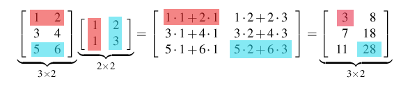

### Details

Matrices A and B can be multiplied together if A is a $n\times p$ matrix
and B is a $p\times m$ matrix. Given the general element $c_{ij}$ of
$n x m$ matrix, $C=AB$ is found by pairing the $i^th$ row of C with the
$j^th$ column of B, and computing the sum of products of the paired
terms.

### Examples

> **Example**:  
> 
> Matrices in R
> 
>     A<-matrix(c(1,3,5,2,4,6),3,2)
>     A
>          [,1] [,2]
>     [1,]    1    2
>     [2,]    3    4
>     [3,]    5    6
>     B<-matrix(1,1,2,3)2,2)
> 
>     B<-matrix(c(1,1,2,3),2,2)
>      B
>          [,1] [,2]
>     [1,]    1    2
>     [2,]    1    3
>     A%*%B
>          [,1] [,2]
>     [1,]    3    8
>     [2,]    7   18
>     [3,]   11   28

## More on matrix multiplication

> Let $A$, $B$, and $C$ be $m\times n$, $n\times l$, and $l\times p$
> matrices, respectively. Then we have 
> 
> $$(AB)C=A(BC).$$
> 
>  In general, matrix
> multiplication is not commutative, that is $AB\neq BA$.\
> We also have 
> 
> $$(AB)'=B'A'.$$
> 
>  In particular, $(Av)'(Av)=v'A'Av$, when $v$
> is a $n\times1$ column vector.\
> \
> More obvious are the rules
> 
> 1.  $A+(B+C)=(A+B)+C$
> 
> 2.  k(A+B)=kA+kB
> 
> 3.  A(B+C)=AB+AC,
> 
> where $k\in\mathbb{R}$ and when the dimensions of the matrices fit.

## Linear equations

### Details

**Detail:**\
General linear equations can be written in the form $Ax=b$.

### Examples

> **Example**:  
> 
> The set of equations\
> \
> $2x+3y=4$\
> $3x+y=2$\
> can be written in matrix formulation as
> 
> 
> $$\begin{bmatrix}
> 2 & 3  \\
> 3 & 1 
> \end{bmatrix}
> \begin{bmatrix}
> x \\
> y
> \end{bmatrix}
> =
> \begin{bmatrix}
> 4 \\
> 2
> \end{bmatrix}$$
> 
> 
> 
> i.e. $A\underline{x} = \underline{b}$ for an appropriate choice of of
> $A, \underline{x}$ and $\underline{b}$

## The unit matrix

> The $n$ x $n$ matrix
> 
> 
> $$\mathbf{I}
> =
> \left[
> \begin{array}{cccc}
>   1 & 0 & \ldots & 0 \\
>   0 & 1 & 0  & \vdots \\
>   \vdots & 0  & \dots & 0 \\
>   0 & \ldots & 0 & 1
> \end{array} \right]$$
> 
> 
> 
> is the identity matrix. This is because if a matrix $\mathbf{A}$ is $n$
> x $n$ then $\mathbf{A} \mathbf{I} = \mathbf{A}$ and
> $\mathbf{I} \mathbf{A}  = 
> \mathbf{A}$

## The inverse of a matrix

> If $A$ is an $n \times n$ matrix and $B$ is a matrix such that
> 
> 
> 
> $$BA = AB = I$$
> 
> 
> 
> Then $B$ is said to be the inverse of $A$, written
> 
> 
> 
> $$B = A ^{-1}$$
> 
> 
> 
> Note that if $A$ is an $n \times n$ matrix for which an inverse exists,
> then the equation $Ax = b$ can be solved and the solution is
> $x = A^{-1} b$.

### Examples

> **Example**:  
> 
> If matrix $A$ is:
> 
> $\begin{bmatrix}
> 2 & 3  \\
> 3 & 1 
> \end{bmatrix}$
> 
> then $A ^{-1}$ is:
> 
> $\begin{bmatrix}
> \frac{-1}{4} & \frac{3}{4}  \\
> \frac{3}{4} & \frac{1}{2} 
> \end{bmatrix}$

**Copyright** 2021, Gunnar Stefansson (editor) with contributions from
very many students

This work is licensed under the Creative Commons Attribution-ShareAlike
License. To view a copy of this license, visit
http://creativecommons.org/licenses/by-sa/1.0/ or send a letter to
Creative Commons, 559 Nathan Abbott Way, Stanford, California 94305,
USA.

# Some notes on matrices and linear operators

## The matrix as a linear operator

> Let $A$ be an $m\times  n$ matrix, the function
> 
> 
> 
> $$T_A:\mathbb{R}^n\to\mathbb{R}^m, T_A(\underline{x}) = A\underline{x},$$
> 
> 
> is linear, that is
> 
> 
> 
> $$T_A (a\underline{x} + b\underline{y}) = aT_A(\underline{x}) + bT_A(\underline{y})$$
> 
> 
> 
> if $\underline{x}, \underline{y} \in \mathbb{R}^n$ and
> $a, b \in \mathbb{R}$.

### Examples

> **Example**:  
> 
> If A= $\begin{bmatrix}
> 1 & 2 
> \end{bmatrix}$ then $T_A(\underline{x}) = x + 2y$ where
> $\underline{x} = {x \choose y}\in \mathbb{R}^2$

> **Example**:  
> 
> If A= $\begin{bmatrix}
> 0 & 1  \\
> 1 & 0 
> \end{bmatrix}$ then $T_A{x \choose y}$ = $\begin{bmatrix}
> y  \\
> x 
> \end{bmatrix}$

> **Example**:  
> 
> If A= $\begin{bmatrix}
> 0 & 2 & 3\\
> 1 & 0 & 1
> \end{bmatrix}$ then $T_A$ $\left(
> \begin{array}{ccc}
>   x \\
>   y\\
>   z\\
>  \end{array} \right)$ = $\begin{bmatrix}
> 2y + 3z\\
> x + z
> \end{bmatrix}$

> **Example**:  
> 
> If $T{x \choose y }$ = $\left(
>  \begin{array}{cc}
>    x+y  \\
>   2x-3y\\
>  \end{array} \right)$ then $T (\underline{x}) = A \underline{x}$ if we
> set A = $\begin{bmatrix}
> 1 & 1 \\
> 2 & -3
> \end{bmatrix}$

## Inner products and norms

> Assuming $x$ and $y$ are vectors, then we define their inner product by
> 
> 
> 
> $$x \cdot y = x_1y_1 + x_2y_2 + \cdots + x_ny_n$$
> 
> 
> 
> where $x =\begin{pmatrix}
> x_1\\
> \vdots\\
> x_n
> \end{pmatrix}$ and $y= \begin{pmatrix}
> y_1\\
> \vdots\\
> y_n
> \end{pmatrix}$

### Details

If $x$, $y$ $\in \mathbb{R}^n$ are arbitrary (column) vectors, then we
define their inner product by


$$x \cdot y = x_1y_1 + x_2y_2 + \cdots + x_ny_n$$


where $x= \begin{pmatrix}
x_1\\
\vdots\\
x_n
\end{pmatrix}$ and $y =\begin{pmatrix}
y_1\\
\vdots\\
y_n
\end{pmatrix}$.

> **Note**:  
> 
> *Note 28*. Note that we can also view $x$ and $y$ as $n \times 1$
> matrices and we see that $x \cdot y = x^\prime y$.

> **Definition**:  
> 
> The normal length of a vector is defined by
> $\left \| x \right \|^2 = x \cdot x$. It may also be expressed as
> $\left \| x \right \| = \sqrt{x_1^2 + x_2^2 + \cdots + x_n^2}$.

It is easy to see that for vectors $a, b$ and $c$ we have
$(a+b)\cdot c=a\cdot c+ b\cdot c$ and $a\cdot b=b\cdot a$.

### Examples

Two vectors $x$ and $y$ are said to be orthogonal if $x \cdot y = 0$

> **Example**:  
> 
> If $x= \begin{pmatrix}
> 3\\
> 4
> \end{pmatrix}$ and $y= \begin{pmatrix}
> 2\\
> 1
> \end{pmatrix}$, then 
> 
> $$x \cdot y = 3 \cdot 2 + 4 \cdot 1 = 10,$$
> 
> 
> 
> and
> 
> 
> 
> $$\left \| x \right \|^2 = 3^2 + 4^2 = 25,$$
> 
> 
> 
> so
> 
> 
> 
> $$\left\| x \right \| = 5$$
> 
> 

## Orthogonal vectors

> Two vectors $x$ and $y$ are said to be orthogonal if $x\cdot y=0$
> denoted $x \perp y$

### Details

> **Definition**:  
> 
> Two vectors $x$ and $y$ are said to be **orthogonal** if $x\cdot y=0$
> denoted $x \perp y$

If $a,b \in \mathbb{R}^n$ then


$$\left\|a+b\right\|^2=a\cdot a+2a\cdot b+b\cdot b$$

 so


$$\left\|a+b\right\|^2=\left\|a\right\|^2+\left\|b\right\|^2 + 2\underline{a}\underline{b}.$$


> **Note**:  
> 
> *Note 29*. Note that if $a \perp b$ then
> $\left\|a+b\right\|^2=\left\|a\right\|^2+ \left\|b\right\|^2$, which is
> Pythagoras' theorem in $n$ dimensions.

## Linear combinations of i.i.d. random variables

> Suppose $X_1,....,X_n$ are i.i.d. random variables and have mean
> $\mu_1, ...., \mu_n$ and variance $\sigma^2$ then the expected value of
> $Y$ of the linear combination is 
> 
> $$Y=\sum a_i X_i$$
> 
>  and if
> $a_1,....,a_n$ are real constants then the mean is:
> 
> 
> 
> $$\mu_Y = \sum a_i \mu_i$$
> 
> 
> 
> and the variance is:
> 
> 
> 
> $$\sigma^2 = \sum a^2_i \sigma^2_i$$
> 
> 

### Examples

> **Example**:  
> 
> Consider two i.i.d. random variables, $Y_1,Y_2$ and a specific linear
> combination of the two, $W=Y_1+3Y_2$.\
> We first obtain 
> 
> $$E[W]=E[Y_1+3Y_2]=E[Y_1]+3E[Y_2]=2+3\cdot 2=2+6=8.$$
> 
> 
> 
> Similarly, we can first use independence to obtain
> 
> 
> $$V[W]=V[Y_1+3Y_2]=V[Y_1]+V[3Y_2]$$
> 
> 
> 
> and then (recall that $V[aY]=a^2V[Y]$)
> 
> 
> $$V[Y_1]+V[3Y_2]=V[Y_1]+3^2V[Y_2]=1^2+3^2= 1(4) + 9(4)= 40$$
> 
> 
> 
> Normally, we just write this up in a simple sequence
> 
> 
> $$V[W]=V[Y_1+3Y_2]=V[Y_1]+3^2V[Y_2]=1^2+3^2= 1(4) + 9(4)= 40$$
> 
> 

## Covariance between linear combinations of i.i.d random variables

> Suppose $Y_1,\ldots,Y_n$ are i.i.d., each with mean $\mu$ and variance
> $\sigma^2$ and $a,b\in \mathbb{R}^n$. Writing $Y= \left(
>  \begin{array}{ccc}
>    Y_1  \\
>    \vdots\\
>    Y_n 
>  \end{array} \right)$, consider the linear combination $a'Y$ and $b'Y$.

### Details

The covarience between random variables $U$ and $W$ is defined by


$$Cov(U,W)= E[(U-\mu_u)(W-\mu_w)]$$

 where 

$$\mu_u=E[U],\mu_w=E[W]$$

 Now,
let $U=a'Y=\sum Y_ia_i$ and $W=b'Y=\sum Y_ib_i$, where $Y_1,\ldots,Y_n$
are i.i.d. with mean $\mu$ and variance $\sigma^2$, then we get


$$Cov(U,W)= E[(\underline{a}'Y-\Sigma a_\mu)(\underline{b}'Y-\Sigma b\mu)]$$


$$= E[(\Sigma a_iY_i -\Sigma a_i\mu)(\Sigma b_jY_j -\Sigma b_j\mu )]$$


and after some tedious (but basic) calculations we obtain


$$Cov(U,W)=\sigma^2a\cdot b$$


### Examples

> **Example**:  
> 
> If $Y_1$ and $Y_2$ are i.i.d., then
> 
> 
> 
> $$Cov(Y_1+Y_2, Y_1-Y_2)=Cov((1,1) \left( \begin{array}{ccc}Y_1  \\Y_2 \end{array} \right),  (1,-1) \left( \begin{array}{ccc}Y_1  \\Y_2 \end{array} \right) )$$
> 
> 
> 
> 
> 
> $$=(1,1) \left( \begin{array}{ccc} 1  \\-1 \end{array} \right)\sigma^2$$
> 
> 
> 
> 
> 
> $$=0$$
> 
> 
> 
> and in general,
> $Cov(\underline{a}'\underline{Y}, \underline{b}'\underline{Y})=0$ if
> $\underline{a}\bot \underline{b}$ and $Y_1,\ldots,Y_n$ are independent.

## Random vectors

> $Y= (Y_1, \ldots , Y_n)$ is a random vector if $Y_1, \ldots , Y_n$ are
> random variables.

### Details

> **Definition**:  
> 
> If $EY_i = \mu_i$ then we typically write
> 
> $E(Y)=\left(
> \begin{array}{ccc}
>   \mu_1 \\
>   \vdots \\
>   \mu_n
> \end{array} \right)=\mu$
> 
> If $Cov(Y_i, Y_j) = \sigma{ij}$ and $V[Y_i]=\sigma_{ii} = \sigma_i^2$,
> then we define the matrix 
> 
> $$\boldsymbol{\Sigma} = (\sigma_{ij})$$
> 
> 
> containing the variances and covariances. We call this matrix the
> **covariance matrix** of $Y$, typically denoted
> $V[Y] = \boldsymbol{\Sigma}$ or $Cov[Y] = \boldsymbol{\Sigma}$.

### Examples

> **Example**:  
> 
> If $Y_i, \ldots , Y_n$ are i.i.d., $EY_i = \mu$, $VY_i = \sigma^2$,
> $a,b\in\mathbb{R}^n$ and $U=a'Y$, $W=b'Y$,
> 
> and T= $\begin{bmatrix}
> U \\
> W
> \end{bmatrix}$
> 
> then
> 
> $ET=
> \begin{bmatrix}
> \Sigma a_i  \mu \\
> \Sigma b_i  \mu
> \end{bmatrix}$
> 
> $VT=
> \boldsymbol{\Sigma}$ = $\sigma^2
> \begin{bmatrix}
> \Sigma a_i^2 & \Sigma a_i b_i \\
> \Sigma a_ib_i & \Sigma b_i^2
> \end{bmatrix}$

## Transforming random vectors

> Suppose
> 
> 
> 
> $$\mathbf{Y}
> =
> \left(
> \begin{array}{c}
> Y_1\\
> \vdots \\
> Y_n
> \end{array} \right)$$
> 
> 
> 
> is a random vector with $E \mathbf{Y} = \mu$ and
> $V \mathbf{Y} = \boldsymbol{\Sigma}$ where the variance-covariance
> matrix 
> 
> $$\boldsymbol{\Sigma} = \sigma^2 \mathbf{I}$$
> 
> 

### Details

Note that if $Y_1, \ldots, Y_n$ are independent with common variance
$\sigma^2$ then


$$\boldsymbol{\Sigma}
=
\left[
\begin{array}{ccccc}
\sigma_{1}^{2} & \sigma_{12} & \sigma_{13} & \ldots & \sigma_{1n} \\
\sigma_{21} & \sigma_2^{2} & \sigma_{23} & \ldots & \sigma_{2n} \\
\sigma_{31} &\sigma_{32}  &\sigma_3^{2}  & \ldots & \sigma_{3n}\\
\vdots & \vdots & \vdots & \ddots & \vdots \\
\sigma_{n1} & \sigma_{n2} & \sigma_{n3} & \ldots & \sigma_n^{2}\\ 
\end{array} \right]$$


$$=
\left[
\begin{array}{ccccc}
\sigma_{1}^{2} & 0 & \ldots & \ldots & 0 \\
 0 & \sigma_2^{2} & \ddots & 0  & \vdots \\
 \vdots & \ddots  &\sigma_3^{2}  & \ddots & \vdots \\
\vdots & 0 & \ddots & \ddots & 0 \\
0 & \ldots & \ldots & 0 & \sigma_n^{2}\\ 
\end{array} \right]$$


$$= 
\sigma^2
\left[
\begin{array}{ccccc}
1 & 0 & \ldots & \ldots & 0 \\
 0 & 1 & \ddots & 0  & \vdots \\
 \vdots & \ddots  & 1  & \ddots & \vdots \\
\vdots & 0 & \ddots & \ddots & 0 \\
0 & \ldots & \ldots & 0 & 1 \\ 
\end{array} \right]
= \sigma^2 \mathbf{I}$$


If $A$ is an $m$ x $n$ matrix, then


$$E[A\mathbf{Y}] = A \mathbf{\mu}$$


and 

$$V[A\mathbf{Y}] = A \boldsymbol{\Sigma} A'$$


**Copyright** 2021, Gunnar Stefansson (editor) with contributions from
very many students

This work is licensed under the Creative Commons Attribution-ShareAlike
License. To view a copy of this license, visit
http://creativecommons.org/licenses/by-sa/1.0/ or send a letter to
Creative Commons, 559 Nathan Abbott Way, Stanford, California 94305,
USA.

# Ranks and determinants

## The rank of a matrix

> The rank of an $n x p$ matrix, $A$, is the largest number of columns of
> $A$, which are not linearly dependent (i.e. the number of linearly
> independent columns).

### Details

Vectors $a_1, a_2, \ldots, a_n$ are said to be linearly dependent if the
constant $k_1 , \ldots, k_n$ exists and are not all zero, such that


$$k_1\mathbf{a}_1 + k_2 \mathbf{a}_2 + \ldots + k_n\mathbf{a}_n = 0$$


Note that if such constants exist, then we can write one of the $a$'s as
a linear combination of the rest, e.g. if $k_1 \neq 0$ then


$$a_1=\mathbf{c_1} =  -\frac{k_2}{k_1} a_2 - \ldots - \frac{k_2}{k_1} a_n$$


It can be shown that the rank of $A$ is the same as the rank of $A'$
i.e. the maximum number of linearly independent rows of $A$.

> **Note**:  
> 
> *Note 30*. Note that if rank $(A)= p$, then the columns are linearly
> independent.

### Examples

> **Example**:  
> 
> If 
> 
> $$A= 
>   \left[ 
>    \begin{array}{cc}
>      1 & 0 \\
>      0 & 1 \\
>    \end{array}
>   \right]$$
> 
> 
> 
> the rank of $A$ = 2, since
> 
> 
> 
> $$k_1
>   \left(
>    \begin{array}{cc}
>      1 \\
>      0 \\
>    \end{array}
>   \right) +  k_2
>   \left(
>    \begin{array}{cc}
>      0 \\
>      1 \\
>    \end{array}
>   \right) =  \left(
>     \begin{array}{cc}
>       0 \\
>       0 \\
>     \end{array}
>    \right)$$
> 
> 
> 
> if and only if
> 
> 
> 
> $$\left( 
>   \begin{array}{cc}
>      k_1 \\
>      k_2 \\
>    \end{array}
>   \right) =   \left(
>     \begin{array}{cc}
>       0 \\
>       0 \\
>     \end{array}
>    \right)$$
> 
> 
> 
> so the columns are linearly independent.

> **Example**:  
> 
> If 
> 
> $$A = 
>   \left[ 
>    \begin{array}{ccc}
>      1 & 0 & 1 \\
>      0 & 1 & 1\\
>      0 & 0 & 0 \\
>    \end{array}
>   \right]$$
> 
> 
> 
> the rank of $A$ = 2.

> **Example**:  
> 
> If 
> 
> $$A = 
>   \left[ 
>    \begin{array}{ccc}
>      1 & 1 & 1 \\
>      0 & 1 & 0 \\
>      0 & 1 & 0 \\
>    \end{array}
>   \right]$$
> 
> 
> 
> the rank of $A$ = 2, since 
> 
> $$1
>   \left(
>    \begin{array}{ccc}
>      1 \\
>      0 \\
>      0 \\
>    \end{array}
>   \right) +  0
>   \left(
>    \begin{array}{ccc}
>      0 \\
>      1 \\
>      1 \\
>    \end{array}
>   \right) + (-1)
>   \left(
>     \begin{array}{ccc}
>       1 \\
>       0 \\
>       0 \\
>     \end{array}
>    \right) = 0$$
> 
>  (and hence the rank can not be more than 2) but 
> 
> $$k_1
>   \left(
>    \begin{array}{ccc}
>      1 \\
>      0 \\
>      0 \\
>    \end{array}
>   \right) +  k_2
>   \left(
>    \begin{array}{ccc}
>      0 \\
>      1 \\
>      1 \\
>    \end{array}
>   \right)$$
> 
> \
> if and only if $k_1=k_2=0$ (and hence the rank must be at least 2).

## The determinant

> Recall that for a 2x2 matrix,
> 
> $A=
> \begin{bmatrix}
> a & b  \\
> c & d 
> \end{bmatrix}$
> 
> the inverse of $A$ is
> 
> $A^{-1}=
> \frac{1}{ad-bc}
> \begin{bmatrix}
> 2 & 3  \\
> 3 & 1 
> \end{bmatrix}$

### Details

> **Definition**:  
> 
> The number $ad-bc$ is called the **determinant**of the 2x2 matrix $A$.

> **Definition**:  
> 
> Now suppose $A$ is an $n x n$ matrix. An **elementary product** from the
> matrix is a product of $n$ terms based on taking exactly one term from
> each column of row $x$. Each such term can be written in the form
> $a_{1j_1} \cdot a_{2j_2} \cdot a_{3j_3} \cdot \ldots \cdot a_{nj_n}$
> where $j_1, \ldots , j_n$ is a permutation of the integers
> $1,2, \ldots , n$. Each permutation $\sigma$ of the integers
> $1,2,\ldots,n$ can be performed by repeatedly interchanging two numbers.

> **Definition**:  
> 
> A **signed elementary product** is an elementary product with a positive
> sign if the number of interchanges in the permutation is even but
> negative otherwise.

The determinant of A, det(A) or $\vert A \vert$ is the sum of all signed
elementary products.

### Examples

> **Example**:  
> 
> $A=
> \begin{bmatrix}
> a_{11} & a_{12}  \\
> a_{21} & a_{22} 
> \end{bmatrix}$
> 
> then
> 
> $\vert A \vert = a_{1\underline{1}} a_{2\underline{2}} - a_{1\underline{2}}a_{2\underline{1}}$.

> **Example**:  
> 
> $A=
> \begin{bmatrix}
> a_{11} & a_{12} & a_{13}  \\
> a_{21} & a_{22} & a_{23} \\
> a_{31} & a_{32} & a_{33}
> \end{bmatrix}$
> 
> $\vert A \vert$
> 
> = $a_{11} a_{22} a_{33}$ This is the identity permutation and has
> positive sign
> 
> $-a_{11} a_{23} a_{32}$ This is the permutation that only interchanges
> $2$ and $3$
> 
> $-a_{12} a_{21} a_{33}$ Only one interchange
> 
> $+a_{12} a_{23} a_{31}$ Two interchanges
> 
> $+a_{13} a_{21} a_{32}$ Two interchanges
> 
> $-a_{13} a_{22} a_{31}$ Three interchanges

> **Example**:  
> 
> $A=
> \begin{bmatrix}
> 1 & 1  \\
> 1 & 0 
> \end{bmatrix}$
> 
> $\vert A \vert = -1$

> **Example**:  
> 
> $A=
> \begin{bmatrix}
> 1 & 0 & 0  \\
> 0 & 2 & 0  \\
> 0 & 0 & 3 
> \end{bmatrix}$
> 
> $\vert A \vert = 1 \cdot 2 \cdot 3 = 6$

> **Example**:  
> 
> $A=
> \begin{bmatrix}
> 1 & 0 & 0  \\
> 0 & 2 & 0  \\
> 0 & 3 & 0 
> \end{bmatrix}$
> 
> $\vert A \vert = 0$

> **Example**:  
> 
> $A=
> \begin{bmatrix}
> 1 & 0 & 0  \\
> 0 & 0 & 2  \\
> 0 & 3 & 0 
> \end{bmatrix}$
> 
> $\vert A \vert = -6$

> **Example**:  
> 
> $A=
> \begin{bmatrix}
> 2 & 1  \\
> 2 & 1 
> \end{bmatrix}$
> 
> $\vert A \vert = 0$

> **Example**:  
> 
> $A=
> \begin{bmatrix}
> 1 & 0 & 1  \\
> 0 & 1 & 1  \\
> 1 & 1 & 2 
> \end{bmatrix}$
> 
> $\vert A \vert = 0$

## Ranks, inverses and determinants

> The following statements are true for an $n\times n$ matrix $A$:
> 
> -   $rank (A)= n$
> 
> -   $det(A)\neq 0$
> 
> -   $A$ has an inverse

### Details

Suppose $A$ is an $n\times n$ matrix. Then the following are truths:

-   $rank (A)= n$

-   $det(A)\neq 0$

-   $A$ has an inverse

**Copyright** 2021, Gunnar Stefansson (editor) with contributions from
very many students

This work is licensed under the Creative Commons Attribution-ShareAlike
License. To view a copy of this license, visit
http://creativecommons.org/licenses/by-sa/1.0/ or send a letter to
Creative Commons, 559 Nathan Abbott Way, Stanford, California 94305,
USA.

# Multivariate calculus

## Vector functions of several variables

> A vector-valued function of several variables is a function
> 
> 
> $$f: \mathbb{R}^{m} \rightarrow \mathbb{R}^{n}$$
> 
>  i.e. a function of $m$
> dimensional vectors, which returns $n$ dimensional vectors.

### Examples

> **Example**:  
> 
> A real valued function of many variables:
> $f: \mathbb{R}^3\to\mathbb{R}$, $f(x_1,x_2,x_3)=2x_1+3x_2+4x_3$.
> 
> > **Note**:  
> > 
> > *Note 31*. Note that $f$ is linear and $f(x)=Ax$ where
> > $x=\begin{pmatrix} x_1\\x_2\\x_3\end{pmatrix}$ and
> > $A=\begin{bmatrix}2&3&4\end{bmatrix}$.

> **Example**:  
> 
> Let 
> 
> $$f: \mathbb{R}^{2} \rightarrow \mathbb{R}^{2}$$
> 
>  where:
> 
> 
> $$f(x_1,x_2) = \left(
> \begin{array}{c}
> x_1+x_2 \\
> x_1-x_2
> \end{array} \right)$$
> 
> 
> 
> > **Note**:  
> > 
> > *Note 32*. Note that $f(x)=Ax$, where
> > $A=\begin{bmatrix}1&1\\1&-1\end{bmatrix}$.

> **Example**:  
> 
> Let 
> 
> $$f: \mathbb{R}^{3} \rightarrow \mathbb{R}^{4}$$
> 
>  be defined by
> 
> 
> $$f(x)
> = \left(
> \begin{array}{c}
> x_1+x_2 \\
> x_1-x_3 \\
> y-z \\
> x_1+x_2+x_3
> \end{array} \right)$$
> 
> 
> 
> > **Note**:  
> > 
> > *Note 33*. Note that: 
> > 
> > $$f(x) = Ax$$
> > 
> >  where 
> > 
> > $$A =
> > \begin{bmatrix}
> > 1 & 1 & 0\\
> > 1 & 0 & -1\\
> > 0 & 1 & -1\\
> > 1 & 1 & 1
> > \end{bmatrix}$$
> > 
> > 

> **Example**:  
> 
> These multi-dimensional functions do not have to be linear, for example
> the function $f:\mathbb{R}^2\to\mathbb{R}^2$ 
> 
> $$f(x) = \left(
> \begin{array}{c}
> x_1x_2 \\
> x_1^{2}+x_2^{2}
> \end{array} \right),$$
> 
>  is obviously not linear.

## The gradient

> Suppose the real valued function $f:
> \mathbb{R}^m \rightarrow \mathbb{R}$ is differentiable in each
> coordinate. Then the gradient of $f$, denoted $\nabla f$ is given by
> 
> 
> 
> $$\nabla f(x)=\begin{pmatrix}\frac{\partial f}{\partial x_1},&\dots &,\frac{\partial f}{\partial x_1}\end{pmatrix}.$$
> 
> 

### Details

> **Definition**:  
> 
> Suppose the real valued function $f:\mathbb{R}^m \rightarrow \mathbb{R}$
> is differentiable in each coordinate. Then the **gradient** of $f$,
> denoted $\nabla f$ is given by
> 
> 
> 
> $$\nabla f(x)=\begin{pmatrix}\frac{\partial f}{\partial x_1},&\dots &,\frac{\partial f}{\partial x_1}\end{pmatrix},$$
> 
> 
> 
> where each partial derivative $\frac{\partial f}{\partial x_i}$ is
> computed by differentiating f with respect to that variable, regarding
> the others as fixed.

### Examples

> **Example**:  
> 
> 
> 
> $$f(\underline{x})= x^2+y^2+2xy;\ \frac{\partial f}{\partial x}=2x+2y,  \frac{\partial f}{\partial y}=2y+2x, \nabla f =\begin{pmatrix}2x+2y, & 2y+2x\end{pmatrix}$$
> 
> 

> **Example**:  
> 
> 
> 
> $$f(\underline{x})=x_1-x_2; \nabla f= \begin{pmatrix}1, & -1\end{pmatrix}$$
> 
> 

## The Jacobian

> Now consider a function $f:\mathbb{R}^m\to\mathbb{R}^n$. Write $f_i$ for
> the $i^{th}$ coordinate of $f$, so we can write
> $f(x)=(f_1(x),f_2(x),\ldots,f_n(x))$, where $x\in\mathbb{R}^m$. If each
> coordinate function $f_i$ is differentiable in each variable we can form
> the *Jacobian matrix* of $f$:
> 
> 
> $$\begin{pmatrix}\nabla f_1\\ \vdots \\ \nabla f_n\end{pmatrix}.$$
> 
> 

### Details

Now consider a function $f:\mathbb{R}^m\to\mathbb{R}^n$. Write $f_i$ for
the $i^{th}$ coordinate of $f$, so we can write
$f(x)=(f_1(x),f_2(x),\ldots,f_n(x))$, where $x\in\mathbb{R}^m$. If each
coordinate function $f_i$ is differentiable in each variable we can form
the *Jacobian matrix* of $f$:


$$\begin{pmatrix}\nabla f_1\\ \vdots \\ \nabla f_n\end{pmatrix}.$$


In this matrix, the element in the $i^th$ row and $j^th$ column is
$\frac{\partial f_i}{\partial x_j}$.

### Examples

> **Example**:  
> 
> For the function
> 
> 
> 
> $$f(x,y)=\begin{pmatrix}
>   x^2 +y \\
>   x y  \\
>   x 
> \end{pmatrix}
> =
> \begin{pmatrix}
>   f_1(x,y) \\
>   f_2(x,y) \\
>   f_3(x,y) 
> \end{pmatrix},$$
> 
> 
> 
> the Jacobian matrix of $f$ is the matrix
> 
> 
> 
> $$J= \begin{bmatrix}
>       \nabla f_1 \\
>       \nabla f_2 \\
>       \nabla f_3 
>       \end{bmatrix}
> =
> \begin{bmatrix}
>       2x & 2y \\
>       y & x \\
>       1 & 0 
>       \end{bmatrix}.$$
> 
> 

## Univariate integration by substitution

> If $f$ is a continuous function and $g$ is strictly increasing and
> differentiable then,
> 
> 
> 
> $$\int_{g(a)}^{g(b)} f(x)dx =  \int_a^b f(g(t))g^\prime (t)dt$$
> 
> 

### Details

If $f$ is a continuous function and $g$ is strictly increasing and
differentiable then,


$$\int_{g(a)}^{g(b)} f(x)dx =  \int_a^b f(g(t))g^\prime (t)dt$$


It follows that if $X$ is a continuous random variable with density $f$
and $Y = h(X)$ is a function of $X$ that has the inverse $g=h^{-1}$, so
$X = g(Y)$ , then the density of $Y$ is given by,


$$f_Y(y)   = f (g(y)) g^\prime (y)$$


This is a consequence of


$$P [Y \leq b] = P [g(Y) \leq g(b)] = P [X \leq g(b)] = \int_{- \infty} ^{g(b)}f(x)dx = \int_{- \infty} ^b f (g(y))g^\prime (y)dy.$$


## Multivariate integration by substitution

> Suppose $f$ is a continuous function
> $f: \mathbb{R}^n \rightarrow \mathbb{R}$ and
> $g: \mathbb{R}^n \rightarrow \mathbb{R}^n$ is a one-to-one function with
> continuous partial derivatives. Then if $U \subseteq \mathbb{R}^n$ is a
> subset,
> 
> 
> 
> $$\int_{g(U)} f(\mathbf {x})d\mathbf {x}  = \int_{U}({g}(\mathbf {y}))|J|d\mathbf {y}$$
> 
> 
> 
> where $J$ is the Jacobian matrix and \|J\| is the absolute value of it's
> determinant.
> 
> 
> 
> $$J=
> \left|\begin{bmatrix}
> \frac{\partial g_1}{\partial y_1} & \frac{\partial g_1}{\partial y_2} & \cdots &\frac{\partial g_1}{\partial y_n} \\
> \vdots & \vdots & \cdots & \vdots \\
> \frac{\partial g_n}{\partial y_1} & \frac{\partial g_n}{\partial y_2} & \cdots & \frac{\partial g_n}{\partial y_n} 
> \end{bmatrix}\right| = 
> \left|\begin{bmatrix}
> \nabla g_1 \\
>  \vdots \\
> \nabla g_n 
> \end{bmatrix}\right|$$
> 
> 

### Details

Suppose $f$ is a continuous function
$f: \mathbb{R}^n \rightarrow \mathbb{R}$ and
$g: \mathbb{R}^n \rightarrow \mathbb{R}^n$ is a one-to-one function with
continuous partial derivatives. Then if $U \subseteq \mathbb{R}^n$ is a
subset,


$$\int_{g(U)} f(\mathbf {x})d\mathbf {x}  = \int_{U}({g}(\mathbf {y}))|J|d\mathbf {y}$$


where $J$ is the Jacobian determinant and \|J\| is its absolute value.


$$J= 
\left|\begin{bmatrix}
\frac{\partial g_1}{\partial y_1} & \frac{\partial g_1}{\partial y_2} & \cdots &\frac{\partial g_1}{\partial y_n} \\
\vdots & \vdots & \cdots & \vdots \\
\frac{\partial g_n}{\partial y_1} & \frac{\partial g_n}{\partial y_2} & \cdots & \frac{\partial g_n}{\partial y_n} 
\end{bmatrix}\right| = 
\left|\begin{bmatrix}
\nabla g_1 \\
 \vdots \\
\nabla g_n 
\end{bmatrix}\right|$$


Similar calculations as in 28.4 give us that if $X$ is a continuous
multivariate random variable, $X = (X_1, \ldots, X_n)^\prime$ with
density $f$ and $\mathbf{Y}  = \mathbf{h} (\mathbf{X})$, where
$\mathbf{h}$ is 1-1 with inverse $\mathbf g= \mathbf{h}^{-1}$. So,
$\mathbf{X} = g(\mathbf{Y})$, then the density of $\mathbf{Y}$ is given
by;


$$f_Y(\mathbf y)   = f (g(\mathbf y)) |J|$$


### Examples

> **Example**:  
> 
> If $\mathbf{Y} = A \mathbf X$ where $A$ is an $n \times n$ matrix with
> $det(A)\neq0$ and $X = (X_1, \ldots, X_n)^\prime$ are i.i.d. random
> variables, then we have the following results:\
> \
> The joint density of $X_1 \cdots X_n$ is the product of the individual
> (marginal) densities,
> 
> 
> 
> $$f_X(\mathbf x)= f(x_1) f(x_2) \cdots f(x_n)$$
> 
> 
> 
> The matrix of partial derivatives corresponds to
> $\frac{\partial g}{\partial y}$ where
> $\mathbf X = \mathbf g(\mathbf{Y})$, i.e. these are the derivatives of
> the transformation: $\mathbf X = g (\mathbf{Y}) = A^{-1}\mathbf{Y}$, or
> $\mathbf X = B \mathbf{Y}$ where $B = A^{-1}$.\
> But if $\mathbf X = B \mathbf{Y}$, then
> 
> 
> 
> $$X_i = b_{i1}y_1 + b_{i2}y_2 + \cdots b_{ij}y_j\cdots b_{in}y_n$$
> 
> 
> 
> So, $\frac{\partial x_i}{\partial y_j} = b_{ij}$ and thus,
> 
> 
> 
> $$J =\left|\frac{\partial d\mathbf x}{\partial d\mathbf y}\right| = |B| = |A^{-1}| = \frac {1}{|A|}$$
> 
> 
> 
> The density of $\mathbf{Y}$ is therefore;
> 
> 
> $$f_Y(\mathbf{y})   =  f_X(g(\mathbf{y})) |J| = f_X(A^{-1}\mathbf{y}) |A^{-1}|$$
> 
> 

**Copyright** 2021, Gunnar Stefansson (editor) with contributions from
very many students

This work is licensed under the Creative Commons Attribution-ShareAlike
License. To view a copy of this license, visit
http://creativecommons.org/licenses/by-sa/1.0/ or send a letter to
Creative Commons, 559 Nathan Abbott Way, Stanford, California 94305,
USA.

# The multivariate normal distribution and related topics

## Transformations of random variables

> Recall that if $X$ is a vector of continuous random variables with a
> joint probability density function and if $Y=h(X)$ such that $h$ is a
> 1-1 function and continuously differentiable with inverse $g$ so
> $X= g(Y)$, then the density of $Y$ is given by 
> 
> $$f_Y(y)=f(g(y))|J|$$
> 
> 

### Details

$J$ is the Jacobian determinant of $g$. In particular if $Y=AX$ then


$$f_Y(y)=f(A^{-1}y)|det(A^{-1})|$$


if $A$ has an inverse.

## The multivariate normal distribution

### Details

Consider i.i.d. random variables, $Z_1, \ldots ,Z_n \sim (0,1)$, written
$\underline{Z}=\left( \begin{array}{ccc}
   Z_1 \\
  \vdots\\
  Z_n\\
 \end{array} \right)$ and let
$\underline{Y}=A \underline{Z} + \underline{\mu}$ where $A$ is an
invertible $n x n$ matrix and $\underline{\mu} \in \mathbb{R}^n$ is a
vector, so $Z= A^{-1}(Y-\underline{\mu})$.\
Then the p.d.f. of $Y$ is given by


$$f_{\underline{Y}}(\underline{y})= f_{\underline{Z}}(A^{-1}(\underline{y}- \underline{\mu})) \vert det(A^{-1}) \vert$$


But the joint p.d.f. of $\underline{Z}$ is the product of the p.d.f.'s
of $Z_1, \ldots , Z_n$, so
$f_{\underline{Z}}(\underline{z})= f(z_1) \cdot f(z_2) \cdot \ldots \cdot f(z_n)$
where


$$f(z_i) = \frac{1}{\sqrt{2 \pi}} e^{-\frac{z^2}{2}}$$


and hence


$$f_{\underline{Z}}(\underline{z}) = \prod_{i=1}^n \frac{1}{\sqrt{2 \pi}} e^{\frac{-z^2}{2}}$$


$$= (\frac{1}{\sqrt{2 \pi}})^n e^{-\frac{1}{2} \sum_{i=1}^n z_i^2}$$


$$=\frac{1}{(2 \pi)^\frac{n}{2}} e^{-\frac{1}{2} \underline{z}'\underline{z}}$$


since


$$\sum_{i=1}^n z_i^2 = \Vert \underline{z} \Vert ^2 = \underline{z} \cdot \underline{z} = \underline{z}'  \underline{z}$$


The joint p.d.f. of $\underline{Y}$ is therefore


$$f_{\underline{Y}}(\underline{y}) = f_{\underline{Z}}(A^{-1}(\underline{y} - \underline{\mu})) \vert det(A^{-1}) \vert$$


$$=\frac{1}{(2 \pi)^{\frac{n}{2}}} e^{-\frac{1}{2}(A^{-1}(\underline{y}-\underline{\mu}))'(A^{-1}(\underline{y}-\underline{\mu}))}\frac{1}{\vert det(A)\vert}$$


We can write $det(AA')=det(A)^2$ so
$\vert det(A)\vert = \sqrt{det(AA')}$ and if we write $\Sigma=AA'$, then


$$\vert det(A) \vert = \vert \boldsymbol{\Sigma} \vert ^\frac{1}{2}$$


Also, note that


$$(A^{-1}(\underline{y}-\underline{\mu}))'(A^{-1}(\underline{y}-\underline{\mu})) = (\underline{y} - \underline{\mu})'(A^{-1})' A^{-1}(\underline{y} - \underline{\mu}) = (\underline{y} - \underline{\mu})' \boldsymbol{\Sigma}^{-1}(\underline{y}-\underline{\mu})$$


We can now write


$$f_{\underline{Y}}(\underline{y}) = \frac{1}{(2 \pi)^\frac{n}{2} \vert \boldsymbol{\Sigma} \vert ^{\frac{1}{2}}} e^{-\frac{1}{2} (\underline{y}-\underline{\mu}) \boldsymbol{\Sigma}^{-1} (\underline{y}-\underline{\mu})}$$


This is the density of the multivariate normal distribution.

Note that 

$$E[\underline{Y}] = \mu$$


$$V[\underline{Y}] = V[A\underline{Z}] = AV[\underline{Z}]A' = AIA' = \boldsymbol{\Sigma}$$


Notation: $\underline{Y}\sim n(\underline{\mu}, \boldsymbol{\Sigma})$

## Univariate normal transforms

> The general univariate normal distribution with density
> 
> 
> $$f_Y(y) = \frac{1}{\sqrt{2\pi}\sigma}e^{-\frac{(y-\mu)^2}{2\sigma^2}}$$
> 
> 
> is a special case of the multivariate version.

### Details

Further, if $Z\sim n(0,1)$, then clearly $X=aZ+\mu \sim n(\mu,\sigma^2)$
where $\sigma^2=a^2$

## Transforms to lower dimensions

> If $Y\sim n \left ( \boldsymbol{\mu},\boldsymbol{\Sigma} \right )$ is a
> random vector of length $n$ and $A$ is an $m\times n$ matrix of rank
> $m\leq n$, then $AY \sim n(A\mu,A\Sigma A')$.

### Details

If $Y\sim n \left ( \boldsymbol{\mu},\boldsymbol{\Sigma} \right )$ is a
random vector of length $n$ and $A$ is an $m\times n$ matrix of rank
$m\leq n$, then $AY \sim n(A\mu,A\Sigma A')$.\
To prove this, set up an $(n-m)\times n$ matrix, $B$, so that the
$n\times n$ matrix, $C$, formed from combining the rows of $A$ and $B$
is of full rank $n$. Then it is easy to derive the density of $CY$ which
also factors nicely into a product, only one of which contains $AY$,
which gives the density for $AY$.

## The OLS estimator

> Suppose $Y \sim n(X \beta,\sigma^2 I)$. The ordinary least squares
> estimator, when the $n \times p$ matrix is of full rank, $p$, where
> $p\leq n$, is: 
> 
> $$\hat{\beta} = (X'X)^{-1}X'Y$$
> 
>  The random variable which
> describes the process giving the data and estimate is:
> 
> 
> $$b = (X'X)^{-1}X'Y$$
> 
> 
> 
> It follows that 
> 
> $$\hat{\beta} \sim n(\beta,\sigma^{2}(X'X)^{-1})$$
> 
> 

### Details

Suppose $Y \sim n(X \beta,\sigma^2I)$. The ordinary least squares
estimator, when the $n \times p$ matrix is of full rank, $p$, is:


$$\hat{\beta} = (X'X)^{-1}X'Y.$$

 The equation below is the random
variable which describes the process giving the data and estimate:


$$b = (X'X)^{-1}X'Y$$

 If $B = (X'X)^{-1}X'$, then we know that


$$BY \sim n(B X \beta, B(\sigma^{2}I)B')$$

 Note that


$$BX\beta = (X'X)^{-1}X'X\beta=\beta$$

 and


$$B(\sigma^{2}I)B' = \sigma^{}(X'X)^{-1}X'[(X'X)^{-1}X']'$$


$$= \sigma^{2}(X'X)^{-1}X'X(X'X)^{-1}$$


$$= \sigma^{2}(X'X)^{-1}$$


It follows that 

$$\hat{\beta} \sim n(\beta,\sigma^{2}(X'X)^{-1})$$


> **Note**:  
> 
> *Note 34*. The earlier results regarding the multivariate Gaussian
> distribution also show that the vector of parameter estimates will be
> Gaussian even if the original $Y$-variables are not independent.

**Copyright** 2021, Gunnar Stefansson (editor) with contributions from
very many students

This work is licensed under the Creative Commons Attribution-ShareAlike
License. To view a copy of this license, visit
http://creativecommons.org/licenses/by-sa/1.0/ or send a letter to
Creative Commons, 559 Nathan Abbott Way, Stanford, California 94305,
USA.

# Independence, expectations and the moment generating function

## Independent random variables

> Recall that two events, $A$ and $B$, are independent if,
> 
> 
> 
> $$P [A \cap B] = P[A] P[B]$$
> 
> 
> 
> Since the conditional probability of $A$ given $B$ is defined by:
> 
> 
> 
> $$P [A|B] = \frac {P [A \cap B]} {P[B]}$$
> 
> 
> 
> We see that A and B are independent if and only if
> 
> 
> 
> $$P[A|B] = P[A](when  P [B] > 0 )$$
> 
> 
> 
> Two continuous random variables, $X$ and $Y$, are similarly independent
> if,
> 
> 
> 
> $$P [X \in A, Y \in B] = P [X \in A] P[Y \in B]$$
> 
> 

### Details

Two continuous random variables, $X$ and $Y$, are similarly independent
if,


$$P [X \in A, Y \in B] = P [X \in A] P[Y \in B]$$


Now suppose $X$ has p.d.f. $f_X$ and Y has p.d.f. $f_Y$. Then,


$$P [X \in A] = \int_{A} f_X (x) dx$$


$$P [Y \in B] = \int_{B} f_Y (y) dy$$


So $X$ and $Y$ are independent if:


$$P [X \in , Y \in B] = \int_{A} f_X (x) dx \int_{B} f_Y (y) dy$$


$$= \int_{A}f_X (x) (\int_{B} f_Y (y) dy) dx$$


$$= \int_{A}\int_{B} f_X (x)f_Y (y) dydx$$


But, if $f$ is the joint density of $X$ and $Y$ then we know that


$$P [X \in A, Y \in B]$$


$$\int_{A}\int_{B} f (x,y) dydx$$


Hence $X$ and $Y$ are independent if and only if we can write the joint
density in the form of,


$$f(x ,y) = f_X (x)f_Y (y)$$


## Independence and expected values

> If $X$ and $Y$ are independent random variables then $E[XY]=E[X]E[Y]$.\
> Further, if $X$ and $Y$ are independent random variables then
> $E[g(X)h(Y)]=E[g(X)]E[h(Y)]$ is true if $g$ and $h$ are functions in
> which expectations exist.

### Details

If $X$ and $Y$ are random variables with a joint distribution function
$f(x,y)$, then it is true that for $h:\mathbb{R}^2\to\mathbb{R}$ we have


$$E[h(X,Y)]=\int\int h(x,y)f(x,y)dxdy$$


for those $h$ such that the integral on the right exists.\
Suppose $X$ and $Y$ are independent continuous r.v., then


$$f(x,y) = f_X (x) f_Y (y)$$


Thus, 

$$E[XY] = \int\int xy f (x,y) dxdy$$


$$= \int\int xy f_X (x) f_Y (y) dxdy$$


$$= \int xf_X (x) dx \int yf_Y (y) dy$$


$$= E [X] E [Y]$$


> **Note**:  
> 
> *Note 35*. Note that if $X$ and $Y$ are independent then
> $E [h (X)g (Y)] = E [h(X)] E[g(Y)]$ is true whenever the functions $h$
> and $g$ have expected values.

### Examples

> **Example**:  
> 
> Suppose $X,Y \in U (0,2)$ are i.i.d then,
> 
> 
> 
> $$f_X (x) = 
> \begin{cases}
>   \frac{1}{2} & \text{if } 0 \leq x \leq 2 \\
>   0 &\text{otherwise}
> \end{cases}.$$
> 
> 
> 
> and similarly for $f_Y$.\
> Next, note that, 
> 
> $$f(x,y) =  f_X (x) f_Y (y) = 
> \begin{cases}
>   \frac{1}{4} &\text{if } 0 \leq x,y \leq 2\\
>   0 &\text{otherwise}
> \end{cases}.$$
> 
> 
> 
> Also note that $f(x,y) \geq 0$ for all $(x,y) \in \mathbb{R}^2$ and
> 
> 
> 
> $$\int\int  f(x,y)dxdy = \int_{0}^{2}\int_{0}^{2} \frac {1}{4} dxdy =  \frac {1}{4}.4 = 1$$
> 
> 
> 
> It follows that,
> 
> 
> $$E [X Y] = \int_{-\infty}^{\infty}\int_{-\infty}^{\infty} xy f(x,y) dxdy$$
> 
> 
> 
> 
> 
> $$= \int_{y=0}^{2}\int_{x=0}^{2} xy. \frac {1}{4}dxdy$$
> 
> 
> 
> 
> 
> $$= \int_{y=0}^{2} (\int_{x=0}^{2} xy \frac {1}{4} dx) dy$$
> 
> 
> 
> 
> 
> $$= \int_{y=0}^{2} [\frac {1}{4}y. \frac {1}{2}x^2]_{x=0}^ {2} dy$$
> 
> 
> 
> 
> 
> $$= \int_{y=0}^{2} \frac {1}{4}y (\frac {1}{2}.2^2 - \frac {1}{2}.0) dy$$
> 
> 
> 
> 
> 
> $$\int_{0}^{2} \frac {2}{4}y dy = \int_{0}^{2} \frac {1}{2}y dy = \frac {1}{2}\cdot \frac {1}{2} y^2 | _{0}^2 = \frac {1}{4}\cdot 2^2 = 1$$
> 
> 
> 
> But 
> 
> $$E [X] = E[Y] = \int_{y=0}^{2} x. \frac {1}{2} dx = 1$$
> 
> 
> 
> So 
> 
> $$E[XY] = E [X] E[Y]$$
> 
> 

## Independence and the covariance

> If $X$ and $Y$ are independent then $Cov(X,Y)=0$.\
> In fact, if $X$ and $Y$ are independent then $Cov(h(X),g(Y))=0$ for any
> functions $g$ and $h$ in which expected values exist.

## The moment generating function

> If $X$ is a random variable we define the moment generating function
> when $t$ exists as: $M(t):=E(e^{tX})$.

### Examples

> **Example**:  
> 
> If $X\sim b(n,p)$ then
> $M(t)=\displaystyle\sum_{x=0}^{n} e^{tx}p(x) = \displaystyle\sum_{x=0}^{n} e^{tx} \binom{n}{x}p\cdot (1-p)^{n-x}$

## Moments and the moment generating function

> If $M_{X}(t)$ is the moment generating function (mgf) of $X$, then
> $M_{X}^{(n)}(0)=E[X^n]$.

### Details

Observe that
$M(t)=E[e^{tX}]=E[1+X+\frac{(tX)^2}{2!}+\frac{(tX)^3}{3!}+\dots]$ since
$e^a=1+a+\frac{a^2}{2!}+\frac{a^3}{3!}+\dots$. If the random variable
$e^{|tX|}$ has a finite expected value then we can switch the sum and
the expected valued to obtain:


$$M(t)=E[\sum_{n=0}^{\infty}\frac{(tX)^n}{n!}]=\sum_{n=0}^{\infty}\frac{E[(tX)^n]}{n!}=\sum_{n=0}^{\infty}t^n\frac{E[X^n]}{n!}$$


This implies that the $n^{th}$ derivative of $M(t)$ evaluated at $t=0$
is exactly $E[X^n]$

## The moment generating function of a sum of random variables

> $M_{X+Y}(t)=M_{X}(t)\cdot M_{Y}(t)$ if $X$ and $Y$ are independent.

### Details

Let $X$ and $Y$ be independent random vaiables, then


$$M_{X+Y}(t)=E[e^{Xt+Yt}]=E[e^{Xt}e^{Xt}]=E[e^{Xt}]E[e^{Xt}]=M_{X}(t)M_{Y}(t)$$


## Uniqueness of the moment generating function

> Moment generating functions (m.g.f.) uniquely determine the probability
> distribution function for random variables. Thus, if two random
> variables have the same m.g.f, then they must also have the same
> distribution.

**Copyright** 2021, Gunnar Stefansson (editor) with contributions from
very many students

This work is licensed under the Creative Commons Attribution-ShareAlike
License. To view a copy of this license, visit
http://creativecommons.org/licenses/by-sa/1.0/ or send a letter to
Creative Commons, 559 Nathan Abbott Way, Stanford, California 94305,
USA.

# The gamma distribution

## The gamma distribution

> If a random variable $X$ has the density
> 
> 
> 
> $$f(x) = \frac{x^{\alpha-1} e^{\frac{-x} {\beta}}} {\Gamma(\alpha) \beta^{\alpha}}$$
> 
> 
> 
> where $x>0$ for some constants $\alpha$, $\beta>0$, then $X$ is said to
> have a gamma distribution.

### Details

The function $\Gamma$ is basically chosen so that $f$ integrates to one,
i.e.


$$\Gamma(\alpha) = \int_0^\infty t^{\alpha-1} e^{-t}dt$$


It is not too hard to see that $\Gamma(n)=(n-1)!$ if $n \in \mathbb{N}$.
Also, $\Gamma(\alpha + 1) = \alpha \Gamma(\alpha)$ for all $\alpha >0$.

## The mean, variance and mgf of the gamma distribution

> Suppose $X \sim G (\alpha, \beta)$ i.e. $X$ has density
> 
> 
> 
> $$f(x) = \frac{x^{\alpha -1} e^{-x/\beta}} {\Gamma (\alpha) \beta^{\alpha}} , x > 0$$
> 
> 
> 
> Then, 
> 
> $$E[X] = \alpha\beta$$
> 
> 
> 
> 
> 
> $$M(t) = (1-\beta t)^{-\alpha}$$
> 
>  
> 
> $$V[X] = \alpha \beta^2$$
> 
> 

### Details

The expected value of $X$ can be computed as follows:


$$\begin{aligned}
E[X] & = & \int_{-\infty}^{\infty} xf(x)dx \\
 & = & \int_{0}^{\infty} x \frac{x^{\alpha -1} e^{-x/\beta}} {\Gamma (\alpha) \beta^{\alpha}} dx \\
 & = & \frac{\Gamma(\alpha+1)\beta^{\alpha+1}}{\Gamma(\alpha)\beta^{\alpha}} \int_{0}^{\infty}  \frac{x^{(\alpha+1) -1} e^{-x/\beta}} {\Gamma (\alpha+1) \beta^{\alpha+1}} dx\\
 & = & \frac{\alpha\Gamma(\alpha)\beta^{\alpha+1}}{\Gamma(\alpha)\beta^{\alpha}} \end{aligned}$$


so $E[X] = \alpha\beta$.\
Next, the m.g.f.is given by


$$\begin{aligned}
E[e^{tX}] & = & \int_{0}^{\infty} e^{tx}  
                \frac{x^{\alpha-1}e^{-x/\beta}}
                     {\Gamma(\alpha)\beta^{\alpha}} 
                dx \\
& = & \frac{1}{\Gamma(\alpha)\beta^{\alpha}} 
\int_{0}^{\infty} x^{\alpha-1} e^{tx - x/\beta} dx \\
& = &  \frac{\Gamma(\alpha) \phi^{\alpha} }
            {\Gamma(\alpha) \beta^{\alpha}} 
\int_{0}^{\infty} \frac{x^{(\alpha-1)} e^{-x/\phi}} {\Gamma (\alpha) \phi^{\alpha}}dx \end{aligned}$$


if we choose $\phi$ so that $\frac{-x}{\phi} = tx - x/\beta$ i.e.
$\frac{-1}{\phi} = t - \frac{1}{\beta}$ i.e.
$\phi = - \frac{1}{t-1/\beta} = \frac{\beta}{1 - \beta t}$ then we have


$$\begin{aligned}
M(t) & = & \left(\frac{\phi}{\beta}\right)^{\alpha} \\
& = & \left(\frac{\beta / (1-\beta t)}{\beta}\right)^{\alpha} \\
& = & \frac{1}{(1-\beta t)^{\alpha} }\end{aligned}$$


or $M(t) = (1-\beta t)^{-\alpha}$. It follows that


$$M'(t) = (-\alpha) (1-\beta t)^{-\alpha-1} (-\beta) = \alpha\beta(1-\beta t)^{-\alpha-1}$$


so $M'(0) = \alpha\beta$. Further,


$$\begin{aligned}
M''(t) & = & \alpha\beta (-\alpha-1)(1-\beta t)^{-\alpha-2} (-\beta) \\
& = & \alpha\beta^2 (\alpha+1)(1-\beta t)^{-\alpha-2} \end{aligned}$$


$$\begin{aligned}
E[X^2] & = & M''(0) \\
& = & \alpha\beta^2 (\alpha+1) \\
& = & \alpha^2 \beta^2 + \alpha \beta^2\end{aligned}$$


Hence,


$$\begin{aligned}
V[X] & = & E[X]^2 - E[X]^2\\
& = & \alpha^2 \beta^2 + \alpha \beta^2 - (\alpha\beta)^2 \\
& = & \alpha \beta^2\end{aligned}$$


## Special cases of the gamma distribution: The exponential and chi-squared distributions

> Consider the gamma density,
> 
> 
> 
> $$f(x) = \frac {x^{\alpha - 1} e^\frac{-x}{\beta}} {\Gamma(\alpha) \beta^{\alpha}} , x > 0$$
> 
> 
> 
> For parameters $\alpha, \beta > 0$.\
> If $\alpha = 1$ then
> 
> 
> 
> $$f(x) = \frac {1} {\beta} e^\frac{-x}{\beta}, x > 0$$
> 
> 
> 
> and this is the density of exponential distribution.\
> Consider next the case $\alpha = \frac{v}{2}$ and $\beta = 2$ where $v$
> is an integer, so the density becomes,
> 
> 
> 
> $$f(x) = \frac {x^ {\frac{v}{2}- 1} e^\frac{-x}{2}} {\Gamma (\frac{v}{2}) Z^ \frac{v}{2}},  x > 0$$
> 
> 
> 
> This is the density of a chi-squared random variable with $v$ degrees of
> freedom.

### Details

Consider, $\alpha = \frac{v}{2}$ and $\beta = 2$ where $v$ is an
integer, so the density becomes,


$$f(x) = \frac {x^ {\frac{v}{2}- 1} e^\frac{-x}{2}} {\Gamma (\frac{v}{2}) Z^ \frac{v}{2}},  x > 0$$


This is the density of a chi - squared random variable with $v$ degrees
of freedom.\
This is easy to see by starting with $Z \sim n(0,1)$ and defining
$W = Z^2$ so that the c.d.f. is:


$$H _(w) = P [W \leq w] = P [ Z^2 \leq w]$$


$$= P [ - \sqrt{w}\leq Z \leq \sqrt{w}]$$


$$= 1 - P [|Z| > \sqrt{w}]$$


$$= 1-2p [Z< - \sqrt{w}]$$


$$= 1 - 2  \int_{-\alpha}^{\sqrt{w}} \frac{e \frac{-t^2}{2}} {\sqrt{2w}} dt = 1 - 2\phi (\sqrt{w})$$


The p.d.f. of $w$ is therefore,


$$h(w) = H ^\prime(w)$$


$$= 0 - 2\phi ^\prime (\sqrt{w}) \frac{1} {2} w ^ {\frac{1} {2} -1}$$


but


$$\phi (x) = \int_{-\alpha}^{x} \frac{e \frac{-t^2}{2}} {2\Pi} dt ; \phi ^\prime (x) = \frac {d}{dx}\int_{\alpha}^{x}\frac{e \frac{-t^2}{2}} {2\Pi} dt = \frac{e \frac{-x^2}{2}} {2\Pi}$$


So


$$h[w] =  -2 \frac{e \frac{-w}{2}} {2\Pi}. \frac {1} {2} . w^{\frac {1}{2} -1}$$


$$h[w] = \frac{w^ {\frac{-1}{2}-1} e \frac{-w}{2}} {2\Pi}, w > 0$$


We see that we must have $h=f$ with $v = 1$. We have also shown
$\Gamma (\frac {1}{2}) 2 ^\frac {1}{2} = \sqrt{2\Pi}$, i.e
$\Gamma (\frac {1}{2}) = \sqrt{\Pi}$. Hence we have shown the $\chi^2$
distribution on 1 df to be $G (\alpha = \frac {v}{2}, \beta = 2)$ when v
= 1.

## The sum of gamma variables

> In the general case if $X_1 \ldots X_n \sim G (\alpha, \beta)$ are
> i.i.d. then $X_1 + X_2 + \ldots X_n \sim G (n\alpha, \beta)$.\
> In particular, if $X_1, X_2 , \ldots, X_v \sim \chi^2$ i.i.d. then
> $\sum_{i=1}^v X_i \sim \chi^2_{v}$.

### Details

If $X$ and $Y$ are i.i.d. $G (\alpha, \beta)$, then


$$M_X (t) = M_Y (t) = \frac {1} {(1- \beta t)^\alpha}$$


and


$$M_{X+Y} (t) = M_X (t) M_Y (t) = \frac {1} {(1- \beta t)^{2 \alpha}}$$


So 

$$X + Y \sim G (2\alpha, \beta)$$


In the general case if $X_1 \ldots X_n \sim G (\alpha, \beta)$ are
i.i.d. then $X_1 + X_2 + \ldots X_n \sim G (n\alpha, \beta)$. In
particular, if $X_1, X_2 , \ldots, X_v \sim \chi^2$ i.i.d., then
$\sum_{i=1}^v X_i \sim \chi^2_{v}$

**Copyright** 2021, Gunnar Stefansson (editor) with contributions from
very many students

This work is licensed under the Creative Commons Attribution-ShareAlike
License. To view a copy of this license, visit
http://creativecommons.org/licenses/by-sa/1.0/ or send a letter to
Creative Commons, 559 Nathan Abbott Way, Stanford, California 94305,
USA.

# Notes and examples: The linear model

## Simple linear regression in R

> To test the effect of one variable on another, simple linear regression
> may be applied. The fitted model may be expressed as
> $y=\alpha + \hat{\beta} x,$ where $\alpha$ is a constant, $\hat{\beta}$
> is the estimated coefficient, and $x$ is the explanatory variable.
> 
> [IMAGE MISSING]
> 
> Figure: Example taken from R of a fitted model using linear regression.

### Details

Below is the linear regression output using the R's data set \"car\".
Notice that the output from the model may be divided into two main
categories:

1.  output that assesses the model as a whole, and

2.  output that relates to the estimated coefficients for the model

```{=html}
<!-- -->
```
    Call:
    lm(formula = dist ~ speed, data = cars)

    Residuals:
        Min      1Q  Median      3Q     Max 
    -29.069  -9.525  -2.272   9.215  43.201 

    Coefficients:
                Estimate Std. Error t value Pr(>|t|)    
    (Intercept) -17.5791     6.7584  -2.601   0.0123 *  
    speed         3.9324     0.4155   9.464 1.49e-12 ***
    ---

    Residual standard error: 15.38 on 48 degrees of freedom
    Multiple R-squared: 0.6511,     Adjusted R-squared: 0.6438 
    F-statistic: 89.57 on 1 and 48 DF,  p-value: 1.490e-12 

Notice that there are four different sets of output (`C`all, Residuals,
Coefficients, and `R`esults) for both the constant $\alpha$ and the
estimated coefficient $\hat{\beta}$ speed variable.\
The estimated coefficients describe the change in the dependent variable
when there is a single unit increase in the explanatory variable given
that everything else is held constant.\
The standard error is a measure of accuracy and is used to construct the
confidence interval. Confidence intervals provide a range of values for
which there is a set level of confidence that the true population mean
will be within the given range. For example, if the CI is set at 95%
percent then the probability of observing a value outside the given CI
range is less than 0.05.\
The p-value is represented as a percentage. Specifically, the p-value
indicates the percentage of time, given that your null hypothesis is
true, that you would find an outcome at least as extreme as the observed
value. If your calculated p-value is 0.02 then 2

In the overall model assessment the R-squared is the explained variance
over the total variance. Generally, a higher $R^2$ is better but data
with very little variance makes it easy to achieve a higher $R^2$, which
is why the adjusted $R^2$ is presented.\
Lastly, the F-statistic is given. Since the t-Statistic is not
appropriate to compare two or more coefficients, the F-statistic must be
applied. The basic methodology is that it compares a restricted model
where the coefficients have been set to a certain fixed level to a model
which is unrestricted. The most common is the sum of squared residuals
F-test.

## Multiple linear regression

> Multiple linear regression attempts to model the relationship between
> two or more explanatory variables and a response variable by fitting a
> linear equation to observed data. Formally, the model for multiple
> linear regression, given $n$ observations, is
> 
> $y_i = \beta_1 x_{i,1} + \beta_2 x_{i,2} + \ldots + \beta_p x_{i,p} + e_i$
> for $i = 1,2, \ldots , n$
> 
> As always, we view the data, $y_i$ as observations of random variables,
> so another way to describe the same model is
> 
> $Y_i = \beta_1 x_{i,1} + \beta_2 x_{i,2} + \ldots + \beta_p x_{i,p} + \epsilon_i$
> for $i = 1,2, \ldots , n$,
> 
> and we note that the $x$-values are just numbers and are usually assumed
> to be without any measurement error.

## The one-way model

> The one-way ANOVA model is of the form: 
> 
> $$Y_{ij}=\mu_i+\epsilon_{ij}$$
> 
> 
> or 
> 
> $$Y_{ij}=\mu+\alpha_i+\epsilon_{ij}$$
> 
> 

### Details

The one-way ANOVA model is of the form: 

$$Y_{ij}=\mu_i+\epsilon_{ij}$$


where $Y_{ij}$ is observation $j$ in treatment group $i$ and $\mu_i$ are
the parameters of the model and are means of treatment group $i$. The
$\epsilon_{ij}$ are independent and follow a normal distribution with
mean zero and constant variance $\sigma^2$ often written as
$\epsilon\sim N(0,\sigma^2)$.\
The ANOVA model can also be written in the form:


$$Y_{ij}=\mu+\alpha_i+\epsilon_{ij}$$

 where $\mu$ is the overall mean of
all treatment groups and $\alpha_i$ is the deviation of mean of
treatment group $i$ from the overall mean. The $\epsilon_{ij}$ follow a
normal distribution as before.\
The expected value of $Y_{ij}$ is $\mu_i$ as the expected value of the
errors is zero, often written as $E[Y_{ij}]=\mu_i$.

### Examples

> **Example**:  
> 
> In the rat diet experiment the model would be of the form:
> 
> 
> $$y_{ij}=\mu_i+\epsilon_{ij}$$
> 
>  where $y_{ij}$ is the weight gain for rat
> $j$ in diet group $i$, $\mu_i$ would be the mean weight gain in diet
> group $i$ and $\epsilon{ij}$ would be the deviation of rat $j$ from the
> mean of its diet group.

## Random effects in the one-way layout

> The simplest random effects model is the one-way layout, commonly
> written in the form 
> 
> $$y_{ij}=\mu + \alpha_i + \epsilon_{ij},$$
> 
>  where
> $j =1,\ldots,J$ and $i =1,\ldots,I$.
> 
> Normally one also assumes $\epsilon_{ij}\sim n (0,\sigma_A^2)$,
> $\alpha_i \sim n (0,\sigma_A^2)$, and that all these random variables
> are independent.
> 
> Note that we have stopped making a distinction in notation between
> random variables and measurements (the $y$-values are just random
> variables when distributions occur).

### Details

Note that this is considerably different from the fixed effect model.

Since the factor has changed to a random variable with an expected value
of zero, the expected value of all the $y$ is the same:


$$Ey_{ij}=\mu .$$


The variance of $y$ now has two components:


$$Vy_{ij}=\sigma^2_A + \sigma^2.$$


In addition we have a covariance structure between the measurements and
this needs to be looked at in some detail. First, the general case of a
covariance between two general $y_{ij}$ and $y_{i'j'}$, where the
indices may or may not be the same:


$$\begin{aligned}
cov(y_{ij},y_{i'j'}) &=cov(\alpha_i+\epsilon_{ij}, \alpha_{i'}+ \epsilon_{i'j'})\\
                     &=E[(\alpha_i+\epsilon_{ij})(\alpha_{i'}+\epsilon_{i'j'})]\\
                     &=E[\alpha_i\alpha_{i'}] + E[\epsilon{ij}\alpha_{i'}]+ E[\alpha_i\epsilon_{i'j'}] + E[\epsilon_{ij}\epsilon_{i'j'}]\end{aligned}$$


> **Note**:  
> 
> *Note 36*. Recall that $E[UW]=E[U]E[W]$ if $U,W$ are independent

So,


$$E[\epsilon_{ij}\alpha_{i'}]=E[\alpha_i\epsilon_{i'j'}] = E\alpha_iE\epsilon_{i'j'}=0 .$$


Further, 

$$E[\epsilon_{ij}\epsilon{i'j'}] =
  \begin{cases}
  \sigma^2 & \text{if } i=i', j=j'\\
  0 &\text{otherwise} 
\end{cases}$$


and


$$E[\alpha_{i}\alpha{i'}] =
\begin{cases}
\sigma^2_A &\text{if } i=i'\\
0 &\text{if }i \neq i' 
\end{cases}$$


so


$$Cov(y_{ij},y_{i'j'}) = 
\begin{cases}
  \sigma_A^2+\sigma^2 & \text{if } i=i', j=j'\\
  \sigma'_A & \text{if } i=i', j \neq j'\\
  0 & \text{otherwise}
\end{cases}.$$


It follows that the correlation between measurements $y_{ij}$ and
$y_{ij'}$ (within the same group) are


$$\begin{align*}
Cor(y_{ij},y_{ij'}) &= \frac{Cov(y_{ij},y_{ij'})}{\sqrt{v[y_{ij}]v[y_{ij'}]}}\\
                   &= \frac{\sigma_A^2}{\sqrt{(\sigma_A^2 + \sigma^2)^2}}\\
                   &\Rightarrow Cor(y_{ij}, y_{ij'}) = \frac{\sigma_A^2}{\sigma_A^2 + \sigma^2}
\end{align*}.$$


This is the intra-class correlation.

## Linear mixed effects models (lmm)

> The simplest mixed effects model is
> 
> 
> 
> $$y_{ij} = \mu + \alpha_i + \beta_j + \epsilon_{ij}$$
> 
> 
> 
> where $\mu, \alpha_1, \alpha_2, \ldots, \alpha_i$ are unknown constants,
> 
> $\beta_j \sim n(0,\sigma^2_\beta)$
> 
> $\epsilon_{ij} \sim n(0,\sigma^2)$
> 
> ($\beta_j$ and $\epsilon_{ij}$ independent).

### Details

The $\mu$ and $\alpha_i$ are the fixed effects and $\beta_j$ is the
random effects.\
Recall that in the simple one-way layout with
$y_{ij} = \mu + \alpha_i + \epsilon_{ij}$, we can write the model in
matrix form $\underline{y} = X \underline{\beta} + \underline{\epsilon}$
where $\underline{\beta} = (\mu, \alpha_1, \ldots, \alpha_I)'$ and $X$
is appropriately chosen.\
The same applies to the simplest random effects model
$y_{ij}= \mu + \beta_j+ \epsilon_{ij}$ where we can write
$\underline{y} = \mu \cdot \underline{1}+ Z \underline{U} + \underline{\epsilon}$
where $\underline{1}=(1,1, \ldots , 1)'$,
$\underline{U} = ( \beta_1 , \ldots , \beta_J )'$.\
In general, we write the mixed effects models in matrix form with
$\underline{y} = X \underline{\beta} + Z \underline{U} + \underline {\epsilon}$,
where $\underline{\beta}$ contains the fixed effects and $\underline{U}$
contains the random effects.

### Examples

> **Example**:  
> 
> 1.  $y_i = \beta_1 + \beta_2 x_i + \epsilon_i$ (SLR)
> 
> 2.  $y_{ij} = \mu + \alpha_i + \beta_i x_{ij} + \epsilon_{ij}$ only
>     fixed effects (ANCOVA)
> 
> 3.  $y_{ijk} = \mu + \alpha_i + b_j + \epsilon{ijk}$ where $\alpha_i$
>     are fixed but $b_j$ are random.
> 
> 4.  $y_{ijk} = \mu  + \alpha_i + b_j x_{ij} + \epsilon_{ijk}$ where
>     $\alpha_i$ are fixed but $b_j$ are random slopes.

## Maximum likelihood estimation in lmm

> The likelihood function for the unknown parameters
> $L(\boldsymbol{\beta},\sigma^2_A, \sigma^2)$ is
> 
> 
> $$\frac{1}{(2\pi)^{n/2} \left| \boldsymbol{\Sigma}_y \right| ^{n/2}} 
> e^{-1/2 (\mathbf{y}-X\boldsymbol{\beta})' \boldsymbol{\Sigma}^{-1}_y (\mathbf{y}-X\boldsymbol{\beta})}$$
> 
> 
> 
> where $\boldsymbol{\Sigma}_y =  \sigma^2_A Z Z' + \sigma^2 I$.\
> Maximising $L$ over $\boldsymbol{\beta},\sigma^2_A, \sigma^2$ gives the
> variance components and the fixed effects. May also need
> $\mathbf{\hat{u}}$, this is normally done using BLUP.

### Details

Recall that if $W$ is a random variable vector with $EW = \mu$ and
$VW= \boldsymbol{\Sigma}$ then 

$$E[AW] = A\mathbf{\mu}$$


$$V[AW]= A \boldsymbol{\Sigma} A'$$


In particular, if $W \sim n(\mu, \boldsymbol{\Sigma}($ then
$AW \sim n(A\mu, A \boldsymbol{\Sigma} A')$.\
Now consider the lmm with


$$y = X \boldsymbol{\beta} + Zu + \boldsymbol{\epsilon}$$

 where


$$u = (u_1 , \ldots , u_m)'$$


$$\boldsymbol{\epsilon} = (\epsilon_1 , \ldots , \epsilon_m)'$$

 and the
random variables $U_i \sim n(0, \sigma^2_A)$,
$\epsilon_i \sim n(0, \sigma^2)$ are all independent so that
$u \sim n(0, \sigma^2_A I)$ and
$\boldsymbol{\epsilon} \sim n(\mathbf{0}, \sigma^2 I)$.

Then $Ey = X\boldsymbol{\beta}$ and 

$$\begin{aligned}
Vy& = & \boldsymbol{\Sigma}_y \\
& = & V[Zu+V[\boldsymbol{\epsilon}] \\
& = & Z(\sigma^2_A I) Z' + \sigma^2 I\\
& = & \sigma^2_A Z Z' + \sigma^2 I\end{aligned}$$

 and hence
$y \sim n(X\boldsymbol{\beta},\sigma^2_A Z Z' + \sigma^2 I )$.\
Therefore the likelihood function for the unknown parameters
$L(\boldsymbol{\beta},\sigma^2_A, \sigma^2)$ is


$$= \frac{1}{(2\pi)^{n/2} \left| \boldsymbol{\Sigma}_y \right| ^{n/2}} e^{-1/2 (\mathbf{y}-X\boldsymbol{\beta})' \boldsymbol{\Sigma}^{-1}_y (y}-X\boldsymbol{\beta})$$


where $\boldsymbol{\Sigma}_y =  \sigma^2_A Z Z' + \sigma^2 I$.
Maximizing $L$ over $\boldsymbol{\beta},\sigma^2_A, \sigma^2$ gives the
variance components and the fixed effects. May also need $\hat{u}$,
which is normally done using BLUP.

**Copyright** 2022, Gunnar Stefansson (editor) with contributions from
very many students

This work is licensed under the Creative Commons Attribution-ShareAlike
License. To view a copy of this license, visit
http://creativecommons.org/licenses/by-sa/1.0/ or send a letter to
Creative Commons, 559 Nathan Abbott Way, Stanford, California 94305,
USA.

# Some regression topics

## Poisson regression

> Data $y_i$ are from a Poisson distribution with mean $\mu_i$ and
> $\ln{\mu_i}=\beta_1+\beta_2 x_i$. A likelihood function can be written
> and the parameters can be estimated using maximum likelihood.

## The generalized linear model (GLM)

> Data $y_i$ are from a distribution within the exponential family, with
> mean $\mu_i$ and $g(\mu_i)=\textbf{x}'_i\boldsymbol{\beta}$ for some
> link function, $g$. A likelihood function can now be written and the
> parameters can be estimated using maximum likelihood.

### Details

Data $y_i$ are from a distribution within the exponential family, with
mean $\mu_i$ and $g(\mu_i)=\textbf{x}'_i\boldsymbol{\beta}$ for some
link function, $g$.\
The exponential family includes distributions such as the Gaussian,
binomial, Poisson, and gamma (and thus exponential and chi-squared).\
The link functions are typically

-   identity (with the Gaussian)

-   log (with the Poisson and the gamma)

-   logistic (with the binomial)

A likelihood function can be set up for each of these models and the
parameters can be estimated using maximum likelihood.

The glm package in R has options to estimate parameters in these models.

**Copyright** 2022, Gunnar Stefansson (editor) with contributions from
very many students

This work is licensed under the Creative Commons Attribution-ShareAlike
License. To view a copy of this license, visit
http://creativecommons.org/licenses/by-sa/1.0/ or send a letter to
Creative Commons, 559 Nathan Abbott Way, Stanford, California 94305,
USA.

# Overview drills

**Copyright** 2021, Gunnar Stefansson (editor) with contributions from
very many students

This work is licensed under the Creative Commons Attribution-ShareAlike
License. To view a copy of this license, visit
http://creativecommons.org/licenses/by-sa/1.0/ or send a letter to
Creative Commons, 559 Nathan Abbott Way, Stanford, California 94305,
USA.