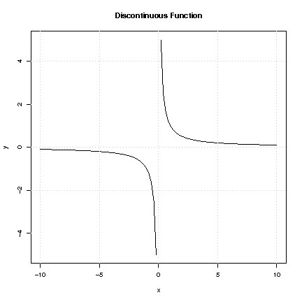
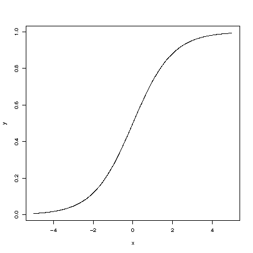

# Continuity and Limits

## The Concept of Continuity

A function is continuous if it has no jumps.
Thus, small changes in each $x_0$, the input, correspond to small changes in the output, $f(x_0)$.

Figure: The above figure is an example of linear growth.

Thomas Robert Malthus (1766-1834) warned about the dangers of uninhibited population growth.

### Details

A function is said to be discontinuous if it has jumps.
The function is continuous if it has no jumps.
Thus, for a continuous function, small changes in each $x_0$, the input, correspond to small changes in the output, $f(x_0)$.

:::note Note

Note that polynomials are continuous as are logarithms (for positive numbers).

:::

## Discrete Probabilities and Cumulative Distribution Functions

The cumulative distribution function for a discrete random variable is discontinuous.

### Details

:::note Definition

If $X$ is a random variable with a discrete probability distribution and the probability mass function of

$$p(x)=P[X=x]$$

then the **cumulative distribution function**, defined by

$$F(X)=P[X\leq x]$$

is discontinuous, i.e. it jumps at points in which a positive probability occurs.

:::

:::note Note

When drawing discontinuous functions, it is common practice to use a filled circle at $(x,f(x))$ to clarify what the function value is at a point $x$ of discontinuity.

:::

### Examples

:::info Example

If a coin is tossed three independent times and $X$ denotes the number of heads, then $X$ can only take on the values $0$, $1$, $2$ and $3$.
The probability of landing exactly $x$ heads, $P(X=x)$, is $p(x) = \displaystyle\binom{n}{x} p^n (1-p)^{n-x}$.
The probabilities are:

$$
\begin{array}{c c c}
  \hline \\
  x & p(x) & F(x) \\
  \hline \\
  0 & \displaystyle\frac{1}{8} & \displaystyle\frac{1}{8} \\
  1 & \displaystyle\frac{3}{8} & \displaystyle\frac{4}{8} \\
  2 & \displaystyle\frac{3}{8} & \displaystyle\frac{7}{8} \\
  3 & \displaystyle\frac{1}{8} & 1 \\
  \hline
\end{array}
$$

The cumulative distribution function, $F(x)=P[X \leq x] = \displaystyle\sum_{t\leq x} p(t)$ has jumps and is therefore discontinuous.

:::

:::note Note

Notice on the above figure how the circles are filled in, the solid circles indicate where the function value is.

:::

## Notes on Discontinuous Function

A function is discontinuous for values or ranges of the variable that do not vary continuously as the variable increases.
In other words, breaks or jumps.

Figure: $f(x) = \displaystyle\frac{1}{x}$, where $x\neq 0$

### Details

A function can be discontinuous in a number of different ways.
Most commonly, it may jump at certain points or increase without bound in certain places.

Consider the function $f$, defined by $f(x)= 1/x$ when $x\neq 0$.
Naturally, $1/x$ is not defined for $x=0$.
This function increases towards $+\infty$ as $x$ goes to zero from the right but decreases to $-\infty$ as $x$ goes to zero from the left.
Since the function does not have the same limit from the right and the left, it cannot be made continuous at $x=0$ even if one tries to define $f(0)$ as some number.

## Continuity of Polynomials

All polynomials, $p(x)=a_0+a_1x+a_2x^2+\ldots +a_n x^n$ are continuous.

### Details

It is easy to show that simple polynomials such as $p(x)=x$, $p(x)=a+bx$, $p(x)=ax^2+bx+c$ are continuous functions.

It is generally true that a polynomial of the form

$$p(x)=a_0+a_1x+a_2x^2+\ldots +a_n x^n$$

is a continuous function.

## Simple Limits

A **limit** is used to describe the value that a function or sequence approaches as the input or index approaches some value.
Limits are used to define continuity, derivatives and integrals.

Figure: $f(x) = x^x$, for $x>0$

### Details

:::note Definition

A **limit** describes the value that a function or sequence approaches as the input or index approaches some value.

:::

Limits are essential to calculus (and mathematical analysis in general) and are used to define continuity, derivatives and integrals.

Consider a function $f(x)$ and a point ${x}_0$.
If $f(x)$ gets steadily closer to some number $c$ as $x$ gets closer to a number $x_0$, then $c$ is called the limit of $f(x)$ as $x$ goes to $x_0$ and is written as:

$$c = \lim_{x\to x_0}f(x)$$

If $c = f(x_0)$ then $f$ is **continuous** at $x_0$.

### Examples

:::info Example

Evaluate the limit of $f(x) = \displaystyle\frac{x^{2}-16}{x-4}$ when $x\rightarrow 4$, or

$$\lim_{x\rightarrow 4} \displaystyle\frac{x^{2}-16}{x-4}$$

Notice that in principle we cannot simply stick in the value $x=4$ since we would then get $0/0$ which is not defined.
However we can look at the numerator and try to factor it.
This gives us:

$$\displaystyle\frac{x^{2}-16}{x-4} = \displaystyle\frac{(x-4)(x+4)}{x-4} = x+4$$

and the result has the obvious limit of $4+4=8$ as $x\to 4$.

:::

:::info Example

Consider the function:

$$g(x) = \displaystyle\frac{1}{x}$$

where $x$ is a positive real number.
As $x$ increases, $g(x)$ decreases, approaching $0$ but never getting there since $\displaystyle\frac{1}{x}=0$ has no solution.
One can therefore say: "The limit of $g(x)$, as $x$ approaches infinity, is $0$," and write:

$$\lim_{x\to\infty} g(x)=0$$

:::

## More on Limits

Limits impose a certain range of values that may be applied to the function.

Figure: The function $f(x)= \displaystyle\frac{1}{1+e^{-x}}$

### Examples

:::info Example

The Beverton-Holt stock recruitment curve is given by:

$$R=\displaystyle\frac{\alpha S}{1+\displaystyle\frac{S}{K}}$$

where $\alpha, K >0$ are constants and $S$ is biomass and $R$ is recruitment

The behavior of this curve as $S$ increases $S\rightarrow\infty$ is

$$\lim_{S\to\infty}\displaystyle\frac{\alpha S}{1+\displaystyle\frac{S}{K}} =\alpha K$$

This is seen by rewriting the formula as follows:

$$\lim_{S\to\infty}\displaystyle\frac{\alpha S}{1+\displaystyle\frac{S}{K}} = \lim_{S\to\infty}\displaystyle\frac{\alpha }{\displaystyle\frac{1}{S}+\displaystyle\frac{1}{K}} =\alpha K$$

:::

:::info Example

A popular model for proportions is:

$$f(x) = \displaystyle\frac{1}{1+e^{-x}}$$

As x increases, $e^{-x}$ decreases which implies that the term $1+e^{-x}$ decreases and hence $\displaystyle\frac{1}{1+e^{-x}}$ increases, from which it follows that $f$ is an increasing function.

Notice that $f(0)=\displaystyle\frac{1}{2}$ and further,

$$\lim_{x\to\infty} f(x) = 1$$

This is seen from considering the components.
Since $e^{-x} = \displaystyle\frac{1}{e^{x}}$ and the exponential function goes to infinity as $x\to\infty$, $e^{-x}$ goes to $0$ and hence $f(x)$ goes to 1.

Through a similar analysis one finds that:

$$\lim_{x\to-\infty} f(x)=0$$

since, as $x\rightarrow \infty$, first $-x\rightarrow \infty$ and second $e^{-x} \rightarrow \infty$.

:::

:::info Example

Evaluate the limit of $f(x) = \displaystyle\frac{\sqrt{x + 4} - 2}{x}$ as $x \to 0$, i.e. solve:

$$\lim_{x \to 0} \displaystyle\frac{\sqrt{x + 4} - 2}{x}$$

Since there is an $x$ in the denominator we cannot just direct substitute the 0 as $x$ sunce that would give us $\displaystyle\frac{0}{0}$, which is an indeterminate form.
We must do some algebra first.
The square root makes this a little bit tricky.
The way to get rid of the radical is to multiply the numerator by the conjugate.

$$\displaystyle\frac{\sqrt{x + 4} - 2}{x} \cdot \displaystyle\frac{\sqrt{x + 4} + 2}{\sqrt{x + 4} + 2}$$

This gives us:

$$\displaystyle\frac{(\sqrt{x + 4})^2 + 2(\sqrt{x+4}) - 2(\sqrt{x+4}) -4}{x(\sqrt{x + 4} + 2)}$$

The numerator reduces to $x$, and the $x$'s will cancel out, leaving us with:

$$\displaystyle\frac{1}{\sqrt{x + 4} + 2}$$

At this point we can direct substitute 0 for $x$, which will give us:

$$\displaystyle\frac{1}{\sqrt{0 + 4} + 2}$$

Therefore:

$$\lim_{x \to 0} \displaystyle\frac{\sqrt{x + 4} - 2}{x} = \displaystyle\frac{1}{4}$$

:::

## One-sided Limits

$f(x)$ may tend towards different numbers depending on whether $x$ approaches $x_0$ from left or right, usually written:

$x \rightarrow x_{0+}$ (from the right)

$x \rightarrow x_{0-}$ (from the left).

### Details

Sometimes a function is such that $f(x)$ tends to different numbers depending on whether $x \rightarrow x_0$ from the right ( $x \rightarrow x_{0+}$ ) or from the left ($x \rightarrow x_{0-}$).

If

$$\lim_{x \to x_{0+}} f(x)=f(x_0)$$

then we say that $f$ is continuous from the right at $x_0$.
Same thing goes for the limit from the left.
In order for the limit to exist at the point (that is the overall limit, regardless og direction) then it must hold true that

$$\lim_{x \to x_{0-}} = \lim_{x to x_{0+}}$$

i.e., the limit is the same from both directions.
