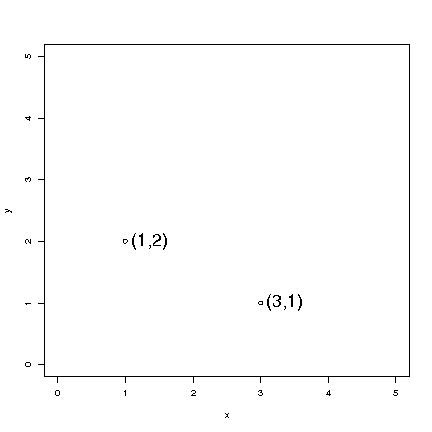

# Data Vectors

## The Plane

Pairs of numbers can be depicted as points on a plane.

The plane is normally denoted by $\mathbb{R}^2$.

### Details

Pairs of numbers can be depicted as points on a plane.

:::note Definition

A **plane** is a perfectly flat surface with no thickness and no end, it can extend forever in all directions.
It has two-dimensions, length and width.
We need two values to find a point on the plane.

:::

Normally we talk about "the plane" (or "the $xy$-plane") as the collection of all pairs of numbers and denote it by

$$\mathbb{R}^2 = \{ (x,y) : x,y \in \mathbb{R} \},$$

giving coordinates to each point.
The plane is also sometimes called *The Cartesian coordinate system*, named after its inventor, the French polymath René Descartes.

### Examples

:::info Example

Plotting the point $(2,4)$ in the $xy$-plane using R:

```text
plot(2,4,xlim=c(0,6),ylim=c(0,6),xlab="x",ylab="y",cex=2)
text(2,4,"(2,4)",pos=4,cex=2)
```

Additional points can be added using the `points()` function:

```text
points(3,5, cex = 0.5) ## a point at (3,5)
```

:::

If you have two sets of coordinates on a plane you, can calculate the distance between the two points and graph the line connecting the points.

:::info Example

What is the distance between the two points $(3,9)$ and $(5,1)$?
What is the distance between the 2 points (3,9) and (5,1)?

We will use the Pythagorean theorem:

$$d = \sqrt{(x_{2}-x_{1})^{2}+(y_{2}-y_{1})^{2}}$$

We insert our values into the formula:

$$d=\sqrt{(5-3)^{2}+(1-9)^{2}}$$

When we combine inside the parentheses we get:

$$d=\sqrt{(2)^{2}+(-8)^{2}}$$

Squaring both terms:

$$d=\sqrt{4+64}$$

Then we take the square root:

$$d=\sqrt{68}$$

The result:

$$d \approx 8.2462$$

:::

## Simple Plots in R

Graphing functions in R

- `plot()` - plots a scatter plot (as a line plot)

- `points()` - adds points to a plot

- `text()` - adds text to a plot

- `lines()` - adds lines to a plot



Figure: Points on a plane, drawn with R.

### Examples

:::info Example

```text
plot(2,3)
```

gives a single plot and

```text
plot(2,3, xlim=c(0,5), ylim=c(0,5))
```

gives a single plot but forces both axes to range from `0` to `5`.

:::

:::info Example

The following R commands can be used to generate a plot with two points:

```text
plot(1,2,xlim=c(0,5),ylim=c(0,5),xlab="x",ylab="y")
points(3,1)
text(1,2,"(1,2)",pos=4, cex=2)
text(3,1,"(3,1)",pos=4, cex=2)
```

:::

:::info Example

In this example, we plot three points.
The first two arguments of the plot function.
The third plot was added with the points are by including vectors with a length of $2$ as the $x$ and $y$ arguments of the plot function.
The third point was added with the points function.
The second and third points were labeled using the text function and a line was drawn between them using the lines function.

```text
plot(c(2,3),c(3,4),xlim=c(2,6),ylim=c(1,5),xlab="x",ylab="y")
points(4,2)
text(3,4,"(3,4)",pos=4, cex=2)
text(4,2,"(4,2)",pos=4, cex=2)
lines(c(3,4), c(4,2))
```

**Note**: Note that if you are unsure of what format the arguments of an R function needs to be, you can call a help file by typing `?` before the function name (e.g. `?lines`).

:::

## Data

Data are usually a sequence of numbers, typically called a vector.

### Details

When we collect data these are one or more sequences of numbers, collected into data vectors.
We commonly think of these data vectors as columns in a table.

### Examples

:::info Example

In R, if the command

```text
x <- c(4,5,3,7)
```

is given, then `x` contains a vector of numbers.

:::

:::info Example

Create a function in R, give it a name `Myfunction` which takes the sum of `x` and `y`:

```text
Myfunction <- function(x,y) { sum(x,y) }
```

If you input the vectors `1:3` and `4:7` into the function it will calculate the sum of `x <- (1+2+3)` and `y <- (4+5+6+7)` as follows:

```text
> Myfunction(1:3,4:7)
[1] 28
```

:::

## Indices for a Data Vector

If data are in a vector `x`, then we use **indices** to refer to individual elements.

### Details

If `i` is an integer then $x_i$ denotes the $i^{th}$ element of $x$.

**Note**: Although we do not distinguish (much) between row- and column vectors, usually a vector is thought of as a column.
If we need to specify the type of vector, row or column, then for vector $x$, the column vector would be referred to as $x'$ and the row vector as $x^T$.

(the **transpose** of the original).

### Examples

:::info Example

If $x=(4,5,3,7)$ then $x_1=4$ and $x_4=7$

:::

:::info Example

How to remove all indices below a certain value in R?

```text
> x <- c(1,5,8,9,4,16,12,7,11)

> x
[1]  1  5  8  9  4 16 12  7 11

> y <- x[x>10]

> y
[1] 16 12 11
```

:::

:::info Example

Consider a function that takes to vectors

$$a \in \mathbb{R}^n, b \in \mathbb{N}^m$$

as arguments with:

$$n \ge m$$

and:

$$1 \le b_1,\dots,b_m \le n.$$

The function returns the sum:

$$\sum_{i = 1}^m {a_b}_i$$

Long version:

```text
> fn <- function(a,b) {
+ result <- sum(a[b])
+ return(result)
+ }
```

Short version:

```text
fN <- function(a,b) sum(a[b])
```

:::

## Summation

We use the symbol $\Sigma$ to denote sums.

In R, the sum function adds numbers.

### Examples

:::info Example

If $x=(4,5,3,7)$

then

$$\sum_{i=1}^{4} x_i = x_1+x_2+x_3+x_4 = 4+5+3+7 = 19$$

and

$$\sum_{i=2}^{4} x_i = x_2+x_3+x_4 = 5+3+7 = 15.$$

In R one can give the corresponding commands:

```text
> x <- c(4,5,3,7)

> x
[1] 4 5 3 7

> sum(x)
[1] 19

> sum(x[2:4])
[1] 15
```

:::
