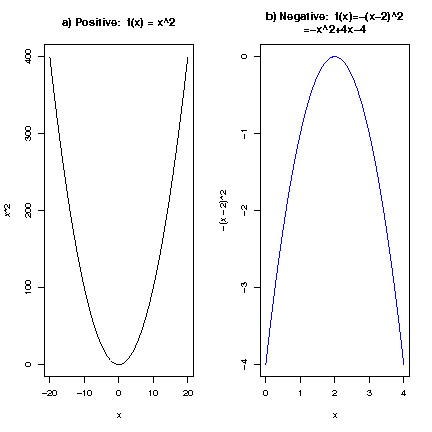

# Polynomials

## The General Polynomial

The general polynomial:

$$p(x)=a_{0}+a_{1}x+a_{2}x^{2}+\dots +a_{n}x^{n}$$

The simplest:

$$p(x)=a$$

### Details

:::note Definition

A **polynomial** describes a specific function consisting of linear combinations of positive integer powers of the explanatory variable.

:::

The general form of a polynomial is:

$$p(x)=a_{0}+a_{1}x+a_{2}x^{2}+\dots +a_{n}x^{n}$$

The simplest of these is the constant polynomial

$$p(x)=a$$

## The Quadratic

The general form of the quadratic (parabola) is:

$$p(x) = ax^2 + bx + c$$

The simplest quadratic is

$$p(x) = x^2$$

Figure: Parabolas: Quadratic functions

### Details

The quadratic polynomial of the form $p(x) = ax^2 + bx + c$ describes a parabola when points $(x,y)$ with $y = p(x)$ are plotted.
The simplest parabola is $p(x) = x^2$ (Fig. a) which is always non-negative $p(x)\geq 0$ and $p(x)=0$ only when $x=0$.

:::note Note

Note that $p(-x) = p(x)$ since $(-x)^2= x^2$.

:::

If the leading coefficient is negative, then the parabola is concave (fig. b) but if it's positive the parabola is convex (fig. a).
This is sometimes used to describe a response function.

## The Cubic

The general form of a cubic polynomial is:

$$p(x)=ax^3 + bx^2 + cx + d$$

Figure:

$$p(x)=x^3-20x^2-30x-4$$

## The Quartic

The general form of the quartic polynomial is

$$p(x) = ax^4 + bx^3 + cx^2 + dx + e$$

Figure: The general shape.

Here we used the following equation

$$y=x^4-x^3-7x^2+x+6$$

## Solving the Linear Equation

If the value of $y$ is given and we know that $x$ and $y$ are on a specific line so that $y = a + bx$, then we can find the value of $x$.

### Details

If a value of $y$ is given, and we know that $x$ and $y$ lie on a specific straight line, so that $y = a + bx$, then we can find the value of $x$ by considering $y = a+bx$ as an equation to be solved for $x$, since $y$, $a$ and $b$ are all known.

The general solution is found through the following steps:

1. Equation: $y = a + bx$

1. Subtract $a$ from both sides.

1. $y-a = bx$

1. $bx=y-a$

1. Divide by $b$ on both sides if $b$ is not equal to 0.

1. $x=\displaystyle\frac{1}{b}(y-a)$

## Roots of the Quadratic Equation

The general solution of $ax^2 + bx + c = 0$ is given by $x = \displaystyle\frac{-b \pm \sqrt{b^2 - 4ac}}{2a}$.

### Details

Suppose we want to solve $ax^2 + bx + c = 0$, where $a \neq 0$.

The general solution is given by the formula

$$x = \displaystyle\frac{-b \pm \sqrt{b^2 - 4ac}}{2a},$$

if $b^2 - 4ac \geq 0$.

On the other hand, if $b^2-4ac<0$, the quadratic equation has no real solution.

### Examples

:::info Example

Solve $x^2 - 3x + 2 = 0$

Putting this into the context of the formulation $ax^2+bx+c=0$, the constants are: $a = 1, b = -3, c = 2$.

Inserting this into the formula for the roots gives:

$$
\begin{aligned}
  x &= \displaystyle\frac{-(-3) \pm \sqrt{(-3)^2 - 4 \cdot 1 \cdot 2}}{2 \cdot 1} \\
  x &= \displaystyle\frac{3 \pm \sqrt{9 - 8}}{2} \\
  x &= \displaystyle\frac{3 \pm \sqrt{1}}{2} \\
  x &= \displaystyle\frac{3 + 1}{2} \text{ or } \displaystyle\frac{3 - 1}{2} \\
  x &= \displaystyle\frac{4}{2} \text{ or } \displaystyle\frac{2}{2} \\
  x &= 2 \text{ or } 1
\end{aligned}
$$

:::

:::info Example

Find the roots of the following polynomial

$$3x^{4} + 14x^{2} + 15$$

We can use the quadratic equation to solve for the roots of this polynomial if we substitute a variable for $x^{2}$.
Let's use the letter $a$:

$$3a^{2} + 14a + 15$$

We then plug the constants in to the quadratic equation.

$$x = \displaystyle\frac{-(14) \pm \sqrt{14^{2} - 4 \cdot 3 \cdot 15}}{2 \cdot 3}$$

which simplifies to:

$$\displaystyle\frac{-(14) \pm \sqrt{196 - 180}}{6}$$

which equals $-\displaystyle\frac{5}{3}$ (using the $+$ sign) and $-3$ (using the $-$ sign).

Then, since we substituted a for $x^2$ we need to take the square root of these values to get the roots of the polynomial.

So,

$$x_{1,2} = \pm \sqrt{-\displaystyle\frac{5}{3}}$$

and

$$x_{3,4} = \pm \sqrt{3}$$

:::
