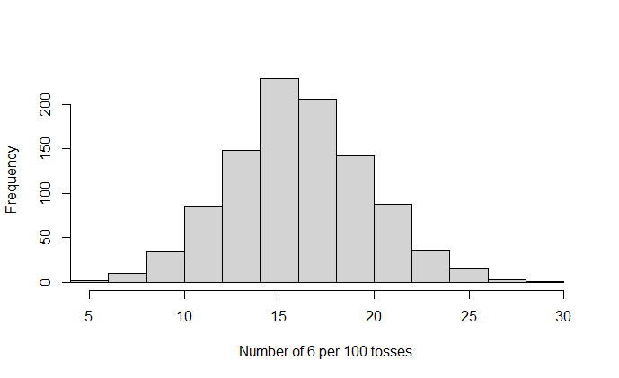
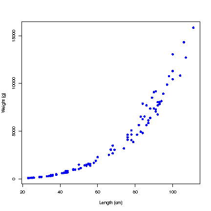

# Simple Data Analysis in R

## Entering Data. Data Frames

Several methods exist to enter data into R:

1. Enter directly:

   ```text
   x <- c(4,3,6,7,8)
   ```

1. Read in a single vector

   ```text
   x <- scan("filename")
   ```

1. Use:

   ```text
   x <- read.table("file address")
   ```

### Details

The most direct method will not work if there are a lot numbers;
therefore, the second method is to read in a single vector by

```text
x <- scan("filename")
```

where `filename` = text string, either a full path name or refers to a file in the working directory.

The `scan()` command returns a vector, but the `read.table()` command returns a data frame, which is a rectangular table of data whose columns have names.
A column can be extracted from a data frame, e.g., with `x <- dat$a` where `dat` is the name of the data frame and `a` is the name of a column.

:::note Note

Note that for `read.table("file address")`, `file address` refers to the location of the file.
Thus, it can be the URL or the complete file directory depending on where the table is stored.

:::

### Examples

:::info Example

Below are three examples using R code to enter data

1. `x <- c(4,3,6,7,8)`

1. `x <- scan("lecture 70.txt")`

1. `x <- read.table("http&#58;&#47;&#47;notendur&period;hi&period;is/~gunnar/kennsla/alsm/data/set115.dat", header=T)`

:::

## Histograms

A histogram is a graphical display of tabulated frequencies, shown as bars.

In R use the command `hist(x)`.



### Examples

A histogram is a graphical display of tabulated frequencies, shown as bars.

## Bar Charts

The bars in a bar chart usually correspond to frequencies in categories and are therefore kept apart.


### Details

A bar chart is similar to the histogram but is used for categorical data.

## Mean, Standard Error, Standard Deviations

### Details

The most familiar measure of central tendency is the arithmetic mean.

:::note Definition

An **arithmetic mean** is the sum of the values divided by the number values, typically expressed as:

$$\bar{y} = \displaystyle\frac{\Sigma_{i=1}^{n} y_i}{n}$$

:::

:::note Definition

The **sample variance** is a measure of the spread of a set of values from the mean value:

$$s^2 = \displaystyle\frac{1}{n-1}\displaystyle\sum_{i=1}^{n}(x_i - \bar{x} )^2$$

:::

The sample standard deviation is more commonly used as a measure of the spread of a set of values from the mean value.

:::note Definition

The **standard deviation** is the square root of the variance and may be expressed as:

$$s = \sqrt{\displaystyle\frac{1}{n-1}\displaystyle\sum_{i=1}^{n}(x_i - \bar{x} )^2}$$

:::

:::note Definition

The **standard error** is a method used to indicate the reliability of the sample mean:

$$SE_{\bar{y}} = \sqrt{\displaystyle\frac{s^2}{n}}$$

:::

If a vector `x` in R contains an array of numbers then: `mean(x)` returns the average, `bar{x};sd(x);` returns the standard deviation, `s;var(x);` returns the variance, `s^2`.
We may also want to use several other related operations in R: `median(x)`, the median value in vector `x; range(x)` which lists the range: `max(x)-min(x)`.

If the variable `x` contains discrete categories, `table(x)` returns counts of the frequency in each category.

## Scatter Plots and Correlations

If we have paired explanatory and response data we are often interested in seeing if a relationship exists between them.
To do this, we first plot the data in a scatter plot.



Figure: Scatter plot showing the length-weight relationship of fish species `X`.

Data source: Marine Resource Institution - Iceland.

### Details

A first step in analyzing data is to prepare different plots.
The type of variable will determine the type of plot.
For example, when using a scatter plot both the explanatory and response data should be continuous variables

The equation for the Pearson correlation coefficient is:

$$r_{x,y} = \displaystyle\frac{\Sigma_{i=1}^{n}(x_i - \bar{x})(y_i - \bar{y})}{\Sigma_{i=1}^{n}(x_i - \bar{x})^2 \Sigma_{i=1}^{n}(y_i - \bar{y})^2},$$

where $\bar{x}$ and $\bar{y}$ are the sample means of the `x`- and `y`-values.

The correlation is always between `-1` and `1`.

### Examples

The following R commands can be used to generate a scatter plot for vectors `x` and `y`

:::info Example

```text
plot(x,y)
```

:::
